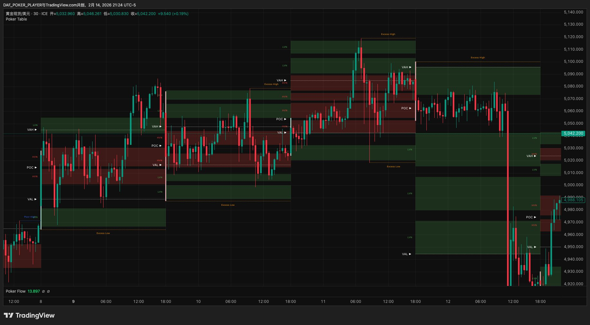
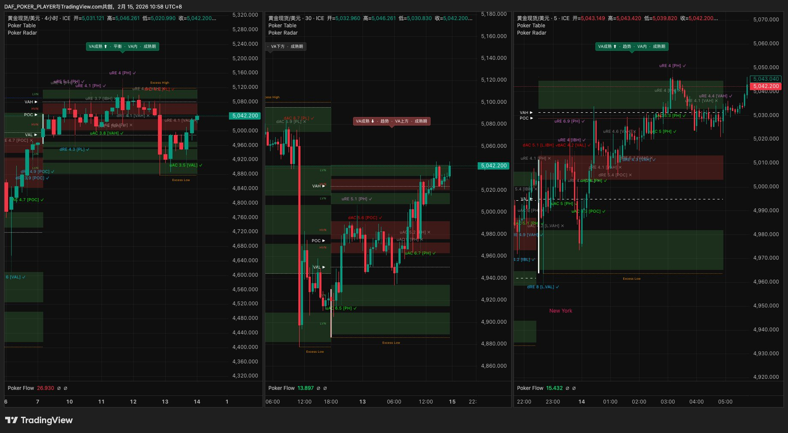
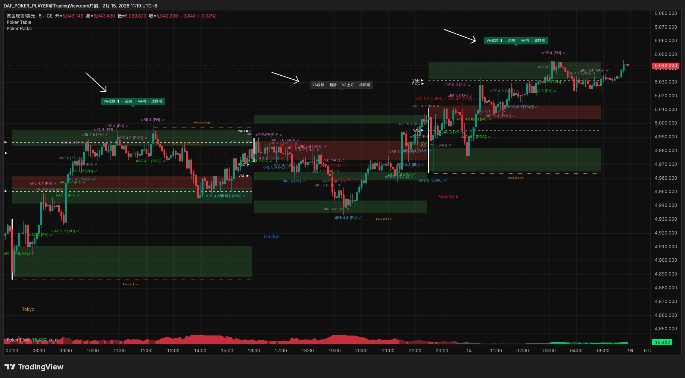

# 第二章 · 工具箱

> *"概念再清楚，看不到就等于没有。工具的意义就是让你用眼睛看到拍卖理论描述的那些东西。"*

上一章建立了世界观，这一章把它变成你能看到、能操作的三个工具。

---

## 2.1 三个工具总览

先用一张表建立全局印象：

| 工具 | 类比 | 负责什么 | 核心输出 |
|------|------|---------|---------|
| Poker Table | 牌桌地图 | 画出每个周期的成交量分布结构 | VA、POC、VAH/VAL、IB、HVN/LVN、**Excess/Poor** |
| Poker Flow | 桌风罗盘 | 判断VA迁移的方向和节奏 | 多头趋势 / 空头趋势 / 多头回调 / 空头回调 / 平衡 |
| Poker Radar | 信号雷达 | 在关键位自动识别接受/拒绝信号并评分 | uAC / dAC / uRE / dRE + 评分 + VA迁移方向 |

三个工具之间有明确的分工边界。Poker Table画出VP结构（VA/POC/VAH/VAL/IB/HVN/LVN）并识别Excess边界和Poor标记，始终可见。Poker Flow判断方向，不捕捉信号。Poker Radar在边界上捕捉AC/RE事件并评分——6个一级边界（PH/PL/VAH/VAL/IBH/IBL）加POC都会捕信号，区别在于VAH/VAL由Table画好线，Radar在线上等事件，而PH/PL/IBH/IBL没有预画的线，只有Radar检测到事件时才标记出来。决策权留给你——后面的章节会教你怎么用这些信息做判断。

---

## 2.2 Poker Table：你的牌桌地图

Poker Table 是你打开图表后第一个要看的东西。它把一段时间内的所有成交量按价格分布画出来，形成第一章讲过的那张牌桌地图——VA在哪里、POC在哪里、边界在哪里、哪里密集哪里稀疏，全都一目了然。

Table最重要的独特输出是**Excess High和Excess Low**——8个一级边界中的2个由Table在VP级别识别。当VP在PH/PL区域长出尖锐的放量拒绝尾部，Table将其标记为Excess。Excess是独立于Radar的一级边界（详见第四章）。Table同时标记极值未完成（Poor）——尾部肥厚，说明拍卖不充分，边界不牢固。



### 看盘布局

Poker Trading 的看盘方式有两种：

**双屏布局（新手路线）：** 左图=背景桌（高周期VP+K线，提供共振参考），右图=执行桌（当前周期VP+K线，实际打牌）。偏见直接等于执行桌桌风方向，不需要额外判断。

**三屏布局（进阶）：** 左图=偏见桌（更高周期VP+K线，看大方向），中图=背景桌，右图=执行桌。偏见桌提供偏见方向，需要在更高周期VP上识别AC/RE事件（详见§3.4）。

| 偏见桌（三屏左图） | 背景桌（双屏左图/三屏中图） | 执行桌（右图） |
|------------------|------------------------|--------------|
| 周桌（1周VP/4H） | 日桌（1日VP/30m） | 分时段桌（1时段VP/5m） |
| 月桌（1月VP/日线） | 周桌（1周VP/4H） | 日内桌（1日VP/30m） |
| 季度桌（季VP） | 月桌（1月VP/日线） | 短线桌（1周VP/4H） |
| 年桌（年VP） | 季度桌（季VP） | 波段桌（1月VP/日线） |

做决策永远看执行桌。背景桌主要提供共振参考。初学阶段用双屏就够了——等对AC/RE有了实盘直觉后再加偏见桌升级为三屏。完整配置见game-setup，布局用法在第三章展开。




### 时段VP

除了日、周、月这些标准周期，Poker Table还支持按交易时段划分——比如东京时段、伦敦时段、纽约时段，每个时段各生成一张独立的VP。时段VP在日内交易中特别有用，本质上就是把一天切成几张小桌，每张桌有自己的VA和关键位。读法和标准VP完全一样，只是时间窗口更短。

### 数据成熟度

有一个容易被忽视的问题：VP的数据不是一开始就可靠的。

一张新的VP刚开始形成时，成交量很少，VA和POC都在剧烈变化——就像一个新开的餐厅，第一天只有3个人给了评分，这时候4.8分毫无意义。等100个人都打完分之后，评分才可靠。VP也一样——只有当足够多的交易发生之后，VP的结构才会稳定下来，这时候的VA、POC、关键位才值得信赖。

Poker Radar会通过状态标签告诉你当前数据的成熟度（2.4节会详细讲）。作为经验参考，不同牌桌大致的成熟时间是：

- **日内桌**：开盘后大约8小时，VA基本稳定
- **短线桌**：大约到周三，结构开始清晰
- **波段桌**：大约到第10天，VA和POC趋于稳定

> 加密品种（BTC/ETH）7×24无收盘——"开盘"=VP重置时间（UTC 0:00），以此为基准计算成熟度。

在VP尚未成熟之前，你可以临时用上一桌的VP作为参考——上一桌的数据是完整的，关键位仍然有效。等当前VP成熟后再切回来。这个切换规则在第三章会进一步展开。

### IB的计算窗口

第一章提到过初始平衡区（IB）是"开盘后初始阶段形成的价格范围"。在Poker Table里，IB的计算窗口因牌桌而异：

| 牌桌 | IB计算窗口 |
|------|-----------|
| 分时段桌 | 时段开始后前15-20分钟 |
| 日内桌 | 开盘后第1小时 |
| 短线桌 | 周一全天 |
| 波段桌 | 月初前3天 |

IB代表的是市场在开局阶段的第一轮博弈结果。具体的时间长度可以在参数中微调，但核心逻辑不变。

---

## 2.3 Poker Flow：你的桌风罗盘

Poker Table画出了每一张牌桌的静态结构，但它不告诉你方向。一张VP上VA在中间，价格在VAH附近——然后呢？该看多还是看空？

这个问题由Poker Flow来回答。

Poker Flow做的事情很简单：它回溯过去几个周期的VA位置，看VA是在往上走、往下走、还是原地不动，然后给你一个桌风判定。你可以把它理解成一个罗盘——你坐到牌桌上，先看一眼罗盘，知道风往哪边吹，再决定优先往哪个方向找机会。


### 五种桌风状态

Poker Flow会输出五种状态中的一种：

| 桌风 | 含义 | 你的默认姿态 |
|------|------|------------|
| 多头趋势 | VA持续上移，方向明确 | 优先找做多机会 |
| 空头趋势 | VA持续下移，方向明确 | 优先找做空机会 |
| 多头回调 | 大方向偏多，但短期在回调 | 仍然优先做多，耐心等回调结束 |
| 空头回调 | 大方向偏空，但短期在反弹 | 仍然优先做空，耐心等反弹结束 |
| 平衡 | VA没有明显方向 | 两边都可以看，但入池门槛更高 |

### 回溯参数

Poker Flow需要知道"回溯多远"来判断方向。不同牌桌的推荐参数不同：

- **日内桌**：回溯5天（看最近一周的VA迁移）
- **短线桌**：回溯4周（看最近一个月的VA迁移）
- **波段桌**：回溯3个月（看最近一个季度的VA迁移）

### 桌风的核心作用

这一点非常重要，需要记住：

桌风**只是一个前置过滤器**。它告诉你优先盯哪些边界、等什么事件——多头桌风优先盯下方边界买便宜和上方边界追突破，空头桌风反过来。逆风方向不是不能做，但门槛更高。其中"顺风优先"是核心——第三章会围绕这个原则展开。除此之外，桌风不替代任何具体的交易决策——不替你定起点、不替你评牌力、不替你决定下多大注。

换句话说，桌风告诉你"风往南吹"，但你不会因为风往南吹就闭着眼睛往南走。你还需要看地图（Poker Table）确认路况，等雷达（Poker Radar）告诉你"前方有一个明确的边界事件"，然后才决定要不要迈步。桌风怎么具体影响你的策略选择，是第三章的内容。

---

## 2.4 Poker Radar：你的信号雷达

Poker Table给你画了地图，Poker Flow给你指了方向，但你还缺一样东西——**谁来告诉你"现在有动静了"？**

这就是Poker Radar的工作。它实时监控所有关键位，当价格触及某个关键位并形成接受或拒绝时，Radar会自动捕捉这个信号，给它评分，然后推送给你。你不需要盯着每一根K线去判断"这算不算一个信号"——Radar替你做了这件事。8个一级边界中，Radar在PH/PL/VAH/VAL/IBH/IBL共6个边界上捕捉K线级AC/RE事件（其中PH/PL/IBH/IBL只在事件触发时才标记，无事件不显示），另外2个（Excess High/Low）由Table在VP级别直接识别结构演化。

![Poker Radar界面：黄金现货30分钟图，Radar在K线上标记信号标签（dAC 8.7 [PL]✓，uRE 5.1 [PH]✓，dAC 5.6 [POC]✓），顶部状态栏显示VA成熟度/市场类型/VA位置/阶段](../images/ch1-radar-signals.png)

### 四种信号

Radar识别的信号和第一章讲的市场语言完全对应：

| 信号 | 颜色 | 含义 |
|------|------|------|
| **uAC** | 🟢 绿色 | 向上接受——价格突破了上方关键位，收盘站在上方 |
| **dAC** | 🔴 红色 | 向下接受——价格跌破了下方关键位，收盘站在下方 |
| **uRE** | 🟣 紫色 | 向上拒绝——价格冲高触及上方关键位，被打回来了 |
| **dRE** | 🔵 蓝色 | 向下拒绝——价格下探触及下方关键位，被弹回来了 |

每个信号标签都会附带它触发的关键位信息，比如"uAC 7.5 [VAH]"意味着"在VAH这个关键位上发生了一个向上接受信号，评分7.5"。

### 评分系统

并不是所有信号都值得认真对待。Radar会给每个信号打一个1-10分的评分，分数越高说明信号越清晰、越可靠：

| 分数 | 含义 | 你的态度 |
|------|------|---------|
| ≥7.0（7+）🚨 | 优质信号 | 认真对待，进入后续评估流程 |
| 4.0–6.9 📢 | 普通信号 | 需要结合其他条件确认 |
| <4.0 | 噪音 | 忽略 |

评分的具体算法你不需要了解——它综合考虑了K线形态、穿透力度、成交量配合等多个因素。你只需要记住这个三档分类就够了。

### 状态标签

除了信号和评分，Radar还会在图表上持续显示四段状态信息，帮你快速了解当前市场的整体状况：

**第一段：数据成熟度** — "IB形成中"、"VA形成中"、"VA成熟"。这就是上一节提到的VP数据成熟度判断。当标签显示"IB形成中"时，VP的结构还在剧烈变化，这个阶段的信号可靠性较低。

**第二段：市场类型** — "趋势"、"扩张"、"平衡"、"震荡"、"中性"。它告诉你当前VP的形态特征。

> ⚠️ **市场类型 ≠ 桌风。** 这是两套独立的分类系统。市场类型（Radar）= 当前VP的形态快照（VP长什么样）。桌风（Flow）= 跨周期VA迁移方向（VA在往哪移）。两者各自独立，不存在映射关系。市场类型是"趋势"时桌风可能是平衡（因为VA没有移动），桌风是多头时市场类型可能是"平衡"（因为VP形态对称）。不要试图让它们"对得上"——它们本来就在说不同的事。

**第三段：VA位置** — "VA上方"、"VA内"、"VA下方"。价格相对于价值区的位置。

**第四段：阶段** — "开盘期"、"发展期"、"成熟期"。当前周期进行到了哪个阶段。

这四段信息组合起来，给你一个快速的"环境快照"。盘中最常看的是**第一段（数据成熟度）和第三段（VA位置）**——前者决定当前VP是否可信赖，后者告诉你价格在结构中的位置。其余两段是辅助参考，用到时自然会看。比如看到"VA成熟 · 趋势 · VA上方 · 成熟期"——这意味着当前VP数据可靠、市场有方向、价格在价值区上方运行、周期已经进入后半段。至于这些信息怎么影响你的具体策略，后面章节会展开。



### VA迁移识别

Radar自动对比当前和前一周期的VA位置，识别VA迁移方向。这和Poker Flow互补——Flow回溯多个周期给宏观桌风，Radar的VA迁移聚焦"这一局和上一局之间VA往哪走了"。比如Flow显示"多头趋势"但Radar发现本周VA下移了——提示大方向不变但短期有回调迹象。

### 推荐设置

Radar必须和Poker Table对齐——你用哪张牌桌，Radar就跟着看哪个周期的信号：

| 牌桌 | Poker Table VP | Radar配合K线 |
|------|------------|-------------|
| 分时段桌 | 1时段VP | 5分钟 |
| 日内桌 | 1日VP | 15/30分钟 |
| 短线桌 | 1周VP | 4小时 |
| 波段桌 | 1月VP | 日线 |

设置好之后，Radar就会按照你所在牌桌的周期来监控信号。你不需要在盘中手动切换——选定牌桌，设好参数，然后让Radar替你盯着。

---

## 2.5 三个工具怎么配合

工作流有自然的先后顺序：

```
┌────────────┐     ┌────────────┐     ┌────────────┐
│ Poker Table │ ──→ │ Poker Flow │ ──→ │Poker Radar │
│  画地图     │     │  读方向     │     │  捕信号     │
│ VA在哪?     │     │ VA往哪走?   │     │ 哪里出事了? │
│ 关键位在哪?  │     │ 风往哪吹?   │     │ 评分多少?   │
└────────────┘     └────────────┘     └────────────┘
   空间感              方向感              时机感
```

**30秒速读示例：** 你坐到短线桌。第一眼看Poker Table——VA在$2,640-$2,680，POC@$2,660，PH@$2,695。第二眼看Poker Flow——绿色，多头趋势。第三眼看Poker Radar——暂无信号。结论：风往多头方向吹，下方边界（VAL $2,640）是"买便宜"的位置，上方边界（PH $2,695）是"追突破"的位置。现在没信号，等。

地图给你空间感，桌风给你方向感，雷达给你时机感。三层信息叠在一起，你对当前牌桌的理解就到位了。拿到这三层信息之后怎么做判断，是第三章开始的内容。

**三个工具之间不会"打架"。** Flow说多头但Radar给了一个dAC——这不是矛盾。Flow在说"过去几周VA在上移"，Radar在说"刚才价格向下突破了一个关键位"。一个是宏观方向，一个是微观事件。它们是信息输入，不是交易指令——不要试图让所有工具"说同一句话"才敢出手。Radar推送的信号支持alert功能，可以设置推送通知，避免持续盯盘。

**工具不适用的场景：** 极端行情（单日暴涨暴跌10%+）、流动性极低（凌晨/节假日）、数据延迟——遇到这些，不坐下，等市场恢复正常再说。详细的极端情况处理见第八章。

---

> **本章要点速记**
>
> Poker Table = 牌桌地图 · Poker Flow = 桌风罗盘 · Poker Radar = 信号雷达
>
> 看盘布局：双屏（新手·背景桌+执行桌）或三屏（进阶·加偏见桌）
>
> 桌风五态：多头趋势 / 空头趋势 / 多头回调 / 空头回调 / 平衡
>
> 桌风回溯：日/5 · 周/4 · 月/3
>
> Radar四信号：uAC / dAC（接受）· uRE / dRE（拒绝）
>
> Radar评分：7+优质 · 4-6普通 · 4以下忽略
>
> VA迁移：Radar对比当前vs前周期VA位置 · 工作流：Table画地图 → Flow读方向 → Radar捕信号

> 🏁 **到目前为止你学了什么：** 第一章你理解了市场是拍卖，第二章你认识了读拍卖的三个工具——Table画结构、Flow看方向、Radar捕信号。下一章开始，你会学到怎么用这些信息做决策：坐哪张桌、往哪个方向看。
