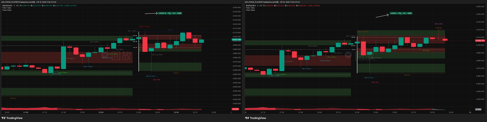
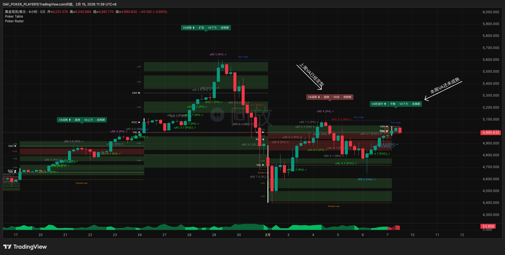
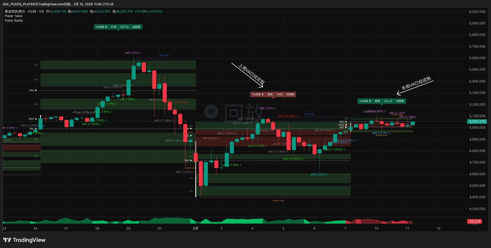
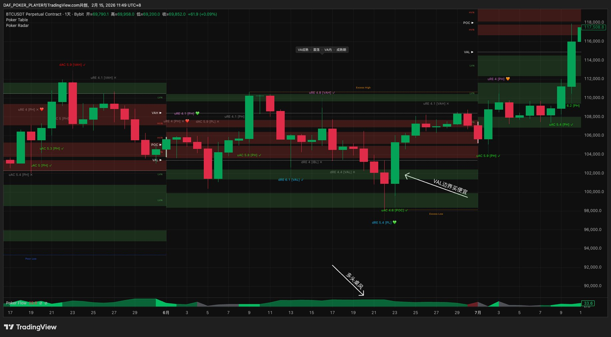
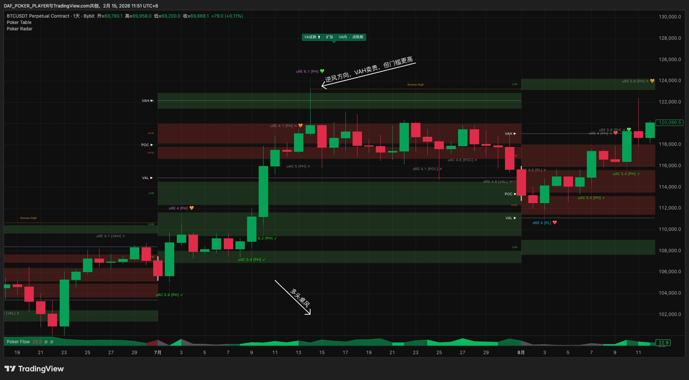
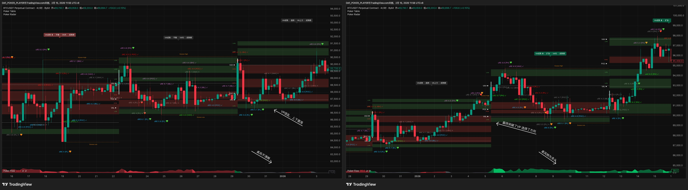

# 第三章 · 坐哪桌

> *"好牌手不是坐下就打，而是先把桌上的情况看清楚。"*

工具摆好了，但不能直接找信号。先解决几个前置问题：坐哪张桌、什么时候该换、风往哪边吹、优先往哪个方向找机会。

---

## 3.1 选桌：你要坐哪张桌

选桌的逻辑很简单——你打算持仓多久，就坐哪张桌。

| 你的持仓周期 | 对应牌桌 | VP计算范围 |
|------------|---------|----------|
| 数小时 | 分时段桌 | 1个时段（按时区配置） |
| 24小时内 | 日内桌 | 1天 |
| 数天到两周 | 短线桌 | 1周 |
| 数周到数月 | 波段桌 | 1月 |

做日内的人坐日内桌，做波段的人坐波段桌。听起来像废话，但在实际交易中，很多人会不自觉地混桌——坐在日内桌上却拿着波段桌的止损，或者坐在短线桌上被一根5分钟K线吓得提前下桌。这种混桌是大部分交易失控的根源。

Poker Trading有一个硬规矩：**一次只坐一张桌。** 你选定了短线桌，那你的VP是周VP，你的K线是4小时，你的止损和止盈都按短线桌的级别来。不在盘中因为恐惧切到更小的K线上"看清楚"，也不因为贪心切到更大的周期去"看看还能不能拿"。一张桌坐到底，除非有明确的理由换桌。

**看盘频率参考：** 你不需要全天盯盘——看盘频率由你的K线级别决定。

| 牌桌 | K线 | 建议看盘频率 | 说明 |
|------|-----|------------|------|
| 分时段桌 | 5m | 盘中实时 | 需要盯盘 |
| 日内桌 | 30m | 每30-60分钟 | 可以设Radar推送，有信号再看 |
| 短线桌 | 4H | 每4小时或一天2-3次 | 早中晚各看一次足够 |
| 波段桌 | 日线 | 每天收盘后1次 | 日线走完后统一处理 |

---

## 3.2 牌桌切换：什么时候该换VP

选好了桌，还有一个实际问题——每个新周期刚开始的时候，VP的数据还不够。

第二章提到过数据成熟度：一张新的VP刚开始形成时，VA和POC还在剧烈变化，这时候的结构不可靠。那怎么办？

答案是临时用上一桌的VP。

### 通用原则

新周期VP未成熟时，以上一周期的VP作为主桌参考。一旦当前VP的结构稳定下来——POC位置不再大幅跳动，VAH和VAL基本锁定——就切回当前VP。判断的依据可以看Poker Radar的状态标签：当第一段从"IB形成中"或"VA形成中"变成"VA成熟"时，就是切换的时机。



任何时候只有一张主桌。不会出现"两张VP都看着，哪个顺眼用哪个"的情况。

### 各牌桌的切换节奏

**波段桌（月VP）：** 月初第1-5天，上个月的VP仍然是你的主桌。第6-8天开始留意本月VP是否成熟，成熟了就切过来。最迟到第10天，不管结构清不清晰，一律用本月VP。

**短线桌（周VP）：** 周一用上周VP。周二开始看本周VP的成熟度。最迟周三收盘后，一律切到本周VP。切过来后如果VP结构仍不清晰（关键位太近、VA太窄）→按§3.5"不坐"处理。

**日内桌（日VP）：** 开盘后前4小时用昨日VP。4-8小时观察当日VP是否成熟。最迟第8小时，切到当日VP。

**分时段桌（时段VP）：** 每个新时段开始时，先参考上一时段VP。当前时段VP形成足够交易量后切回。由于时段VP的时间窗口短，通常成熟得也快。

> **加密货币时区说明：** BTC/ETH等7×24交易品种的VP周期以UTC时间为界。UTC周一0:00=新周开始，每月1日0:00=新月开始（7×24连续交易，不受周末影响）。game-setup中的默认时区（如HKT）仅影响K线显示，不影响VP周期边界。

这些时间节点不需要死记——它们的逻辑是一致的：**新周期前半段用上一桌，后半段必须用当前桌。** 具体什么时候切，看Radar状态标签就好。

### 两个场景帮你建立直觉

**场景一：周一——VP未成熟，用上周的。** 打开短线桌，本周VP极窄，POC还在跳，关键位没参考价值。上周VP结构完整、关键位清晰→主桌=上周VP，等本周成熟了再切。



**场景二：周三——VP成熟了，切回来。** 两天多交易后，VA展开、POC稳定、Radar显示"VA成熟"→切到本周VP，用本周自己的关键位做后续判断。



### 洗牌期

偶尔会遇到一种情况：当前VP乱得没法看，上一桌的VP也接不上——结构混乱，方向不清。这种状态在Poker Trading里叫"洗牌期"。

洗牌期的处理只有一个字：**等。** 不坐下，不入池，不猜方向。记录下当前价格位置和VP的大致结构，等市场结构重新变得清晰、Radar给出明确信号再说。宁可错过一整个周期的机会，也不在一张看不清的桌子上赌。

---

## 3.3 读桌风：顺风优先

桌选好了，VP也确认了。打开Poker Flow看桌风。第二章介绍了五种状态，这里讲拿到桌风后怎么用。

### 核心原则：顺风优先

桌风的核心价值只有一句话：**多头桌风优先做多，空头桌风优先做空。**

这不是绝对——逆风方向不是完全不能做——但顺风方向的胜率显著更高。在实盘中，大部分盈利来自顺风方向的交易。把精力集中在顺风方向，少碰逆风，长期下来胜率和盈亏比都会好得多。

| 桌风状态 | 优先方向 | 逆风方向 |
|---------|---------|---------|
| 多头趋势 / 多头回调 | 做多 | 做空可以但门槛更高 |
| 空头趋势 / 空头回调 | 做空 | 做多可以但门槛更高 |
| 平衡 | 两边都可以 | 无逆风概念，但标准更严 |

```
             做多信号 ←  边界事件  → 做空信号
                │                    │
多头桌风     ⭐⭐⭐ 顺风           ⭐ 逆风（高门槛）
                │                    │
空头桌风     ⭐ 逆风（高门槛）     ⭐⭐⭐ 顺风
                │                    │
平衡桌风     ⭐⭐ 可做（标准更严）  ⭐⭐ 可做（标准更严）
```

> **回调vs平衡怎么区分？** 回溯窗口内≥60%周期VA同向移动=回调，<60%=平衡。例：4周中3周上移=75%=多头回调。

### 顺风优先怎么落地

顺风优先不是一个抽象口号——它具体到你**盯哪些边界、等什么事件**。

**多头桌风下，你优先盯三类机会：**

- **下方边界（VAL/IBL/PL/Excess Low）买便宜** — 价格回落到支撑位被拒绝弹回（RE或Excess），或者VAL/IBL假跌破后反弹。这是多头桌风下最标准的机会。
- **上方边界（VAH/IBH/PH）追真突破** — 价格突破阻力位并站稳，新价值区被发现，等回踩入场做多。
- **上方边界的拒绝和假突破是逆风** — 做空方向和桌风相反，门槛更高。普通信号可以直接跳过，只有特别强烈的才值得考虑。

**空头桌风下反过来：**

- **上方边界（VAH/IBH/PH/Excess High）卖贵** — 价格反弹到阻力位被打回（RE或Excess），或者VAH/IBH假突破后回落。
- **下方边界（VAL/IBL/PL）追真跌破** — 价格跌破支撑位并站稳，等反弹入场做空。
- **下方边界的拒绝和假跌破是逆风** — 做多方向和桌风相反，门槛更高。

**平衡桌风下：** 两边都可以盯，但因为没有桌风加持，入池标准要更严格——信号更强、共振更明确才值得做。

一句话：**桌风告诉你优先盯哪些边界，边界上发生什么事件告诉你做什么。** 两者配合就是整个交易判断的起点。

### 三个场景看顺风优先怎么用

**场景三：买便宜——多头趋势下价格回到VAL附近。**

波段桌，Poker Flow多头趋势，价格从VA上方回落接近VAL。这正是你优先盯的下方边界——如果Radar在VAL上捕到拒绝（dRE）或者dAC失败后价格反弹回VAL上方，就是顺风做多机会。在支撑位买便宜做多，这是多头桌风下优先级最高的入场逻辑。具体怎么评估，下一章展开。



**场景四：逆风——多头趋势下VAH上方出现拒绝。**

同桌多头趋势，价格冲到VAH上方被打回（uRE）。上方边界拒绝=做空方向，和桌风相反，属于逆风。逆风信号不直接忽略，但门槛更高——需要看拒绝是否特别强烈。普通拒绝在多头桌风下可以跳过。



**场景五：VA迁移分歧——大方向多头，但短期下移。**

短线桌，Flow显示多头趋势（过去4周VA持续上移），但Radar的VA迁移显示本周VA相对上周下移。不意味着反转，但提示大趋势中正在经历短期回调——找做多机会要更耐心，等价格回调到更深的支撑位（PL而不只是VAL）。Flow给宏观方向，Radar VA迁移给最近一步变化，两者配合着看。

### 一句话定局

到这里，桌风的角色可以用一句话概括：**顺风优先，桌风定方向，边界定起点。**

桌风给了你一个方向。如果你升级到三屏布局加入偏见桌（最左图），还可以拿到更精确的方向——这就是下一节的偏见。

---

## 3.4 建立偏见

> ⛔ **新手路线：跳过本节。** 初学阶段，偏见=执行桌桌风方向，不看偏见桌——只用执行桌+背景桌的双屏布局。背景桌继续提供共振参考（判断牌力需要它），但不从背景桌读偏见。
>
> **为什么跳过？** 偏见系统需要在更高周期VP上识别和判断AC/RE事件——这套能力要先在执行桌上练熟。过早使用偏见系统是新手最常见的错误之一——它不会让你更准，只会制造方向冲突和决策噪音，让你犹豫。等你在执行桌上做了几十手顺风牌、对信号的长相和力度有了本能反应后，再回来学这一节。

偏见决定你优先往哪个方向找机会。偏见来源分两层：

| 层级 | 偏见来源 | 操作 |
|------|---------|------|
| 基础 | 执行桌桌风（Poker Flow颜色） | 看桌风 → 偏见=桌风方向 |
| 进阶 | 偏见桌未完成的牌 | 扫一眼最左图 → 有未完成的牌 → 偏见=那手牌方向（覆盖桌风） |

**偏见来源决策树：**

```
偏见桌有未被否定的牌？
  ├─ Yes → 偏见 = 那手牌方向
  │         （覆盖桌风，即使方向相反）
  └─ No  → 背景桌有未被否定的牌？
              ├─ Yes → 偏见 = 那手牌方向
              └─ No  → 偏见 = 桌风方向
                        （回到§3.3基础版）
```

### 3.4.1 三屏布局

进阶布局是三屏：偏见桌（最左）+ 背景桌（中间）+ 执行桌（最右）。

| | 偏见来源 | 共振参考 |
|---|---------|---------|
| 偏见桌（最左，更高周期） | 首选 | ✅（更高级别共振） |
| 背景桌（中间，高周期） | 偏见桌没牌时接替 | ✅（标准共振） |

三屏配置表见§2.2。

> 注：年VP在BTC上历史数据有限，参考价值可能不足。如果年VP结构不清晰，波段桌的偏见可以退化为季度VP或桌风方向。

偏见桌主要提供偏见方向，背景桌主要提供共振参考，两者可互补。

偏见桌没有未完成的牌 → 偏见=桌风方向，和顺风优先一致。

### 3.4.2 偏见桌上的"一手牌"

偏见桌**一级边界或POC**上的AC或RE事件，以及Table识别的Excess。AC、RE和Excess都能开牌：

| 空头牌开始 | 多头牌开始 |
|-----------|-----------|
| uRE（上方拒绝打回） | dRE（下方拒绝弹回） |
| dAC（向下接受突破） | uAC（向上接受突破） |
| Excess High（上方VP结构拒绝） | Excess Low（下方VP结构拒绝） |

多个事件先后出现时，看最近一个未被否定的。后发事件自然覆盖前面的。

**信号有效性：** 偏见桌K线已走完，统一看Radar标记——✓或无标记=事件成立，✗=没成立（当它没发生）。

**否定规则：** 只有反方向的AC能否定一手牌，RE不能。AC是进攻（价值区扩张），RE是防守。只有进攻能推翻方向。否定信号同样看Radar✓/✗。强烈的反向RE（7+）不否定偏见，但提示偏见方向可能承压，交易时留意。

三屏布局时偏见来自偏见桌（最左图）。偏见桌没牌时看背景桌（中间图）。都没有→偏见=桌风方向。共振两张桌都算，可叠加。

偏见桌和背景桌读两件事：（1）有没有未被否定的AC/RE事件或Excess→偏见方向，（2）关键位有没有和执行桌重合→共振。不读桌风，不判断牌型，不评估牌力，不看Radar评分高低。

> **怎么在图上看？** 偏见桌挂Poker Radar（和执行桌相同配置方法），Radar会在偏见桌K线上标记AC/RE事件和✓/✗状态。Poker Table在偏见桌同样识别Excess High/Low（一级边界）和Poor——Excess用于偏见建立和否定锚点（见下节）。

### 3.4.3 否定锚点

每个偏见有一个否定锚点——偏见反方向的极值区域，是偏见的"生死线"。

**空头偏见** → 偏见来源桌VP上方最高的Excess High。没有Excess → 用PH。
**多头偏见** → 偏见来源桌VP下方最低的Excess Low。没有Excess → 用PL。

偏见来源桌=提供当前偏见的那张桌（偏见桌优先，偏见桌没牌时为背景桌）。

锚点距离自动反映偏见稳固程度：远=稳固，近=脆弱。

### 3.4.4 偏见失效

两个条件**并行，任一满足即失效**：

| 否定方式 | 触发条件 | 含义 |
|---------|---------|------|
| 反向AC | 偏见来源桌一级边界/POC出现反向AC（✓或无标记） | 对手牌出现，这手牌结束 |
| 锚点穿越 | 执行桌K线收盘在否定锚点外侧（收盘穿过才算，影线碰到不算） | 价格推翻偏见前提 |

插针到锚点但收盘未穿过=未穿越=偏见不受影响。"穿越"的定义和AC一致——看收盘价，不看影线极值。失效后重新评估：有新的未完成的牌→新偏见，没有→偏见退化为桌风方向。

### 3.4.5 偏见与桌风

**一致时：** 偏见方向的信号=顺风牌，高置信度，标准门槛。最优先的交易机会。

**冲突时（偏见逆桌风）：** 偏见定注意力，桌风定牌型。两者各管各的维度，不互相否决。

| 你在做什么 | 用偏见 | 用桌风 |
|-----------|--------|--------|
| 决定盯哪些边界 | 偏见方向的边界优先盯 | 不管 |
| 信号出来后判牌型 | 不管 | 交易方向vs桌风→顺风/逆风 |
| 决定打不打 | 不管 | 牌型+牌力→决策总表 |

偏见方向的信号你主动盯——牌型按执行桌桌风判定，逆桌风就是逆风牌（AA-only + KK执行）。逆偏见方向的信号不排斥——牌型仍按"交易方向 vs 桌风"判定，走完整决策链。

### 3.4.6 偏见更新

| 触发 | 动作 |
|------|------|
| 偏见来源桌反向AC出现（✓或无标记） | 当前牌结束 → 重新评估 |
| 价格穿越否定锚点 | 偏见失效 → 重新评估 |
| 偏见来源桌VP更新（新的一天/一周） | 重新评估偏见和否定锚点 |
| 偏见方向连续无信号 | **不更新。** 偏见只被结构变化否定，不被时间和情绪否定 |

VP更新（新的一天/一周/一月开始）是偏见的自然重新评估时机——偏见不会真的无限持续。每次VP更新时重新检查：偏见来源桌上有没有仍未完成的牌？否定锚点还在原位吗？

偏见确定后，你知道了优先盯哪些边界。接下来就是等那个边界上出现事件——怎么验证、怎么判断质量，是第四章的内容。

---

## 3.5 不坐的时候

不是每个时刻都适合坐下。

有三种情况应该选择等待而不是入池：

**VP未成熟且上一桌也不可用。** 这就是前面说的洗牌期。两张VP都看不清结构，没有可靠的关键位可以参考，那就没有打牌的基础。

**桌风状态不清晰。** Poker Flow有时会输出一个很模糊的状态——VA来回震荡，既不算趋势也不算典型的平衡。遇到这种情况，与其硬猜方向，不如承认"现在风向不明"，等它清晰了再说。

**刚切换VP但新结构还没形成有效的关键位。** 你按时间节点切到了当前VP，但这张新VP的VAH/VAL/PH/PL位置还很局促，距离太近，信号出来了也没有足够的空间去操作。这种时候也不急——等结构展开一些再动手。

### 场景六：洗牌期 vs 正常环境

**洗牌期：** 短线桌VP范围极窄，连续几个周期VA来回跳，Flow在平衡和回调之间反复切换，关键位互相矛盾。没有可靠的方向和关键位——不坐。

**正常环境：** 同桌VP结构清晰，VA充分展开，POC稳定，Flow显示明确多头趋势，关键位之间有足够空间。这才是值得坐下的桌子。



三种"不坐"的共同点：**你看不清楚。** 看不清就不打。

---

> **本章要点速记**
>
> 选桌：持仓周期=牌桌级别 · 一次只坐一张 · 不混桌
>
> 切换：前半段用上一桌VP → Radar显示"VA成熟"就切 → 最迟：波段D10/短线周三/日内8H
>
> 顺风优先：多头→盯下方买便宜+上方追突破 · 空头→盯上方卖贵+下方追跌破 · 平衡→两边都盯但标准更严
>
> 偏见来源（进阶·新手直接用桌风+背景桌共振）：偏见桌有牌→偏见=牌方向 → 没牌看背景桌 → 都没有=桌风方向。否定=反向AC或锚点穿越
>
> 偏见vs桌风冲突：偏见定注意力（盯哪些边界），桌风定牌型（顺风/逆风），各管各的
>
> 洗牌期/看不清：不坐 · 等结构清晰再说

> 🏁 **你现在能做什么：** 你能选桌、读桌风、知道优先往哪个方向找机会。下一章，你会学到边界上出现事件后，怎么判断它是不是一个真信号。
