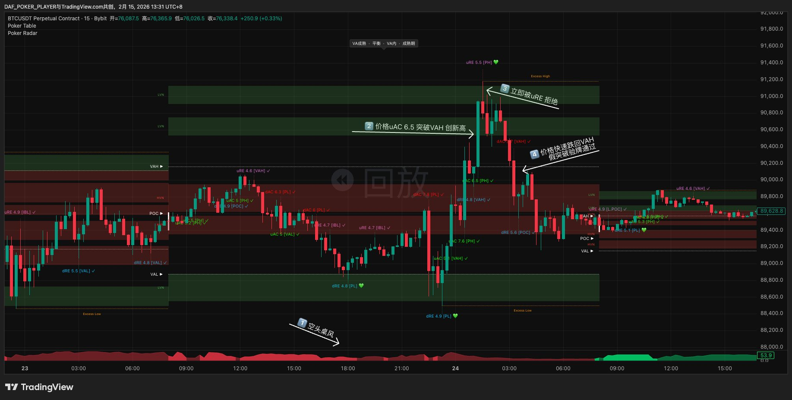
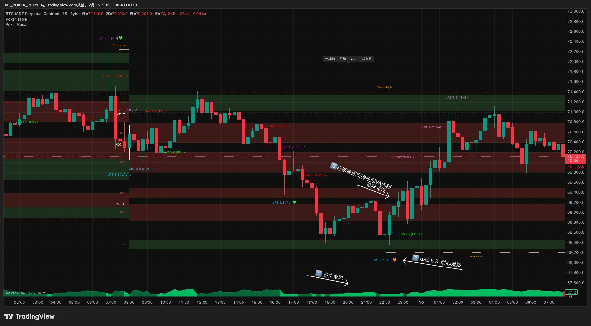
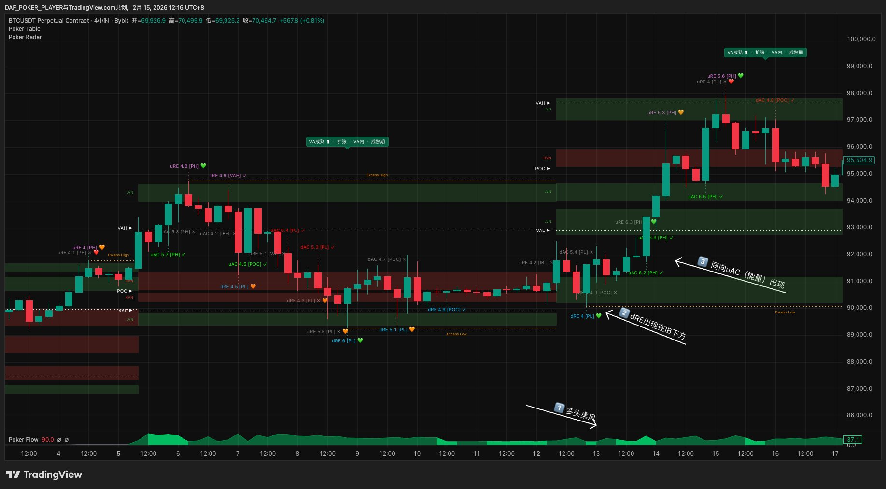
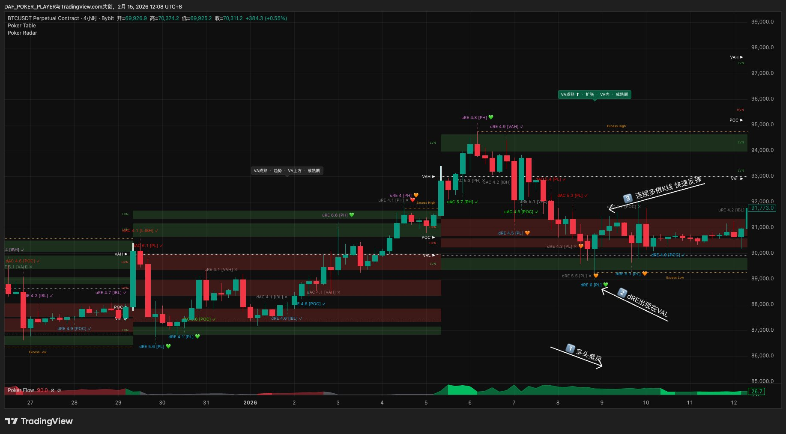
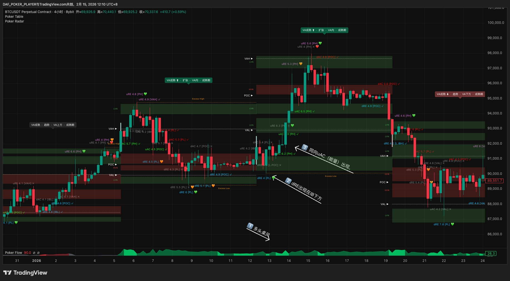
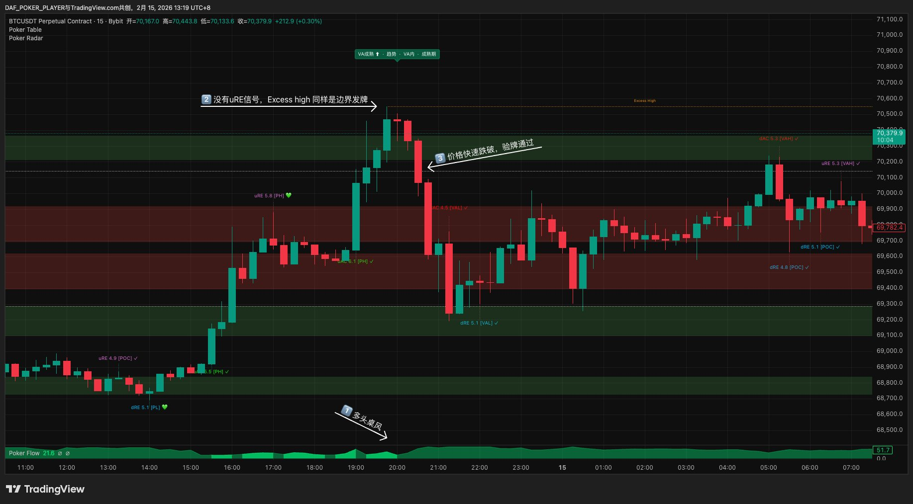

# 第四章 · 等发牌

> *"牌桌上最重要的纪律，是大部分时间不出手。"*

桌选好了、桌风读过了，接下来你盯着8个一级边界等一件事：**哪个边界出事了。** 边界上发生了事件或结构演化就是发牌，但拿到牌不代表可以动手——只有验牌通过的信号才进入后续评估。

---

## 4.1 什么算一手牌

你的牌桌上有8个一级边界，按识别工具分两组：

**Radar捕捉信号（6个）——K线级别实时事件：** 价格触及PH、PL、VAH、VAL、IBH、IBL时，Radar自动捕捉接受（AC）或拒绝（RE），标记为uAC、dAC、uRE、dRE中的一种。其中PH/PL/IBH/IBL只在Radar检测到事件时才标记出来——没有事件，图上不显示这些位置。边界上出事了，你就拿到了一手牌。6个边界均发AC和RE两种牌。

**Table识别（2个）——VP级别结构演化：** Poker Table在VP的高低点区域识别Excess High和Excess Low。Excess不是某一刻"发生"的，是VP在一段时间内累积成交量逐渐"长出来"的尖锐尾部。Excess成型=拍卖在那个方向的探索已被结构性拒绝=发牌。

Radar边界和Table边界各自独立。PH/PL和Excess都出现在周期高低点区域，但来自不同指标、不同机制——可以单独出现，也可以共同存在。共同存在时以Excess为准（VP结构证据优先于K线事件）。

VA内部的信号——包括POC附近、HVN内部、以及任何非边界位置上的Radar响应——一律当噪音忽略，不算发牌。原因很简单：边界是多空双方的决战线，边界上的事件或结构演化代表拍卖机制的方向性判决。VA内部的价格运动只是已知价值区内的正常轮换，不产生新的方向性信息。

POC不是发牌位，但有四种辅助角色（验牌能量/共振/方向/翻转锚点，详见§1.7）。核心原则不变：**只因边界事件开仓——发牌必须来自8个一级边界，入场价位在甜点位上。**

拿到牌之后，你要做的第一件事不是分析它、不是判断方向——而是**验证它是不是真的**。

---

## 4.2 验牌：确认这手牌是真的

信号出现了，但你还不能直接入场。

> **⚠️ 核心原则：没有通过验牌的信号都是预测，而Poker Trading永远不做预测。**

信号出现的那一刻只是可能性，只有后续市场行为确认了方向，它才从"预测"变成"确认"。

### 什么是验牌

**验牌是对任何市场事件判断"它是不是真的"的标准流程。** 入场、加注、判断假突破——都走同一条验牌链路。一次定义，处处适用。

**人话版本：** 信号出来了→(1)价格有没有往正确方向动？没动=扔掉 (2)动了，待在新方向3根K线以上不回来？没有=扔掉 (3)还出了同方向的新推进且不被Radar否定？有=直接挂甜点位。没有=等价格回来测试不破再挂。

### 验牌链路

```
                        事件出现（RE / AC / Excess）
                                  │
                        ┌─────────┴─────────┐
                        │ ① 方向（必须通过） │
                        │ 价格往正确方向动了？│
                        └────┬──────────┬────┘
                          没有          有
                           ↓            ↓
                        ❌弃牌  ┌───────┴────────┐
                               │ ② 时间（必须）  │
                               │ ≥3根K线不回去   │
                               └───┬────────┬───┘
                                回来了    没回来
                                  ↓         ↓
                               ❌弃牌 ┌─────┴──────┐
                                      │ ③ 能量     │
                                      │ 同向新推进？│
                                      └──┬─────┬──┘
                                       没有    有
                                        ↓      ↓
                                     后手入场   先手入场
                                  等回踩不破  直接挂
                                  再挂甜点位  甜点位
```

**快速通道：** 有时市场不给你慢慢数3根K线的机会——去程中直接出现同向AC且不被Radar否定（如dRE[PL]后立刻uAC[IBL]）。这个AC同时完成了三件事：AC本身=方向确认，AC=能量的定义，而Radar的确认机制（2-3根K线内价格没有反向突破信号K线极值）已经帮你做了时间检验。三关同时过=验牌完成→先手入场，直接找甜点位挂单。

**去程与回程：** 信号出现后价格远离信号位的过程叫**去程**——验牌三步都在去程中判断。价格回向信号位的过程叫**回程**——§4.3会详细讲。

### ① 方向（必须通过）

信号出现后，价格有没有往正确方向动？

**RE类事件（拒绝）：** 价格有没有往反方向反弹？dRE出现后价格涨了吗？uRE出现后价格跌了吗？有 → 继续。没有 → 验牌失败。

**AC类事件（突破）：** 价格有没有继续往突破方向走？uAC出现后价格继续涨了吗？dAC出现后价格继续跌了吗？有 → 继续。没有（价格回到突破位内侧）→ 验牌失败（可能是假突破→诈唬牌机会，见§4.4）。

**Excess事件：** 价格有没有远离Excess区域？Excess High成型后价格跌了吗？Excess Low成型后价格涨了吗？有 → 继续。没有 → 验牌失败。

三种信号问的都是同一个问题：**价格动了没有？** 方向是二元判断——动了就继续，没动就扔掉。Radar评分不影响方向判断，但影响验牌优先级（见§4.4）。

### ② 时间（必须通过）

方向对了，但价格可能只是一根K线的脉冲——闪一下就回来。时间过滤掉这种噪音。

**判断标准：≥3根执行桌K线持续停留在新方向，不回到信号位。** 短线桌看4H K线，日内桌看15/30m K线，分时段桌看5m K线。3根是最低门槛，5根以上确认度更高。

持续停留不回去 → ✅ 继续看③能量。又滑回信号位 → ❌ 验牌失败。

①通过但②未明确 → **验牌进行中**：继续观察，不入场，不预判结果。

**例外：去程中出现同向AC且不被Radar否定 → 不用另外数3根K线。** Radar的否定机制本身就是时间检验——信号发生后2-3根K线内价格没有反向突破，就是不被否定，就是时间过了。直接跳到"验牌完成，先手入场"（见上方快速通道）。

### ③ 能量（先手 or 后手）

方向+时间都过了，信号大概率为真。方向+时间证明信号位有力量在防守——价格被挡住了，而且挡了一段时间。现在看有没有后续推进——能量证明这股力量还在进攻，不仅挡住了，还往前推了。**有没有能量，决定你怎么入场。**

**RE后的能量 = 同向AC。** 如dRE[VAL]后出现uAC[POC]——POC的同向AC可以作为验牌能量。

**AC后的能量 = 连续AC推进。** 如uAC[IBH]后出现uAC[VAH]。

**Excess后的能量 = 同向AC。** 如Excess High成型后出现dAC，方向一致即算能量确认。

能量信号有效期=当前VP周期内。VP更新后重新评估。

**RE和Excess后的能量不能被Radar否定。** 如果能量信号后来被Radar标记为无效，这个能量就作废——继续等新的能量或弃牌。

**⚠️ 能量只在去程中计算。** 价格远离信号位的过程中出的同向AC才是能量。价格回向信号位的过程中出的信号不是能量，而是回踩确认（见§4.3）。

**能量分流规则：**

| ③ 能量 | 入场方式 | 含义 |
|--------|---------|------|
| ✅ 有 | **先手入场 · 直接挂甜点位** | 方向+时间+能量三层确认，防守和进攻都验证了，可以博弈回踩不破 |
| ❌ 没有 | **后手入场 · 等回踩不破** | 方向+时间确认了防守，但没有进攻验证——等回踩确认后再挂甜点位 |

**默认规则：能量有就先手，没有就后手。** 如果你是保守型牌手，可以每次都选择后手入场——牺牲一点入场价，换更高的确认度。

---

## 4.3 回踩确认：防守还在不在

验牌确认了"信号位有真实力量在防守"。但防守会不会持续？价格回来第二次测试的时候，防守还在不在？这就是回踩确认要回答的问题。

> **回踩确认的前提是验牌通过（至少①方向+②时间）。** 信号出来后价格在信号位附近反复晃动、方向和时间都没过——这不叫回踩，这叫拍卖还没结束。只有去程走完了（价格离开信号位、在新位置停住了），之后价格回来才叫回踩。

### 关键锚点

回踩不破，"不破"的是**关键锚点**——一个具体的价位：

| 信号类型 | 关键锚点 | 为什么 |
|---------|---------|--------|
| RE | RE信号K线的极值点（dRE=低点，uRE=高点）| 价格被弹回来的最低/最高价 |
| AC | AC K线回踩侧的极值点（uAC=低点，dAC=高点）| 突破后没跌/涨回去的最低/最高价 |
| Excess | Excess尾部的极值点 | Excess成型的边界价 |

**判断方式：二元，用收盘价定义。** K线收盘在关键锚点的正确一侧=不破。K线收盘在锚点错误一侧=击穿，不做。影线刺穿锚点但收盘拉回正确一侧=不破。只看一个数字，破了没有，不需要判断"确认够不够强"。

### 后手入场流程

后手入场（③能量没出）的完整入场流程：

1. ①方向+②时间通过 → 验牌部分通过，不挂单，观察
2. 价格开始回向信号位（回程开始）
3. 价格到达信号位附近 → 观察关键锚点
4. 锚点没被击穿 → 回踩不破确认 → 找甜点位挂限价单（甜点位方法见Ch6，和先手入场完全一样）
5. 锚点被击穿 → 不做
6. 价格不回踩直接走 → 错过，等下一手

### 先手入场 vs 后手入场

| | 先手入场 · 直接挂 | 后手入场 · 回踩后挂 |
|--|---------------|-----------------|
| 前提 | ①方向 + ②时间 + ③能量 | ①方向 + ②时间（能量没出）|
| 入场时机 | 验牌通过后立刻找甜点位挂单 | 回踩不破确认后找甜点位挂单 |
| 优势 | 入场价好（信号位附近）| 方向有双重确认（验牌+回踩）|
| 代价 | 可能被回踩击穿止损 | 入场价较差，可能接不到 |
| 甜点位方法 | Ch6三层优先级 | Ch6三层优先级（完全一样）|

**硬规则：同一个信号只承担一次入场风险。** 先手入场成交了（无论盈亏）→ 这手牌结束，不再做后手。先手挂单中未成交 → 等结果，不同时做后手。没挂先手（保守型牌手直接选后手）→ 可以直接走后手。

---

## 4.4 验牌速查

### RE / AC / Excess 验牌对照

```
RE信号（拒绝/防守）    AC信号（突破/进攻）    Excess（结构演化）
     │                      │                      │
① 方向？              ① 方向？              ① 方向？
往反方向反弹了？       继续突破方向走了？      远离Excess区域了？
有↓  没有→❌          有↓  没有→❌          有↓  没有→❌
② 时间？              ② 时间？              ② 时间？
≥3根K线不回去          ≥3根K线不回去          ≥3根K线不回去
是↓  否→❌            是↓  否→❌            是↓  否→❌
③ 能量？              ③ 能量？              ③ 能量？
同向AC出现？           连续AC推进？           同向AC出现？
有→先手入场  没有→后手入场  有→先手入场  没有→后手入场  有→先手入场  没有→后手入场
```

| | RE信号 | AC信号 | Excess信号 |
|--|--------|--------|-----------| 
| **信号本质** | 防守（拒绝） | 进攻（突破） | 结构演化（VP尾部） |
| **① 方向** | 价格往反方向反弹了？ | 价格继续往突破方向走了？ | 价格远离Excess区域了？ |
| **② 时间** | ≥3根K线不回到信号位 | ≥3根K线不回到突破位 | ≥3根K线不回到Excess区域 |
| **③ 能量** | 同向AC出现（不被否定）| 连续AC推进 | 同向AC出现（不被否定）|
| **有能量** | 先手入场：直接挂甜点位 | 先手入场：直接挂甜点位 | 先手入场：直接挂甜点位 |
| **没能量** | 后手入场：等回踩不破再挂 | 后手入场：等回踩不破再挂 | 后手入场：等回踩不破再挂 |
| **失败标志** | 没反弹 / 回到信号位 | 回到突破位内侧 | 价格回到Excess区域内 |

### 假突破的验牌

AC突破后站不住、价格回到关键位内侧 = 假突破。突破失败意味着反方向力量更强，利用假突破反做的机会叫"诈唬牌"（Ch5）。

假突破验牌分两段：先确认突破失败（2-3根K线站不住+Radar捕到反向信号），再按反方向RE逻辑走验牌链路。



### 最重要的"不做"信号

**RE出现后价格根本不走 = 弃牌。** 验牌链路第一步就失败——方向都没有，后面不用看。

**AC出现后价格回到内侧 = 弃牌。** 突破失败了。但别忘记，这可能是一个假突破的机会——AC失败本身就是反方向的信息。

你在这个时刻会感到一种错过的焦虑——"如果它后来又走了呢？"这很正常。但记住两件事：你没亏一分钱，而且一个连方向都没有的信号，后来真走出大行情的概率很低。弃掉不心疼的牌是职业牌手的日常。

### 验牌优先级

**🟢 A档：立刻验牌。** Radar 7+。双Excess也按A档。

**🟡 B档：耐心观察。** Radar 4-6。单Excess（无Radar评分）默认B档。

**🔴 C档：暂时跳过。** Radar 4以下。

**Excess发牌：** 没有Radar评分，单Excess默认按🟡B档处理（耐心观察①方向和②时间），双Excess按🟢A档。

> 验牌在你所在牌桌的K线上进行。短线桌看4H K线，日内桌看15/30m K线，分时段桌看5m K线。不切到更小K线上"验得更快"。
>
> 验牌没有时间限制——唯一的过期条件是VP更新后边界位移。如果VP没更新、边界没动，即使信号过了6小时你才打开图表，仍然可以回溯后续K线表现来补验。过期≠失败（不影响未来判断，可能开延续牌新局）。

### 场景

**RE · 后手入场（方向+时间过了，没能量）：** BTC 15min，多头桌风，dRE 5.3出现在PL附近。①方向：价格反弹了。②时间：4根K线待在PL上方不回去。③能量：没有同向uAC出现。→后手入场，等价格回踩PL附近、关键锚点不被击穿后再挂甜点位。



**RE · 能量出现→先手入场：** BTC 15min，空头桌风，dRE 5.6出现。①方向：价格反弹了。②时间：3根K线不回去。③能量：同向uAC 5.6出现。✅ 三步全过→先手入场。



**RE · 先手入场（高评分+能量）：** BTC 15min，多头桌风，uRE 8.3出现在PH（逆风牌——逆着桌风做空）。①方向：价格向下反弹，有方向。②时间：3根K线持续在PH下方不回去。③能量：同向dAC 6.2出现。✅ 三步全过→先手入场，直接挂甜点位。



**AC · 先手入场（方向+时间+能量全过）：** BTC 15min，多头桌风，uAC 6.8突破VAH。①方向：价格继续往上走。②时间：4根K线站稳在VAH上方不回去。③能量：继续uAC突破IBH。✅ 三步全过→先手入场，直接在VAH附近挂甜点位等回踩。



**AC · 后手入场（方向+时间过了，没能量）：** 黄金5min，多头桌风，uAC 5.3[PH]突破VAH。①方向：价格继续往上走。②时间：方向+时间都通过了。③能量：没有新的能量通过。→后手入场，价格跌回VAH附近又快速收回，回踩不破，后手入场挂甜点位。

![AC验牌——后手入场：黄金5min图，①多头桌风，②uAC 5.3[PH]突破VAH，③方向+时间都通过了但没有新的能量通过，④价格跌回VAH又快速收回，回踩不破→后手入场](../images/ch4-ac-patience.png)

**Excess · 后手入场：** BTC 15min，多头桌风，没有uRE信号但Excess High成型=边界发牌。①方向：价格远离Excess区域向下走。②时间：3根K线持续远离。③能量：没有同向dAC出现。→后手入场，等回踩Excess区域不破后再挂甜点位。



---

> **本章要点速记**
>
> 发牌 = 8个一级边界：Radar捕捉 PH/PL/VAH/VAL/IBH/IBL 的AC和RE（其中PH/PL/IBH/IBL事件触发才显示）+ Table识别 Excess High/Low（VP结构演化，始终可见）· VA内=噪音 · POC=辅助
>
> Radar和Excess共同存在以Excess为准
>
> 验牌三步（统一链路）：①方向（必须）→ ②时间≥3根K线不回去（必须）→ ③能量=去程中同向AC
>
> ③有能量 → 先手入场：直接挂甜点位 · ③没能量 → 后手入场：等回踩不破再挂
>
> 回踩确认：验牌通过后，价格回到信号位附近，关键锚点没被击穿=回踩不破 · 用收盘价定义（影线刺穿但收盘拉回=不破）· RE锚点=信号K线极值点 · AC锚点=AC K线回踩侧极值点
>
> 去程中出的后续信号=验牌能量 · 回程中出的后续信号=回踩确认 · 不要混淆
>
> 验牌优先级：🟢A(7+)立刻验 · 🟡B(4-6)观察 · 🔴C(<4)跳过 · 在当前桌K线验 · 不限时间
>
> 没有通过验牌的信号都是预测，Poker Trading永远不做预测

> 🏁 **你现在能做什么：** 你能识别一个边界信号并判断它是不是真的——通过验牌三步检查，并知道该直接挂甜点位（先手入场）还是等回踩确认（后手入场）。下一章，你会学到验牌通过后，怎么判断这手牌值不值得打。
>
> ⏸️ **中场休息：** 如果你到这里感觉信息量很大，是正常的。Ch1-Ch4引入了大量新概念。回去翻一遍Ch3和Ch4的速记，确认你理解了"桌风→偏见→等边界出事→验牌→先手/后手入场"这条线，再往下走。
