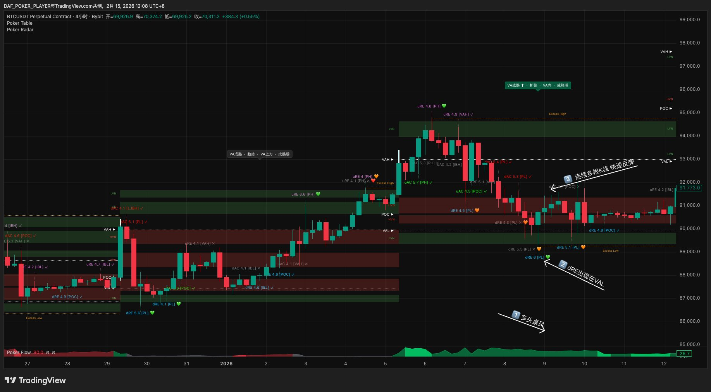
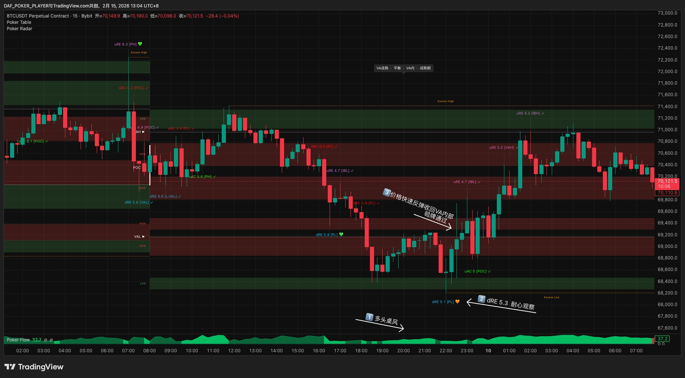
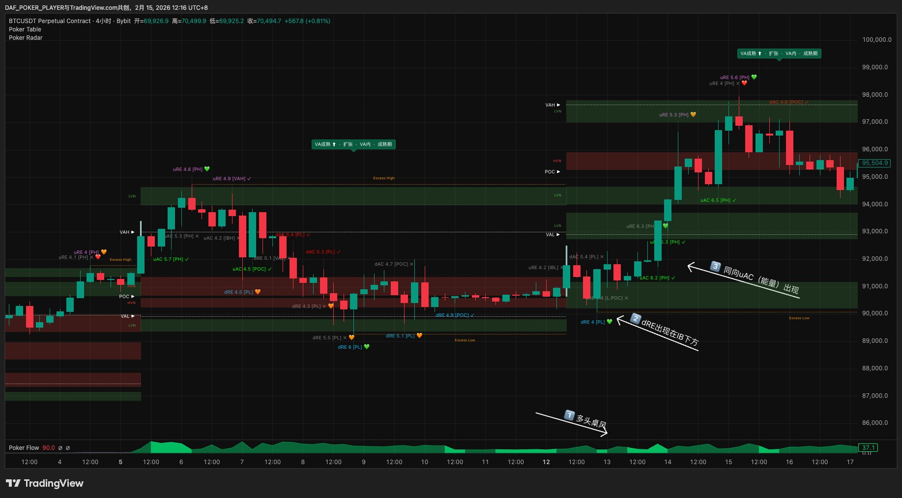
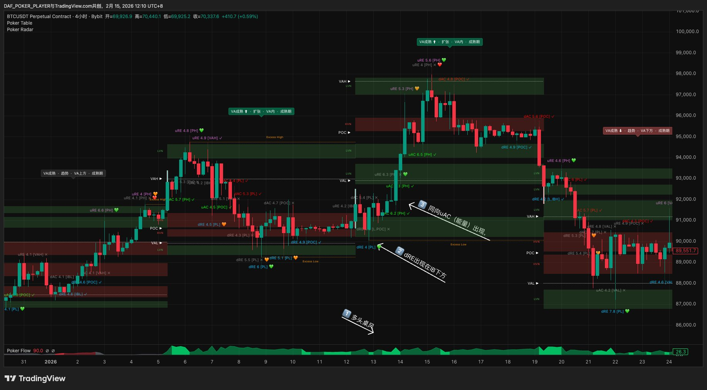
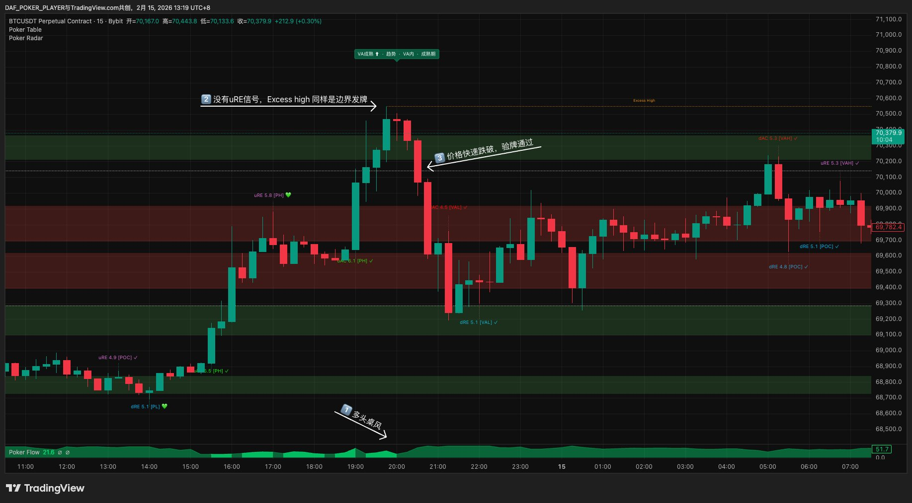

# 第四章 · 等发牌

> *"牌桌上最重要的纪律，是大部分时间不出手。"*

桌选好了、桌风读过了，接下来你盯着8个一级边界等一件事：**哪个边界出事了。** 边界上发生了事件或结构演化就是发牌，但拿到牌不代表可以动手——只有验牌通过的信号才进入后续评估。

---

## 4.1 什么算一手牌

你的牌桌上有8个一级边界，按识别工具分两组：

**Radar捕捉信号（6个）——K线级别实时事件：** 价格触及Table画出的PH、PL、VAH、VAL、IBH、IBL时，Radar自动捕捉接受（AC）或拒绝（RE），标记为uAC、dAC、uRE、dRE中的一种。边界上出事了，你就拿到了一手牌。PH/PL只发RE牌（拒绝），VAH/VAL/IBH/IBL发AC和RE两种牌。

**Table识别（2个）——VP级别结构演化：** Poker Table在VP的高低点区域识别Excess High和Excess Low。Excess不是某一刻"发生"的，是VP在一段时间内累积成交量逐渐"长出来"的尖锐尾部。Excess成型=拍卖在那个方向的探索已被结构性拒绝=发牌。

Radar边界和Table边界各自独立。PH/PL和Excess都出现在周期高低点区域，但来自不同指标、不同机制——可以单独出现，也可以共同存在。共同存在时以Excess为准（VP结构证据优先于K线事件）。

VA内部的信号——包括POC附近、HVN内部、以及任何非边界位置上的Radar响应——一律当噪音忽略，不算发牌。原因很简单：边界是多空双方的决战线，边界上的事件或结构演化代表拍卖机制的方向性判决。VA内部的价格运动只是已知价值区内的正常轮换，不产生新的方向性信息。

POC不是发牌位，但有四种辅助角色（验牌能量/共振/方向/翻转锚点，详见§1.7）。核心原则不变：**只因边界事件开仓——发牌必须来自8个一级边界，入场价位在甜点位上。**

拿到牌之后，你要做的第一件事不是分析它、不是判断方向——而是**验证它是不是真的**。

---

## 4.2 验牌：确认这手牌是真的

信号出现了，但你还不能直接入场。

> **⚠️ 核心原则：没有通过验牌的信号都是预测，而Poker Trading永远不做预测。**

信号出现的那一刻只是可能性，只有后续市场行为确认了方向，它才从"预测"变成"确认"。

### 什么是验牌

**验牌是对任何市场事件判断"它是不是真的"的标准流程。** 入场、加注、判断假突破——都走同一条验牌链路。一次定义，处处适用。

**人话版本：** 信号出来了→(1)价格有没有往我想的方向动？没动=扔掉 (2)动了，动得快不快？快=OK (3)不快，但一直待在新方向不回来=也OK (4)或者出现了同方向的新信号=也OK (5)啥都没有=扔掉。

### 验牌链路

```
                    事件出现
                      │
            ┌─────────┴─────────┐
            │  ① 方向 / 评分     │ ← 必须通过
            │  (RE:有反弹?       │
            │   AC:评分7+?)     │
            └─────────┬─────────┘
               没通过 │ 通过
                 ↓    │
              ❌弃牌   ↓
            ┌─────────┴─────────┐
            │  ② 响应速度        │
            │  ≤3根K线+远离      │
            │  +实体为主          │
            └─────────┬─────────┘
                快 ↙      ↘ 不快
              ✅通过        ↓
            ┌─────────┴─────────┐
            │  ③ 停留      ④ 能量│ ← 满足任一即可
            │  待在新方向   同向新 │
            │  不回去      信号出现│
            └─────────┬─────────┘
             满足任一 ↙      ↘ 都没有
              ✅通过       ❌弃牌
```

### ① 方向 / 评分（必须通过）

**RE类事件（拒绝、回踩）：** 价格有没有往预期方向走？有 → 继续。没有 → 验牌失败。

**AC类事件（突破、站稳）：** 突破力度大不大？直接看Radar评分——7+ = 力度大 → ✅ 验牌直接通过。不到7+ → 继续看③④。

区别：RE问"有没有方向"，AC问"评分够不够"。

**Excess发牌：** Excess没有Radar评分，跳过①评分判断，从②响应速度开始。RE类Excess仍需确认方向（价格离开PH/PL区域）。

### ② 响应速度

**RE类事件：** 快速验牌通过需要三要素同时满足：

- **根数少**：≤3根K线内连贯反弹，无横盘犹豫
- **距离远**：反弹幅度≥信号K线振幅的50%
- **实体实**：反弹K线以实体为主，非十字星、非长反向影线

三个同时满足 → ✅ 验牌通过。任何一个不满足 → 继续看③或④。以上阈值为参考范围，不同品种可根据经验微调。

**AC类事件：** 评分不到7+才走到这步，无独立速度关，直接看③④。

### ③ 持续确认

速度不快，但价格一直待在新方向上不回去。**停留越久，确认越牢靠。** 最低参考阈值：≥2根K线持续停留在新方向不回原位。

持续停留在新方向 → ✅ 验牌通过。又滑回原位 → 验牌失败。①通过但②③④都未明确 → **验牌进行中**：继续观察，不入场，不预判结果。

### ④ 能量

等待过程中出现同向新信号 → ✅ 验牌直接通过，跳过③。

**RE后的能量 = 同向AC。** 如dRE[VAL]后出现uAC[POC]。POC不发牌但可以提供证据——边界发牌后POC的同向AC作为验牌能量，不改变"只因边界事件开仓"的原则。

**AC后的能量 = 连续AC推进。** 如uAC[IBH]后出现uAC[VAH]。

能量信号有效期=当前VP周期内。VP更新后重新评估。

注意：AC后的回踩RE（如uAC[IBH]后dRE[IBH]弹回）属于③站稳确认，不属于④能量。

### RE和AC验牌对照

```
     RE信号（拒绝/防守）          AC信号（突破/进攻）
         │                           │
    ① 有反弹吗?                  ① 评分7+吗?
    有↓   没有→❌                是→✅    否↓
    ② 快吗?                      ② (跳过)
    快→✅   不快↓                      ↓
    ③停留 或 ④同向AC             ③站稳 或 ④连续AC
    有→✅   没有→❌               有→✅   没有→❌
```

| | RE信号 | AC信号 |
|--|--------|--------|
| **信号本质** | 防守（拒绝） | 进攻（突破） |
| **① 第一关** | 方向：有没有反弹 | 评分：7+→直接过 |
| **② 响应速度** | 2-3根K线内连贯远离+实体为主→直接过 | （评分不到7+才到这步，直接看③④）|
| **③ 持续确认** | 停留在新方向，越久越好 | 站稳在突破位上方 |
| **④ 能量** | 同向AC出现（RE+AC配合） | 连续AC推进（AC+AC连续） |
| **失败标志** | 没反弹 / 回到拒绝位 | 回到突破位内侧 |

**Excess验牌：** Excess没有Radar评分，验牌跳过①评分/方向判断，直接从②响应速度开始——Excess成型后价格有没有快速远离？有→通过，没有→看③停留。其余和RE验牌逻辑相同。

### 假突破的验牌

AC突破后站不住、价格回到关键位内侧 = 假突破。突破失败意味着反方向力量更强，利用假突破反做的机会叫"诈唬牌"（Ch5）。

假突破验牌分两段：先确认突破失败（2-3根K线站不住+Radar捕到反向信号），再按反方向RE逻辑走验牌链路。

### 最重要的"不做"信号

**RE出现后价格根本不走 = 弃牌。** 验牌链路第一步就失败——方向都没有，后面不用看。

**AC出现后价格回到内侧 = 弃牌。** 突破失败了。但别忘记，这可能是一个假突破的机会——AC失败本身就是反方向的信息。

你在这个时刻会感到一种错过的焦虑——"如果它后来又走了呢？"这很正常。但记住两件事：你没亏一分钱，而且一个连方向都没有的信号，后来真走出大行情的概率很低。弃掉不心疼的牌是职业牌手的日常。

### 验牌优先级

**🟢 A档：立刻验牌。** Radar 7+。

**🟡 B档：耐心观察。** Radar 4-6。

**🔴 C档：暂时跳过。** Radar 4以下。

> 验牌在你所在牌桌的K线上进行。短线桌看4H K线，日内桌看30m K线。不切到更小K线上"验得更快"。
>
> 验牌没有时间限制——唯一的过期条件是VP更新后边界位移。如果VP没更新、边界没动，即使信号过了6小时你才打开图表，仍然可以回溯后续K线表现来补验。过期≠失败（不影响未来判断，可能开延续牌新局）。

### 场景

**RE通过（速度快）：** 短线桌多头趋势，dRE 7.8出现在VAL。①方向：价格立刻弹起。②速度：两根4H K线快速远离VAL。✅ 验牌通过。

**RE通过（能量）：** dRE 6.5出现在VAL。①弹起但很慢。②速度不快。④能量：Radar报出uAC 7.0 [POC]，同向AC出现。✅ 验牌通过。（如果④也无，但价格持续停留在VAL上方不回落 → ③持续确认通过。）

**RE失败：** dRE 6.0出现在支撑位。①弹了一下又滑回来。②不快。③没停留在上方。④无AC。价格跌破支撑位。❌ 验牌失败，弃牌。

**AC通过（评分高）：** uAC突破IBH，Radar 7.5。①评分7+=力度大 → ✅ 直接通过。（评分不到7+时：后续站稳在IBH上方 = ③通过，或VAH出现新uAC = ④能量通过。）











---

> **本章要点速记**
>
> 发牌 = 8个一级边界（全部由Table画出）：Radar捕捉 PH/PL（只RE）+ VAH/VAL/IBH/IBL（AC和RE）+ Table识别 Excess High/Low（VP结构演化）· VA内=噪音 · POC=辅助
>
> Radar和Excess共同存在以Excess为准 · Excess验牌跳过①评分从②速度开始
>
> 验牌链路：①方向/评分（必须过）→ ②速度快→直接过 → 不快看③停留或④能量 → 都没有→弃牌
>
> RE验牌：①反弹? → ②快?（少+远+实）→ ③停留 / ④同向AC
>
> AC验牌：①评分7+→直接过 → 不到7+→③站稳 / ④连续AC
>
> 验牌优先级：🟢A(7+)立刻验 · 🟡B(4-6)观察 · 🔴C(<4)跳过 · 在当前桌K线验 · 不限时间
>
> 没有通过验牌的信号都是预测，Poker Trading永远不做预测

> 🏁 **你现在能做什么：** 你能识别一个边界信号并判断它是不是真的——通过验牌链路四步检查。下一章，你会学到验牌通过后，怎么判断这手牌值不值得打。
>
> ⏸️ **中场休息：** 如果你到这里感觉信息量很大，是正常的。Ch1-Ch4引入了大量新概念。回去翻一遍Ch3和Ch4的速记，确认你理解了"桌风→偏见→等边界出事→验牌"这条线，再往下走。
