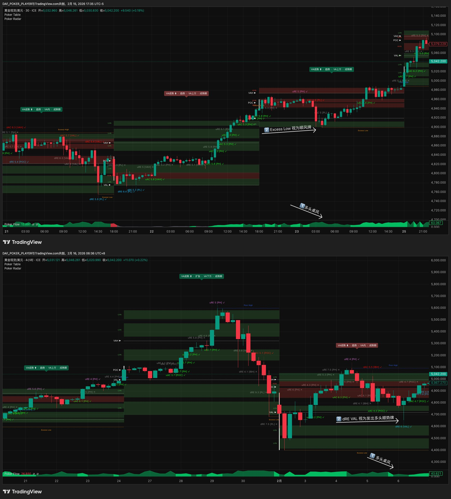
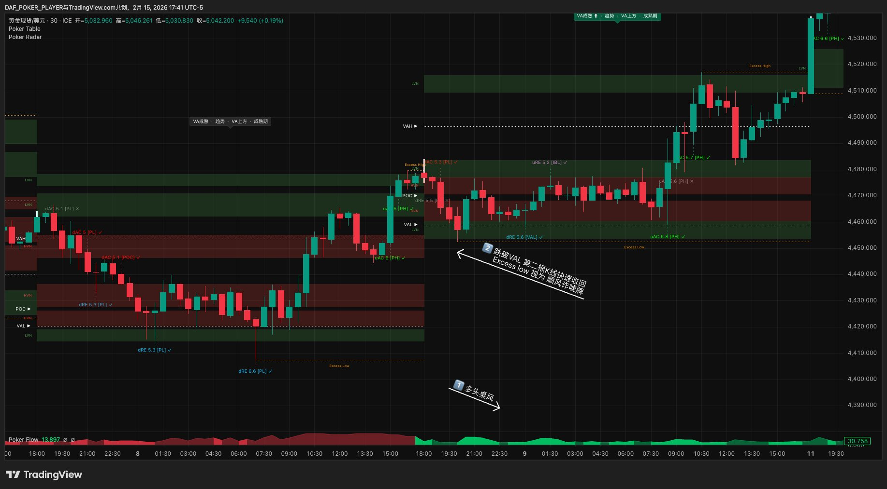
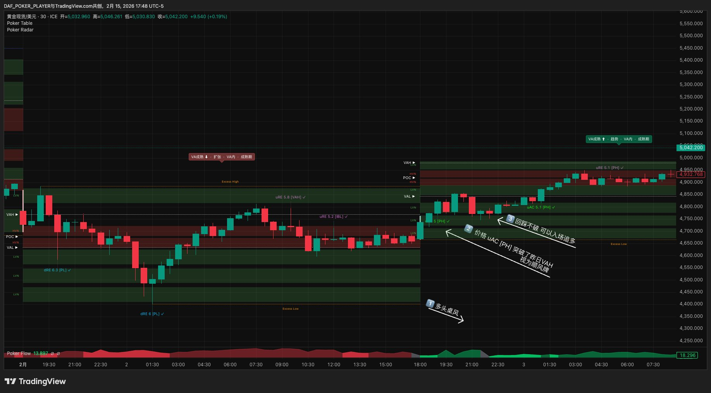
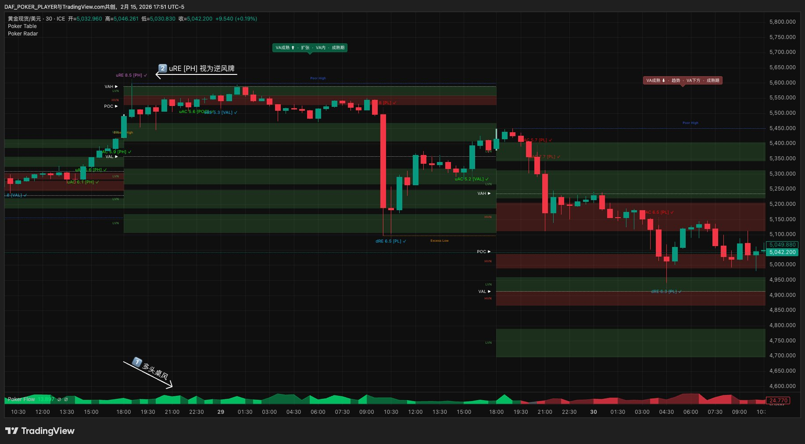
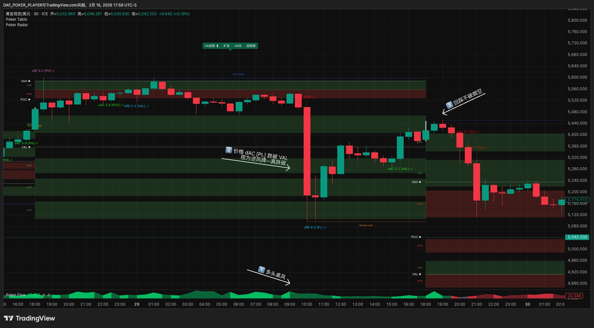
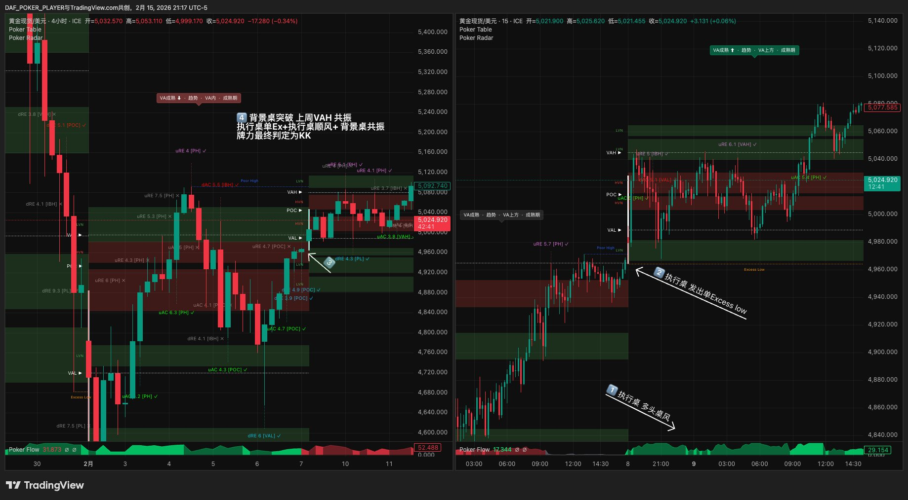
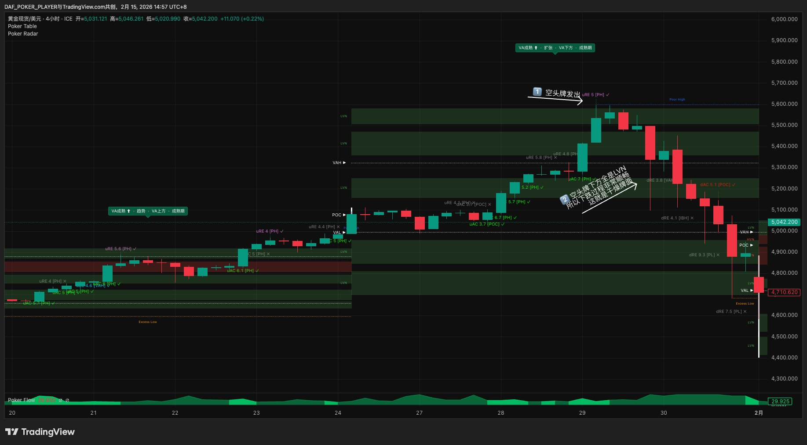
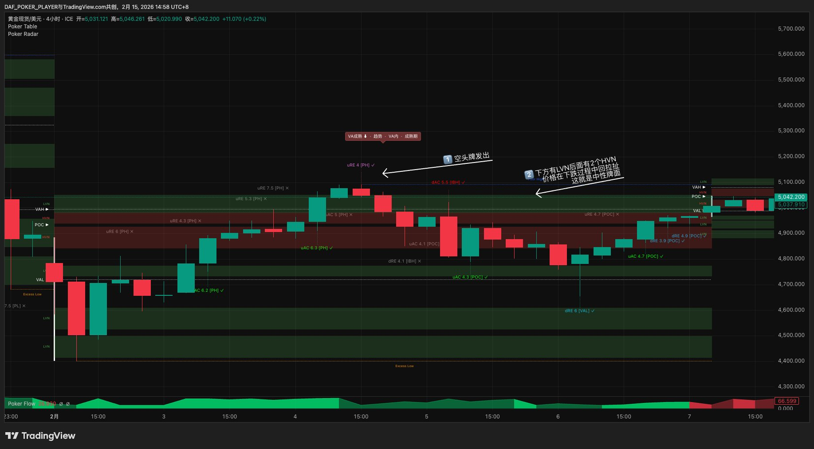
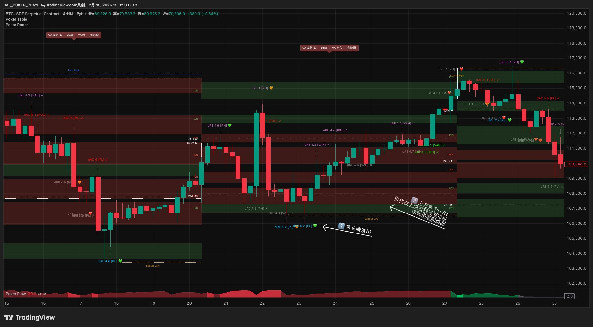

# 第五章 · 牌好吗

> *"好牌不代表好局。牌好、环境好、两者同时满足才出手。"*

验牌通过的信号不等于好牌。这一章做全面体检——牌型、牌力、纹理，输出最终牌力。

---

## 5.1 四种牌型：这是哪种机会

牌型的判断从**边界**出发，不是从信号类型出发。实战中你不是坐在那里等"一个uAC"——你是盯着一个具体的边界（比如VAL 2650），看价格到了之后发生什么。边界上只会出两种事：**突破成功**（AC验牌通过，价格站到另一侧）和**突破失败**（RE拒绝弹回，或AC失败价格回到原侧）。你做什么，取决于哪个边界出了什么事。

### 三种入场逻辑

**买便宜 / 卖贵。** 价格到了边界被拒绝弹回（RE）。做多就在下方边界（VAL/IBL/PL）买便宜的，做空就在上方边界（VAH/IBH/PH）卖贵的。这是最经典的边界交易。

**追真突破 / 追真跌破。** 边界被真正突破（AC验牌通过），新的价值区被发现。做多就追上方边界（VAH/IBH/PH）的真突破，等回踩突破位入场，做空就追下方边界（VAL/IBL/PL）的真跌破，等反弹至跌破位入场。原来的阻力变成支撑，原来的支撑变成阻力。AC[PH/PL]是区间扩展信号——但和所有AC一样，必须通过验牌（站稳/延续）才算真突破。站不住收回来=假突破→诈唬牌机会（见下一条）。

**假突破反做。** 边界看似被突破但站不住，价格回到原侧——突破失败本身就是反方向的强证据。VAH/IBH/PH假突破→做空，VAL/IBL/PL假跌破→做多。这就是诈唬牌。

### 四种牌型

牌型由**交易方向 vs 桌风方向**决定。两者一致=顺风，两者相反=逆风。桌风与VA迁移分歧时牌型不变但牌力降级（见§5.5）。

**顺风牌（主食）。** 交易方向和桌风+VA迁移一致。多头桌风下的做多、空头桌风下的做空，不管来自哪种入场逻辑（买便宜、追突破、假跌破反做多），都是顺风牌。新手应该集中精力打这个牌型。

**逆风牌。** 交易方向和桌风+VA迁移相反。天然需要更高门槛——更强信号、更谨慎仓位。

**诈唬牌。** 假突破后反做。按反做后的交易方向归入对应类别——顺风方向的假突破反做是**顺风诈唬牌**（桌风+假突破双重确认，门槛同顺风牌），逆风方向的假突破反做是**逆风诈唬牌**（按逆风牌门槛处理）。判断方法：先看假突破反做后你的交易方向，再和桌风比——同向=顺风诈唬，反向=逆风诈唬。

**延续牌。** 错过原始入场后的补救。不是独立方向判断，而是入场时机的处理方式。入场逻辑：价格远离原始甜点位后，在途中形成新小平衡区，在新平衡区边缘找甜点位入场。

小平衡区三个条件：3-5根K线横向震荡（非单边推进），幅度不超甜点位到TP1距离的30%，K线实体逐渐缩短、影线互相覆盖。

硬性前提：桌风没有反向 + 有清晰的新小平衡 + 小平衡内出现过一次顺风方向的Radar信号。三缺一就放弃。延续牌天然用更轻仓位。甜点位和TP定位见Ch6（算笔账）。

### 边界×结果→牌型映射

下面两张表是实战中最核心的对照——**你盯着哪些边界、等什么结果、做什么动作。**

**怎么用这张表（四步）：**
1. **看桌风**→确定用哪张表（多头用第一张，空头用第二张）
2. **找你盯的边界**→在表的第一列找到对应行（比如你在盯VAL）
3. **等结果**→价格到了边界之后，看它是被拒绝弹回（RE）、真突破站稳（AC成功）、还是假突破回来（AC失败）
4. **查表**→对应行告诉你该做什么、这是什么牌型、优先级多高

**顺风优先原则：** 每张表的前三行是顺风方向（⭐⭐⭐和⭐⭐），后三行是逆风（⭐）。新手集中精力盯前三行就够了。

**多头桌风 + VA上移（一致）：**

| 边界 | 结果 | 你做什么 | 牌型 | 顺风优先级 |
|------|------|---------|------|-----------|
| VAL / IBL / PL / Excess Low | 拒绝弹回（RE / Excess） | 在支撑位买便宜做多 | 顺风牌 | ⭐⭐⭐ 最高 |
| VAL / IBL / PL | 假跌破（AC失败→反弹） | 在支撑位做多 | 顺风诈唬牌 | ⭐⭐⭐ |
| VAH / IBH / PH | 真突破（AC成功+验牌） | 回踩突破位做多 | 顺风牌 | ⭐⭐ |
| VAH / IBH / PH / Excess High | 拒绝打回（RE / Excess） | 在阻力位卖贵做空 | 逆风牌 | ⭐ 逆风 |
| VAH / IBH / PH | 假突破（AC失败→回落） | 在阻力位做空 | 逆风诈唬牌 | ⭐ 逆风 |
| VAL / IBL / PL | 真跌破（AC成功+验牌） | 反弹至跌破位做空 | 逆风牌 | ⭐ 逆风 |

多头桌风下你优先盯前三行：下方边界买便宜 + 下方边界假跌破反做多 + 上方边界追真突破。后三行是逆风，门槛更高。

**空头桌风 + VA下移（一致）：**

| 边界 | 结果 | 你做什么 | 牌型 | 顺风优先级 |
|------|------|---------|------|-----------|
| VAH / IBH / PH / Excess High | 拒绝打回（RE / Excess） | 在阻力位卖贵做空 | 顺风牌 | ⭐⭐⭐ 最高 |
| VAH / IBH / PH | 假突破（AC失败→回落） | 在阻力位做空 | 顺风诈唬牌 | ⭐⭐⭐ |
| VAL / IBL / PL | 真跌破（AC成功+验牌） | 反弹至跌破位做空 | 顺风牌 | ⭐⭐ |
| VAL / IBL / PL / Excess Low | 拒绝弹回（RE / Excess） | 在支撑位买便宜做多 | 逆风牌 | ⭐ 逆风 |
| VAL / IBL / PL | 假跌破（AC失败→反弹） | 在支撑位做多 | 逆风诈唬牌 | ⭐ 逆风 |
| VAH / IBH / PH | 真突破（AC成功+验牌） | 回踩突破位做多 | 逆风牌 | ⭐ 逆风 |

空头桌风下你优先盯前三行：上方边界卖贵 + 上方边界假突破反做空 + 下方边界追真跌破。

### 六种入场场景（以多头桌风为例）

**① 顺风牌——拒绝弹回（RE / Excess）：** 多头桌风，价格回落到下方边界附近被拒绝弹回。上图黄金30min：Excess Low成型后价格迅速离开低点区域，视为顺风牌。下图黄金4H：dRE在VAL弹回，在支撑位买便宜做多。这是顺风最高优先级——顺着桌风方向、在边界被拒绝后入场，确定性最高。

**② 顺风诈唬牌——假跌破（AC失败→反弹）：** 多头桌风，价格跌破VAL触及Excess Low区域，但第二根K线快速收回VA内部=假跌破。对手试图打破支撑但失败了，反方向力量更强。你在支撑位做多，和①同优先级。

**③ 顺风牌——真突破（AC成功+验牌）：** 多头桌风，价格uAC突破昨日VAH，验牌通过后站稳=真突破。你等回踩突破位不破后入场追多，不追高。顺风方向的真突破=价值区正在扩张。

**④ 逆风牌——拒绝打回（RE / Excess）：** 多头桌风，价格冲到PH上方，uRE 8.5被打回=上方边界拒绝上涨。你在阻力位卖贵做空。这是逆风操作——逆着桌风方向，门槛更高，需要更强的信号和更严格的验牌。

**⑤ 逆风诈唬牌——假突破（AC失败→回落）：** 多头桌风，价格突破VAH又快速收回=假突破。多头试图突破但失败了，你在阻力位做空，回踩不破入场。逆风诈唬牌，门槛和④一样高。

**⑥ 逆风牌——真跌破（AC成功+验牌）：** 多头桌风，价格dAC跌破VAL，验牌通过后站稳在下方=真跌破。你等反弹至跌破位不破后入场做空。逆风方向的真突破=可能是桌风转向的信号，但在确认之前仍按逆风对待。

以上6种入场场景全部以多头桌风为例。空头桌风下完全对称：上方边界RE打回做空=顺风牌，下方边界RE弹回做多=逆风牌，以此类推。判断方法永远一样——先看你的交易方向，再和桌风比，同向=顺风，反向=逆风。

**桌风与VA迁移分歧时（§3.3场景五提到过这种情况）：** 桌风说多头但Radar的VA迁移显示本周期VA下移（或反过来）。牌型仍按桌风方向归类，但**牌力自动降一级**。AA按KK打，KK按AK打，AK按AQ打，AQ直接弃牌。

桌风分歧是独立降级来源——与纹理降级同时存在时，牌力降一级（取最严），仓位额外减半（见§7.2仓位与下注）。分歧提示大方向没变但短期有回调，找顺风机会要更耐心，等价格回调到更深的边界。

---

## 5.2 四种牌力：这手牌有多好

牌力由两个独立维度决定：**共振**和**信号强度。**

### 共振

**执行桌的关键位和偏见桌或背景桌的关键位在同一个价位附近重合。** 量化标准：两个关键位的价差≤执行桌VA宽度的10%即视为共振（VA宽度以信号出现时的最新VP数据为准）。比如短线桌VA宽度40美元，两个关键位差4美元以内=共振成立。偏见桌共振=更高级别（跨周期距离大，信息含量高），背景桌共振=标准级别。两张桌都重合=双重共振。有就是有，没有就是没有。

### 信号强度（Radar发牌）

- **Radar评分**：7+ = 强，4-6 = 一般，4以下通常忽略

### Radar发牌牌力：2×2矩阵

| | 信号强 | 信号不强 |
|--|--------|---------|
| **有共振** | **AA** — 最强 | **KK** — 强 |
| **无共振** | **AK** — 中等 | **AQ** — 最低门槛 |

Radar 4以下 = 直接弃牌，不进牌力评估。

**不确定时永远往下降一级。** 觉得可能AA也可能KK？按KK打。

### Excess发牌牌力

Excess High和Excess Low是8个一级边界中由Table识别的2个（第一章§1.7）。Excess没有Radar评分，牌力由结构强度（单/双Excess）× 共振决定。

**单Excess：**

| | 有共振 | 无共振 |
|--|--------|---------|
| **顺风/平衡** | **KK** | **AK** |
| **逆风** | **AK** | **AQ** |

**双Excess：**

| | 有共振 | 无共振 |
|--|--------|---------|
| **顺风/平衡** | **AA** | **KK** |
| **逆风** | **KK** | **AK** |

**双Excess定义：** 同一价格区域出现两次Excess，且**第二次比第一次"弱"**——双Excess High要求第二个高点低于第一个（"冲不动了"），双Excess Low要求第二个低点高于第一个（"砸不动了"）。第二次更极端 = 趋势加速，不是双Excess。两次之间通常有一段回归VA的过程。有效范围：同一VP内或相邻VP之间（如本周+上周）。跨两个以上VP的双Excess参考价值很低。

**双Excess逆风特权：** 双Excess逆风牌免掉Radar 7+条件直接入池（双Excess本身就是方向穷尽的结构证据）。纹理和R:R照常走。

### 场景对比

**Radar发牌四种牌力：**

2×2矩阵给出基础牌力，然后看牌型（顺风/逆风）决定怎么打：顺风=按基础牌力执行，逆风=每级降一档（AA→KK、KK→AK需三条件、AK→AQ、AQ弃牌）。

**AA（有共振+信号强+顺风）：** 执行桌边界和更高周期关键位重合，Radar评分7+，交易方向顺桌风。三个维度全到位=最强牌力，标准仓位12手入场。逆风时AA降级按KK（9手）执行。

![AA牌力：BTC双屏（4H背景桌+15min执行桌），①执行桌空头桌风，②执行桌发出dAC 7[PL]信号强(7+)，③背景桌跌破上周VAL=共振确认。顺风+评分7++背景桌共振→最终牌力AA](../images/ch5-strength-aa.png)

**KK（有共振+信号不强+顺风）：** 执行桌边界和更高周期关键位重合，但Radar评分4-6，交易方向顺桌风。共振给了方向信心，信号力度一般，9手入场。逆风时KK需满足三条件（7+ + 纹理不湿润 + R:R≥1.5:1）才入池。

![KK牌力：BTC双屏（4H背景桌+15min执行桌），①执行桌空头桌风，②执行桌发出uRE 5.1[PH]信号不强(5.1)，③背景桌在接近Excess High被拒绝跌回VAH内=共振确认。顺风+信号不强+共振→最终牌力KK](../images/ch5-strength-kk.png)

**AK（无共振+信号强+顺风）：** 执行桌边界没有更高周期关键位配合，但Radar评分7+，交易方向顺桌风。信号力度够，缺少跨周期确认，6手轻仓。逆风时AK降级按AQ（3手）执行。

![AK牌力：BTC双屏（4H背景桌+15min执行桌），①执行桌空头桌风，②执行桌发出uRE 8.3[PH]信号强(8.3)，③背景桌没有在关键位置共振。顺风+信号强+无共振→最终牌力AK](../images/ch5-strength-ak.png)

**AQ（无共振+信号不强+顺风）：** 执行桌边界没有共振，Radar评分4-6，交易方向顺桌风。两个维度都不突出=最低门槛，3手最轻仓。逆风时AQ直接弃牌。

![AQ牌力：BTC双屏（4H背景桌+15min执行桌），①执行桌空头桌风，②执行桌发出uRE 4[PH]信号不强(4.0)，③背景桌没有关键位置共振。顺风+信号不强+无共振→最终牌力AQ](../images/ch5-strength-aq.png)

**Excess发牌两种牌力：**

**单Excess：** Excess没有Radar评分，牌力起点由结构强度决定。单Excess = 顺风有共振KK / 顺风无共振AK / 逆风降一级。

**双Excess：** 同一区域两次Excess且第二次更弱=方向穷尽的结构证据。双Excess = 顺风有共振AA / 顺风无共振KK / 逆风降一级。

![双Excess牌力：黄金双屏（4H背景桌+15min执行桌），①执行桌多头桌风，②执行桌发出双Excess Low，③背景桌在VAL dRE 4.3[PL]=共振确认。双Excess+顺风+背景桌共振→牌力最终判定AA](../images/ch5-strength-excess-double.png)

以上6个场景展示的是顺风+有/无共振的典型组合。实战中牌型（顺风/逆风/中性）× 共振（有/无）× 信号强度（强/不强）× Excess结构（单/双）的全部组合远不止这些——按§5.2的矩阵和降级规则查表即可，不需要死记每种排列。

---

## 5.3 牌型 × 牌力：决策总表

**热力图速读：** 绿色=放心入池，黄色=轻仓或条件入池，红色=弃牌。越绿越大胆，越红越保守。

| 牌型 \ 牌力 | AA | KK | AK | AQ |
|------------|----|----|----|----|
| **顺风牌** | 🟢 标准入池 · 12手 | 🟢 标准入池 · 9手 | 🟡 轻仓入池 · 6手 | 🟡 最轻仓 · 3手 |
| **顺风诈唬牌** | 🟢 标准入池 · 12手 | 🟢 标准入池 · 9手 | 🟡 轻仓入池 · 6手 | 🟡 最轻仓 · 3手 |
| **逆风牌** | 🟡 降级入池 · 9手 | 🟡 条件入池 · 6手 | 🟡 降级入池 · 3手 | 🔴 弃牌 |
| **逆风诈唬牌** | 🟡 降级入池 · 9手 | 🟡 条件入池 · 6手 | 🟡 降级入池 · 3手 | 🔴 弃牌 |
| **平衡桌风** | 🟢 标准入池 · 12手 | 🟡 轻仓入池 · 6手 | 🔴 多数弃牌（仅7+时轻仓） | 🔴 弃牌 |
| **顺风延续牌** | 🟡 降级入池 · 9手 | 🟡 降级入池 · 6手 | 🟡 降级入池 · 3手 | 🔴 弃牌 |
| **逆风延续牌** | 🟡 降级入池 · 6手 | 🟡 降级入池 · 3手 | 🔴 弃牌 | 🔴 弃牌 |

> **📎 速查卡建议：** 把这张表和§5.1的映射表打印出来贴在屏幕旁边。实战中你最常查的就是这两张表。

要点：

- 顺风牌门槛最低（桌风在帮你），顺风诈唬同门槛
- 逆风牌每级降一档执行（AA→9手，KK→6手需三条件，AK→3手，AQ弃牌）
- 逆风KK三条件：7+ + 纹理不湿润 + R:R≥1.5:1，缺一弃牌
- 平衡桌风介于两者之间，R:R≥1.2:1
- 延续牌天然轻仓
- 矛盾信号（同时出现反向信号）→ 都不打，等一方胜出

> **平衡桌风判定：** 回溯窗口内VA移动方向无主导（同向移动<60%周期）=平衡。对比：有≥60%周期同向移动=回调（方向已确立，近期暂停）。

**新手路线：只打顺风牌（含顺风诈唬）的AA和KK。** 偏见=执行桌桌风方向，双屏布局（执行桌+背景桌），不看偏见桌。

### 查表练习

试着用决策表回答以下问题（答案在下方）：

**练习1：** 多头桌风，dRE@VAL，Radar 7.5，执行桌VAL和背景桌月VP下界差$2（VA宽度$50）。你该怎么做？

**练习2：** 空头桌风，uRE@VAH，Radar 5.8，无共振。纹理中性。你该怎么做？

**练习3：** 多头桌风，uRE@PH，Radar 8.0，有共振。这是什么牌型？查表结果？

> 答案：
> (1) 顺风牌 · 共振✅（差$2，VA宽$50，4%<10%）· 7.5=信号强 → AA · 12手
> (2) 顺风牌 · 无共振 · 5.8=信号不强 → AQ · 3手
> (3) 做空+多头桌风=逆风牌 · AA · 降级按KK执行 · 9手

### 选择你的主打牌型

学完所有牌型是为了理解全局，**实战中只打自己高胜率的那一两种。** 反复练习、记录结果，找到胜率最高、执行最舒服的牌型，然后只打那些。专注一两种牌型打到炉火纯青，比掌握十种但每种半生不熟强得多。

---

## 5.4 牌面纹理：环境好不好

牌型和牌力确定后，还需要看**从入场位置到目标之间的路况。**

### 地形：红色块和绿色块

Poker Table在K线图上覆盖两种色块：**红色块（HVN）** = 高成交量节点，大量持仓堆积，价格经过时容易被"粘住"或弹回，是路上的关卡。**绿色块（LVN）** = 低成交量节点，成交稀少，价格快速通过，是路上的高速公路。

纹理判断：**从信号位置往交易方向看，关卡多还是高速公路多？** POC/VAH/VAL等虚线是结构定位用的，纹理判断只看红绿色块。

### 三档纹理

**干燥：** LVN占主导，HVN少且分散。前方通畅，最理想的环境。

**中性：** 红绿交替，间距适中。有路可走但不算通畅，留意TP可能遇阻。

**湿润：** HVN密集堆叠，LVN几乎消失。价格每走一小段就撞关卡，市场在这段价格区间没有方向共识。

**直觉测试：** 从甜点位到TP1画一条线，这条线穿过的红色区域（HVN）总厚度不到路程四分之一=干燥，超过一半=湿润，中间=中性。

一眼判断法：**一片绿**→干燥→放心。**红绿交替**→中性→留意。**一堆红**→湿润→警惕。纹理是**入场那一刻的快照**，入场后变化属于持仓管理问题。

### 纹理对牌力的影响

**干燥牌面：** 牌力不变，按5.3的决策表正常处理。

**中性牌面：** 牌力不变，但做好颠簸准备。新手可以主动选择轻仓一些。

**湿润牌面：** **牌力降一级处理。** 本来是AA的按KK打，本来是KK的按AK打，本来是AK的按AQ打，本来是AQ的——弃牌。

**极端湿润：** 从信号位置往交易方向看几乎全是红色块、绿色块完全消失——**不管牌力多高，直接弃牌。**

---

## 5.5 降级总规则与最终牌力

**降级来源汇总：**
- 桌风与VA迁移分歧 → 降一级
- 判断不确定 → 降一级
- 纹理湿润 → 降一级
- 纹理极端湿润 → 直接弃牌

多个降级来源同时存在时，**牌力不叠加，取最严格的那个结果。** 但多个降级来源同时存在时，仓位额外减半——牌力决定"打不打"，仓位反映"多重不利因素叠加的风险"。降级后得到**最终牌力**，带入下一章。

---

## 5.6 弃牌不可惜

从选桌到验牌通过，你投入了大量等待。被告知"条件不够，弃牌"心理上很难接受。但你等了这么久，不是为了打这一手牌，而是为了打**值得打的**牌。

**弃牌为什么是赚钱的？** 假设你一个月有20次信号。如果20次全做，历史数据显示你的胜率大约45%、平均盈亏比1.3:1——结果是微利或持平。但如果你只打其中最好的8次（AA和KK级），胜率提高到60%、盈亏比提升到1.8:1——因为你过滤掉了所有"勉强入池"的AQ和逆风牌。12次弃牌亏了多少？零。8次精选入池多赚了多少？远超那12次"可能"的利润。**少打=多赚，这是概率游戏的核心悖论。**

**条件不齐就不动手——等好牌+好环境同时满足才出手。**

---

> **本章要点速记**
>
> 牌型从边界出发：盯着8个一级边界，看突破成功还是失败
>
> 三种入场逻辑：买便宜/卖贵（边界RE）· 追真突破/跌破（边界AC成功）· 假突破反做（边界AC失败）
>
> 牌型四种：顺风牌（顺桌风）· 逆风牌（逆桌风）· 诈唬牌（假突破反做，可顺可逆）· 延续牌（错过后补救）
>
> 牌力：Radar信号→AA/KK/AK/AQ（共振×信号强度）· Excess结构→单KK/双AA起步（×共振，逆风降级，双Excess逆风免7+）
>
> 共振 = 执行桌和偏见桌/背景桌关键位重合（≤VA宽度10%）
>
> 纹理三档：干燥=标准 · 中性=留意 · 湿润=降级 · 极端湿润=弃牌
>
> 降级取最严+仓位减半 · 新手只打顺风AA/KK

> 🏁 **你现在能做什么：** 你能判断一手牌值不值得打——牌型、牌力、纹理三重评估输出最终牌力。下一章，你会学到这笔交易划不划算：在哪入场、止损放哪、盈亏比够不够。
