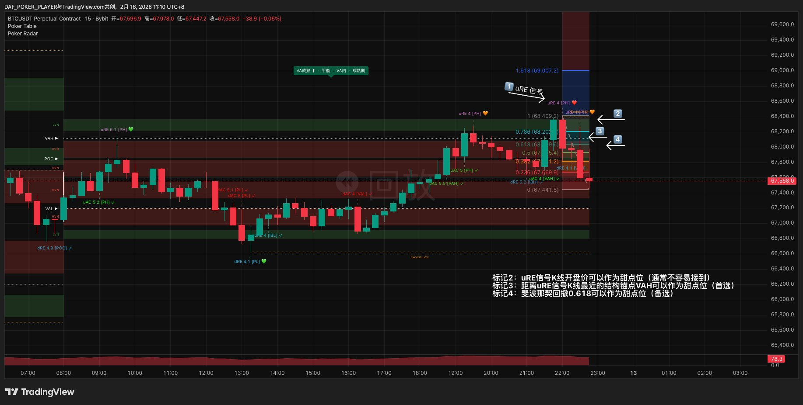
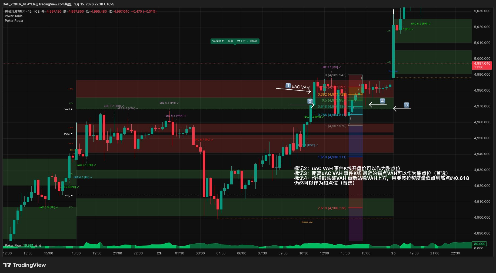
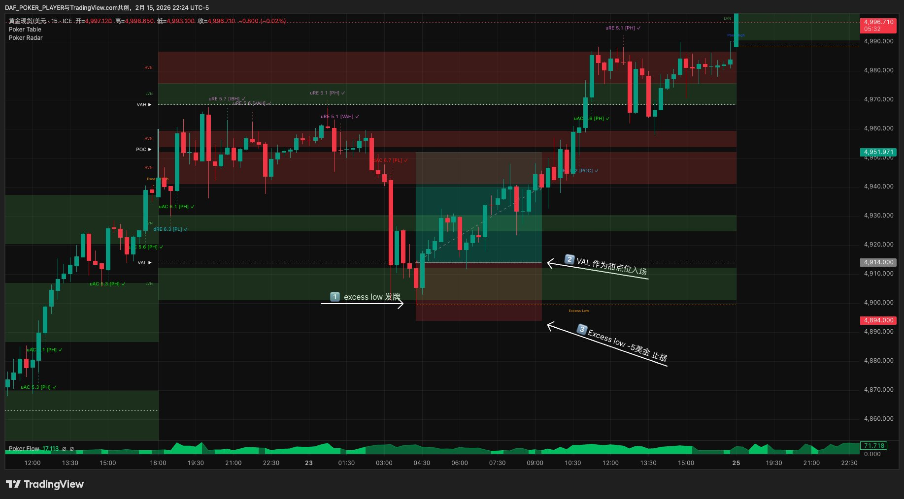
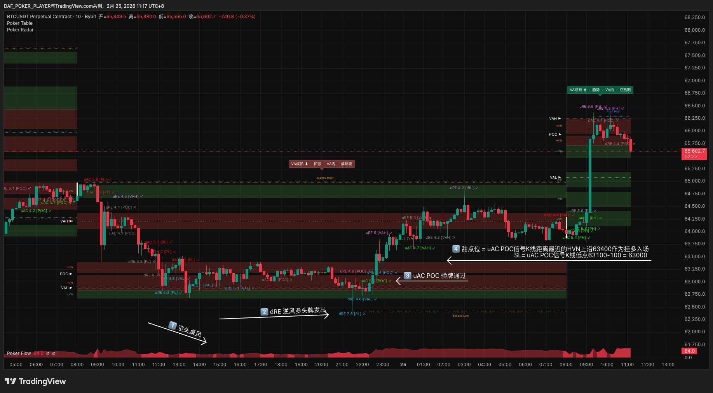
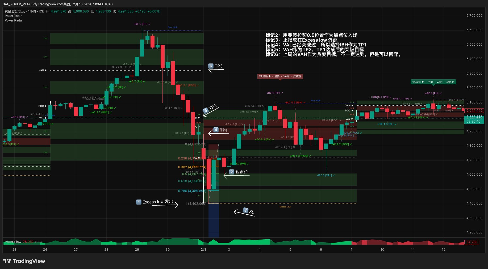

# 第六章 · 算笔账

> *"好牌不等于好局。甜点位对不对、止损放哪里、赚多少才够——算不过来就不出手。"*

上一章输出了最终牌力。这一章做数学检验——甜点位、止损、目标位、盈亏比，四样全部算清楚。算不过来=弃牌。

> **两道门：** 上一章的牌力检查是第一道门（这手牌值不值得评估），本章的数学检查是第二道门（这个入场位置划不划算）。两道门都过才Go——好牌+烂位置=弃牌，烂牌+好位置=也弃牌。

---

## 6.1 甜点位：在哪个价位入场

验牌通过不意味着立刻入场——你需要一个精确的入场价位。

**核心原则：** RE=等弹回来再进，AC=等回踩突破位再进。永远不市价入场，只用限价挂单。

甜点位的选择取决于信号类型：

### RE信号的甜点位（三层优先级）

价格到了边界被拒绝弹回——你要在弹回的起点附近等回踩入场。

🥇 **结构锚点。** IBH/IBL、VAH/VAL、POC——这些是VP画出来的精确价位。价格在边界弹回后往往会回踩到最近的结构锚点。这是最精确的甜点位。

🥈 **信号K线开盘价。** RE那根K线的开盘价=拒绝动作的起点。如果没有结构锚点恰好在附近，用这根K线的开盘价作为甜点位。

🥉 **斐波那契回撤。** 价格弹得太快、太远，验牌已经通过——回踩时既没有合适的结构锚点，信号K线开盘价也离得太远。这时候用斐波那契回撤作为参考：从信号起点到弹回最远点画一段距离，取0.618或0.786的回撤位。

> 斐波那契不需要深入理解原理——把它当成一种度量工具：信号运动了一段距离，价格回撤到这段距离的六成到八成位置时，往往是不错的入场点。



### AC信号的甜点位（三层优先级）

价格突破了边界并站稳——你要等价格回踩突破位入场（原阻力变支撑，原支撑变阻力）。

🥇 **突破位本身。** AC突破了VAH，价格站到VAH上方。等价格回踩到VAH附近入场——这就是"原来的天花板变成了地板"。最精确。

🥈 **POC翻转位。** 边界事件发生后，如果价格还穿越了POC（AC确认），POC角色翻转。回踩到这个翻转后的POC也是好的入场位。

🥉 **斐波那契回撤。** 突破后价格强势推进、不回踩到突破位。用从突破点到推进最远点的斐波那契0.618/0.786作为备用甜点位。



### 候选之间怎么选

同一层优先级可能有多个候选——比如信号边界和SL之间有好几个结构锚点。选哪个？

**看信号强度。** 信号越强（Radar 7+或双信号叠加），市场回踩越浅——甜点位选距信号边界最近的候选，否则大概率接不到。信号普通（Radar 5-7），按三层优先级正常选。

**看路上的VP形态。** 候选之间是HVN（成交量密集区，价格到了会减速）→价格容易被黏住不回来，选HVN前方的候选而非后方。候选之间是LVN（成交量稀薄区，价格会快速穿过）→价格要么不回要么一下穿过，别选LVN中间的候选。

挂单在有效期内未成交→弃牌，不追价。错过一手好牌不亏钱，追价入场亏的是真金白银。

### "够不到"规则

甜点位和当前价格之间有一个合理距离。如果价格已经走太远，甜点位变得遥不可及——等回来的概率太低。

**判断标准：甜点位在当前VA内（含VA边界）= 够得到。甜点位明确在当前VA外 = 够不到。** VA是当前70%交易者的共识区间，价格在VA内回踩是正常运动，回踩到VA外需要价格偏离共识区——概率大幅下降。VA边界（VAH/VAL）在Table上一眼看到，不需要计算。

> VP早期VA尚未成熟时（Radar显示"IB形成中"或"VA形成中"），VA范围不具参考价值——此时视为够得到。

三层甜点位全部够不到 → 放弃这手牌。宁可错过也不追价——错过一手好牌不亏钱，追价入场可能亏很多。

### 甜点位的K线框架

甜点位在你所在牌桌的K线上定义。短线桌看4H K线的开盘价，日内桌看15/30m K线的开盘价，分时段桌看5m K线的开盘价。不要切到更小K线上去"找更精确的甜点位"——和验牌一样，在你的牌桌上操作。先手入场和后手入场用同一套甜点位方法，区别只是入场时机不同（Ch4 §4.3）。

### 挂单与有效期

甜点位确定后挂限价单等成交。**发牌有效期 = 验牌通过起，见下表。**

| 牌桌 | 发牌最大有效期 |
|------|--------------|
| 分时段桌 | 当前时段 + 下一时段 |
| 日内桌 | 今天 + 明天 |
| 短线桌 | 当前周 + 下周三收盘 |
| 波段桌 | 当月 + 下月D10 |

这是最大期限——提前失效条件会先生效。**牌提前死亡：** 信号被Radar否定（灰色 ✗）、出现反向AC且通过验牌、或桌风变为牌方向的对立方向（多头→回调/平衡≠对立，但Go/No-go需重跑）。任一触发，撤单。

进入下一VP后，检查甜点位依附的结构锚点还在不在：还在→继续挂单。偏移或消失→基于当前VP重新找甜点位，重跑Go/No-go，达标就换单，不达标就弃牌。未成交的挂单调整不违反"同一信号一次入场风险"。新VP同一位置出新信号=新牌，走完整流程。

甜点位够不到（在当前VA外）→ 原始挂单作废，评估延续牌（Ch5）。够得到（VA内含边界）→继续等。

---

## 6.2 止损：亏多少认赔

止损是"如果我错了，最多亏多少"的答案。每笔交易必须在入场前定好SL，不例外。

### SL定位

**唯一原则：SL = 最后确认失效的位置外侧 + buffer。** 你因为什么入场，就在那个理由被证伪的位置画SL。不同入场方式的"最后确认"不同，所以SL位置不同：

| 入场方式 | 最后确认 | 失效 = | SL = |
|---------|---------|-------|------|
| **先手入场**（三步全过，有能量）| 能量信号（去程AC） | 价格穿过能量K线极值 | 能量K线极值外侧 + buffer |
| **后手入场**（没能量，等回踩不破）| 回踩不破 | 价格穿过回踩极值 | 回踩极值外侧 + buffer |
| **延续牌**（Ch5）| 小平衡区中继成立 | 价格穿过小平衡区反向极端位 | 小平衡区反向极端位外侧 + buffer |

不管原始信号是RE、AC还是Excess，不管牌型是顺风、逆风还是诈唬——都走这个表。诈唬牌和加注走先手/后手分流，延续牌走第三行。三行覆盖所有入场情况。

buffer≈品种最小SL下限的五分之一（黄金$2、BTC $100）。SL距离低于最小SL下限→放弃本局。

**SL质量检查。** 画完SL后检查：SL位置有没有结构位保护？有结构保护的SL更可靠——价格不容易穿过去。

可提供保护的结构位：一级边界（PH/PL/VAH/VAL/IBH/IBL）、HVN边缘（大量持仓堆积，价格到了会被挡住）、POC（磁吸+支撑阻力）。**LVN不算。** LVN是通道不是阻挡，价格在LVN区域快速通过。

SL恰好有结构位保护 → 高质量SL。SL没有结构位保护 → 有效（因为它在失效点），但较弱——清醒入场。

**针尖检查。** SL附近有无针尖（Excess尖端、RE[PH/PL]针尖）？SL恰好在针尖内侧——针尖可能被流动性扫穿，SL应外推到针尖外侧，然后重新验证R:R。



下图是先手入场时SL跟能量信号走的示例——SL不回溯到更早的dRE极端位，而是放在能量确认（uAC）K线极值外侧：



### 最小SL下限

SL不能太小——太小会被正常波动扫掉。不同品种、不同牌桌有最小SL要求：

| 品种 | 分时段桌 | 日内桌 | 短线桌 | 波段桌 |
|------|---------|--------|--------|--------|
| 黄金 | ≥$3 | ≥$5 | ≥$10 | ≥$15 |
| BTC | ≥$100 | ≥$200 | ≥$500 | ≥$1,000 |
| ETH | ≥$8 | ≥$15 | ≥$40 | ≥$80 |
| 白银 | ≥$0.05 | ≥$0.10 | ≥$0.25 | ≥$0.50 |

SL距离低于下限 → 放弃本局。关键位间距太近说明操作空间不足，不适合这个牌桌级别。表外品种暂无标准——建议参考波动率相近的品种作为起点，实盘中根据经验微调。

### 数学SL（降级方案）

有时候标准SL太远，导致盈亏比算不过来。数学SL是一种妥协——用你需要的盈亏比反推SL应该放在哪里。

**数学SL不是标准方案，是降级妥协。** SL放在没有结构保护的位置=更容易被扫，仓位还得降一级=赚得更少。首选永远是标准SL达标→入场。标准SL不达标→首选弃牌→数学SL仅为最后手段。

**使用限制：**
- 仅限最终牌力AA或KK，且Radar 7+。这里看的是降级后的最终牌力，不是原始牌力。原始AA因逆VA迁移降到KK→最终牌力KK，仍可用数学SL。原始KK因湿润纹理降到AK→最终牌力AK，不可用
- AK和AQ不允许使用数学SL——牌力不够强，不值得冒无结构保护的风险
- Excess发牌没有Radar评分，不适用数学SL——因此失效点没有结构保护时无法入场
- 仓位降一个牌力等级（AA用KK的手数，KK用AK的手数）
- R:R硬要求提高0.5（顺风牌≥1.7:1，平衡桌风≥1.7:1，逆风牌≥2.0:1）

### SL画好后不能移远

入场后禁止往不利方向移动SL。SL只能在TP达成后按规则往有利方向移（见Ch7 SL管理）。"浮亏了把SL往后移一点——再给它一次机会"=情绪交易。如果你的SL被打了，说明市场告诉你：你错了。接受这个答案。

---

## 6.3 目标位：赚多少下桌

TP（Take Profit）是"如果我对了，在哪里收钱"的答案。TP定位只看结构——路上有什么阻挡就在那里设TP，不猜"能涨多少"。

### TP1：第一个结构阻挡

从甜点位出发，往交易方向看，第一个会挡住价格的结构位就是TP1。结构阻挡包括：HVN边缘（大量持仓堆积，价格到了会被"粘住"或弹回）、下一个一级边界（做多时的VAH、做空时的VAL）、对面VA边界。

TP1是最重要的目标——它决定了你这笔交易的最低收益，也是计算盈亏比的基础。

### TP2：第二个结构阻挡

TP1之后，继续往交易方向看，第二个结构阻挡就是TP2。TP2可以是执行桌上更远的一级边界，也可以是偏见桌或背景桌的关键位。

### TP3：极端目标

偏见方向的极端目标——偏见桌的PH（做多时）或PL（做空时）。如果你做的是大级别的顺风牌，TP3可以很远。另一种TP3的定义是"跟着走到结构反转信号出现"——价格一直推进，直到你看到反向的验牌通过信号。

TP1必须有，TP2和TP3有更好、没有也行。如果路上只有一个结构阻挡就到了执行桌的边界——那TP1就是唯一的目标。



---

## 6.4 盈亏比：这笔账划算吗

盈亏比（R:R）= 甜点位到TP1的距离 ÷ 甜点位到SL的距离。

一个数字告诉你这笔交易值不值得做：赚的空间够不够大，相对于你可能亏的空间。

### R:R门槛

| 牌型 | 最低R:R |
|------|---------|
| 顺风牌（含顺风诈唬） | ≥ 1.2:1 |
| 平衡桌风 | ≥ 1.2:1 |
| 逆风牌（含逆风诈唬） | ≥ 1.5:1 |
| 使用数学SL时 | 在对应牌型基础上 +0.5 |

逆风牌要求更高是因为逆风方向胜率更低——需要更大的盈利空间来弥补。平衡桌风介于两者之间。

### 为什么用TP1算

R:R只用TP1计算，不用TP2/TP3。这是保守设计——即使价格只到TP1你就平仓，这笔交易也是正的。TP2和TP3到了是额外收益（bonus），不是你入场的前提。

这种设计牺牲了精度换取了鲁棒性。进阶用户可以自行计算加权期望值：EV = 各TP触达概率 × 各TP收益 - 止损概率 × SL亏损。但加权期望值不替代TP1 R:R检查——即使EV为正，TP1 R:R不达标仍然弃牌。

### R:R不达标 → 弃牌

好牌+好环境，但R:R不够——弃牌。AA+干燥纹理+共振，R:R只有1.3:1——弃牌。不要因为信号好就降低数学门槛。信号好说明方向可能对，R:R不够说明这个入场位置不划算。等下一个机会。

---

## 6.5 Go/No-go：最终检查

四样都算完了，走一遍最终检查。

**可勾选清单（盘中使用）：**

```
☐ 甜点位够得到（在当前VA内，含VA边界）
     甜点位 = _________ · VAH = _________ · VAL = _________
     VA未成熟 → 视为够得到
     在VA外 → 弃牌

☐ SL在失效点（最后确认被证伪的位置外侧+buffer）
     失效点 = _________ · SL = _________ · 距离 = _________
     有结构保护？Y/N（质量标注，N=清醒入场）

☐ R:R ≥ 门槛（顺风1.2 / 平衡1.2 / 逆风1.5）
     TP1 = _________ · R:R = _________
     不达标 → 数学SL可用？（需AA/KK + 7+）
                不可用 → 弃牌
                可用 → 仓位降级 + R:R门槛+0.5

→ 三个都 ☑ = Go · 进入Ch7
```

通过这个检查=你有一个精确的甜点位、一个在失效点的SL、至少一个明确的TP、一个达标的盈亏比。四样齐了，你才有资格在这手牌上花钱。

弃牌的原因可能很多种：甜点位够不到、SL太远、TP太近、R:R差一点点。每一种都是正常的。弃牌不是失败——它保护了你的账户。好的交易者弃牌的次数远多于入场的次数。

---

## 6.6 场景演示

### 场景一：R:R不达标

短线桌做多黄金，dRE@VAL，Radar 7.5。甜点位=VAL $2,648（结构锚点🥇）。SL方向往下看：PL在$2,638。SL画在PL外侧=$2,636。SL距离=$12。TP1=路上第一个HVN边缘$2,657。R:R=($2,657-$2,648)÷($2,648-$2,636)=9÷12=0.75:1。顺风牌R:R门槛1.2:1——不达标。**弃牌。**

好信号，好位置，但数学不够。等下一手。

### 场景二：甜点位够不到

同一手牌，但你看到信号时价格已经大幅弹回VA内部。当前VA范围$2,648-$2,680。甜点位$2,643（VAL下方的结构锚点）——明确在VA外。三层甜点位都在VA外。价格要从VA内跌出VA才能到你的甜点位——回来的概率太低。**弃牌。**

### 场景三：数学SL

日内桌做空黄金，uAC[VAH]验牌力度大，AA牌力，Radar 8.2。甜点位=VAH $2,670（回踩突破位🥇）。SL方向往上看：PH在$2,695。SL=$2,697（PH外侧）。SL距离=$27。TP1=$2,650（HVN边缘）。R:R=20÷27=0.74:1。不达标。

数学SL可用（AA+Radar 8.2即7+）：反推SL=20÷2.5=8→SL=$2,678。仓位从AA(12手)降到KK(9手)。但$2,678没有结构保护——清醒地知道这是妥协方案。

### 场景四：SL跟着入场理由走

日内桌BTC，dRE 7.5[PL]发牌，随后价格反弹突破POC，Radar报uAC[POC]——能量确认，三步全过，先手入场做多。SL=能量信号（uAC）K线最低点$63,100外侧+buffer $100=$63,000。甜点位=POC上方最近HVN上沿$63,400。SL距离=$400。TP1=VAH $64,200。R:R=800÷400=2.0:1。顺风牌≥1.2:1——达标。**Go。**

如果错误地把SL回溯到dRE的Excess Low外侧$62,100→SL距离=$1,300→同一个TP1的R:R=800÷1,300=0.62:1→不达标→甜点位被迫选更深的POC→大概率踏空。SL跟着入场理由走，就不会出现这个问题。

---

> **本章要点速记**
>
> 甜点位 = RE三层（结构锚点>K线开盘价>Fib） · AC三层（突破位回踩>POC翻转>Fib） · 多个候选：信号强选近的，路上HVN选前方，LVN别选中间 · 够不到（VA外）或未成交→弃牌不追价 · 挂限价单 · 有效期=验牌通过起§6.1表格 · 提前失效：否定/反向AC通过验牌/桌风对立
>
> SL = 最后确认失效点外侧+buffer：先手→能量K线极值，后手→回踩极值，延续牌→小平衡区反向极端位
>
> SL质量+约束：有结构保护=高质量，无结构=有效但较弱 · 针尖在SL内侧→外推 · 最小SL下限见表 · 低于下限=放弃 · SL画好后不能移远
>
> 数学SL = 降级妥协：仅AA/KK+7+ · 仓位降级 · R:R+0.5 · AK/AQ禁用
>
> TP = TP1（第一个结构阻挡，必须有）· TP2/TP3（bonus）· R:R用TP1算
>
> R:R门槛：顺风≥1.2 · 平衡≥1.2 · 逆风≥1.5 · 数学SL再+0.5 · 不达标→弃牌
>
> Go/No-go：甜点位够得到 + SL在失效点 + R:R达标 → 三样齐了才花钱

> 🏁 **你现在能做什么：** 你能算清楚一笔交易划不划算——甜点位在哪、止损放哪、盈亏比够不够。Go/No-go三样全过才花钱。下一章，花多少钱、怎么入场、入场后每一步怎么做。
