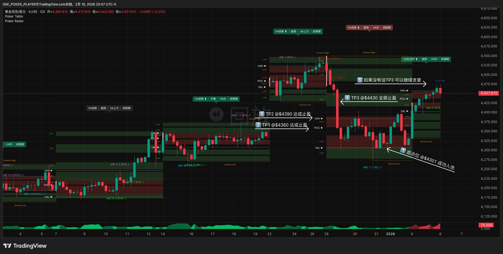
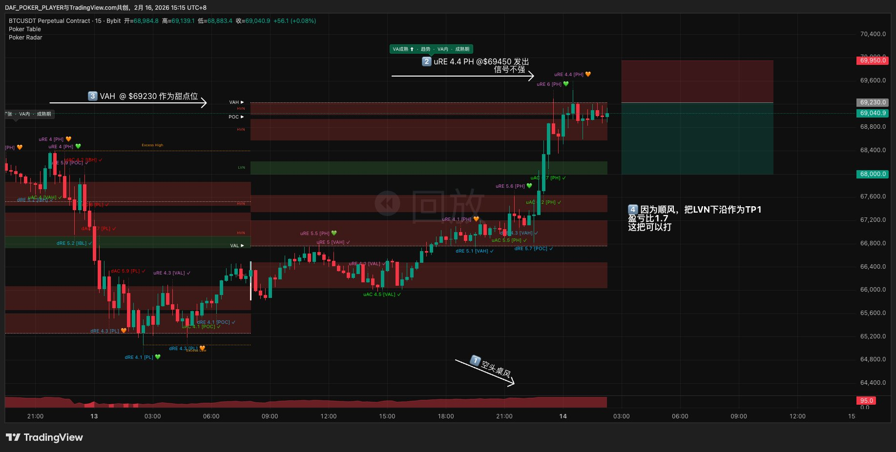
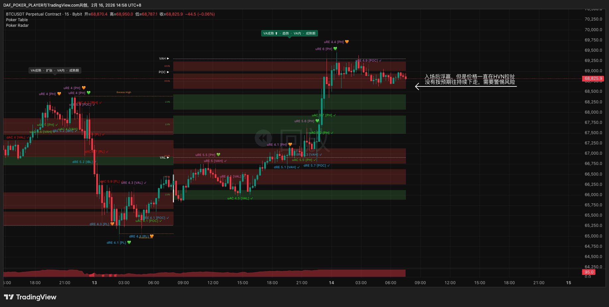
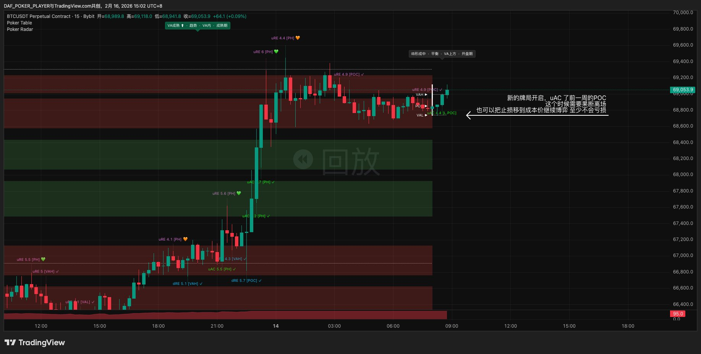
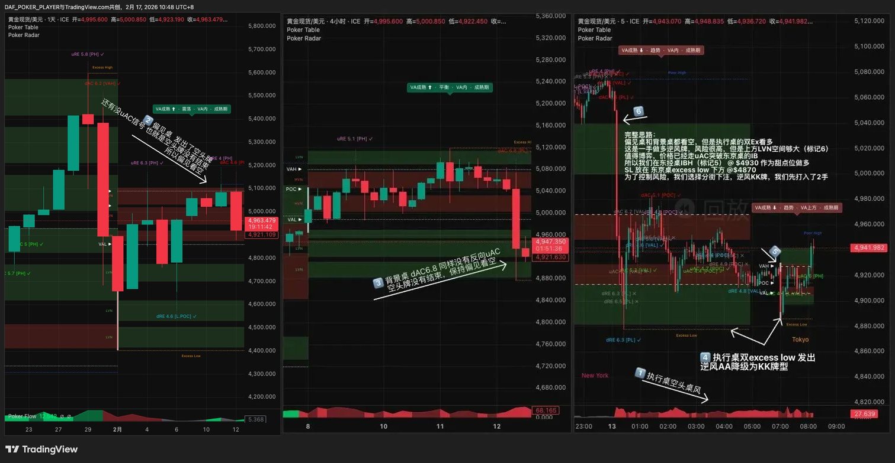
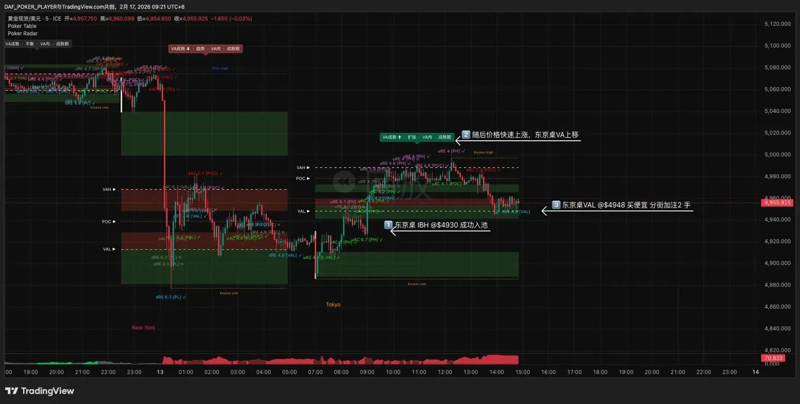
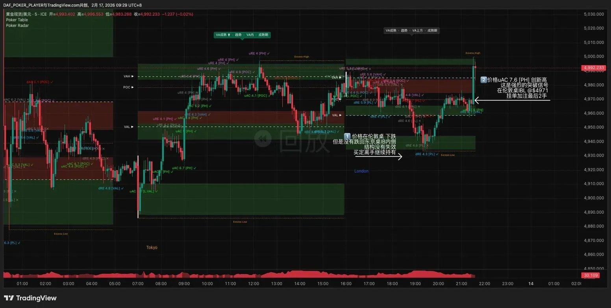
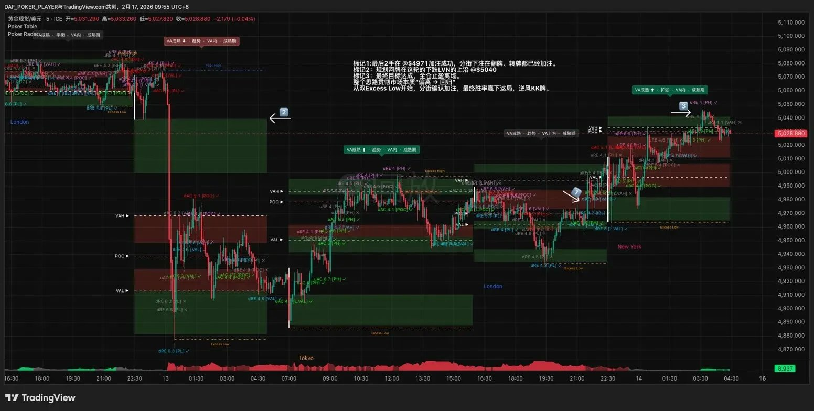
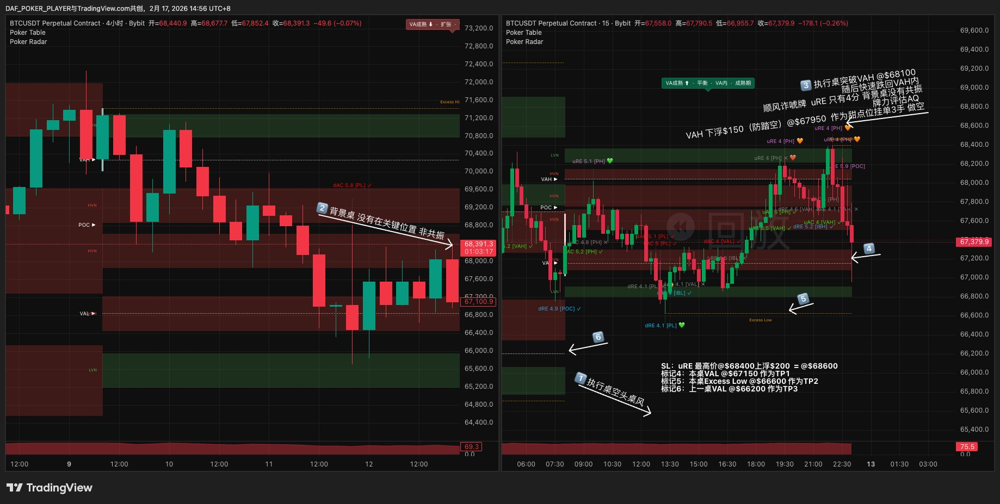
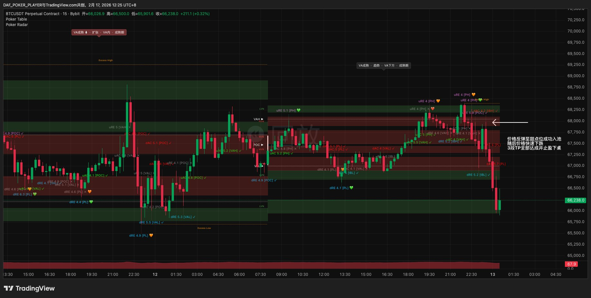

# 第九章 · 你的第一手牌

> *"看了八章规则，现在走一遍完整的牌局。从打开图表到平仓下桌，每一步都有数字。"*

这一章用真实案例把Ch3到Ch8串起来。不是教新概念——是让你看到完整的决策链在实盘中长什么样。

> **五个案例：** ①顺风AA赚钱下桌 · ②信号强但R:R不够弃牌 · ③止损+结构自证错误 · ④双Excess逆风KK（分时段桌三屏）· ⑤假突破反做（诈唬牌）

---

## 案例一：短线桌顺风牌AA · 赚钱下桌

品种：黄金（XAUUSD）。牌桌：短线桌（周VP / 4H K线）。每手$10/点。

### 第一步到第六步：评估（Ch3-Ch6）

| 步骤 | 内容 | 结果 |
|------|------|------|
| Ch3选桌 | 短线桌周VP，VP成熟 | ✅ |
| Ch3桌风 | 执行桌多头桌风（VA上移趋势，成熟期） | 多头趋势 |
| Ch4信号 | 执行桌发出dRE 7.1 [PL] @$4,274 → A档（7+） | 立刻验牌 |
| Ch4验牌 | ①方向✅ ②时间✅ ③能量✅ → 先手入场 | ✅通过 |
| Ch3共振 | 背景桌关键位@$4,265，与执行桌PL@$4,274仅差$9（VA宽度$89，10%≈$9）| 共振成立 |
| Ch5牌型 | 下方边界买便宜+多头桌风 | 顺风牌 |
| Ch5牌力 | 共振✅+信号强✅（7.1） | AA |
| Ch5纹理 | 上方有2个HVN，跨过后是高速LVN | 中性（不降级） |
| Ch6甜点 | 执行桌VAL @$4,301（距dRE信号最近的结构锚点🥇） | $4,301 |
| Ch6 SL | dRE所在PL @$4,273外侧-$20=$4,253，距离$48 | 结构SL $4,253 |
| Ch6 TP | TP1=POC $4,360 · TP2=VAH $4,390 · TP3=上周低点Excess Low $4,430 | 三级目标 |
| Ch6 R:R | ($4,360-$4,301)÷($4,301-$4,253)=$59÷$48=1.23:1≥1.2✅ | Go |

![案例一入场设置：黄金4H双屏，左侧背景桌关键位@$4,265与执行桌PL共振确认→AA牌力（图片标注$4,625为标记误差，实际共振位$4,265）。右侧执行桌①多头桌风，②dRE 7.1[PL]@$4,274信号强，④VAL@$4,301甜点位，⑤SL@$4,253，⑦TP1=POC@$4,360，⑧TP2=VAH@$4,390，⑨TP3=上周Excess Low@$4,430。纹理中性（上方2个HVN跨过后高速）](../images/ch9-case1-setup.png)

### 第七步：仓位 + 入场（Ch7）

AA=12手。前置下注。黄金每手$10/点。

安全组4手 / 价值组4手 / 贪婪组4手。

在$4,301挂限价多单12手，SL挂$4,253，TP1挂$4,360（安全组4手）。等成交。

### 第八步：四街管理（Ch7）

**翻牌前：** 限价单成交于$4,301。12手全部入场。

**翻牌（TP1）：** 价格推到$4,360，安全组4手平仓。盈利=($4,360-$4,301)×4×$10=$2,360。价值组SL从$4,253移到入场价$4,301（保本），贪婪组SL不动仍在$4,253（给空间）。

**转牌（TP2）：** 价格继续推到$4,390，价值组4手平仓。盈利=($4,390-$4,301)×4×$10=$3,560。贪婪组4手SL移到TP1=$4,360。

**河牌（TP3）：** 价格推到$4,430（上周低点Excess Low），贪婪组4手全部平仓。盈利=($4,430-$4,301)×4×$10=$5,160。如果没有设TP3，可以继续持有贪婪组博更大行情。

**总盈利：$2,360+$3,560+$5,160=$11,080。** 风险$5,760（12手×$48 SL×$10），收益$11,080。实际R:R=1.9:1。



**📋 案例一总结卡**

```
顺风牌 AA · dRE 7.1[PL] @$4,274 · 背景桌@$4,265共振（差$9≤VA10%）
甜点位 $4,301(VAL) · SL $4,253(PL外侧-$20) · TP1 $4,360(POC) · R:R 1.23:1
仓位 12手前置 · 安全4手/价值4手/贪婪4手
结果 TP3全部下桌 · +$11,080 · 实际R:R 1.9:1
```

---

## 案例二：弃牌 · 信号好但R:R不够

品种：BTC（BTCUSDT）。牌桌：日内桌（日VP / 15min K线）。

**信号：** dRE 7.9 [PL] @$75,690。桌风空头，信号方向做多=**逆风牌。** 验牌通过。

**牌力：** 信号强（7.9即7+）。逆风牌→降级执行。

**甜点位：** VAL @$77,060（距信号K线最近的结构锚点🥇）。

**SL：** PL @$75,690外侧-$500=$75,190。SL距离=$77,060-$75,190=$1,870。

**TP1：** 第二个HVN上沿 @$78,960。TP距离=$78,960-$77,060=$1,900。

**R:R：** $1,900÷$1,870=**1.02:1。** 逆风牌R:R门槛1.5:1——**不达标。弃牌。**

7.9分的信号，非常强。但R:R不够就是不够。信号再强也不能弥补盈亏比的不足——赚的钱覆盖不了风险，长期做下去一定亏。**R:R是硬门槛，没有例外。**

![案例二弃牌：BTC 15min，①空头桌风，②dRE 7.9[PL]@$75,690信号非常强，③VAL@$77,060甜点位，④第二个HVN上沿@$78,960作为TP1，⑤SL=PL@$75,690-$500=$75,190，⑥R:R=1.02:1<逆风门槛1.5:1，信号再强也弃牌不打](../images/ch9-case2-fold.png)

**📋 案例二总结卡**

```
逆风牌 · dRE 7.9[PL] @$75,690 · 信号非常强
甜点位 $77,060(VAL) · SL $75,190 · TP1 $78,960
R:R 1.02:1 < 逆风门槛1.5:1 → 弃牌
教训：R:R是硬门槛，信号再强也不能弥补盈亏比不足
```

---

## 案例三：止损 · 做错了怎么出来

品种：BTC（BTCUSDT）。牌桌：日内桌（日VP / 15min K线）。

**信号：** uRE 4.4 [PH] @$69,450。桌风空头，信号方向做空=**顺风牌。** 验牌通过。

**牌力：** 无共振 + 信号不强（4.4）= **AQ。** 纹理中性。最终牌力=AQ。

**甜点位：** VAH @$69,230（距信号K线最近的结构锚点🥇）。

**SL：** PH @$69,450外侧+$500=$69,950。SL距离=$720。

**TP1：** 因为顺风，把LVN下沿 @$68,000作为TP1。TP距离=$1,230。

**R:R：** $1,230÷$720=**1.7:1。** 顺风牌门槛1.2:1——达标。Go。前置，AQ=3手。



**入场后：** 价格从$69,230开始往下推，出现浮赢。但价格一直在HVN区域拉扯，没有按预期持续下走。TP前不碰SL——继续持有，但需要警惕风险。



**结构自证错误：** 新的牌局开启，价格uAC了前一周的POC——原来支撑做空的结构被突破了。这时候有两个选择：

1. **果断离场。** 入场理由不再成立，主动平仓。
2. **SL移到成本价继续博弈。** 至少不会亏损，给剩余仓位一次机会。



**止损不是失败。** 大多数人把止损等同于"做错了"。但在Poker Trading里，止损等同于"规则执行正确"。你的工作不是永远不止损——你的工作是在该止损的时候止损。结构自证错误让你在SL触发前就识别出问题，提前保护资金。记录、复盘、继续。

**📋 案例三总结卡**

```
顺风牌 AQ · uRE 4.4[PH] @$69,450 · 空头桌风做空
甜点位 $69,230(VAH) · SL $69,950 · TP1 $68,000(LVN下沿) · R:R 1.7:1
仓位 3手前置
结果 结构自证错误（uAC前周POC）→ 离场或移SL成本价
教训：入场理由消失=最强的离场信号
```

> **如果这是当天第二次止损？** Ch8规则：日止损2笔→日熔断触发，当日停止交易。不是惩罚，是让你在情绪升温前离场。同时检查子弹余量阶梯——子弹缩水了多少决定下次牌力上限。

---

## 案例四：逆风KK · 双Excess Low + 分街下注

品种：黄金（XAUUSD）。执行桌：分时段桌（时段VP / 5min K线）。三屏布局：偏见桌（月VP / 日线）+ 背景桌（周VP / 4H）+ 执行桌（时段VP / 5min）。

**偏见和桌风都看空，但执行桌出了双Excess Low——逆着大方向做多。整笔交易从三屏读图到止盈下桌，用四张截图完整还原。**

### 第一步到第六步：三屏读图 + 评估（Ch3-Ch6）

**Ch3三屏读图：**

先看偏见桌（最左，月VP / 日线）——VA成熟，震荡期。没有uAC信号，也就是没有空头牌被否定。偏见桌没有明确的未完成多头牌可以覆盖桌风。

再看背景桌（中间，周VP / 4H）——VA成熟，平衡。关键信息：dAC 6.8出现，**没有反向uAC否定**。空头牌还没结束。偏见保持看空。

最后看执行桌（最右，时段VP / 5min）——东京时段刚开始。桌风：**空头**（VA下移趋势，成熟期）。

三屏结论：偏见看空 + 执行桌空头桌风。方向上全部指向空。

**但是——执行桌底部出了双Excess Low（标记④）。**



**Ch4发牌：** Poker Table在执行桌时段VP底部识别出双Excess Low——同一区域两次放量拒绝，第二次更弱。这是方向穷尽的结构证据。做多信号。

**Ch4验牌（Excess链路）：** ①方向✅ 价格远离Excess区域向上走 → ②时间✅ K线持续远离不回去 → ③能量待观察 → 验牌通过。

**Ch5牌型：** 做多 vs 空头桌风 = **逆风牌。**

**Ch5牌力——查Excess专用表：** 偏见桌（月VP）VAL在相近价位，价格正接近月VP的VAL区域 → 共振成立。

| | 单Excess | 双Excess |
|--|---------|---------|
| 有共振·逆风 | AK | **→ KK** |

双Excess + 共振 + 逆风 = **KK。** 双Excess逆风牌免7+条件直入池。

**Ch5纹理：** 从甜点位往上看，上方大段LVN通道（标记⑥），路上畅通。干燥。不降级。最终牌力 = **KK。**

**Ch6数学检验：**

| 项目 | 数值 | 说明 |
|------|------|------|
| 甜点位 | $4,930 | 东京时段IBH（结构锚点🥇）。价格已uAC突破东京桌IB |
| SL | $4,870 | 双Excess Low下方外侧。距离=$60。≥分时段下限$3 ✅ |
| TP1 | $5,040 | 上方LVN上沿（第一个结构阻挡） |
| R:R | $110÷$60=**1.83:1** | ≥逆风KK门槛1.5:1 ✅ |

Go/No-go：甜点位够得到 ✅ + SL达标 ✅ + R:R达标 ✅ = **Go。**

### 第七步：入场（Ch7）

逆风KK = 6手。

> **规则vs实战：** Ch7标准是"逆风牌只用前置"——6手一次入场。这笔交易选了分街下注（2+2+2），是作者为了验证分街在逆风场景下的表现而做的测试局。结论写在后面的盈亏计算里：分街抬高均价、稀释R:R，逆风前置确实更优。
>
> 另外要注意牌桌节奏。分时段桌5min K线跑得极快，一个时段里可能已经走完好几手牌了——回头看这个案例的四张截图，从双Excess到止盈，中间已经有多手牌局完成。**没有足够打牌经验的读者不要在分时段桌尝试分街下注**，你很难把握加注时机。这个案例展示的决策逻辑（三屏读图→双Excess发牌→逆风降级→分街管理）套在短线桌或波段桌上会更从容：K线周期更长，每一步都有时间想清楚再动手。

实际操作：先打入2手@$4,930（IBH），SL@$4,870。

### 第八步：四街管理（Ch7）

**翻牌前：** 2手入场@$4,930。SL挂$4,870。

**翻牌（第一次加注）：** 价格快速上涨，东京时段VA上移（标记②）。VA从空头切换到扩张。东京桌VAL上移到$4,948附近，价格回踩VAL = 买便宜的机会。走验牌链路：新的dRE@VAL弹回确认。加注2手@$4,948。



**转牌（第二次加注）：** 进入伦敦时段。价格出现回调（标记①），但没有跌回东京桌IB内侧——结构没失效，买定离手继续持有。随后价格创新高，Radar捕到uAC 7.6 [PH]（标记②）——这是强烈的突破信号，评分7.6。在伦敦桌IBL@$4,971挂限价单加注最后2手。



**河牌（止盈）：** 6手全部到位（2+2+2）。规划河牌目标在这轮下跌LVN的上沿@$5,040（标记②）——价格从底部双Excess Low弹起，经过整段LVN通道，到达第一个结构阻挡位。价格推到目标区域，6手全仓止盈离场（标记③）。



**盈亏计算：**

| 批次 | 入场价 | 手数 | 盈利（到$5,040） |
|------|--------|------|-----------------|
| 初始@$4,930 | $4,930 | 2手 | $110 × 2 = $220/点 |
| 加注①@$4,948 | $4,948 | 2手 | $92 × 2 = $184/点 |
| 加注②@$4,971 | $4,971 | 2手 | $69 × 2 = $138/点 |
| **合计** | | **6手** | **$542/点** |

风险：最大风险（全部被SL@$4,870扫掉）= (2×$60 + 2×$78 + 2×$101) = $478风险。

实际R:R = $542 ÷ $478 = **1.13:1。** 注意：分街下注的后两批入场拉高了均价、扩大了SL距离，稀释了整体R:R。前置下注6手@$4,930的R:R = ($110×6) ÷ ($60×6) = 1.83:1，更优。这就是逆风牌规定前置的原因之一——加注抬高了平均成本。

**📋 案例四总结卡**

```
逆风牌 KK · 双Excess Low · 执行桌空头桌风+偏见看空
三屏：偏见桌+背景桌空头未否定 → 执行桌双Excess做多 = 逆风
牌力 双Excess+共振（偏见桌月VP VAL）+逆风=KK · 免7+条件
甜点位 $4,930(IBH) · SL $4,870(Excess Low下方) · TP $5,040(LVN上沿)
R:R 1.83:1(前置标准) ≥ 逆风KK门槛1.5:1
仓位 6手分街2/2/2（作者验证测试） · 标准应前置
结果 全仓止盈@$5,040 · +$542/点
教训：双Excess逆风可以做，严格降级+R:R达标是底线
牌桌：同样逻辑放短线桌/波段桌更从容，时段桌分街不适合新手
```

---

## 案例五：顺风诈唬牌 · 假突破反做

品种：BTC（BTCUSDT永续合约）。执行桌：日内桌（日VP / 15min K线）。双屏布局：背景桌（周VP / 4H）+ 执行桌。

**价格冲破VAH，没站住，快速跌回来——假突破。这就是诈唬机会。两段验牌通过，R:R刚好达标，入场做空，三个TP全部到位。**

### 第一步到第四步：识别诈唬机会（Ch3-Ch4）

**Ch3桌风：** 执行桌空头桌风（标记①，VA下移趋势，成熟期）。偏见=桌风方向=做空。盯上方边界的做空机会。

**Ch3共振检查：** 背景桌（标记②）价格没有落在关键结构位附近。非共振。

**Ch4发牌——先来假动作：** 价格突破执行桌VAH@$68,100（标记③）。但随后快速跌回VAH内侧。Radar捕到uRE [PH]，评分4分。假突破最高价到$68,400。

**突破死了。** uAC@VAH没站住=假突破。价格回到VAH内侧=反方向力量更强。这就是诈唬机会——假突破后反做空。

**Ch4两段验牌：**

| 段 | 检查 | 本案例 |
|---|------|--------|
| **第一段：确认突破失败** | K线站不住 + Radar捕到反向信号 | 价格快速回落VAH内 ✅ + uRE [PH] ✅ |
| **第二段：按RE逻辑验牌** | ①方向→②时间→③能量 | ①方向✅ ②时间✅ → 验牌通过 |

**关键区别：** 普通RE只有一段验牌。诈唬牌多了第一段——必须先确认"突破真的死了"，然后才按RE逻辑评估反方向信号。

### 第五步：牌型 + 牌力（Ch5）

**牌型：** 假突破后做空 + 空头桌风 = **顺风诈唬牌**（桌风+假突破双重确认，门槛同顺风牌）。

**牌力：** uRE只有4分（不强）+ 背景桌非共振 → **AQ。**

**纹理：** 从VAH往下看，路上有HVN，中性。不降级。最终牌力 = **AQ。**

### 第六步：数学检验（Ch6）

| 项目 | 数值 | 说明 |
|------|------|------|
| 甜点位 | $67,950 | VAH下浮$150（防踏空挂单） |
| SL | $68,600 | 假突破最高价$68,400外侧+$200。距离=$650 |
| TP1 | $67,150 | 本桌VAL（标记④，第一个结构阻挡） |
| TP2 | $66,600 | 本桌Excess Low（标记⑤） |
| TP3 | $66,200 | 上一桌VAL（标记⑥） |
| **R:R** | $800÷$650=**1.23:1** | ≥1.2:1 ✅ 刚好达标 |

> **诈唬牌的SL：** 不放在最近结构位外侧，而放在假突破高点/低点外侧——如果价格再次冲破$68,400，说明突破是真的，你的诈唬判断错了。

Go/No-go：甜点位够得到 ✅ + SL达标 ✅ + R:R达标 ✅ = **Go。**



### 第七步：仓位 + 入场（Ch7）

AQ=3手。前置下注。安全组1手 / 价值组1手 / 贪婪组1手。

在$67,950挂限价空单3手，SL挂$68,600，TP1挂$67,150（安全组1手）。

### 第八步：四街管理（Ch7）

**翻牌前：** 价格反弹到甜点位$67,950附近，限价单成交。3手全部入场。

**翻牌（TP1）：** 价格快速下跌，推到$67,150。安全组1手平仓。盈利=($67,950-$67,150)×1=$800/点。价值组SL移到入场价$67,950（保本），贪婪组SL不动（给空间）。

**转牌（TP2）：** 价格继续下跌到Excess Low@$66,600。价值组1手平仓。盈利=($67,950-$66,600)×1=$1,350/点。贪婪组1手SL移到TP1=$67,150。

**河牌（TP3）：** 价格推到上一桌VAL@$66,200。贪婪组1手平仓。盈利=($67,950-$66,200)×1=$1,750/点。全仓止盈下桌。



**盈亏计算：**

| 批次 | 平仓位 | 手数 | 盈利 |
|------|--------|------|------|
| 安全组@TP1 $67,150 | $67,150 | 1手 | $800 × 1 = $800/点 |
| 价值组@TP2 $66,600 | $66,600 | 1手 | $1,350 × 1 = $1,350/点 |
| 贪婪组@TP3 $66,200 | $66,200 | 1手 | $1,750 × 1 = $1,750/点 |
| **合计** | | **3手** | **$3,900/点** |

风险=$1,950/点（3手×$650）。实际R:R=$3,900÷$1,950=**2.0:1。**

**📋 案例五总结卡**

```
顺风诈唬 AQ · 假突破@VAH $68,100 · uRE [PH] 4分
两段验牌：①突破失败（快速回落VAH内+uRE）→ ②RE链路验牌通过（①方向+②时间）
牌力 无共振+信号不强=AQ · 纹理中性不降级
甜点位 $67,950(VAH-$150) · SL $68,600（假突破高点外侧）
TP1 本桌VAL $67,150 · R:R 1.23:1 ≥ 顺风门槛1.2:1
仓位 3手前置 · 安全1/价值1/贪婪1
结果 3个TP全达成 · +$3,900/点 · 实际R:R 2.0:1
```

> **本案例的三个教学要点：**
> 1. **两段验牌：** 先确认"突破死了"（K线站不住+Radar反向信号），再按RE逻辑验牌反方向信号。普通RE只有一段。
> 2. **牌型归类看反做方向：** 假突破后做空，和桌风比——同向=顺风诈唬。桌风+假突破=双重确认，门槛同顺风牌。
> 3. **SL放假突破极值外侧：** 不是放在最近结构位外侧，而是放在假突破冲出去的最高点外侧。价格再破这个点=突破是真的，你错了。

---

## 决策复盘表模板

每手牌下桌后填一张：

```
┌──────────────────────────────────────────┐
│ 交易编号: #___     日期: ____-__-__       │
│ 品种: _______  牌桌: ______（__VP/__K线） │
├──────────────────────────────────────────┤
│ Ch3 桌风: ____（Flow颜色____）           │
│ Ch3 偏见: ____（来源：偏见桌____ / 桌风） │
│ Ch3 桌风分歧: □无 □有（____vs____）      │
│ Ch4 信号: ____@____（$____）Radar ____    │
│ Ch4 验牌: ____（①方向/②时间/③能量）     │
│ Ch5 牌型: ____                            │
│ Ch5 牌力: ____（共振____+信号____）       │
│ Ch5 纹理: ____                            │
│ Ch5 最终牌力: ____                        │
│ Ch6 甜点位: $____ （____层）              │
│ Ch6 SL: $____（结构/数学）                │
│ Ch6 TP1/TP2/TP3: $____ / $____ / $____   │
│ Ch6 R:R: ____:1                           │
│ Ch7 仓位: ____手  模式: 前置/分街         │
│ Ch7 安全/价值/贪婪组: ____/____/____ 手     │
├──────────────────────────────────────────┤
│ 结果: TP__达成 / SL触发 / 自证错误        │
│ 盈亏: $____                               │
├──────────────────────────────────────────┤
│ 规则执行: ✅/❌（哪一步偏离了？）         │
│ 本手违规项: □无 □追价 □移远SL □情绪平仓  │
│   □仓位过大 □跳过验牌 □逆风未升级门槛    │
│ 如果重来: ________________________________ │
│ 复盘笔记: _____________________________   │
│ 情绪评分: 入场__/持仓__/出场__(1冷静-5冲动)│
└──────────────────────────────────────────┘
```

每次下桌花3分钟填这张表。一个月后你会有20-50张表——这就是你的成长记录。周复盘时把这些表摊开看，比任何教程都有价值。

---

## 回测参考数据

以下数据来自作者实盘/模拟盘记录，仅供参考，不代表未来表现：

| 指标 | 参考范围 |
|------|---------|
| 综合胜率 | 45-55% |
| 顺风牌胜率 | 50-60% |
| 逆风牌胜率 | 35-45% |
| 平均R:R（TP1到达后） | 1.8-2.5:1 |
| 每月交易次数（短线桌） | 8-15笔 |
| 每月交易次数（日内桌） | 15-30笔 |
| 最大回撤（含训练期） | 12-18% |
| 最长连续亏损 | 6笔 |

> 这些数字的前提是：严格按规则执行。规则遵守率低于80%时所有统计数据都没有意义——你测的不是策略，是你的情绪。

---

> **本章要点速记**
>
> 完整决策链：Ch3选桌+桌风+偏见 → Ch4等发牌+验牌 → Ch5牌型+牌力+纹理 → Ch6甜点位+SL+TP+R:R → Ch7仓位+入场+四街管理
>
> 弃牌是正常结果 · 止损是系统的一部分
>
> 每手牌下桌后填复盘表 · 3分钟投资 · 一个月后回报巨大
>
> 前100笔AQ级仓位训练 · 重点看规则遵守率不看盈亏
>
> 策略能不能赚钱看数字 · 你能不能执行看复盘表
>
> Trade like a poker player.

> 🏁 **你走完了全部九章。** 你看到了完整的决策链在实盘中长什么样——从打开图表到平仓下桌，每一步都有规则、每一步都有依据。现在该做的：回到Ch8§8.13，用AQ级仓位开始你的前100笔训练。
