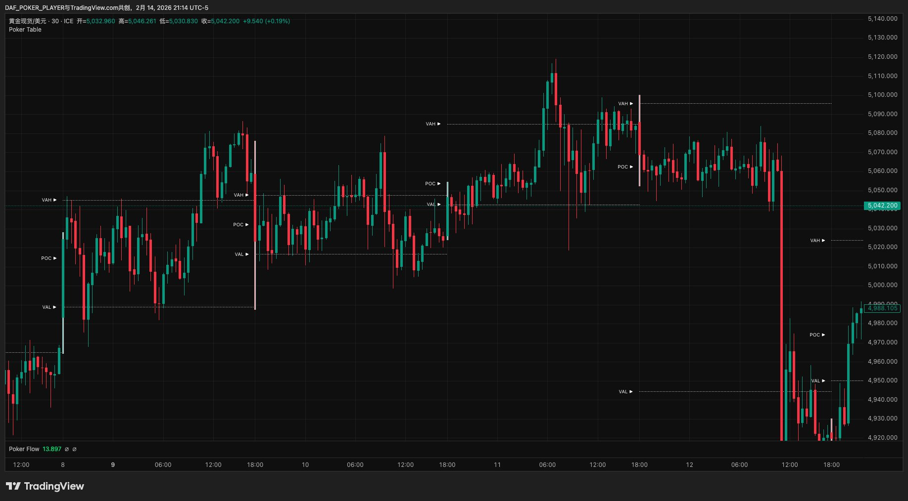
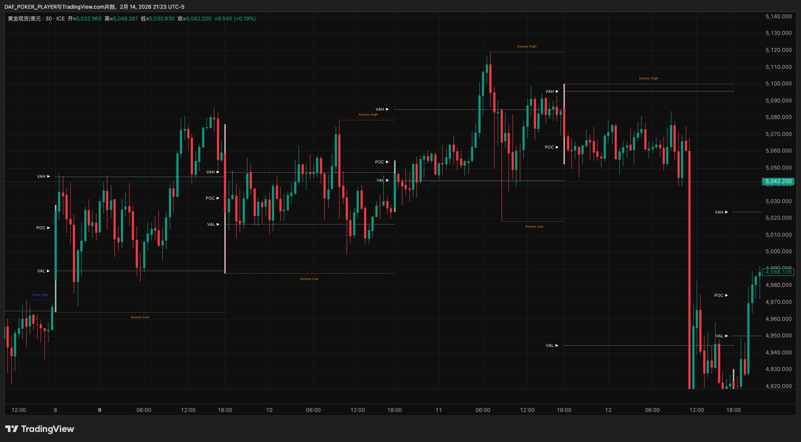
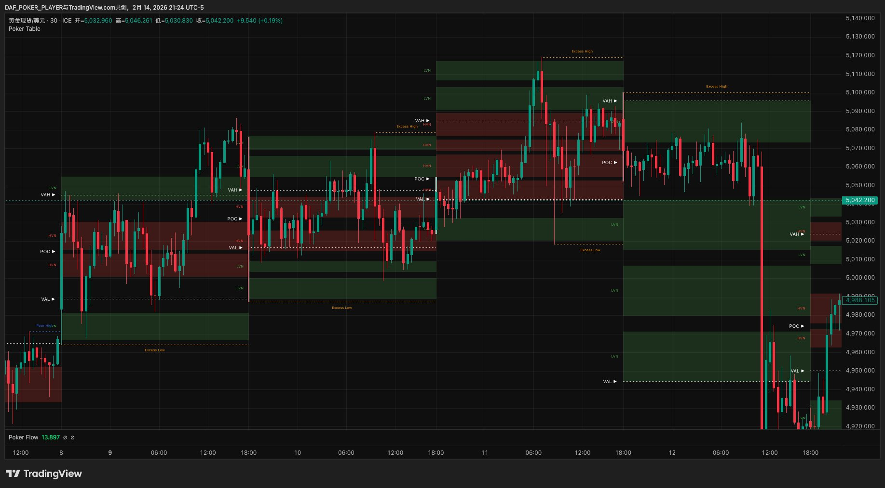

# Poker Trading Handbook · v4.0.6.7

编译时间：2026-02-15 02:34 UTC

---

# Poker Trading

> ***Trade like a poker player - Poker Trading***
>
> **用拍卖理论读懂市场，用扑克规则把交易变成概率游戏，像牌手一样交易。**

---

## 前言

做交易这件事，走到最后你会发现，难的从来不是"看对方向"。

大部分在市场里待过几年的人，看图表的能力都不差。趋势和震荡分得清，支撑和阻力找得到，甚至复盘的时候回头看，很多机会自己当时都看到了。但结果呢？要么看到了没敢做，要么做了但仓位不对，要么进去了但拿不住，要么拿住了但不知道什么时候该走。

问题出在分析之后的所有环节。

什么时候出手？下多大仓位？止损放哪里？到了第一个目标该全走还是留一部分？信号出来了但环境不对怎么办？错过了最佳入场点还追不追？这些问题没有一个是靠"多看几根K线"能解决的。它们需要的不是更多的分析能力，而是一套足够清晰的规则——在盘中的压力下，帮你快速做出决定，而且事后复盘时能说清楚每一步的依据。

Poker Trading 就是为了解决这个问题而创建的交易策略。

大多数策略教你看懂市场，但没人教你怎么下注、怎么管、什么时候走。Poker Trading用拍卖理论读结构，用扑克规则管执行——像职业牌手一样，不预测，只打好手里的牌。

想象一下，未来一年你继续用现在的方式交易——每次凭感觉入场、止损靠"差不多"、仓位看心情——12个月后你的账户会在哪里？大部分人不需要想象，因为过去一年就是这么过来的。Poker Trading不保证你赚钱，但它保证你做的每一笔交易都有清晰的理由，每一次止损都在计划之内。

它重新定义了交易者和市场之间的关系，给每一步决策都配上了明确的规则和对应的工具。从你打开图表的那一刻到最终下桌，每一个环节该看什么、该怎么判断、该怎么行动，都有章可循。

如果你已经准备好了，翻到第一章，我们从头开始。

---

## 目录

**第一章 · 新世界**
*市场 · 拍卖 · 牌桌*

**第二章 · 工具箱**
*Poker Table · Flow · Radar*

**第三章 · 坐哪桌**
*选桌 · 看桌风 · 顺风优先 · 建立偏见*

**第四章 · 等发牌**
*边界出事 · 验牌*

**第五章 · 牌好吗**
*牌型 · 牌力 · 纹理*

**第六章 · 算笔账**
*甜点位 · 止损 · 盈亏比*

**第七章 · 怎么打**
*仓位 · 下注 · 四街*

**第八章 · 活下来**
*风控 · 纪律 · 长期主义*

**第九章 · 你的第一手牌**
*一个完整案例，从打开图表到平仓下桌*

---

## 全书路线图

```
Ch1 新世界 ──→ Ch2 工具箱 ──→ Ch3 坐哪桌
  理解市场        认识工具         选桌+看方向
  │                               │
  │  ┌─────────────────────────────┘
  │  │
  │  ↓
  │  Ch4 等发牌 ──→ Ch5 牌好吗 ──→ Ch6 算笔账
  │    等信号+验真      评估牌力       算盈亏比
  │                                  │
  │  ┌───────────────────────────────┘
  │  │
  │  ↓
  │  Ch7 怎么打 ──→ Ch8 活下来 ──→ Ch9 第一手牌
  │    入场+管理       风控+纪律       完整实战
  │
  └──→ 每一步的输出是下一步的输入
       看不懂后面的？回到前面对应的章节
```

> 你在任何时候迷路了，回来看这张图——它告诉你每一章在整条决策链里的位置。

---

> 已验证品种：黄金 / 白银 / BTC / ETH（Volume Profile数据充足的品种均可适用，以上为已验证并持续实盘使用的品种）
>
> 核心工具：Poker Table · Poker Flow · Poker Radar
>
> 本策略约七成规则可量化执行（评分、R:R、仓位、熔断），三成依赖经验判断（验牌节奏、纹理评估）。所有判断类规则均附参考阈值。

---

# 第一章 · 新世界

> *"大部分人输钱不是因为看错了方向，而是因为从来没搞懂自己坐在一张什么样的牌桌上。"*

这一章是整个体系的地基——从市场本质讲起，建立Poker Trading的世界观。

---

## 1.1 忘掉庄家

以前你可能听过这样的故事——

市场里有一个庄家。他控制着一切：拉升是他在吸筹，暴跌是他在洗盘，你的止损被扫了是他在"猎杀"。你唯一能做的就是猜他下一步要干什么，然后跟上。

忘掉这个故事。

不是因为它完全错误，而是因为它**让你把自己放在了一个永远被动的位置**——你在猜，在跟，在害怕。而一个职业牌手，从来不猜对手手里是什么牌。他只看桌面上已经翻开的信息，然后做出最优决策。

市场不是一个人在操控的赌局，而是一场**所有人同时参与的双向拍卖**。

---

## 1.2 市场是一场拍卖

想象一个最简单的拍卖场景：

一件商品挂出来，起拍价100。有人喊101，有人喊102，价格一路往上走。喊到120的时候，没人再加价了——因为大部分人觉得120以上不值。价格开始回落，115有人接手，110又有人买。最后成交最密集的区域停在了108-115之间。

这就是市场每时每刻在做的事情。

**价格是广告牌**——它只是在喊："这个价格，有没有人愿意交易？"

**成交量才是真正的投票**——它告诉你："有多少人觉得这个价格合理。"

就像淘宝上一个商品标价￥100——这是广告。但有5000人真的掏钱买了——这才是投票。你应该关注的是有多少人愿意在这个价格交易，而不是价格本身。

当很多人在某个价格附近投票，那里就形成了一个共识区——我们叫它**价值区**。价格偏离价值区太远，就像商品定价太离谱——要么被疯抢，要么无人问津，最终回归合理。

这就是市场唯一不变的规律：

> **偏离 → 回归 → 再偏离 → 再回归。**
>
> ⚠️ 但"偏离"不等于"一定回来"。有时偏离就是新价值区的开始——市场接受了新价格，旧的价值区被抛弃。后面章节会教你区分"该回归的偏离"和"已被接受的偏离"。

你不需要预测"下一步往哪走"。你只需要读懂当前的结构——价值在哪里，价格偏离了多远，市场正在接受还是拒绝。

好消息是，成交量分布把这些信息全都摆在你面前了。坏消息是，光"看懂"还不够——你还需要一套规则框架来帮你决定：什么时候出手，下多大注，什么时候收手。

这套框架，我们从德州扑克里借来。

---

## 1.3 从拍卖到牌局

交易和德州扑克本质上是同一类游戏——都是在信息不完全的环境下做概率决策。

你永远不知道所有人的底牌，但桌面上翻开的公共牌给了你足够的线索。市场也一样——你看不到所有人的持仓，但成交量分布告诉你大多数人在哪里达成了共识。

职业牌手不需要每手都赢。100手牌里赢40手，但每手赢的是输的3倍，他就是赢家。业余玩家怕错过、每手都想参与；职业牌手大部分时间在弃牌——80%的利润来自20%的好牌。

扑克给了你一套可执行的思维框架——

- "我该不该做这笔交易？" → "这手牌值不值得入池？"
- "该做多还是做空？" → "桌风偏哪边？"
- "该下多大仓位？" → "这手牌够不够强？"
- "什么时候止损？" → "局势变差了，该弃牌。"
- "什么时候止盈？" → "目标到了，收手。"

拍卖市场理论告诉你市场是怎么运作的，成交量分布让你能读懂市场结构，而德州扑克给了你一套把"读懂"转化为"做到"的规则系统——从环境判定、信号识别、牌力评估，到入场执行、仓位管理、下桌管理，每一步都有对应的扑克概念。

把拍卖市场的结构分析能力，装进德州扑克的执行框架里——这套系统，我们叫它 **Poker Trading**。

---

## 1.4 职业牌手的四条铁律

在进入具体的工具和策略之前，先记住职业牌手都知道的四件事。它们贯穿 Poker Trading 的每一章，是所有策略的底色。

**第一，大部分手牌不值得打。**

你有没有过这种经历——信号出来了就忍不住做，做完才发现是一手烂牌？职业牌手恰恰相反——他的默认状态是**不做**，只有当条件足够好的时候才出手。弃牌的成本是零，而追一手烂牌的代价可能是一周的利润。

**第二，位置比牌大。**

同样一手中等牌，在有利位置（顺着环境、踩在关键位上）可以大胆打，在不利位置（逆着环境、找不到好的入场位）就应该弃掉。同样的信号，在不同的结构位置，价值完全不同。忽视位置的交易者，赢一次输三次——因为好信号出现在坏位置上的概率远高于你的想象。

**第三，下注是为了赢筹码，不是为了证明自己对。**

盈亏比不够就放弃。止盈目标太近、止损太远——哪怕你99%确定方向是对的，这笔交易也不值得做。长期来看，盈亏比决定了你能不能活下来。每一笔"我就试一下"的交易，都是在拿本金为好奇心买单。

**第四，情绪是最大的对手。**

被连续止损后报复性交易，赢了一笔大的后飘了加大仓位——这些情绪驱动的行为，比任何"看错方向"都更致命。你见过这样的人：周一到周四赚了$800，周五被连扫两次止损后失控，连续追了三笔、把仓位加到平时的三倍——两小时亏掉$1,200。一周白干。你真正的对手不在市场里，在你自己脑子里。

---

## 1.5 你的牌桌地图：成交量分布

如果市场是一场拍卖，那**成交量分布（Volume Profile）就是这场拍卖的投票记录**。它不告诉你价格会往哪走，但它告诉你在过去一段时间里，市场参与者在哪些价格上达成了最多共识。

把一段时间内的所有成交量按价格分布画出来，你会得到一张横向的柱状图——柱子越长，说明那个价格上发生的交易越多。这张图就是你的牌桌地图。

地图上有几组关键标记。下面会一组一组地介绍——**不用急着背，它们会在后面的章节里反复出现，现在只需要知道每个标记代表什么意思就够了。**

### 第一组：价值区三件套（VA + POC）

这是最核心的三个概念。打个比方：如果成交量分布是一栋楼，价值区就是楼里住人最多的那几层。

**价值区（VA）**——包含70%成交量的价格区间，也就是大多数人觉得合理的价格范围。价值区有一个天花板和一个地板：

- **VAH（价值区上界）** = 天花板，价格到了这里容易受阻
- **VAL（价值区下界）** = 地板，价格到了这里容易获得支撑

价格在VA内 = 市场觉得"价格合理"，倾向于横盘。价格在VA外 = 市场觉得"价格偏离了"，可能回归，也可能扩展到新的价值区。

**控制点（POC）**——成交量最大的那个价格，也就是价值区的"重心"。POC对价格有磁吸效应——价格偏离后容易被吸回来。当POC开始向一个方向移动，说明市场的共识重心正在迁移，这是方向确认的重要信号。

举个例子：黄金日VP显示VA在2640-2680之间，POC在2660。这意味着今天大部分人认为2640-2680是合理价格区间，而2660是成交最密集的"重心"。如果价格跌到2640（VAL）被弹回来，说明市场在地板上拒绝了更低的价格。



> ✅ **检查点：** 如果你理解了"VA=大多数人觉得合理的价格区间"和"POC=成交最密集的那个价格"，就可以继续了。不确定的话回到上面再看一遍。

### 第二组：拍卖边界（PH/PL + VAH/VAL + IB）——Table画线，Radar捕信号

**周期最高价与最低价（PH / PL）**——当前计算周期内价格触及的天花板和地板，由Poker Table画出。它们是拍卖的极端边界——价格到了这里，要么被拒绝弹回，要么突破进入新领地。Poker Radar在K线级别实时捕捉PH/PL处的拒绝事件。

**初始平衡区（IB）**——开盘后初始阶段形成的价格范围，由Poker Table画出，代表了市场的"开局博弈区"。具体的计算窗口因品种和周期而异，第二章会详细说明。IB的上界（**IBH**）和下界（**IBL**）在日内交易中是重要的参考关键位。

**价值区边界（VAH / VAL）**——VA的天花板和地板，同样由Table画出。Radar在这里捕捉接受和拒绝两种事件。

以上6个位置（PH、PL、VAH、VAL、IBH、IBL）全部由**Poker Table画出**，由**Poker Radar在K线级别捕捉AC/RE事件**。Table负责画线（结构），Radar负责在线上捕信号（事件）——两层分工。

![第二组：黄金现货30分钟图，Poker Radar在一级边界上实时捕捉AC/RE信号，标签显示信号类型+评分+触发位（如uRE 4 [PH]、dRE 5.6 [VAL]、dAC 4.1 [POC]），顶部状态栏显示VA成熟度/市场类型/VA位置/阶段](images/ch1-group2-radar.png)

> ✅ **检查点：** PH/PL=拍卖极端边界，VAH/VAL=价值区边界，IBH/IBL=开局博弈区边界。这6个位置由Table画出，由Radar在K线级别捕捉AC/RE事件。

### 第三组：拍卖边界——Table识别（Excess High / Excess Low）

**极值完成（Excess）**——当拍卖到达极端价格时，如果那个区域的成交量极低，说明价格刚到那里就被快速拒绝了——拍卖干脆利落地结束了。VP的尾部呈现尖锐形态，这叫极值完成。Excess是最强烈的拒绝信号，意味着那个边界非常牢固。上方的Excess叫**Excess High**（看空信号），下方的叫**Excess Low**（看多信号）。在实际操作中，Poker Table会自动识别和标记Excess——你不需要自己测量尾部形态。

Excess和PH/PL都出现在周期的高低点区域，但检测方式完全不同——PH/PL由Table画出后，Radar在K线级别实时捕捉拒绝事件；Excess由Poker Table在VP级别直接识别成交量分布结构。PH是一条精确的价格线（周期最高价），Excess是一段尖锐的尾部区域（VP长出来的结构）。**两者可以单独出现，也可以共同存在，都是一级边界。**

**极值未完成（Poor）**——如果极端价格区域的成交量反而很高，说明那里发生了大量交易，拍卖并没有干脆地结束。这叫极值未完成，意味着那个边界不牢固，价格可能会回来重新测试。**Poor不是发牌来源**——它告诉你这里的门没关上，不是可靠的边界。

直觉理解：**Excess像一扇砰地关上的门**——价格碰了一下就弹走了，没人愿意在那个价格交易，边界非常牢固。**Poor像一扇虚掩的门**——很多人在门口挤来挤去，说明大家对"要不要进去"还有分歧，边界不牢固，价格可能回来再推一次。



> ✅ **检查点：** Excess High/Low由Table在VP级别识别，和Table画出、Radar捕信号的PH/PL是不同机制观察同一片战场。Excess=门关了（一级边界，发牌），Poor=门没关（不发牌）。

### 第四组：路况标记（HVN/LVN）

**高成交量节点（HVN）与低成交量节点（LVN）**——HVN是成交量特别密集的价格区域，像路上的减速带——价格容易在这里停留和纠缠。LVN是成交量特别稀少的区域，像一条高速公路——价格一碰就快速穿越。

HVN和LVN不是边界，不产生发牌。它们是路况参考——告诉你价格经过某个区域时会快还是慢，影响你的纹理判断和甜点位选择（第五章和第六章会用到）。



> ✅ **检查点：** HVN=减速带（成交密集，价格容易粘住），LVN=高速公路（成交稀少，价格快速通过）。四组都理解了，你已经能读懂VP地图了。

---

## 1.6 市场只会说两种话

有了牌桌地图之后，你需要学会听懂市场的语言。好在这门语言极其简洁——当价格触及任何一个关键位时，市场只有两种回答：

> **命名规律（先记住，后面全靠它）：** 字母u/d代表价格的运动方向（上/下），AC/RE代表结果（接受/拒绝）。"向上拒绝"不是说"拒绝向上"，而是"价格向上运动之后被拒绝了"。

### 接受（Accept）

价格穿越了关键位，收盘在另一侧。K线实体饱满，穿透明确。

市场在说：**"这个价格，我接受了。旧的边界已经失效，新的价值区正在形成。"**

在信号雷达（Poker Radar）上，接受信号分为两个方向：
- **uAC** = 向上接受（Up Accept）——价格往上突破关键位，收盘站在上方。白话：**"冲上去了，站住了"**
- **dAC** = 向下接受（Down Accept）——价格往下跌破关键位，收盘留在下方。白话：**"跌下去了，没回来"**

### 拒绝（Reject）

价格触及了关键位，但被弹了回来。留下影线，收盘回归原侧。

市场在说：**"这个价格，我不接受。这里就是边界，价格该回去了。"**

在信号雷达上，拒绝信号分为两个方向：
- **uRE** = 向上拒绝（Up Reject）——价格往上冲到关键位，被打回来了，留上影线。白话：**"冲上去了，又被打回来"**
- **dRE** = 向下拒绝（Down Reject）——价格往下探到关键位，被弹回来了，留下影线。白话：**"砸下去了，又被弹回来"**

举个例子：黄金价格涨到$2,680（VAH），然后被打回到$2,665——这就是uRE，市场说"$2,680以上太贵了"。如果黄金从$2,640（VAL）跌到$2,630，但收盘站稳在$2,628——这就是dAC，市场说"$2,640以下我也接受了"。

有一个关键的不对称需要记住：拒绝通常是瞬间事件，一根K线就能确认；接受是一个过程，需要后续K线持续在外侧收盘才能确认。这个不对称深刻地影响着后面的策略设计——你会发现反转牌和顺势牌的节奏差异，根源就在这里。

信号雷达还有评分系统、确认机制、成熟度判断等更多功能，这些会在第二章详细介绍。

【截图：Poker Radar信号示例——一个uAC信号和一个dRE信号在图表上的实际呈现】

---

## 1.7 一级边界与POC

不是所有关键位都一样重要。Poker Trading在**8个一级边界**上发牌，按识别工具分两组：

**Table画出、Radar捕捉信号（6个）——K线级别实时事件：**

| 层级 | 关键位 | 信心度 | 含义 |
|------|--------|--------|------|
| 第一层 | PH / PL | ⭐⭐⭐ | 拍卖的极端边界，信号最强 |
| 第二层 | VAH / VAL | ⭐⭐ | 价值区的边界，核心交易位 |
| 第三层 | IBH / IBL | ⭐ | 开局博弈区边界，日内参考 |

**Table识别（2个）——VP级别结构演化：**

| 关键位 | 信心度 | 含义 |
|--------|--------|------|
| Excess High | ⭐⭐⭐ | 上方VP尾部放量拒绝（看空） |
| Excess Low | ⭐⭐⭐ | 下方VP尾部放量拒绝（看多） |

```
        ┌─────────┐
        │ PH / PL │  ← Table画出：拍卖极端边界（Radar捕RE）
        │ Excess  │  ← Table识别：VP结构极端边界
        ├─────────┤
      ┌─┤ VAH/VAL ├─┐  ← Table画出：价值区边界（Radar捕AC/RE）
      │ ├─────────┤ │
    ┌─┤ │ IBH/IBL │ ├─┐  ← Table画出：开局博弈区（Radar捕AC/RE）
    │ │ └─────────┘ │ │
    └─┘             └─┘
```

这8个位置构成VP的**一级边界**。Poker Trading只在一级边界上发牌——边界上的事件或结构演化代表拍卖机制的真正判决，VA内部的信号只是已知价值区内的正常波动，不产生方向性信息，一律当噪音忽略。

PH/PL和Excess都出现在周期高低点区域，但来自不同指标、不同机制。它们可以单独出现、也可以共同存在——共同存在时以Excess为准（VP结构证据优先于K线事件）。

层级越高的关键位，发出的信号越可信。而当多个关键位在同一个价格附近重叠时（比如PH恰好在VAH附近，或者Excess和偏见桌关键位重合），信号强度会叠加——这是你能拿到的最好的牌。

**POC的角色：参考位，不是发牌位。**

POC和一级边界性质不同。PH/PL、VAH/VAL、IBH/IBL、Excess High/Low都是"边界"——价格在这里会被接受或拒绝，或者VP在这里演化出结构判决。而POC是"磁铁"——价格偏离后容易被它吸回来，经过它时容易被减速和纠缠。

POC不是入场触发位——你不会因为"价格到了POC"而开仓。但POC在四个场景下有参考和辅助价值：

（1）**验牌能量**——边界信号出现后，POC处的同向AC可以作为验牌④能量的证据。

（2）**共振加分**——执行桌边界与偏见桌/背景桌关键位（含POC）重合时，信号获得额外的结构支撑。

（3）**方向参考**——POC持续迁移可以辅助判断方向。

（4）**翻转入场锚点**——边界事件发生后，如果价格穿越POC（AC确认），POC角色翻转（原来的支撑变阻力，反之亦然），可作为回踩/回抽入场的甜点位。翻转入场的前提是先有边界事件，POC本身不产生发牌。POC翻转在同一VP周期内有效——VP更新后旧的翻转角色失效。

【截图：图表上标注8个一级边界（PH/PL、VAH/VAL、IBH/IBL、Excess High/Low）和POC的实际位置，以及关键位重叠的示例】

---

## 1.8 每一张VP就是一张牌桌

成交量分布的计算方式永远相同，区别只在于时间窗口的大小。一个小时的成交量分布和一个月的成交量分布，算法完全一样——你看的是多大范围内的拍卖记录，就决定了你坐在哪张牌桌上。

在 Poker Trading 里，我们把每一张VP直接看作一张牌桌。打开一张日VP，你就坐到了日内桌上；打开一张周VP，你就换到了短线桌上。每张牌桌都有自己的VA、POC、PH/PL、关键位——就像每张扑克桌都有自己的底池、庄位和盲注一样。

```
┌─────────────────────────────────────┐
│  波段桌（月VP · 日线）               │
│  ┌─────────────────────────────┐    │
│  │  短线桌（周VP · 4H）          │    │
│  │  ┌─────────────────────┐    │    │
│  │  │  日内桌（日VP · 30m）  │    │    │
│  │  │  ┌─────────────┐    │    │    │
│  │  │  │ 分时段桌(5m) │    │    │    │
│  │  │  └─────────────┘    │    │    │
│  │  └─────────────────────┘    │    │
│  └─────────────────────────────┘    │
└─────────────────────────────────────┘
    小桌嵌在大桌里，规则相同，范围不同
```

| 牌桌 | VP计算范围 | 配合K线 | 典型持仓时间 |
|------|---------|--------|------------|
| 分时段桌 | 1个时段（按时区配置，见下方） | 5分钟 | 数小时 |
| 日内桌 | 1天 | 15/30分钟 | 24小时内 |
| 短线桌 | 1周 | 4小时 | 数天到两周 |
| 波段桌 | 1月 | 日线 | 数周到数月 |

**时段配置（默认HKT/UTC+8）：**
| 时段 | 名称 | 时间范围 |
|------|------|---------|
| Session 1 | 东京 | 08:00 — 16:00 |
| Session 2 | 伦敦 | 16:00 — 22:30 |
| Session 3 | 纽约 | 22:30 — 05:00 |

> 05:00-08:00为亚洲早盘静默期，成交量极低，不单独生成时段VP，其数据归入日VP。不建议在此时段入场。

你的持仓周期决定你坐哪张桌。做日内就坐日内桌，做短线就坐短线桌，做波段就坐波段桌。一次只坐一张桌——这个纪律后面会反复提到。

但你坐在一张桌上打牌时，并不是完全不看别的桌。Poker Trading 用多屏布局来组织信息：

- **背景桌（高周期）** = 比执行桌高一级的牌桌，提供共振参考
- **执行桌（当前周期）** = 你正在打牌的这张桌，所有入场和下桌决策都在这里做
- **偏见桌（更高周期，进阶）** = 更大格局的参考，提供偏见方向

初学阶段用**双屏布局**：背景桌（左）+ 执行桌（右），偏见直接等于执行桌桌风方向。进阶后加偏见桌升级为**三屏布局**：偏见桌（左）+ 背景桌（中）+ 执行桌（右）。

不管哪种布局，你只在执行桌上下注，参考桌只是"侧头看一眼"了解大环境。

布局关系随你坐的执行桌变化。如果你坐在日内桌上，本周的周VP就是你的背景桌；如果你坐在短线桌上，本月的月VP是你的背景桌。完整配置见game-setup，布局用法在第三章展开。

【截图：双屏布局示例——左图背景桌（高周期VP）、右图执行桌（当前周期VP）】

---

## 1.9 完整映射一览

到这里，牌桌上的基本工具已经全部到齐。德州扑克和 Poker Trading 的完整概念映射表见**附录A · 模型总览**，可以随时翻阅。现在不用背——后面每一章都会用到这些概念，用着用着就记住了。

---

> **本章要点速记**
>
> 市场 = 双向拍卖 · 价格 = 广告 · 成交量 = 投票
>
> 价值区（VA）= 70%共识区间 · POC = 价格磁铁
>
> 接受（Accept）= 穿越关键位 · 拒绝（Reject）= 在关键位弹回
>
> 信号标记：uAC / dAC（接受）· uRE / dRE（拒绝）
>
> 极值完成 = 最强拒绝 · 极值未完成 = 边界不牢
>
> 一级边界（发牌位）：Table画出 PH/PL/VAH/VAL/IBH/IBL（Radar捕AC/RE）+ Table识别 Excess High/Low · POC = 参考位（不发牌）
>
> 布局：双屏（新手·背景桌+执行桌）或三屏（进阶·加偏见桌）。背景桌=共振优先

> 🏁 **你现在能做什么：** 你理解了市场是拍卖，知道VP上的关键标记代表什么——VA是共识区、边界是发牌位、信号只有接受和拒绝两种。下一章，我们去认识帮你读这些信息的三个工具。

---

# 第二章 · 工具箱

> *"概念再清楚，看不到就等于没有。工具的意义就是让你用眼睛看到拍卖理论描述的那些东西。"*

上一章建立了世界观，这一章把它变成你能看到、能操作的三个工具。

---

## 2.1 三个工具总览

先用一张表建立全局印象：

| 工具 | 类比 | 负责什么 | 核心输出 |
|------|------|---------|---------|
| Poker Table | 牌桌地图 | 画出每个周期的成交量分布结构 | VA、POC、VAH/VAL、PH/PL、IBH/IBL、HVN/LVN、**Excess/Poor** |
| Poker Flow | 桌风罗盘 | 判断VA迁移的方向和节奏 | 多头趋势 / 空头趋势 / 多头回调 / 空头回调 / 平衡 |
| Poker Radar | 信号雷达 | 在关键位自动识别接受/拒绝信号并评分 | uAC / dAC / uRE / dRE + 评分 + VA迁移方向 |

三个工具之间有明确的分工边界。Poker Table画出VP结构（含所有关键位：VA/POC/PH/PL/IBH/IBL/HVN/LVN）并识别Excess边界和Poor标记，Poker Flow判断方向不捕捉信号，Radar在Table画出的6个一级边界上捕捉AC/RE事件并评分。Table还独立识别Excess High/Low（2个一级边界）。决策权留给你——后面的章节会教你怎么用这些信息做判断。

---

## 2.2 Poker Table：你的牌桌地图

Poker Table 是你打开图表后第一个要看的东西。它把一段时间内的所有成交量按价格分布画出来，形成第一章讲过的那张牌桌地图——VA在哪里、POC在哪里、边界在哪里、哪里密集哪里稀疏，全都一目了然。

Table最重要的独特输出是**Excess High和Excess Low**——8个一级边界中的2个由Table在VP级别识别。当VP在PH/PL区域长出尖锐的放量拒绝尾部，Table将其标记为Excess。Excess是独立于Radar的一级边界（详见第四章）。Table同时标记极值未完成（Poor）——尾部肥厚，说明拍卖不充分，边界不牢固。

【截图：Poker Table界面总览——一张完整的成交量分布图，标注各个结构元素的位置】

### 看盘布局

Poker Trading 的看盘方式有两种：

**双屏布局（新手路线）：** 左图=背景桌（高周期VP+K线，提供共振参考），右图=执行桌（当前周期VP+K线，实际打牌）。偏见直接等于执行桌桌风方向，不需要额外判断。

**三屏布局（进阶）：** 左图=偏见桌（更高周期VP+K线，看大方向），中图=背景桌，右图=执行桌。偏见桌提供偏见方向，需要在更高周期VP上识别AC/RE事件（详见§3.4）。

| 偏见桌（三屏左图） | 背景桌（双屏左图/三屏中图） | 执行桌（右图） |
|------------------|------------------------|--------------|
| 周桌（1周VP/4H） | 日桌（1日VP/30m） | 分时段桌（1时段VP/5m） |
| 月桌（1月VP/日线） | 周桌（1周VP/4H） | 日内桌（1日VP/30m） |
| 季度桌（季VP） | 月桌（1月VP/日线） | 短线桌（1周VP/4H） |
| 年桌（年VP） | 季度桌（季VP） | 波段桌（1月VP/日线） |

做决策永远看执行桌。背景桌主要提供共振参考。初学阶段用双屏就够了——等对AC/RE有了实盘直觉后再加偏见桌升级为三屏。完整配置见game-setup，布局用法在第三章展开。

【截图：TradingView双屏布局示例——左图背景桌、右图执行桌】

### 时段VP

除了日、周、月这些标准周期，Poker Table还支持按交易时段划分——比如东京时段、伦敦时段、纽约时段，每个时段各生成一张独立的VP。时段VP在日内交易中特别有用，本质上就是把一天切成几张小桌，每张桌有自己的VA和关键位。读法和标准VP完全一样，只是时间窗口更短。

### 数据成熟度

有一个容易被忽视的问题：VP的数据不是一开始就可靠的。

一张新的VP刚开始形成时，成交量很少，VA和POC都在剧烈变化——就像一个新开的餐厅，第一天只有3个人给了评分，这时候4.8分毫无意义。等100个人都打完分之后，评分才可靠。VP也一样——只有当足够多的交易发生之后，VP的结构才会稳定下来，这时候的VA、POC、关键位才值得信赖。

Poker Radar会通过状态标签告诉你当前数据的成熟度（2.4节会详细讲）。作为经验参考，不同牌桌大致的成熟时间是：

- **日内桌**：开盘后大约8小时，VA基本稳定
- **短线桌**：大约到周三，结构开始清晰
- **波段桌**：大约到第10天，VA和POC趋于稳定

> 加密品种（BTC/ETH）7×24无收盘——"开盘"=VP重置时间（UTC 0:00），以此为基准计算成熟度。

在VP尚未成熟之前，你可以临时用上一桌的VP作为参考——上一桌的数据是完整的，关键位仍然有效。等当前VP成熟后再切回来。这个切换规则在第三章会进一步展开。

### IB的计算窗口

第一章提到过初始平衡区（IB）是"开盘后初始阶段形成的价格范围"。在Poker Table里，IB的计算窗口因牌桌而异：

| 牌桌 | IB计算窗口 |
|------|-----------|
| 分时段桌 | 时段开始后前15-20分钟 |
| 日内桌 | 开盘后第1小时 |
| 短线桌 | 周一全天 |
| 波段桌 | 月初前3天 |

IB代表的是市场在开局阶段的第一轮博弈结果。具体的时间长度可以在参数中微调，但核心逻辑不变。

---

## 2.3 Poker Flow：你的桌风罗盘

Poker Table画出了每一张牌桌的静态结构，但它不告诉你方向。一张VP上VA在中间，价格在VAH附近——然后呢？该看多还是看空？

这个问题由Poker Flow来回答。

Poker Flow做的事情很简单：它回溯过去几个周期的VA位置，看VA是在往上走、往下走、还是原地不动，然后给你一个桌风判定。你可以把它理解成一个罗盘——你坐到牌桌上，先看一眼罗盘，知道风往哪边吹，再决定优先往哪个方向找机会。

【截图：Poker Flow界面——显示桌风状态的实际呈现】

### 五种桌风状态

Poker Flow会输出五种状态中的一种：

| 桌风 | 含义 | 你的默认姿态 |
|------|------|------------|
| 多头趋势 | VA持续上移，方向明确 | 优先找做多机会 |
| 空头趋势 | VA持续下移，方向明确 | 优先找做空机会 |
| 多头回调 | 大方向偏多，但短期在回调 | 仍然优先做多，耐心等回调结束 |
| 空头回调 | 大方向偏空，但短期在反弹 | 仍然优先做空，耐心等反弹结束 |
| 平衡 | VA没有明显方向 | 两边都可以看，但入池门槛更高 |

### 回溯参数

Poker Flow需要知道"回溯多远"来判断方向。不同牌桌的推荐参数不同：

- **日内桌**：回溯5天（看最近一周的VA迁移）
- **短线桌**：回溯4周（看最近一个月的VA迁移）
- **波段桌**：回溯3个月（看最近一个季度的VA迁移）

### 桌风的核心作用

这一点非常重要，需要记住：

桌风**只是一个前置过滤器**。它告诉你优先盯哪些边界、等什么事件——多头桌风优先盯下方边界买便宜和上方边界追突破，空头桌风反过来。逆风方向不是不能做，但门槛更高。其中"顺风优先"是核心——第三章会围绕这个原则展开。除此之外，桌风不替代任何具体的交易决策——不替你定起点、不替你评牌力、不替你决定下多大注。

换句话说，桌风告诉你"风往南吹"，但你不会因为风往南吹就闭着眼睛往南走。你还需要看地图（Poker Table）确认路况，等雷达（Poker Radar）告诉你"前方有一个明确的边界事件"，然后才决定要不要迈步。桌风怎么具体影响你的策略选择，是第三章的内容。

---

## 2.4 Poker Radar：你的信号雷达

Poker Table给你画了地图，Poker Flow给你指了方向，但你还缺一样东西——**谁来告诉你"现在有动静了"？**

这就是Poker Radar的工作。它实时监控所有关键位，当价格触及某个关键位并形成接受或拒绝时，Radar会自动捕捉这个信号，给它评分，然后推送给你。你不需要盯着每一根K线去判断"这算不算一个信号"——Radar替你做了这件事。8个一级边界全部由Table画出——其中6个（PH/PL/VAH/VAL/IBH/IBL）由Radar在K线级别捕捉AC/RE事件，另外2个（Excess High/Low）由Table在VP级别直接识别结构演化。

【截图：Poker Radar界面——显示信号标签、评分的实际呈现】

### 四种信号

Radar识别的信号和第一章讲的市场语言完全对应：

| 信号 | 颜色 | 含义 |
|------|------|------|
| **uAC** | 🟢 绿色 | 向上接受——价格突破了上方关键位，收盘站在上方 |
| **dAC** | 🔴 红色 | 向下接受——价格跌破了下方关键位，收盘站在下方 |
| **uRE** | 🟣 紫色 | 向上拒绝——价格冲高触及上方关键位，被打回来了 |
| **dRE** | 🔵 蓝色 | 向下拒绝——价格下探触及下方关键位，被弹回来了 |

每个信号标签都会附带它触发的关键位信息，比如"uAC 7.5 [VAH]"意味着"在VAH这个关键位上发生了一个向上接受信号，评分7.5"。

### 评分系统

并不是所有信号都值得认真对待。Radar会给每个信号打一个1-10分的评分，分数越高说明信号越清晰、越可靠：

| 分数 | 含义 | 你的态度 |
|------|------|---------|
| ≥7.0（7+）🚨 | 优质信号 | 认真对待，进入后续评估流程 |
| 4.0–6.9 📢 | 普通信号 | 需要结合其他条件确认 |
| <4.0 | 噪音 | 忽略 |

评分的具体算法你不需要了解——它综合考虑了K线形态、穿透力度、成交量配合等多个因素。你只需要记住这个三档分类就够了。

### 状态标签

除了信号和评分，Radar还会在图表上持续显示四段状态信息，帮你快速了解当前市场的整体状况：

**第一段：数据成熟度** — "IB形成中"、"VA形成中"、"VA成熟"。这就是上一节提到的VP数据成熟度判断。当标签显示"IB形成中"时，VP的结构还在剧烈变化，这个阶段的信号可靠性较低。

**第二段：市场类型** — "趋势"、"扩张"、"平衡"、"震荡"、"中性"。它告诉你当前VP的形态特征。

> ⚠️ **市场类型 ≠ 桌风。** 这是两套独立的分类系统。市场类型（Radar）= 当前VP的形态快照（VP长什么样）。桌风（Flow）= 跨周期VA迁移方向（VA在往哪移）。两者各自独立，不存在映射关系。市场类型是"趋势"时桌风可能是平衡（因为VA没有移动），桌风是多头时市场类型可能是"平衡"（因为VP形态对称）。不要试图让它们"对得上"——它们本来就在说不同的事。

**第三段：VA位置** — "VA上方"、"VA内"、"VA下方"。价格相对于价值区的位置。

**第四段：阶段** — "开盘期"、"发展期"、"成熟期"。当前周期进行到了哪个阶段。

这四段信息组合起来，给你一个快速的"环境快照"。盘中最常看的是**第一段（数据成熟度）和第三段（VA位置）**——前者决定当前VP是否可信赖，后者告诉你价格在结构中的位置。其余两段是辅助参考，用到时自然会看。比如看到"VA成熟 · 趋势 · VA上方 · 成熟期"——这意味着当前VP数据可靠、市场有方向、价格在价值区上方运行、周期已经进入后半段。至于这些信息怎么影响你的具体策略，后面章节会展开。

【截图：Poker Radar状态标签示例——四段信息在图表上的实际显示】

### VA迁移识别

Radar自动对比当前和前一周期的VA位置，识别VA迁移方向。这和Poker Flow互补——Flow回溯多个周期给宏观桌风，Radar的VA迁移聚焦"这一局和上一局之间VA往哪走了"。比如Flow显示"多头趋势"但Radar发现本周VA下移了——提示大方向不变但短期有回调迹象。

### 推荐设置

Radar必须和Poker Table对齐——你用哪张牌桌，Radar就跟着看哪个周期的信号：

| 牌桌 | Poker Table VP | Radar配合K线 |
|------|------------|-------------|
| 分时段桌 | 1时段VP | 5分钟 |
| 日内桌 | 1日VP | 15/30分钟 |
| 短线桌 | 1周VP | 4小时 |
| 波段桌 | 1月VP | 日线 |

设置好之后，Radar就会按照你所在牌桌的周期来监控信号。你不需要在盘中手动切换——选定牌桌，设好参数，然后让Radar替你盯着。

---

## 2.5 三个工具怎么配合

工作流有自然的先后顺序：

```
┌────────────┐     ┌────────────┐     ┌────────────┐
│ Poker Table │ ──→ │ Poker Flow │ ──→ │Poker Radar │
│  画地图     │     │  读方向     │     │  捕信号     │
│ VA在哪?     │     │ VA往哪走?   │     │ 哪里出事了? │
│ 关键位在哪?  │     │ 风往哪吹?   │     │ 评分多少?   │
└────────────┘     └────────────┘     └────────────┘
   空间感              方向感              时机感
```

**30秒速读示例：** 你坐到短线桌。第一眼看Poker Table——VA在$2,640-$2,680，POC@$2,660，PH@$2,695。第二眼看Poker Flow——绿色，多头趋势。第三眼看Poker Radar——暂无信号。结论：风往多头方向吹，下方边界（VAL $2,640）是"买便宜"的位置，上方边界（PH $2,695）是"追突破"的位置。现在没信号，等。

地图给你空间感，桌风给你方向感，雷达给你时机感。三层信息叠在一起，你对当前牌桌的理解就到位了。拿到这三层信息之后怎么做判断，是第三章开始的内容。

**三个工具之间不会"打架"。** Flow说多头但Radar给了一个dAC——这不是矛盾。Flow在说"过去几周VA在上移"，Radar在说"刚才价格向下突破了一个关键位"。一个是宏观方向，一个是微观事件。它们是信息输入，不是交易指令——不要试图让所有工具"说同一句话"才敢出手。Radar推送的信号支持alert功能，可以设置推送通知，避免持续盯盘。

**工具不适用的场景：** 极端行情（单日暴涨暴跌10%+）、流动性极低（凌晨/节假日）、数据延迟——遇到这些，不坐下，等市场恢复正常再说。详细的极端情况处理见第八章。

---

> **本章要点速记**
>
> Poker Table = 牌桌地图 · Poker Flow = 桌风罗盘 · Poker Radar = 信号雷达
>
> 看盘布局：双屏（新手·背景桌+执行桌）或三屏（进阶·加偏见桌）
>
> 桌风五态：多头趋势 / 空头趋势 / 多头回调 / 空头回调 / 平衡
>
> 桌风回溯：日/5 · 周/4 · 月/3
>
> Radar四信号：uAC / dAC（接受）· uRE / dRE（拒绝）
>
> Radar评分：7+优质 · 4-6普通 · 4以下忽略
>
> VA迁移：Radar对比当前vs前周期VA位置 · 工作流：Table画地图 → Flow读方向 → Radar捕信号

> 🏁 **到目前为止你学了什么：** 第一章你理解了市场是拍卖，第二章你认识了读拍卖的三个工具——Table画结构、Flow看方向、Radar捕信号。下一章开始，你会学到怎么用这些信息做决策：坐哪张桌、往哪个方向看。

---

# 第三章 · 坐哪桌

> *"好牌手不是坐下就打，而是先把桌上的情况看清楚。"*

工具摆好了，但不能直接找信号。先解决几个前置问题：坐哪张桌、什么时候该换、风往哪边吹、优先往哪个方向找机会。

---

## 3.1 选桌：你要坐哪张桌

选桌的逻辑很简单——你打算持仓多久，就坐哪张桌。

| 你的持仓周期 | 对应牌桌 | VP计算范围 |
|------------|---------|----------|
| 数小时 | 分时段桌 | 1个时段（按时区配置） |
| 24小时内 | 日内桌 | 1天 |
| 数天到两周 | 短线桌 | 1周 |
| 数周到数月 | 波段桌 | 1月 |

做日内的人坐日内桌，做波段的人坐波段桌。听起来像废话，但在实际交易中，很多人会不自觉地混桌——坐在日内桌上却拿着波段桌的止损，或者坐在短线桌上被一根5分钟K线吓得提前下桌。这种混桌是大部分交易失控的根源。

Poker Trading有一个硬规矩：**一次只坐一张桌。** 你选定了短线桌，那你的VP是周VP，你的K线是4小时，你的止损和止盈都按短线桌的级别来。不在盘中因为恐惧切到更小的K线上"看清楚"，也不因为贪心切到更大的周期去"看看还能不能拿"。一张桌坐到底，除非有明确的理由换桌。

**看盘频率参考：** 你不需要全天盯盘——看盘频率由你的K线级别决定。

| 牌桌 | K线 | 建议看盘频率 | 说明 |
|------|-----|------------|------|
| 分时段桌 | 5m | 盘中实时 | 需要盯盘 |
| 日内桌 | 30m | 每30-60分钟 | 可以设Radar推送，有信号再看 |
| 短线桌 | 4H | 每4小时或一天2-3次 | 早中晚各看一次足够 |
| 波段桌 | 日线 | 每天收盘后1次 | 日线走完后统一处理 |

---

## 3.2 牌桌切换：什么时候该换VP

选好了桌，还有一个实际问题——每个新周期刚开始的时候，VP的数据还不够。

第二章提到过数据成熟度：一张新的VP刚开始形成时，VA和POC还在剧烈变化，这时候的结构不可靠。那怎么办？

答案是临时用上一桌的VP。

### 通用原则

新周期VP未成熟时，以上一周期的VP作为主桌参考。一旦当前VP的结构稳定下来——POC位置不再大幅跳动，VAH和VAL基本锁定——就切回当前VP。判断的依据可以看Poker Radar的状态标签：当第一段从"IB形成中"或"VA形成中"变成"VA成熟"时，就是切换的时机。

【截图：Poker Radar状态标签从"VA形成中"变为"VA成熟"的前后对比】

任何时候只有一张主桌。不会出现"两张VP都看着，哪个顺眼用哪个"的情况。

### 各牌桌的切换节奏

**波段桌（月VP）：** 月初第1-5天，上个月的VP仍然是你的主桌。第6-8天开始留意本月VP是否成熟，成熟了就切过来。最迟到第10天，不管结构清不清晰，一律用本月VP。

**短线桌（周VP）：** 周一用上周VP。周二开始看本周VP的成熟度。最迟周三收盘后，一律切到本周VP。切过来后如果VP结构仍不清晰（关键位太近、VA太窄）→按§3.5"不坐"处理。

**日内桌（日VP）：** 开盘后前4小时用昨日VP。4-8小时观察当日VP是否成熟。最迟第8小时，切到当日VP。

**分时段桌（时段VP）：** 每个新时段开始时，先参考上一时段VP。当前时段VP形成足够交易量后切回。由于时段VP的时间窗口短，通常成熟得也快。

> **加密货币时区说明：** BTC/ETH等7×24交易品种的VP周期以UTC时间为界。UTC周一0:00=新周开始，每月1日0:00=新月开始（7×24连续交易，不受周末影响）。game-setup中的默认时区（如HKT）仅影响K线显示，不影响VP周期边界。

这些时间节点不需要死记——它们的逻辑是一致的：**新周期前半段用上一桌，后半段必须用当前桌。** 具体什么时候切，看Radar状态标签就好。

### 两个场景帮你建立直觉

**场景一：周一——VP未成熟，用上周的。** 打开短线桌，本周VP极窄，POC还在跳，关键位没参考价值。上周VP结构完整、关键位清晰→主桌=上周VP，等本周成熟了再切。

【截图：短线桌周一——本周VP（极窄、不成熟）vs 上周VP（结构完整）并排对比】

**场景二：周三——VP成熟了，切回来。** 两天多交易后，VA展开、POC稳定、Radar显示"VA成熟"→切到本周VP，用本周自己的关键位做后续判断。

【截图：短线桌周三——本周VP已成熟，Radar状态标签显示"VA成熟"】

### 洗牌期

偶尔会遇到一种情况：当前VP乱得没法看，上一桌的VP也接不上——结构混乱，方向不清。这种状态在Poker Trading里叫"洗牌期"。

洗牌期的处理只有一个字：**等。** 不坐下，不入池，不猜方向。记录下当前价格位置和VP的大致结构，等市场结构重新变得清晰、Radar给出明确信号再说。宁可错过一整个周期的机会，也不在一张看不清的桌子上赌。

---

## 3.3 读桌风：顺风优先

桌选好了，VP也确认了。打开Poker Flow看桌风。第二章介绍了五种状态，这里讲拿到桌风后怎么用。

### 核心原则：顺风优先

桌风的核心价值只有一句话：**多头桌风优先做多，空头桌风优先做空。**

这不是绝对——逆风方向不是完全不能做——但顺风方向的胜率显著更高。在实盘中，大部分盈利来自顺风方向的交易。把精力集中在顺风方向，少碰逆风，长期下来胜率和盈亏比都会好得多。

| 桌风状态 | 优先方向 | 逆风方向 |
|---------|---------|---------|
| 多头趋势 / 多头回调 | 做多 | 做空可以但门槛更高 |
| 空头趋势 / 空头回调 | 做空 | 做多可以但门槛更高 |
| 平衡 | 两边都可以 | 无逆风概念，但标准更严 |

```
             做多信号 ←  边界事件  → 做空信号
                │                    │
多头桌风     ⭐⭐⭐ 顺风           ⭐ 逆风（高门槛）
                │                    │
空头桌风     ⭐ 逆风（高门槛）     ⭐⭐⭐ 顺风
                │                    │
平衡桌风     ⭐⭐ 可做（标准更严）  ⭐⭐ 可做（标准更严）
```

> **回调vs平衡怎么区分？** 回溯窗口内≥60%周期VA同向移动=回调；<60%=平衡。例：4周中3周上移=75%=多头回调。

### 顺风优先怎么落地

顺风优先不是一个抽象口号——它具体到你**盯哪些边界、等什么事件**。

**多头桌风下，你优先盯三类机会：**

- **下方边界（VAL/IBL/PL/Excess Low）买便宜** — 价格回落到支撑位被拒绝弹回（RE或Excess），或者VAL/IBL假跌破后反弹。这是多头桌风下最标准的机会。
- **上方边界（VAH/IBH）追真突破** — 价格突破阻力位并站稳，新价值区被发现，等回踩入场做多。
- **上方边界的拒绝和假突破是逆风** — 做空方向和桌风相反，门槛更高。普通信号可以直接跳过，只有特别强烈的才值得考虑。

**空头桌风下反过来：**

- **上方边界（VAH/IBH/PH/Excess High）卖贵** — 价格反弹到阻力位被打回（RE或Excess），或者VAH/IBH假突破后回落。
- **下方边界（VAL/IBL）追真跌破** — 价格跌破支撑位并站稳，等反弹入场做空。
- **下方边界的拒绝和假跌破是逆风** — 做多方向和桌风相反，门槛更高。

**平衡桌风下：** 两边都可以盯，但因为没有桌风加持，入池标准要更严格——信号更强、共振更明确才值得做。

一句话：**桌风告诉你优先盯哪些边界，边界上发生什么事件告诉你做什么。** 两者配合就是整个交易判断的起点。

### 三个场景看顺风优先怎么用

**场景三：买便宜——多头趋势下价格回到VAL附近。**

波段桌，Poker Flow多头趋势，价格从VA上方回落接近VAL。这正是你优先盯的下方边界——如果Radar在VAL上捕到拒绝（dRE）或者dAC失败后价格反弹回VAL上方，就是顺风做多机会。在支撑位买便宜做多，这是多头桌风下优先级最高的入场逻辑。具体怎么评估，下一章展开。

【截图：波段桌多头趋势——Poker Flow显示多头，价格回落到VAL附近，标注"下方边界买便宜=最高优先级"】

**场景四：逆风——多头趋势下VAH上方出现拒绝。**

同桌多头趋势，价格冲到VAH上方被打回（uRE）。上方边界拒绝=做空方向，和桌风相反，属于逆风。逆风信号不直接忽略，但门槛更高——需要看拒绝是否特别强烈。普通拒绝在多头桌风下可以跳过。

【截图：波段桌多头趋势——价格冲至VAH上方后被拒绝（uRE信号），标注"逆风方向，门槛更高"】

**场景五：VA迁移分歧——大方向多头，但短期下移。**

短线桌，Flow显示多头趋势（过去4周VA持续上移），但Radar的VA迁移显示本周VA相对上周下移。不意味着反转，但提示大趋势中正在经历短期回调——找做多机会要更耐心，等价格回调到更深的支撑位（PL而不只是VAL）。Flow给宏观方向，Radar VA迁移给最近一步变化，两者配合着看。

### 一句话定局

到这里，桌风的角色可以用一句话概括：**顺风优先，桌风定方向，边界定起点。**

桌风给了你一个方向。如果你升级到三屏布局加入偏见桌（最左图），还可以拿到更精确的方向——这就是下一节的偏见。

---

## 3.4 建立偏见

> ⛔ **新手路线：跳过本节。** 初学阶段，偏见=执行桌桌风方向，不看偏见桌——只用执行桌+背景桌的双屏布局。背景桌继续提供共振参考（判断牌力需要它），但不从背景桌读偏见。
>
> **为什么跳过？** 偏见系统需要在更高周期VP上识别和判断AC/RE事件——这套能力要先在执行桌上练熟。过早使用偏见系统是新手最常见的错误之一——它不会让你更准，只会制造方向冲突和决策噪音，让你犹豫。等你在执行桌上做了几十手顺势牌、对信号的长相和力度有了本能反应后，再回来学这一节。

偏见决定你优先往哪个方向找机会。偏见来源分两层：

| 层级 | 偏见来源 | 操作 |
|------|---------|------|
| 基础 | 执行桌桌风（Poker Flow颜色） | 看桌风 → 偏见=桌风方向 |
| 进阶 | 偏见桌未完成的牌 | 扫一眼最左图 → 有未完成的牌 → 偏见=那手牌方向（覆盖桌风） |

**偏见来源决策树：**

```
偏见桌有未被否定的牌？
  ├─ Yes → 偏见 = 那手牌方向
  │         （覆盖桌风，即使方向相反）
  └─ No  → 背景桌有未被否定的牌？
              ├─ Yes → 偏见 = 那手牌方向
              └─ No  → 偏见 = 桌风方向
                        （回到§3.3基础版）
```

### 3.4.1 三屏布局

进阶布局是三屏：偏见桌（最左）+ 背景桌（中间）+ 执行桌（最右）。

| | 偏见来源 | 共振参考 |
|---|---------|---------|
| 偏见桌（最左，更高周期） | 首选 | ✅（更高级别共振） |
| 背景桌（中间，高周期） | 偏见桌没牌时接替 | ✅（标准共振） |

三屏配置表见§2.2。

> 注：年VP在BTC上历史数据有限，参考价值可能不足。如果年VP结构不清晰，波段桌的偏见可以退化为季度VP或桌风方向。

偏见桌主要提供偏见方向，背景桌主要提供共振参考，两者可互补。

偏见桌没有未完成的牌 → 偏见=桌风方向，和顺风优先一致。

### 3.4.2 偏见桌上的"一手牌"

偏见桌**一级边界或POC**上的AC或RE事件，以及Table识别的Excess。AC、RE和Excess都能开牌：

| 空头牌开始 | 多头牌开始 |
|-----------|-----------|
| uRE（上方拒绝打回） | dRE（下方拒绝弹回） |
| dAC（向下接受突破） | uAC（向上接受突破） |
| Excess High（上方VP结构拒绝） | Excess Low（下方VP结构拒绝） |

多个事件先后出现时，看最近一个未被否定的。后发事件自然覆盖前面的。

**信号有效性：** 偏见桌K线已走完，统一看Radar标记——✓或无标记=事件成立，✗=没成立（当它没发生）。

**否定规则：** 只有反方向的AC能否定一手牌，RE不能。AC是进攻（价值区扩张），RE是防守。只有进攻能推翻方向。否定信号同样看Radar✓/✗。强烈的反向RE（7+）不否定偏见，但提示偏见方向可能承压，交易时留意。

三屏布局时偏见来自偏见桌（最左图）。偏见桌没牌时看背景桌（中间图）。都没有→偏见=桌风方向。共振两张桌都算，可叠加。

偏见桌和背景桌读两件事：（1）有没有未被否定的AC/RE事件或Excess→偏见方向；（2）关键位有没有和执行桌重合→共振。不读桌风，不判断牌型，不评估牌力，不看Radar评分高低。

> **怎么在图上看？** 偏见桌挂Poker Radar（和执行桌相同配置方法），Radar会在偏见桌K线上标记AC/RE事件和✓/✗状态。Poker Table在偏见桌同样识别Excess High/Low（一级边界）和Poor——Excess用于偏见建立和否定锚点（见下节）。

### 3.4.3 否定锚点

每个偏见有一个否定锚点——偏见反方向的极值区域，是偏见的"生死线"。

**空头偏见** → 偏见来源桌VP上方最高的Excess High。没有Excess → 用PH。
**多头偏见** → 偏见来源桌VP下方最低的Excess Low。没有Excess → 用PL。

偏见来源桌=提供当前偏见的那张桌（偏见桌优先，偏见桌没牌时为背景桌）。

锚点距离自动反映偏见稳固程度：远=稳固，近=脆弱。

### 3.4.4 偏见失效

两个条件**并行，任一满足即失效**：

| 否定方式 | 触发条件 | 含义 |
|---------|---------|------|
| 反向AC | 偏见来源桌一级边界/POC出现反向AC（✓或无标记） | 对手牌出现，这手牌结束 |
| 锚点穿越 | 执行桌K线收盘在否定锚点外侧（收盘穿过才算，影线碰到不算） | 价格推翻偏见前提 |

插针到锚点但收盘未穿过=未穿越=偏见不受影响。"穿越"的定义和AC一致——看收盘价，不看影线极值。失效后重新评估：有新的未完成的牌→新偏见，没有→偏见退化为桌风方向。

### 3.4.5 偏见与桌风

**一致时：** 偏见方向的信号=顺势牌，高置信度，标准门槛。最优先的交易机会。

**冲突时（偏见逆桌风）：** 偏见定注意力，桌风定牌型。两者各管各的维度，不互相否决。

| 你在做什么 | 用偏见 | 用桌风 |
|-----------|--------|--------|
| 决定盯哪些边界 | 偏见方向的边界优先盯 | 不管 |
| 信号出来后判牌型 | 不管 | 交易方向vs桌风→顺势/反转 |
| 决定打不打 | 不管 | 牌型+牌力→决策总表 |

偏见方向的信号你主动盯——牌型按执行桌桌风判定，逆桌风就是反转牌（AA-only + KK执行）。逆偏见方向的信号不排斥——牌型仍按"交易方向 vs 桌风"判定，走完整决策链。

### 3.4.6 偏见更新

| 触发 | 动作 |
|------|------|
| 偏见来源桌反向AC出现（✓或无标记） | 当前牌结束 → 重新评估 |
| 价格穿越否定锚点 | 偏见失效 → 重新评估 |
| 偏见来源桌VP更新（新的一天/一周） | 重新评估偏见和否定锚点 |
| 偏见方向连续无信号 | **不更新。** 偏见只被结构变化否定，不被时间和情绪否定 |

VP更新（新的一天/一周/一月开始）是偏见的自然重新评估时机——偏见不会真的无限持续。每次VP更新时重新检查：偏见来源桌上有没有仍未完成的牌？否定锚点还在原位吗？

偏见确定后，你知道了优先盯哪些边界。接下来就是等那个边界上出现事件——怎么验证、怎么判断质量，是第四章的内容。

---

## 3.5 不坐的时候

不是每个时刻都适合坐下。

有三种情况应该选择等待而不是入池：

**VP未成熟且上一桌也不可用。** 这就是前面说的洗牌期。两张VP都看不清结构，没有可靠的关键位可以参考，那就没有打牌的基础。

**桌风状态不清晰。** Poker Flow有时会输出一个很模糊的状态——VA来回震荡，既不算趋势也不算典型的平衡。遇到这种情况，与其硬猜方向，不如承认"现在风向不明"，等它清晰了再说。

**刚切换VP但新结构还没形成有效的关键位。** 你按时间节点切到了当前VP，但这张新VP的VAH/VAL/PH/PL位置还很局促，距离太近，信号出来了也没有足够的空间去操作。这种时候也不急——等结构展开一些再动手。

### 场景六：洗牌期 vs 正常环境

**洗牌期：** 短线桌VP范围极窄，连续几个周期VA来回跳，Flow在平衡和回调之间反复切换，关键位互相矛盾。没有可靠的方向和关键位——不坐。

**正常环境：** 同桌VP结构清晰，VA充分展开，POC稳定，Flow显示明确多头趋势，关键位之间有足够空间。这才是值得坐下的桌子。

【截图：洗牌期（VP混乱、桌风不清晰）vs 正常状态（VP清晰、桌风明确）并排对比】

三种"不坐"的共同点：**你看不清楚。** 看不清就不打。

---

> **本章要点速记**
>
> 选桌：持仓周期=牌桌级别 · 一次只坐一张 · 不混桌
>
> 切换：前半段用上一桌VP → Radar显示"VA成熟"就切 → 最迟：波段D10/短线周三/日内8H
>
> 顺风优先：多头→盯下方买便宜+上方追突破 · 空头→盯上方卖贵+下方追跌破 · 平衡→两边都盯但标准更严
>
> 偏见来源（进阶·新手直接用桌风+背景桌共振）：偏见桌有牌→偏见=牌方向 → 没牌看背景桌 → 都没有=桌风方向。否定=反向AC或锚点穿越
>
> 偏见vs桌风冲突：偏见定注意力（盯哪些边界），桌风定牌型（顺势/反转），各管各的
>
> 洗牌期/看不清：不坐 · 等结构清晰再说

> 🏁 **你现在能做什么：** 你能选桌、读桌风、知道优先往哪个方向找机会。下一章，你会学到边界上出现事件后，怎么判断它是不是一个真信号。

---

# 第四章 · 等发牌

> *"牌桌上最重要的纪律，是大部分时间不出手。"*

桌选好了、桌风读过了，接下来你盯着8个一级边界等一件事：**哪个边界出事了。** 边界上发生了事件或结构演化就是发牌，但拿到牌不代表可以动手——只有验牌通过的信号才进入后续评估。

---

## 4.1 什么算一手牌

你的牌桌上有8个一级边界，按识别工具分两组：

**Radar捕捉信号（6个）——K线级别实时事件：** 价格触及Table画出的PH、PL、VAH、VAL、IBH、IBL时，Radar自动捕捉接受（AC）或拒绝（RE），标记为uAC、dAC、uRE、dRE中的一种。边界上出事了，你就拿到了一手牌。PH/PL只发RE牌（拒绝），VAH/VAL/IBH/IBL发AC和RE两种牌。

**Table识别（2个）——VP级别结构演化：** Poker Table在VP的高低点区域识别Excess High和Excess Low。Excess不是某一刻"发生"的，是VP在一段时间内累积成交量逐渐"长出来"的尖锐尾部。Excess成型=拍卖在那个方向的探索已被结构性拒绝=发牌。

Radar边界和Table边界各自独立。PH/PL和Excess都出现在周期高低点区域，但来自不同指标、不同机制——可以单独出现，也可以共同存在。共同存在时以Excess为准（VP结构证据优先于K线事件）。

VA内部的信号——包括POC附近、HVN内部、以及任何非边界位置上的Radar响应——一律当噪音忽略，不算发牌。原因很简单：边界是多空双方的决战线，边界上的事件或结构演化代表拍卖机制的方向性判决。VA内部的价格运动只是已知价值区内的正常轮换，不产生新的方向性信息。

POC不是发牌位，但有四种辅助角色（验牌能量/共振/方向/翻转锚点，详见§1.7）。核心原则不变：**只因边界事件开仓——发牌必须来自8个一级边界，入场价位在甜点位上。**

拿到牌之后，你要做的第一件事不是分析它、不是判断方向——而是**验证它是不是真的**。

---

## 4.2 验牌：确认这手牌是真的

信号出现了，但你还不能直接入场。

> **⚠️ 核心原则：没有通过验牌的信号都是预测，而Poker Trading永远不做预测。**

信号出现的那一刻只是可能性，只有后续市场行为确认了方向，它才从"预测"变成"确认"。

### 什么是验牌

**验牌是对任何市场事件判断"它是不是真的"的标准流程。** 入场、加注、判断假突破——都走同一条验牌链路。一次定义，处处适用。

**人话版本：** 信号出来了→(1)价格有没有往我想的方向动？没动=扔掉 (2)动了，动得快不快？快=OK (3)不快，但一直待在新方向不回来=也OK (4)或者出现了同方向的新信号=也OK (5)啥都没有=扔掉。

### 验牌链路

```
                    事件出现
                      │
            ┌─────────┴─────────┐
            │  ① 方向 / 评分     │ ← 必须通过
            │  (RE:有反弹?       │
            │   AC:评分7+?)     │
            └─────────┬─────────┘
               没通过 │ 通过
                 ↓    │
              ❌弃牌   ↓
            ┌─────────┴─────────┐
            │  ② 响应速度        │
            │  ≤3根K线+远离      │
            │  +实体为主          │
            └─────────┬─────────┘
                快 ↙      ↘ 不快
              ✅通过        ↓
            ┌─────────┴─────────┐
            │  ③ 停留      ④ 能量│ ← 满足任一即可
            │  待在新方向   同向新 │
            │  不回去      信号出现│
            └─────────┬─────────┘
             满足任一 ↙      ↘ 都没有
              ✅通过       ❌弃牌
```

### ① 方向 / 评分（必须通过）

**RE类事件（拒绝、回踩）：** 价格有没有往预期方向走？有 → 继续。没有 → 验牌失败。

**AC类事件（突破、站稳）：** 突破力度大不大？直接看Radar评分——7+ = 力度大 → ✅ 验牌直接通过。不到7+ → 继续看③④。

区别：RE问"有没有方向"，AC问"评分够不够"。

**Excess发牌：** Excess没有Radar评分，跳过①评分判断，从②响应速度开始。RE类Excess仍需确认方向（价格离开PH/PL区域）。

### ② 响应速度

**RE类事件：** 快速验牌通过需要三要素同时满足：

- **根数少**：≤3根K线内连贯反弹，无横盘犹豫
- **距离远**：反弹幅度≥信号K线振幅的50%
- **实体实**：反弹K线以实体为主，非十字星、非长反向影线

三个同时满足 → ✅ 验牌通过。任何一个不满足 → 继续看③或④。以上阈值为参考范围，不同品种可根据经验微调。

**AC类事件：** 评分不到7+才走到这步，无独立速度关，直接看③④。

### ③ 持续确认

速度不快，但价格一直待在新方向上不回去。**停留越久，确认越牢靠。** 最低参考阈值：≥2根K线持续停留在新方向不回原位。

持续停留在新方向 → ✅ 验牌通过。又滑回原位 → 验牌失败。①通过但②③④都未明确 → **验牌进行中**：继续观察，不入场，不预判结果。

### ④ 能量

等待过程中出现同向新信号 → ✅ 验牌直接通过，跳过③。

**RE后的能量 = 同向AC。** 如dRE[VAL]后出现uAC[POC]。POC不发牌但可以提供证据——边界发牌后POC的同向AC作为验牌能量，不改变"只因边界事件开仓"的原则。

**AC后的能量 = 连续AC推进。** 如uAC[IBH]后出现uAC[VAH]。

能量信号有效期=当前VP周期内。VP更新后重新评估。

注意：AC后的回踩RE（如uAC[IBH]后dRE[IBH]弹回）属于③站稳确认，不属于④能量。

### RE和AC验牌对照

```
     RE信号（拒绝/防守）          AC信号（突破/进攻）
         │                           │
    ① 有反弹吗?                  ① 评分7+吗?
    有↓   没有→❌                是→✅    否↓
    ② 快吗?                      ② (跳过)
    快→✅   不快↓                      ↓
    ③停留 或 ④同向AC             ③站稳 或 ④连续AC
    有→✅   没有→❌               有→✅   没有→❌
```

| | RE信号 | AC信号 |
|--|--------|--------|
| **信号本质** | 防守（拒绝） | 进攻（突破） |
| **① 第一关** | 方向：有没有反弹 | 评分：7+→直接过 |
| **② 响应速度** | 2-3根K线内连贯远离+实体为主→直接过 | （评分不到7+才到这步，直接看③④）|
| **③ 持续确认** | 停留在新方向，越久越好 | 站稳在突破位上方 |
| **④ 能量** | 同向AC出现（RE+AC配合） | 连续AC推进（AC+AC连续） |
| **失败标志** | 没反弹 / 回到拒绝位 | 回到突破位内侧 |

**Excess验牌：** Excess没有Radar评分，验牌跳过①评分/方向判断，直接从②响应速度开始——Excess成型后价格有没有快速远离？有→通过；没有→看③停留。其余和RE验牌逻辑相同。

### 假突破的验牌

AC突破后站不住、价格回到关键位内侧 = 假突破。突破失败意味着反方向力量更强，利用假突破反做的机会叫"诈唬牌"（Ch5）。

假突破验牌分两段：先确认突破失败（2-3根K线站不住+Radar捕到反向信号），再按反方向RE逻辑走验牌链路。

### 最重要的"不做"信号

**RE出现后价格根本不走 = 弃牌。** 验牌链路第一步就失败——方向都没有，后面不用看。

**AC出现后价格回到内侧 = 弃牌。** 突破失败了。但别忘记，这可能是一个假突破的机会——AC失败本身就是反方向的信息。

你在这个时刻会感到一种错过的焦虑——"如果它后来又走了呢？"这很正常。但记住两件事：你没亏一分钱，而且一个连方向都没有的信号，后来真走出大行情的概率很低。弃掉不心疼的牌是职业牌手的日常。

### 验牌优先级

**🟢 A档：立刻验牌。** Radar 7+。

**🟡 B档：耐心观察。** Radar 4-6。

**🔴 C档：暂时跳过。** Radar 4以下。

> 验牌在你所在牌桌的K线上进行。短线桌看4H K线，日内桌看30m K线。不切到更小K线上"验得更快"。
>
> 验牌没有时间限制——唯一的过期条件是VP更新后边界位移。如果VP没更新、边界没动，即使信号过了6小时你才打开图表，仍然可以回溯后续K线表现来补验。过期≠失败（不影响未来判断，可能开延续牌新局）。

### 场景

**RE通过（速度快）：** 短线桌多头趋势，dRE 7.8出现在VAL。①方向：价格立刻弹起。②速度：两根4H K线快速远离VAL。✅ 验牌通过。

**RE通过（能量）：** dRE 6.5出现在VAL。①弹起但很慢。②速度不快。④能量：Radar报出uAC 7.0 [POC]，同向AC出现。✅ 验牌通过。（如果④也无，但价格持续停留在VAL上方不回落 → ③持续确认通过。）

**RE失败：** dRE 6.0出现在支撑位。①弹了一下又滑回来。②不快。③没停留在上方。④无AC。价格跌破支撑位。❌ 验牌失败，弃牌。

**AC通过（评分高）：** uAC突破IBH，Radar 7.5。①评分7+=力度大 → ✅ 直接通过。（评分不到7+时：后续站稳在IBH上方 = ③通过；或VAH出现新uAC = ④能量通过。）

【截图：RE验牌三种结果 + AC验牌通过对比】

---

> **本章要点速记**
>
> 发牌 = 8个一级边界（全部由Table画出）：Radar捕捉 PH/PL（只RE）+ VAH/VAL/IBH/IBL（AC和RE）+ Table识别 Excess High/Low（VP结构演化）· VA内=噪音 · POC=辅助
>
> Radar和Excess共同存在以Excess为准 · Excess验牌跳过①评分从②速度开始
>
> 验牌链路：①方向/评分（必须过）→ ②速度快→直接过 → 不快看③停留或④能量 → 都没有→弃牌
>
> RE验牌：①反弹? → ②快?（少+远+实）→ ③停留 / ④同向AC
>
> AC验牌：①评分7+→直接过 → 不到7+→③站稳 / ④连续AC
>
> 验牌优先级：🟢A(7+)立刻验 · 🟡B(4-6)观察 · 🔴C(<4)跳过 · 在当前桌K线验 · 不限时间
>
> 没有通过验牌的信号都是预测，Poker Trading永远不做预测

> 🏁 **你现在能做什么：** 你能识别一个边界信号并判断它是不是真的——通过验牌链路四步检查。下一章，你会学到验牌通过后，怎么判断这手牌值不值得打。
>
> ⏸️ **中场休息：** 如果你到这里感觉信息量很大，是正常的。Ch1-Ch4引入了大量新概念。回去翻一遍Ch3和Ch4的速记，确认你理解了"桌风→偏见→等边界出事→验牌"这条线，再往下走。

---

# 第五章 · 牌好吗

> *"好牌不代表好局。牌好、环境好、两者同时满足才出手。"*

验牌通过的信号不等于好牌。这一章做全面体检——牌型、牌力、纹理，输出最终牌力。

---

## 5.1 四种牌型：这是哪种机会

牌型的判断从**边界**出发，不是从信号类型出发。实战中你不是坐在那里等"一个uAC"——你是盯着一个具体的边界（比如VAL 2650），看价格到了之后发生什么。边界上只会出两种事：**突破成功**（AC验牌通过，价格站到另一侧）和**突破失败**（RE拒绝弹回，或AC失败价格回到原侧）。你做什么，取决于哪个边界出了什么事。

### 三种入场逻辑

**买便宜 / 卖贵。** 价格到了边界被拒绝弹回（RE）。做多就在下方边界（VAL/IBL/PL）买便宜的，做空就在上方边界（VAH/IBH/PH）卖贵的。这是最经典的边界交易。

**追真突破 / 追真跌破。** 边界被真正突破（AC验牌通过），新的价值区被发现。做多就追上方边界（VAH/IBH）的真突破，等回踩突破位入场；做空就追下方边界（VAL/IBL）的真跌破，等反弹至跌破位入场。原来的阻力变成支撑，原来的支撑变成阻力。PH/PL不发AC牌——PH实时跟随最高价更新，价格永远在PH"内侧"，不存在"突破PH站稳"的概念。

**假突破反做。** 边界看似被突破但站不住，价格回到原侧——突破失败本身就是反方向的强证据。VAH/IBH假突破→做空；VAL/IBL假跌破→做多。这就是诈唬牌。

### 四种牌型

牌型由**交易方向 vs 桌风方向**决定。两者一致=顺势，两者相反=反转。桌风与VA迁移分歧时牌型不变但牌力降级（见§5.5）。

**顺势牌（主食）。** 交易方向和桌风+VA迁移一致。多头桌风下的做多、空头桌风下的做空，不管来自哪种入场逻辑（买便宜、追突破、假跌破反做多），都是顺势牌。新手应该集中精力打这个牌型。

**反转牌。** 交易方向和桌风+VA迁移相反。天然需要更高门槛——更强信号、更谨慎仓位。

**诈唬牌。** 假突破后反做。按反做后的交易方向归入对应类别——顺风方向的假突破反做是**顺势诈唬牌**（桌风+假突破双重确认，门槛同顺势牌），逆风方向的假突破反做是**反转诈唬牌**（按反转牌门槛处理）。判断方法：先看假突破反做后你的交易方向，再和桌风比——同向=顺势诈唬，反向=反转诈唬。

**延续牌。** 错过原始入场后的补救。不是独立方向判断，而是入场时机的处理方式。入场逻辑：价格远离原始甜点位后，在途中形成新小平衡区，在新平衡区边缘找甜点位入场。

小平衡区三个条件：3-5根K线横向震荡（非单边推进）；幅度不超甜点位到TP1距离的30%；K线实体逐渐缩短、影线互相覆盖。

硬性前提：桌风没有反向 + 有清晰的新小平衡 + 小平衡内出现过一次顺势方向的Radar信号。三缺一就放弃。延续牌天然用更轻仓位。甜点位和TP定位见Ch6（算笔账）。

### 边界×结果→牌型映射

下面两张表是实战中最核心的对照——**你盯着哪些边界、等什么结果、做什么动作。**

**怎么用这张表（四步）：**
1. **看桌风**→确定用哪张表（多头用第一张，空头用第二张）
2. **找你盯的边界**→在表的第一列找到对应行（比如你在盯VAL）
3. **等结果**→价格到了边界之后，看它是被拒绝弹回（RE）、真突破站稳（AC成功）、还是假突破回来（AC失败）
4. **查表**→对应行告诉你该做什么、这是什么牌型、优先级多高

**顺风优先原则：** 每张表的前三行是顺风方向（⭐⭐⭐和⭐⭐），后三行是逆风（⭐）。新手集中精力盯前三行就够了。

**多头桌风 + VA上移（一致）：**

| 边界 | 结果 | 你做什么 | 牌型 | 顺风优先级 |
|------|------|---------|------|-----------|
| VAL / IBL / PL / Excess Low | 拒绝弹回（RE / Excess） | 在支撑位买便宜做多 | 顺势牌 | ⭐⭐⭐ 最高 |
| VAL / IBL | 假跌破（AC失败→反弹） | 在支撑位做多 | 顺势诈唬牌 | ⭐⭐⭐ |
| VAH / IBH | 真突破（AC成功+验牌） | 回踩突破位做多 | 顺势牌 | ⭐⭐ |
| VAH / IBH / PH / Excess High | 拒绝打回（RE / Excess） | 在阻力位卖贵做空 | 反转牌 | ⭐ 逆风 |
| VAH / IBH | 假突破（AC失败→回落） | 在阻力位做空 | 反转诈唬牌 | ⭐ 逆风 |
| VAL / IBL | 真跌破（AC成功+验牌） | 反弹至跌破位做空 | 反转牌 | ⭐ 逆风 |

多头桌风下你优先盯前三行：下方边界买便宜 + 下方边界假跌破反做多 + 上方边界追真突破。后三行是逆风，门槛更高。

**空头桌风 + VA下移（一致）：**

| 边界 | 结果 | 你做什么 | 牌型 | 顺风优先级 |
|------|------|---------|------|-----------|
| VAH / IBH / PH / Excess High | 拒绝打回（RE / Excess） | 在阻力位卖贵做空 | 顺势牌 | ⭐⭐⭐ 最高 |
| VAH / IBH | 假突破（AC失败→回落） | 在阻力位做空 | 顺势诈唬牌 | ⭐⭐⭐ |
| VAL / IBL | 真跌破（AC成功+验牌） | 反弹至跌破位做空 | 顺势牌 | ⭐⭐ |
| VAL / IBL / PL / Excess Low | 拒绝弹回（RE / Excess） | 在支撑位买便宜做多 | 反转牌 | ⭐ 逆风 |
| VAL / IBL | 假跌破（AC失败→反弹） | 在支撑位做多 | 反转诈唬牌 | ⭐ 逆风 |
| VAH / IBH | 真突破（AC成功+验牌） | 回踩突破位做多 | 反转牌 | ⭐ 逆风 |

空头桌风下你优先盯前三行：上方边界卖贵 + 上方边界假突破反做空 + 下方边界追真跌破。

**桌风与VA迁移分歧时：** 桌风说多头但Radar的VA迁移显示本周期VA下移（或反过来）。牌型仍按桌风方向归类，但**牌力自动降一级**。AA按KK打，KK按AK打，AQ直接弃牌。

桌风分歧是独立降级来源——与纹理降级同时存在时，牌力降一级（取最严），仓位额外减半（见§7.2仓位管理）。分歧提示大方向没变但短期有回调，找顺风机会要更耐心，等价格回调到更深的边界。

【截图：多头桌风下的边界映射——标注"下方边界买便宜""上方边界追突破""逆风边界门槛更高"的实际图表位置】

---

## 5.2 四种牌力：这手牌有多好

牌力由两个独立维度决定：**共振**和**信号强度。**

### 共振

**执行桌的关键位和偏见桌或背景桌的关键位在同一个价位附近重合。** 量化标准：两个关键位的价差≤执行桌VA宽度的10%即视为共振（VA宽度以信号出现时的最新VP数据为准）。比如短线桌VA宽度40美元，两个关键位差4美元以内=共振成立。偏见桌共振=更高级别（跨周期距离大，信息含量高），背景桌共振=标准级别。两张桌都重合=双重共振。有就是有，没有就是没有。

### 信号强度（Radar发牌）

- **Radar评分**：7+ = 强；4-6 = 一般；4以下通常忽略

### Radar发牌牌力：2×2矩阵

| | 信号强 | 信号不强 |
|--|--------|---------|
| **有共振** | **AA** — 最强 | **KK** — 强 |
| **无共振** | **AK** — 中等 | **AQ** — 最低门槛 |

Radar 4以下 = 直接弃牌，不进牌力评估。

**不确定时永远往下降一级。** 觉得可能AA也可能KK？按KK打。

### Excess发牌牌力

Excess High和Excess Low是8个一级边界中由Table识别的2个（第一章§1.7）。Excess没有Radar评分，牌力由结构强度（单/双Excess）× 共振决定。

**单Excess：**

| | 有共振 | 无共振 |
|--|--------|---------|
| **顺势/中性** | **KK** | **AK** |
| **反转** | **AK** | **AQ** |

**双Excess：**

| | 有共振 | 无共振 |
|--|--------|---------|
| **顺势/中性** | **AA** | **KK** |
| **反转** | **KK** | **AK** |

**双Excess定义：** 同一价格区域出现两次Excess，且**第二次比第一次"弱"**——双Excess High要求第二个高点低于第一个（"冲不动了"），双Excess Low要求第二个低点高于第一个（"砸不动了"）。第二次更极端 = 趋势加速，不是双Excess。两次之间通常有一段回归VA的过程。有效范围：同一VP内或相邻VP之间（如本周+上周）。跨两个以上VP的双Excess参考价值很低。

**双Excess反转特权：** 双Excess反转牌免掉Radar 7+条件直接入池（双Excess本身就是方向穷尽的结构证据）。纹理和R:R照常走。

### 场景对比

**AA：** 短线桌多头，dRE 8.2出现在VAL。背景桌月VP的VA下界也在同一价位→共振确认。Radar 8.2（7+）→信号强。有共振+信号强 = AA。

**AQ：** 同桌多头，dRE 5.5出现在LVN通道上缘。背景桌无对应关键位→无共振。Radar 5.5→信号不强。无共振+信号不强 = AQ，最轻仓。

**Excess KK：** 短线桌空头，Table在PH区域识别出Excess High（单次）。背景桌月VP的VAH在同一价位→共振。顺势+有共振+单Excess = KK。

**Excess AA：** 同桌空头，Table在PH区域识别出双Excess High（第二次高点低于第一次）。偏见桌周VP的PH也在同一价位→共振。顺势+有共振+双Excess = AA。

【截图：AA级（执行桌VAL+背景桌VA下界重合+Radar 8.2）vs AQ级（LVN上缘+无共振+Radar 5.5）vs Excess KK级（单Excess+共振）】

---

## 5.3 牌型 × 牌力：决策总表

**热力图速读：** 绿色=放心入池，黄色=轻仓或条件入池，红色=弃牌。越绿越大胆，越红越保守。

| 牌型 \ 牌力 | AA | KK | AK | AQ |
|------------|----|----|----|----|
| **顺势牌** | 🟢 标准入池 · 10手 | 🟢 标准入池 · 8手 | 🟡 轻仓入池 · 6手 | 🟡 最轻仓 · 4手 |
| **顺势诈唬牌** | 🟢 标准入池 · 10手 | 🟢 标准入池 · 8手 | 🟡 轻仓入池 · 6手 | 🟡 最轻仓 · 4手 |
| **反转牌** | 🟡 降级入池 · 8手(KK) | 🟡 条件入池 · 6手(AK) · *需三条件 | 🔴 多数弃牌 | 🔴 弃牌 |
| **反转诈唬牌** | 🟡 降级入池 · 8手(KK) | 🟡 条件入池 · 6手(AK) · *需三条件 | 🔴 弃牌 | 🔴 弃牌 |
| **中性牌（平衡桌风）** | 🟢 标准入池 · 10手 | 🟡 轻仓入池 · 6手 | 🔴 多数弃牌（仅7+时轻仓） | 🔴 弃牌 |
| **延续牌** | 🟡 小仓入池 · 4手 | 🟡 小仓入池 · 4手 | 🔴 多数弃牌 | 🔴 弃牌 |

> **📎 速查卡建议：** 把这张表和§5.1的映射表打印出来贴在屏幕旁边。实战中你最常查的就是这两张表。

要点：

- 顺势牌门槛最低（桌风在帮你），顺势诈唬同门槛
- 反转牌仅AA入池且降级KK执行
- 反转KK条件入池：7+ + 纹理不湿润 + R:R≥2:1，缺一弃牌
- 中性牌介于两者之间，R:R≥1.8:1
- 延续牌天然轻仓
- 矛盾信号（同时出现反向信号）→ 都不打，等一方胜出

> **平衡桌风判定：** 回溯窗口内VA移动方向无主导（同向移动<60%周期）=平衡。对比：有≥60%周期同向移动=回调（方向已确立，近期暂停）。

**新手路线：只打顺势牌（含顺势诈唬）的AA和KK。** 偏见=执行桌桌风方向，双屏布局（执行桌+背景桌），不看偏见桌。

### 查表练习

试着用决策表回答以下问题（答案在下方）：

**练习1：** 多头桌风，dRE@VAL，Radar 7.5，执行桌VAL和背景桌月VP下界差$2（VA宽度$50）。你该怎么做？

**练习2：** 空头桌风，uRE@VAH，Radar 5.8，无共振。纹理中性。你该怎么做？

**练习3：** 多头桌风，uRE@PH，Radar 8.0，有共振。这是什么牌型？查表结果？

> 答案：
> (1) 顺势牌 · 共振✅（差$2，VA宽$50，4%<10%）· 7.5=信号强 → AA · 10手
> (2) 顺势牌 · 无共振 · 5.8=信号不强 → AQ · 4手
> (3) 做空+多头桌风=反转牌 · AA · 降级按KK执行 · 8手

### 选择你的主打牌型

学完所有牌型是为了理解全局，**实战中只打自己高胜率的那一两种。** 反复练习、记录结果，找到胜率最高、执行最舒服的牌型，然后只打那些。专注一两种牌型打到炉火纯青，比掌握十种但每种半生不熟强得多。

---

## 5.4 牌面纹理：环境好不好

牌型和牌力确定后，还需要看**从入场位置到目标之间的路况。**

### 地形：红色块和绿色块

Poker Table在K线图上覆盖两种色块：**红色块（HVN）** = 高成交量节点，大量持仓堆积，价格经过时容易被"粘住"或弹回，是路上的关卡。**绿色块（LVN）** = 低成交量节点，成交稀少，价格快速通过，是路上的高速公路。

纹理判断：**从信号位置往交易方向看，关卡多还是高速公路多？** POC/VAH/VAL等虚线是结构定位用的，纹理判断只看红绿色块。

### 三档纹理

**干燥：** LVN占主导，HVN少且分散。前方通畅，最理想的环境。

**中性：** 红绿交替，间距适中。有路可走但不算通畅，留意TP可能遇阻。

**湿润：** HVN密集堆叠，LVN几乎消失。价格每走一小段就撞关卡，市场在这段价格区间没有方向共识。

**直觉测试：** 从甜点位到TP1画一条线，这条线穿过的红色区域（HVN）总厚度不到路程四分之一=干燥，超过一半=湿润，中间=中性。

【截图：干燥/中性/湿润三种纹理对比】

一眼判断法：**一片绿**→干燥→放心。**红绿交替**→中性→留意。**一堆红**→湿润→警惕。纹理是**入场那一刻的快照**，入场后变化属于持仓管理问题。

### 纹理对牌力的影响

**干燥牌面：** 牌力不变，按5.3的决策表正常处理。

**中性牌面：** 牌力不变，但做好颠簸准备。新手可以主动选择轻仓一些。

**湿润牌面：** **牌力降一级处理。** 本来是AA的按KK打，本来是KK的按AK打，本来是AK的按AQ打，本来是AQ的——弃牌。

**极端湿润：** 从信号位置往交易方向看几乎全是红色块、绿色块完全消失——**不管牌力多高，直接弃牌。**

---

## 5.5 降级总规则与最终牌力

**降级来源汇总：**
- 桌风与VA迁移分歧 → 降一级
- 判断不确定 → 降一级
- 纹理湿润 → 降一级
- 纹理极端湿润 → 直接弃牌

多个降级来源同时存在时，**牌力不叠加，取最严格的那个结果。** 但多个降级来源同时存在时，仓位额外减半——牌力决定"打不打"，仓位反映"多重不利因素叠加的风险"。降级后得到**最终牌力**，带入下一章。

---

## 5.6 弃牌不可惜

从选桌到验牌通过，你投入了大量等待。被告知"条件不够，弃牌"心理上很难接受。但你等了这么久，不是为了打这一手牌，而是为了打**值得打的**牌。

**弃牌为什么是赚钱的？** 假设你一个月有20次信号。如果20次全做，历史数据显示你的胜率大约45%、平均盈亏比1.3:1——结果是微利或持平。但如果你只打其中最好的8次（AA和KK级），胜率提高到60%、盈亏比提升到1.8:1——因为你过滤掉了所有"勉强入池"的AQ和逆风牌。12次弃牌亏了多少？零。8次精选入池多赚了多少？远超那12次"可能"的利润。**少打=多赚，这是概率游戏的核心悖论。**

**条件不齐就不动手——等好牌+好环境同时满足才出手。**

---

> **本章要点速记**
>
> 牌型从边界出发：盯着8个一级边界，看突破成功还是失败
>
> 三种入场逻辑：买便宜/卖贵（边界RE）· 追真突破/跌破（边界AC成功）· 假突破反做（边界AC失败）
>
> 牌型四种：顺势牌（顺桌风）· 反转牌（逆桌风）· 诈唬牌（假突破反做，可顺可逆）· 延续牌（错过后补救）
>
> 牌力：Radar信号→AA/KK/AK/AQ（共振×信号强度）· Excess结构→单KK/双AA起步（×共振，反转降级，双Excess反转免7+）
>
> 共振 = 执行桌和偏见桌/背景桌关键位重合（≤VA宽度10%）
>
> 纹理三档：干燥=标准 · 中性=留意 · 湿润=降级 · 极端湿润=弃牌
>
> 降级取最严+仓位减半 · 新手只打顺势AA/KK

> 🏁 **你现在能做什么：** 你能判断一手牌值不值得打——牌型、牌力、纹理三重评估输出最终牌力。下一章，你会学到这笔交易划不划算：在哪入场、止损放哪、盈亏比够不够。

---

# 第六章 · 算笔账

> *"好牌不等于好局。甜点位对不对、止损放哪里、赚多少才够——算不过来就不出手。"*

上一章输出了最终牌力。这一章做数学检验——甜点位、止损、目标位、盈亏比，四样全部算清楚。算不过来=弃牌。

> **两道门：** 上一章的牌力检查是第一道门（这手牌值不值得评估），本章的数学检查是第二道门（这个入场位置划不划算）。两道门都过才Go——好牌+烂位置=弃牌，烂牌+好位置=也弃牌。

---

## 6.1 甜点位：在哪个价位入场

验牌通过不意味着立刻入场——你需要一个精确的入场价位。

**核心原则：** RE=等弹回来再进，AC=等回踩突破位再进。永远不市价入场，只用限价挂单。

甜点位的选择取决于信号类型：

### RE信号的甜点位（三层优先级）

价格到了边界被拒绝弹回——你要在弹回的起点附近等回踩入场。

🥇 **结构锚点。** IBH/IBL、VAH/VAL、POC——这些是VP画出来的精确价位。价格在边界弹回后往往会回踩到最近的结构锚点。这是最精确的甜点位。

🥈 **信号K线开盘价。** RE那根K线的开盘价=拒绝动作的起点。如果没有结构锚点恰好在附近，用这根K线的开盘价作为甜点位。

🥉 **斐波那契回撤。** 价格弹得太快、太远，验牌直接通过——回踩时既没有合适的结构锚点，信号K线开盘价也离得太远。这时候用斐波那契回撤作为参考：从信号起点到弹回最远点画一段距离，取61.8%或78.6%的回撤位。

> 斐波那契不需要深入理解原理——把它当成一种度量工具：信号运动了一段距离，价格回撤到这段距离的六成到八成位置时，往往是不错的入场点。

【截图：RE信号甜点位示例——标注三层优先级的价位选择】

### AC信号的甜点位（三层优先级）

价格突破了边界并站稳——你要等价格回踩突破位入场（原阻力变支撑，原支撑变阻力）。

🥇 **突破位本身。** AC突破了VAH，价格站到VAH上方。等价格回踩到VAH附近入场——这就是"原来的天花板变成了地板"。最精确。

🥈 **POC翻转位。** 边界事件发生后，如果价格还穿越了POC（AC确认），POC角色翻转。回踩到这个翻转后的POC也是好的入场位。

🥉 **斐波那契回撤。** 突破后价格强势推进、不回踩到突破位。用从突破点到推进最远点的斐波那契0.618/0.786作为备用甜点位。

【截图：AC信号甜点位示例——回踩突破位入场】

### "够不到"规则

甜点位和当前价格之间有一个合理距离。如果价格已经走太远，甜点位变得遥不可及——等回来的概率太低。

**量化标准：** 甜点位与当前价格的距离 ≥ 信号K线振幅 × 1.5 = 够不到。当前价格=你做Go/No-go检查那一刻的最新K线收盘价。

三层甜点位全部够不到 → 放弃这手牌。宁可错过也不追价——错过一手好牌不亏钱，追价入场可能亏很多。

### 甜点位的K线框架

甜点位在你所在牌桌的K线上定义。短线桌看4H K线的开盘价，日内桌看30m K线的开盘价。不要切到更小K线上去"找更精确的甜点位"——和验牌一样，在你的牌桌上操作。

### 挂单与过期

甜点位确定后挂限价单等成交。挂单有效期=当前VP周期内。VP更新后关键位可能位移，甜点位可能失效→取消未成交挂单，重新评估。

---

## 6.2 止损：亏多少认赔

止损是"如果我错了，最多亏多少"的答案。每笔交易必须在入场前定好SL，不例外。

### 结构SL（首选）

从甜点位出发，往交易反方向找最近的结构位，SL画在那个结构位的外侧。

**SL可用的结构位：**
- 一级边界：PH / PL / VAH / VAL / IBH / IBL
- HVN边缘（高成交量节点的外侧——大量持仓堆积的地方，价格不容易穿过）
- POC（最大成交量价格，有磁吸和支撑/阻力效果）

**不包括LVN。** LVN是通道不是阻挡——价格在LVN区域快速通过，放SL在那里没有结构保护。

结构SL的逻辑：如果价格穿过了那个结构位，说明我的入场理由大概率是错的，认赔出场。结构位越清晰，SL越可靠。

【截图：结构SL定位示例——从甜点位往反方向找最近结构位画SL】

### 最小SL下限

SL不能太小——太小会被正常波动扫掉。不同品种、不同牌桌有最小SL要求：

| 品种 | 分时段桌 | 日内桌 | 短线桌 | 波段桌 |
|------|---------|--------|--------|--------|
| 黄金 | ≥$3 | ≥$5 | ≥$10 | ≥$15 |
| BTC | ≥$100 | ≥$200 | ≥$500 | ≥$1,000 |
| ETH | ≥$8 | ≥$15 | ≥$40 | ≥$80 |
| 白银 | ≥$0.05 | ≥$0.10 | ≥$0.25 | ≥$0.50 |

结构SL距离低于下限 → 放弃本局。关键位间距太近说明操作空间不足，不适合这个牌桌级别。表外品种暂无标准——建议参考波动率相近的品种作为起点，实盘中根据经验微调。

### 数学SL（降级方案）

有时候结构SL太远，导致盈亏比算不过来。数学SL是一种妥协——用你需要的盈亏比反推SL应该放在哪里。

**数学SL不是标准方案，是降级妥协。** SL放在没有结构保护的位置=更容易被扫，仓位还得降一级=赚得更少。首选永远是结构SL达标→入场。结构SL不达标→首选弃牌→数学SL仅为最后手段。

**使用限制：**
- 仅限AA或KK牌力，且Radar 7+
- AK和AQ不允许使用数学SL——牌力不够强，不值得冒无结构保护的风险
- Excess发牌没有Radar评分，不适用数学SL——Excess发牌必须有结构SL才能入场
- 仓位降一个牌力等级（AA用KK的手数，KK用AK的手数）
- R:R硬要求提高0.5（顺势牌≥2.0:1，中性牌≥2.3:1，反转牌≥2.5:1）

### SL画好后不能移远

入场后禁止往不利方向移动SL。SL只能在TP达成后按规则往有利方向移（见Ch7 SL管理）。"浮亏了把SL往后移一点——再给它一次机会"=情绪交易。如果你的SL被打了，说明市场告诉你：你错了。接受这个答案。

---

## 6.3 目标位：赚多少下桌

TP（Take Profit）是"如果我对了，在哪里收钱"的答案。TP定位只看结构——路上有什么阻挡就在那里设TP，不猜"能涨多少"。

### TP1：第一个结构阻挡

从甜点位出发，往交易方向看，第一个会挡住价格的结构位就是TP1。结构阻挡包括：HVN边缘（大量持仓堆积，价格到了会被"粘住"或弹回）、下一个一级边界（做多时的VAH、做空时的VAL）、对面VA边界。

TP1是最重要的目标——它决定了你这笔交易的最低收益，也是计算盈亏比的基础。

### TP2：第二个结构阻挡

TP1之后，继续往交易方向看，第二个结构阻挡就是TP2。TP2可以是执行桌上更远的一级边界，也可以是偏见桌或背景桌的关键位。

### TP3：极端目标

偏见方向的极端目标——偏见桌的PH（做多时）或PL（做空时）。如果你做的是大级别的顺势牌，TP3可以很远。另一种TP3的定义是"跟着走到结构反转信号出现"——价格一直推进，直到你看到反向的验牌通过信号。

TP1必须有，TP2和TP3有更好、没有也行。如果路上只有一个结构阻挡就到了执行桌的边界——那TP1就是唯一的目标。

【截图：TP1/TP2/TP3定位示例——从甜点位往交易方向标注三级结构阻挡】

---

## 6.4 盈亏比：这笔账划算吗

盈亏比（R:R）= 甜点位到TP1的距离 ÷ 甜点位到SL的距离。

一个数字告诉你这笔交易值不值得做：赚的空间够不够大，相对于你可能亏的空间。

### R:R门槛

| 牌型 | 最低R:R |
|------|---------|
| 顺势牌（含顺势诈唬） | ≥ 1.5:1 |
| 中性牌（平衡桌风） | ≥ 1.8:1 |
| 反转牌（含反转诈唬） | ≥ 2.0:1 |
| 使用数学SL时 | 在对应牌型基础上 +0.5 |

反转牌要求更高是因为逆风方向胜率更低——需要更大的盈利空间来弥补。中性牌（平衡桌风）介于两者之间。

### 为什么用TP1算

R:R只用TP1计算，不用TP2/TP3。这是保守设计——确保即使价格只到TP1你就平仓，这笔交易也是正的。TP2和TP3到了是额外收益（bonus），不是你入场的前提。

这种设计牺牲了精度换取了鲁棒性。进阶用户可以自行计算加权期望值：EV = 各TP触达概率 × 各TP收益 - 止损概率 × SL亏损。但加权期望值不替代TP1 R:R检查——即使EV为正，TP1 R:R不达标仍然弃牌。

### R:R不达标 → 弃牌

好牌+好环境，但R:R不够——弃牌。AA+干燥纹理+共振，R:R只有1.3:1——弃牌。不要因为信号好就降低数学门槛。信号好说明方向可能对，R:R不够说明这个入场位置不划算。等下一个机会。

---

## 6.5 Go/No-go：最终检查

四样都算完了，走一遍最终检查。

**可勾选清单（盘中使用）：**

```
☐ 甜点位够得到（距离 ≤ 振幅×1.5）
     甜点位 = _________ · 当前价 = _________ · 差 = _________
     不够 → 弃牌

☐ SL有结构支撑
     结构位 = _________ · SL = _________ · 距离 = _________
     无结构 → 数学SL可用？（需AA/KK + 7+）
                不可用 → 弃牌
                可用 → 仓位降级 + R:R门槛+0.5

☐ R:R ≥ 门槛（顺势1.5 / 中性1.8 / 反转2.0 / 数学SL+0.5）
     TP1 = _________ · R:R = _________
     不达标 → 弃牌

→ 三个都 ☑ = Go · 进入Ch7
```

通过这个检查=你有一个精确的甜点位、一个有结构保护的SL、至少一个明确的TP、一个达标的盈亏比。四样齐了，你才有资格在这手牌上花钱。

弃牌的原因可能很多种：甜点位够不到、SL太远、TP太近、R:R差一点点。每一种都是正常的。弃牌不是失败——它保护了你的账户。好的交易者弃牌的次数远多于入场的次数。

---

## 6.6 场景演示

### 场景一：标准结构SL

短线桌做多黄金，dRE@VAL，Radar 7.5。甜点位=VAL $2,648（结构锚点🥇）。SL方向往下看：PL在$2,638。SL画在PL外侧=$2,636。SL距离=$12。TP1=路上第一个HVN边缘$2,665。R:R=($2,665-$2,648)÷($2,648-$2,636)=17÷12=1.42:1。顺势牌R:R门槛1.5:1——不达标。**弃牌。**

好信号，好位置，但数学不够。等下一手。

### 场景二：甜点位够不到

同一手牌，但你看到信号时价格已经弹到$2,660。甜点位$2,648和当前价差=$12。信号K线振幅=$7。$12 > $7×1.5=$10.5——够不到。三层甜点位都在$2,648以下。**弃牌。**

### 场景三：数学SL

日内桌做空黄金，uAC[VAH]验牌力度大，AA牌力，Radar 8.2。甜点位=VAH $2,670（回踩突破位🥇）。结构SL方向往上看：PH在$2,695。结构SL=$2,697。SL距离=$27。TP1=$2,650（HVN边缘）。R:R=20÷27=0.74:1。结构SL不达标。

数学SL可用（AA+Radar 8.2即7+）：反推SL=20÷2.5=8→SL=$2,678。仓位从AA(10手)降到KK(8手)。但$2,678没有结构保护——清醒地知道这是妥协方案。

---

> **§6 速记**
>
> 甜点位 = RE三层（结构锚点>K线开盘价>Fib） · AC三层（突破位回踩>POC翻转>Fib） · 够不到（距离>振幅×1.5）→弃牌 · 挂限价单 · 有效期=VP周期
>
> SL = 甜点位→反方向最近结构位外侧（一级边界+HVN+POC，不含LVN）· 最小SL下限见表 · 低于下限=放弃 · SL画好后不能移远
>
> 数学SL = 降级妥协：仅AA/KK+7+ · 仓位降级 · R:R+0.5 · AK/AQ禁用
>
> TP = TP1（第一个结构阻挡，必须有）· TP2/TP3（bonus）· R:R用TP1算
>
> R:R门槛：顺势≥1.5 · 中性≥1.8 · 反转≥2.0 · 数学SL再+0.5 · 不达标→弃牌
>
> Go/No-go：甜点位够得到 + SL有结构 + R:R达标 → 三样齐了才花钱

> 🏁 **你现在能做什么：** 你能算清楚一笔交易划不划算——甜点位在哪、止损放哪、盈亏比够不够。Go/No-go三样全过才花钱。下一章，花多少钱、怎么入场、入场后每一步怎么做。

---

# 第七章 · 怎么打

> *"入场前是科学，入场后是纪律。计划好了就执行，执行了就不后悔。"*

上一章算清了账——甜点位、SL、TP、R:R全部达标，Go。这一章决定花多少钱、怎么花、入场后每一步怎么走。

---

## 7.1 "手"是什么

先搞清楚一个基本单位。整本书用"手"来衡量仓位大小——1手不是1张合约，而是**1个风险单位。**

**换算公式：**

```
最大手数 = （账户净值 × 风险百分比）÷（SL距离 × 每点价值）
```

举个例子：账户$10,000，风险百分比2%（AA级），允许的最大风险=$200。做多黄金，SL距离$10，黄金每手$1/点。每手风险=$10。$200÷$10=20手。但AA上限是10手，所以用10手入场，实际风险=$100=1%账户。

> "每点价值"取决于你的交易平台和合约规格——入场前先确认：在你的平台上，1手(lot)的每$1价格变动对应多少美元盈亏。

另一个例子：账户$5,000，风险百分比0.8%（AQ级），允许的最大风险=$40。做多BTC，SL距离$500，每手$0.01/点。每手风险=$5。$40÷$5=8手。AQ上限4手，用4手，实际风险=$20=0.4%账户。

手数的意义：它让你在不同品种、不同SL距离下保持一致的风险水平。SL远=每手少下一些，SL近=每手多下一些，总风险金额始终受控。

**即算器：** 每次入场前打开手机计算器：账户×风险%÷(SL距离×每点价值)=最大手数。然后和牌力上限对比，取小的那个。5秒搞定。

---

## 7.2 仓位映射

| 牌力 | 最大手数 | 风险占比（基于2%满仓） |
|------|---------|---------------------|
| AA | 10手 | 2.0% |
| KK | 8手 | 1.6% |
| AK | 6手 | 1.2% |
| AQ | 4手 | 0.8% |

AA到AQ之间有2.5倍的仓位差距。最强的牌用最多的钱，最弱的牌用最少的钱——让好机会赚更多，差机会即使做错也亏得少。

### 多重降级来源的仓位调整

Ch5提到降级不叠加、取最严格的那个。但如果你有多个降级来源同时存在（比如桌风分歧+纹理湿润），虽然牌力只降一级，仓位要额外减半。牌力决定"打不打"，仓位反映"多重不利因素叠加的风险"。

例：原始牌力AA，桌风分歧降到KK，同时纹理湿润——牌力按KK打，手数=8×50%=4手。

### 信号评分微调

同一牌力档位内，评分更高的信号可以接近满仓，评分只是勉强过线的可以偏轻。AA级中Radar 9.8用10手，Radar 7.1用8手。这是进阶调整，新手按牌力直接对应手数就行。

### 同一张桌上多个信号

偶尔会出现同一时间段内同桌出了两个信号——比如VAL的dRE和IBL的dRE同时存在。规则：只做牌力最高的一个。牌力相同→做共振更强的。仍然相同→做甜点位更优的。不同时做两笔同方向的同桌交易。

---

## 7.3 两种下注模式

一局只用一种。入场前定好，不中途切换。

### 前置下注

计划手数一次全部入场。后面只管止盈和SL调整。简单、干脆、不需要盯盘。

适用场景：信号清晰、甜点位精确、不需要等后续确认。新手默认用前置——一个动作搞定，剩下交给市场。

### 分街下注

初始轻仓入场，后面等结构事件出现后加注。适合大级别的顺势牌——先用小仓位试水，市场证明你对了再加码。

**初始/加注比例：**

| 阶段 | 占计划总手数 |
|------|------------|
| 初始入场 | 40-50% |
| 第一次加注 | 25-30% |
| 第二次加注 | 20-30% |
| **总计** | **≤100%** |

最多加注两次。**每次加注当新牌处理**——走一遍Ch4验牌链路。加注信号没有因为你已经有仓位而变得更好或更差。标准不变。

适用场景：大级别牌力（AA/KK）+ 顺势 + 干燥纹理 + 路上有明确的结构事件可以作为加注触发点。

### 怎么选

| 条件 | 建议 |
|------|------|
| 反转牌 | 只用前置（逆风不加注） |
| 延续牌 | 只用前置（补救不加码） |
| 中性牌 | 只用前置（方向不确定不加注） |
| 新手 | 默认前置 |
| AA/KK + 顺势 + 干燥 | 分街 |
| 不确定 | 前置 |

---

## 7.4 安全组 · 价值组 · 贪婪组

入场后你的仓位分成三组，各自有不同的使命：

| 组别 | 默认占比 | 使命 | 平仓触发 |
|------|---------|------|---------|
| **安全组** | 40% | TP1到了就走——锁定R:R计算基础，保证这手牌不白打 | TP1达成 |
| **价值组** | 40% | 吃行情主体——跟到TP2区域，收割主要利润 | TP2达成 |
| **贪婪组** | 20% | 博大行情——不急着走，等TP3、结构反转信号或对侧Excess成型 | TP3/结构反转/对侧Excess |

贪婪组的设计逻辑：SL锁在TP1后这部分仓位最差也赚TP1的钱——它是一张**免费彩票**。价格在TP2-TP3区间震荡时不会被误伤，让利润真正跑起来。对侧Excess成型=拍卖在新方向被结构性拒绝=行情大概率结束，是最有说服力的下桌信号。

**比例微调：**
- 纹理湿润（路上阻碍多）→ 安全组50%/价值组40%/贪婪组10%（多锁少博）
- 纹理干燥+AA（路上通畅）→ 安全组30%/价值组40%/贪婪组30%（多博少锁）
- 也可以按手数均分（如6手=2/2/2），或根据自己的风格自定义——原则是贪婪组≤安全组（价值组可以最大）

---

## 7.5 四街打法

四条街是Poker Trading的持仓管理框架。每条街有明确的任务——入场、止盈、推进、下桌。

### 前置下注的四街

| 街 | 动作 |
|----|------|
| **翻牌前** | 计划手数全部入场 · SL和TP全部挂好 |
| **翻牌** | TP1达成 → 安全组平仓 · 价值组+贪婪组SL移到入场价（保本） |
| **转牌** | TP2达成 → 价值组平仓 · 贪婪组SL移到TP1 |
| **河牌** | TP3达成 / 结构反转信号 / 对侧Excess成型 → 贪婪组下桌 |

### 分街下注的四街

| 街 | 动作 |
|----|------|
| **翻牌前** | 初始轻仓入场（40-50%）· SL和TP挂好 |
| **翻牌** | 路上出现新结构确认 → 第一次加注（+25-30%）· 加注走验牌链路 |
| **转牌** | 第一个主要结构位出现回踩 → 第二次加注（+20-30%）· 加注走验牌链路 |
| **河牌** | 止盈阶段 · 安全组TP1 / 价值组TP2 / 贪婪组TP3+ · SL管理同前置 |

### SL管理三条规则

1. **TP达成前不碰SL。** 初始SL画好就不动。不管价格怎么波动，SL在那里是你的保险——动了就没保险了。

2. **TP1后：安全组平仓 + 价值组和贪婪组SL移入场价。** 安全组已经赚了钱出来了。剩余仓位SL移到入场价=最差也不亏。

3. **TP2后：价值组平仓 + 贪婪组SL移TP1。** 到这一步你已经赚了两次了，贪婪组的SL锁定在TP1=最差也赚TP1的钱。贪婪组继续持有，等TP3、结构反转信号或对侧Excess成型再下桌。

四街不是严格的时间分界线。价格不会按照翻牌→转牌→河牌的顺序整齐推进。价格可能在TP1附近反复震荡——这不需要特殊处理，你在翻牌阶段等TP1，等到了就执行翻牌的规则。

**四街时间轴（前置下注）：**

```
翻牌前          翻牌           转牌           河牌
 │               │              │              │
 全仓入场        TP1到          TP2到          TP3/反转/Excess
 SL/TP挂好      安全组平仓      价值组平仓      贪婪组下桌
                SL→入场价      SL→TP1
                  ↑              ↑              ↑
              SL阶梯：      逐步推进：      最终锁定：
              保护本金       锁定利润       最差也赚TP1
```

**迷你四街走势：** 你做多黄金，前置10手入场@$2,648，SL@$2,636，TP1@$2,665。价格涨到$2,665——TP1到了，安全组（4手）平仓赚$68，价值组+贪婪组SL移到$2,648（入场价）。继续持有。价格推到$2,680（TP2），价值组（4手）平仓赚$128。贪婪组（2手）SL移到$2,665（TP1）。价格到$2,695附近出现对侧Excess成型信号，贪婪组2手全平，赚$94。总盈利$68+$128+$94=$290。全程SL只往有利方向移动，从不后退。

---

## 7.6 买定离手

"买定"：入场前做完所有功课——Ch3到Ch6的每一步都走完了，甜点位、SL、TP、R:R、仓位全部写在纸上（或者在脑子里），不轻易入场。

"离手"：入场后按计划执行——不让情绪改变计划。SL在哪里就在哪里，TP在哪里就在哪里。

### 合规平仓：四种，且仅四种

**① 触SL。** 自动执行。SL挂好了交给系统，不需要你做任何决策。

**② 到TP。** 按计划减仓或平仓。TP1减安全组，TP2减价值组，TP3/结构反转/对侧Excess→贪婪组下桌。

**③ 结构自证错误。** 入场理由被市场推翻了，SL还没到但你已经知道方向错了——主动平仓。比如：你做多基于dRE[VAL]弹回，入场后价格收盘在VAL下方=dAC确认=你的RE已经被否定了。虽然SL在更远的PL外侧还没到，但你入场的理由已经不存在了。这时主动出来比等SL更明智。

**④ 周期结束平仓。** 当前VP周期即将结束，你不打算持仓跨周期。这不是强制的——如果你愿意持仓到下个周期，按新VP重新评估就行。

| 牌桌 | 周期结束平仓窗口 |
|------|----------------|
| 分时段桌 | 时段结束前15分钟 |
| 日内桌 | 收盘前1小时 |
| 短线桌 | 周五收盘前 |
| 波段桌 | 月末最后一天 |

> 加密品种无收盘——"收盘"=VP重置时间（UTC 0:00）。日内桌"收盘前1小时"=UTC 23:00。短线桌"周五收盘前"=UTC周一00:00前（周VP在周一UTC 0:00重置）。

### 禁止情绪驱动

想提前平仓？问自己四个问题：

1. SL到了吗？
2. TP到了吗？
3. 入场理由被推翻了吗？
4. 周期要结束了吗？

四个都是No → 你是在情绪交易。放下手机，走开。去散步、做一组俯卧撑、打开交易日志写下此刻的情绪——给自己一个"替代盯盘"的动作。价格在TP1之前的任何波动都是"翻牌前的噪音"——你入场前已经考虑过了，现在不需要重新考虑。

**入场后的内心剧场（提前经历一遍）：** 入场后价格先回调了$3——你开始想"是不是做错了"。然后回到入场价——你松了口气，开始想"要不要先跑"。然后价格往TP1方向走了一半——你想"现在走保住利润"。然后又回调了一半——"完了又要回来了"。最后价格到了TP1。整个过程你的情绪坐了四次过山车，但计划没变过一步。**这就是正常的持仓体验。** 提前知道它会发生，发生时就不会被劫持。

禁止情绪驱动的改变，允许规则驱动的调整。SL管理三条规则都是规则驱动——它们在你入场前就定好了，执行时不需要判断。

---

## 7.7 入场后纹理变化

纹理是入场那一刻的快照。入场后VP可能更新、新的HVN出现、路上的结构发生变化——**这不触发平仓。**

但你可以做一个微调：如果入场后纹理明显变湿润（路上出现了新的大HVN），安全组比例从40%提高到50-60%，贪婪组相应缩减。提前锁定更多利润，减少贪婪组暴露。

不因纹理变化改变SL、改变TP、改变方向判断。纹理变化只影响TP1的减仓比例。

---

> **§7 速记**
>
> 手数 = (账户×风险%)÷(SL距离×每点价值) · AA=10(2%) · KK=8(1.6%) · AK=6(1.2%) · AQ=4(0.8%) · 多重降级仓位额外减半
>
> 前置=一次入场 · 分街=轻仓+两次加注（各走验牌） · 反转/延续/中性/新手→前置 · AA/KK顺势干燥→分街
>
> 安全组40%(TP1平仓)+价值组40%(TP2平仓)+贪婪组20%(TP3/反转/Excess下桌) · SL管理：TP前不碰→TP1后移入场价→TP2后移TP1
>
> 合规平仓仅四种：触SL · 到TP · 结构自证错误 · 周期结束 · 四个都No=情绪交易→放下手机走开
>
> 买定离手：入场前做完功课，入场后按计划执行

> 🏁 **你现在能做什么：** 你知道花多少钱（仓位）、怎么入场（前置/分街）、入场后每一步怎么做（四街SL管理+合规平仓）。下一章，保护自己——风控、熔断、纪律。

---

# 第八章 · 活下来

> *"策略再好，活不下来都是零。不是赚最多的人赢——是最后还在牌桌上的人赢。"*

前面七章教你怎么找牌、怎么评估、怎么入场、怎么管理。这一章保证你能一直做下去。风控、纪律、情绪管理——不是附加条件，是生存前提。

---

## 8.1 每笔交易的风险上限

**每笔交易默认最大风险 ≤ 账户净值的 2%。** 这是整个仓位体系的基石。四档牌力对应的风险占比和手数见§7.2。多笔同时持仓时上限见§8.2。

2%意味着什么？连续止损5次（全部AA级）=账户亏10%。连续止损10次=亏20%。即使连续做错10次，你的账户还剩80%——还有足够的资金恢复。

如果你用的是AQ级仓位（0.8%），连续止损10次只亏8%——这就是为什么小牌要轻仓。小牌的确定性低，让它做错时的代价也低。

---

## 8.2 总持仓风险上限

单笔风险≤2%不够——如果你同时开了三笔AA交易，总风险就是6%。

**所有在场仓位的总风险 ≤ 账户的 6%。**

| 同时持仓 | 每笔上限 | 约束 |
|---------|---------|------|
| 1笔 | 2% | 无额外约束 |
| 2笔 | 各3% | 总计≤6% |
| 3笔 | 各2% | 需前两笔至少一笔已移保本SL |

> 2笔同时持仓时单笔上限从2%放宽到3%，前提是总风险≤6%。这是有意设计——两笔分散在不同信号上，总风险仍在控制范围内。

不同牌桌的持仓互不影响牌型判断——短线桌的做多和日内桌的做空可以同时存在——但它们共享同一个账户风险池。

---

## 8.3 杠杆

杠杆不是魔法加速器——它是实现仓位的工具。

不限制具体杠杆倍数。限制最终风险金额：

```
手数 × SL距离 × 每点价值 ≤ 账户净值 × 风险百分比
```

如果计算出来的手数需要超过交易所允许的杠杆才能实现——说明SL太小或账户太小。解决方案：放弃本局、换更大级别的牌桌（SL更宽）、或者接受更少的手数。绝不是"开更高杠杆"。

---

## 8.4 强制停止：三级熔断

交易做错不可怕——连续做错不停下来才可怕。三级熔断是强制的刹车机制。

| 级别 | 触发条件 | 动作 | 恢复 |
|------|---------|------|------|
| **日熔断** | 日亏 ≥ 账户2% | 当日停止交易 | 次日自动恢复 |
| **周熔断** | 周亏 ≥ 账户5% | 本周停止 + 复盘当周所有交易 | 复盘完成后下周恢复 |
| **月熔断** | 月亏 ≥ 账户10% | 本月停止 + 全面检查策略执行 | 检查完成后下月恢复 |

熔断不是惩罚。触发熔断说明两件事之一：市场环境不适合你当前的牌桌（洗牌期、极端行情），或者你的执行出了问题（情绪交易、降低标准入池）。无论哪种，停下来想清楚都比继续做好。

---

## 8.5 回撤管理

从账户历史最高点算起，如果账户缩水到一定程度，逐级降低风险暴露：

| 回撤幅度 | 应对措施 |
|---------|---------|
| 10% | 仓位减半（所有牌力最大手数×50%） |
| 20% | 仓位降至25% + 只打AA |
| 30% | 暂停交易 + 全面复盘策略适配性 |
| 50% | 停止交易 + 重新评估策略是否适合自己 |

回撤恢复：回撤收窄到上一级时逐步恢复对应仓位。不要一次恢复满仓——回撤20%恢复到15%时先恢复到减半仓位（10%对应措施），低于10%后再恢复正常仓位。

---

## 8.6 最低账户建议

没有硬性最低金额。但你的账户至少应该能承受连续10次AQ级止损（每笔0.8%×10=8%回撤）而不触发30%回撤暂停，并且手数换算后至少能下1手最小合约。

参考：黄金建议最低$2,000-5,000。BTC建议最低$5,000-10,000。具体取决于杠杆条件和你选择的牌桌级别。

---

## 8.7 交易日志

没有记录就没有改进。每笔交易记录以下信息：

> **新手简化版（前100笔先用这个）：** 日期 · 信号（什么边界什么事件） · 方向 · 结果（+/-多少） · 一句话复盘。五个字段，做完100笔后再升级到完整版。

**完整版：**

| 字段 | 内容 |
|------|------|
| 日期/时间 | 入场和出场 |
| 品种/牌桌 | 黄金/短线桌 |
| 桌风/偏见 | 多头趋势 / 偏见桌dRE |
| 信号 | dRE@VAL $2,648，Radar 7.8 |
| 牌型/牌力/纹理 | 顺势/AA/干燥 |
| 最终牌力 | AA |
| 甜点位/SL/TP1 | $2,648 / $2,636 / $2,665 |
| R:R | 1.7:1 |
| 手数/模式 | 10手/前置 |
| 安全/价值/贪婪 | 4/4/2 |
| 结果 | TP1达成 +$170 |
| 复盘笔记 | 规则执行✅，甜点位精确 |

### 周复盘

每周回顾所有交易：本周胜率、平均R:R、有没有规则外的操作、情绪记录（哪几笔纠结了、有没有提前跑或者扛单）。

### 月复盘

统计月胜率、月R:R、最大单笔亏损、最大回撤、规则遵守率。看看有没有需要微调的参数——验牌阈值感觉太松还是太紧？品种SL下限合不合适？月复盘是策略进化的唯一合法途径。

---

## 8.8 连续止损

| 连续止损次数 | 建议 |
|-------------|------|
| 2次 | 正常。继续按规则执行 |
| 3次 | 暂停30分钟。复盘这三笔是否都是合规入场 |
| 5次 | 停止当日交易。检查是否桌风误判或市场进入洗牌期 |

连续止损不代表策略有问题——它可能只是说明你在一个不适合的市场环境中。洗牌期、极端低波动、非农/FOMC前夕——这些时候信号质量天然下降。停下来等环境变化，比硬做要好。

**熔断日记：** 周二下午连续止损3次，日亏达到2.1%。日熔断触发。关闭交易软件，去跑了5公里。回来后复盘三笔——发现都是合规入场，但当天市场进入洗牌期，信号K线质量普遍下降。结论：不是你做错了，是市场暂时不适合做。周三早上带着清醒的头脑重新评估，发现桌风重新清晰，下午捕到一笔AA级顺势牌——$180。熔断不是惩罚，是保护。

---

## 8.9 情绪管理

纯靠"自律"管理情绪不现实。好的策略应该通过结构设计减少情绪干预的机会。

**限价挂单。** 不盯盘做决策，提前挂好单让市场来找你。甜点位确定了就挂单走人——价格到了自动成交，到不了就不做。

**SL自动执行。** 不靠自律止损。SL挂好了交给系统。你唯一需要做的是入场前定好SL的位置——执行交给机器。

**验牌缓冲。** 信号出来不是立刻决策。验牌链路有一个自然的缓冲期——你需要看后续K线的表现才能判断验牌是否通过。这个等待过程让你冷静下来。

**买定离手。** 入场前做完所有功课，入场后不再决策。在场的你只有一件事——等SL或TP或结构自证错误或周期结束。其他时间，不需要看盘。

**熔断机制。** 当你状态不好时强制停止。不给情绪交易的机会。

**情绪日志（可选但推荐）。** 在交易日志旁边加三个字段：入场时情绪（1-5分，1=冷静，5=冲动）、持仓中情绪、出场时情绪。一个月后你会发现：情绪分数高的交易，盈利率显著低于情绪分数低的。数据会告诉你，冷静不是美德——是收益。

---

## 8.10 赢钱后的纪律

赢了大的之后最危险。**你最危险的时刻不是连亏的时候，而是刚赢了一笔大的之后。** 赢的时候大脑释放多巴胺，这种快感会让你错误地认为自己"掌握了市场"——于是降低标准、加大仓位。三种常见错误：

**加大仓位。** "手气好，下一手多押一点。"——仓位只由牌力决定，和上一手赚了多少没关系。

**降低标准。** "状态这么好，随便做做也能赚。"——入池门槛不因盈亏历史变化。AQ就是AQ的标准，不会因为你上一手赚了AA的钱就降低。

**过度交易。** "趁热打铁多做几手。"——一天能出几个合格信号就做几个。没有信号的时候不做——不管你刚赚了多少。

---

## 8.11 工具失效场景

| 场景 | 特征 | 处理 |
|------|------|------|
| 极端行情 | 单日暴涨暴跌10%+ | 不坐下，等波动恢复正常 |
| 低流动性 | 凌晨/节假日交易稀疏 | VP数据不足，信号不可靠 |
| 数据延迟 | 交易所异常、API中断 | 暂停一切操作 |
| 黑天鹅事件 | 战争/政策突变 | 已有仓位按SL处理，不开新仓 |

这些场景下VP和Radar的信号质量会大幅下降。不是策略失效了——是市场暂时不适合用这套方法。等它恢复正常。

---

## 8.12 品种参数

### 黄金（XAUUSD）

主战场。所有牌桌类型均适用（分时段/日内/短线/波段），决策链与其他品种一致——无特殊规则。SL下限和最小SL见§6.2。东京/伦敦/纽约时段切换时VP结构可能快速变化，注意§3.2 VP成熟度切换规则。

### BTC/ETH

VP周期边界以UTC时间为界（UTC周一0:00=新周，每月1日0:00=新月）。7×24交易无"收盘"概念，日内桌以UTC 0:00为日界。波动率更大，验牌阈值和SL下限参考§6.2。周末流动性可能下降——周六日信号质量要额外留意。

### 白银（XAGUSD）

波动率介于黄金和BTC之间。SL下限和验牌逻辑按黄金的框架比例调整。

---

## 8.13 长期主义

"多长算长期？" 最低200笔合规交易——大约3-6个月。前100笔用最轻仓位（AQ级），重点放在规则执行率而不是盈亏结果。这100笔是你的训练赛——输了不心疼（AQ级每笔只亏0.8%），但每一笔都完整记录和复盘。

100笔后统计胜率和平均R:R。如果胜率×平均盈利 > (1-胜率)×平均亏损——策略对你有正期望值。逐步提高仓位。如果数字不好看——先检查执行：是不是有很多规则外的操作？规则遵守率低的话问题不在策略，在执行。

策略的价值不是在一周内翻倍——是在一年后你还活着，而且知道自己为什么活着。

---

## 8.14 不做什么

追新闻、猜方向、凭感觉、频繁交易、跟大V、扛亏损、上头加仓——如果你做过交易，这些你大概率全干过。不丢人，谁都是这么过来的。但它们不是几个独立的坏习惯——戒掉一个另一个会冒出来，因为根子是一样的：拿情绪做决策。

Poker Trading的每一步都在替换这套东西：用结构替换叙事，用规则替换直觉，用概率替换预测。同时接入其他指标或策略也不建议——不是它们不好，是信号源多了会打架，打架你就会犹豫，犹豫就会凭感觉选一个。一条决策链，从头走到尾，中间不掺别的。

链条只在每一步都按规则执行时才有效。混进去任何一个"我觉得"，整条链就废了。

做到了，概率站你这边。做不到，Poker Trading帮不了你。

---

> **§8 速记**
>
> 风控三线：单笔≤2% · 总仓≤6% · 杠杆不限倍数限风险金额
>
> 三级熔断：日亏2%停 · 周亏5%停+复盘 · 月亏10%停+全面检查
>
> 回撤阶梯：10%仓位减半 · 20%→25%+只打AA · 30%暂停 · 50%停止
>
> 连续止损：2次正常 · 3次暂停 · 5次停止当日 · 赢钱后不加仓不降标准
>
> 极端行情/低流动性/黑天鹅 → 不坐下 · 前100笔AQ训练 · 200笔后才有统计意义
>
> 一条链从头走到尾 · 不掺别的 · 混进"我觉得"整条链就废

> 🏁 **你现在能做什么：** 你有了保护自己的完整规则——单笔风控、总仓位控制、三级熔断、回撤管理、情绪防线。下一章，看完整的决策链在实盘中长什么样。

---

# 第九章 · 你的第一手牌

> *"看了八章规则，现在走一遍完整的牌局。从打开图表到平仓下桌，每一步都有数字。"*

这一章用真实案例把Ch3到Ch8串起来。不是教新概念——是让你看到完整的决策链在实盘中长什么样。

> **六个案例：** ①顺势AA赚钱下桌 · ②SL不够弃牌 · ③止损+结构自证错误 · ④偏见vs桌风冲突（反转牌）· ⑤Excess发牌（Table识别）· ⑥假突破反做（诈唬牌）

---

## 案例一：短线桌顺势牌AA · 赚钱下桌

品种：黄金（XAUUSD）。牌桌：短线桌（周VP / 4H K线）。

### 第一步到第六步：评估（Ch3-Ch6）

| 步骤 | 内容 | 结果 |
|------|------|------|
| Ch3选桌 | 短线桌周VP，周三，VP成熟 | ✅ |
| Ch3桌风 | Flow绿色，4周中3周VA上移=75%>60% | 多头趋势 |
| Ch3偏见 | 偏见桌(季VP) dRE未否定，方向=做多 | 偏见=做多（与桌风一致） |
| Ch3共振 | 背景桌(月VP) VAL@$2,645 vs 执行桌VAL@$2,648，差$3/$40=7.5% | 共振成立(<10%) |
| Ch4信号 | dRE@VAL $2,648，Radar 7.8 → A档 | 立刻验牌 |
| Ch4验牌 | ①方向✅ ②速度快（2根K线强势弹回）→直接通过 | ✅通过 |
| Ch5牌型 | 下方边界买便宜+多头桌风 | 顺势牌 |
| Ch5牌力 | 共振✅+信号强✅ | AA |
| Ch5纹理 | 信号到TP1方向一片LVN | 干燥（不降级） |
| Ch6甜点 | VAL $2,648（结构锚点🥇） | $2,648 |
| Ch6 SL | PL@$2,636外侧=$2,634，距离$14≥$10✅ | 结构SL $2,634 |
| Ch6 TP | TP1=VAH $2,670 · TP2=月VP POC $2,685 · TP3=偏见桌PH $2,720 | 三级目标 |
| Ch6 R:R | ($2,670-$2,648)÷($2,648-$2,634)=22÷14=1.57:1≥1.5✅ | Go |

### 第七步：仓位 + 入场（Ch7）

AA=10手。前置下注（顺势AA虽然也可以分街，但甜点位精确、信号清晰，前置即可）。黄金每手$1/点。

安全组4手 / 价值组4手 / 贪婪组2手。

在$2,648挂限价多单10手，SL挂$2,634，TP1挂$2,670（安全组4手）。等成交。

### 第八步：四街管理（Ch7）

**翻牌前：** 限价单成交于$2,648。10手全部入场。SL和TP1已挂好。

**翻牌（TP1）：** 价格推到$2,670，安全组4手平仓。盈利=($2,670-$2,648)×4手=$88。价值组+贪婪组SL从$2,634移到入场价$2,648（保本）。

**转牌（TP2）：** 价格继续推到$2,685，价值组4手平仓。盈利=($2,685-$2,648)×4手=$148。贪婪组2手SL移到TP1=$2,670。

**河牌（TP3）：** 价格推到$2,705附近出现结构反转信号（uRE@偏见桌关键位）。贪婪组下桌，2手平仓于$2,705。盈利=($2,705-$2,648)×2手=$114。

**总盈利：$88+$148+$114=$350。** 风险$140（10手×$14 SL），收益$350。实际R:R=2.5:1。

**📋 案例一总结卡**

```
顺势牌 AA · dRE@VAL $2,648 · Radar 7.8
甜点位 $2,648 · SL $2,634 · TP1 $2,670 · R:R 1.57:1
仓位 10手前置 · 安全4手/价值4手/贪婪2手
结果 TP3区域下桌 · +$350 · 实际R:R 2.5:1
```

【截图：完整交易标注——甜点位/SL/TP1/TP2/TP3/入场出场点】

---

## 案例二：弃牌 · 信号好但R:R不够

品种：黄金。牌桌：短线桌。同一周，不同信号。

**信号：** dRE@IBL $2,655，Radar 6.5（B档）。桌风多头，顺势牌。验牌通过（③停留，3根K线不回去）。

**牌力：** 无共振（偏见桌/背景桌关键位都不在$2,655附近）+ 信号不强（6.5）= **AQ。**

**纹理：** 中性（路上有一个HVN但不大）。不降级。最终牌力=AQ。

**甜点位：** IBL $2,655（结构锚点🥇）。

**SL：** 往下看最近结构位=VAL $2,648。SL画在外侧=$2,646。SL距离=$9。≥$10下限？——**不达标。** $9<$10。

**弃牌。** SL空间不足。关键位太近，操作空间不够。

即使强行做，TP1=$2,670，R:R=15÷9=1.67:1。看起来达标。但SL低于最小下限——正常波动就可能扫到。弃牌是对的。

**📋 案例二总结卡**

```
顺势牌 AQ · dRE@IBL $2,655 · Radar 6.5
SL距离$9 < 最小下限$10 → 弃牌
教训：关键位太近=操作空间不足，不适合这个牌桌级别
```

---

## 案例三：止损 · 做错了怎么出来

品种：黄金。牌桌：日内桌（日VP / 30m K线）。

**信号：** uAC[VAH] $2,672，Radar 6.2（B档）。桌风多头，顺势牌。验牌：力度一般，等站稳。3根K线后价格仍在$2,672上方→验牌通过（③停留）。

**牌力：** 背景桌POC@$2,674重合（共振，差$2，VA宽$40，5%<10%）+ 信号不强（6.2）= **KK。**

**纹理：** 中性。最终牌力=KK。

**甜点位：** AC信号，第一层=突破位本身$2,672（回踩入场🥇）。

**SL：** 往下找最近结构位=POC $2,662。SL=$2,660。SL距离=$12。≥$5✅。

**TP1：** PH $2,688。R:R=16÷12=1.33:1。顺势牌门槛1.5:1——**不达标。**

但这是KK+共振。数学SL？KK+6.2——不满足数学SL条件（需7+）。**弃牌。**

**次日——新VP更新后的新机会：**

VAH位移到$2,670，PH还是$2,688。新信号：dRE@VAL $2,650，Radar 6.0（B档）。验牌通过（③停留，3根K线不回去）。牌力AK（无共振+信号不强）。甜点位$2,650。SL=$2,638（PL外侧）。SL距离=$12。≥$5✅。TP1=$2,670（VAH）。R:R=20÷12=1.67:1。达标。Go。前置，6手。

**入场后：** 价格从$2,650弹到$2,662（往TP1方向推进），然后回落。继续等——TP前不碰SL。

价格持续下跌，$2,655、$2,652、$2,649……30m K线收盘在VAL $2,650下方——dAC确认，你的dRE@VAL被否定了。**结构自证错误。** SL在$2,638还没到，但入场理由已经不存在了。

主动平仓于$2,648。亏损=($2,650-$2,648)×6手=$12。如果等SL在$2,638触发，亏损=($2,650-$2,638)×6=$72。结构自证错误让你提前出来，少亏了$60。

**止损不是失败。** 大多数人把止损等同于"做错了"。但在Poker Trading里，止损等同于"规则执行正确"。你的工作不是永远不止损——你的工作是在该止损的时候止损。这笔交易入场合规、出场合规，结构自证错误让你比SL早$60出来。记录、复盘、继续。

**📋 案例三总结卡**

```
顺势牌 AK · dRE@VAL $2,650 · Radar 6.0
甜点位 $2,650 · SL $2,638 · TP1 $2,670 · R:R 1.67:1
仓位 6手前置
结果 结构自证错误@$2,648 · -$12 · 比SL少亏$60
```

> **如果这是当天第三次止损？** Ch8规则：连续止损3次→暂停30分钟，复盘这三笔是否都是合规入场。5次→停止当日交易。不是惩罚，是让你在情绪升温前离场。

---

## 案例四：偏见vs桌风冲突 · 反转牌

品种：黄金。牌桌：短线桌。

**桌风：** 多头趋势（Flow绿色）。

**偏见桌（季度VP）：** 价格在季度VP的PH处出现uRE 8.5（向上拒绝，Excess成型）。这手牌尚未被否定。偏见=这手牌方向=**做空**。

偏见做空 + 桌风多头 = **冲突。** 偏见定注意力（盯上方边界做空机会），桌风定牌型（做空方向逆桌风=反转牌）。

**信号：** uRE@VAH $2,695，Radar 7.2。验牌②速度快通过。

**牌型：** 做空+多头桌风=**反转牌。** 反转牌仅AA入池。

**牌力：** 共振（偏见桌PH@$2,698和执行桌VAH@$2,695重合，差$3）✅ + 信号强（Radar 7.2即7+）✅ = **AA。**

但反转牌仅AA入池且降级KK执行。最终牌力按KK打。

**反转牌KK三条件：** 7+✅ + 纹理不湿润（中性）✅ + R:R≥2:1？待算。

**甜点位：** VAH $2,695。**SL：** PH外侧$2,700。SL距离=$5。最小SL短线桌≥$10——**不达标。**

SL太小。换结构位？上方没有更远的结构位了（PH就是最高的）。数学SL？KK+Radar 7.2（7+）满足条件。反推：TP1=$2,678（HVN边缘），潜在盈利$17。数学SL R:R要求=反转2.0+0.5=2.5:1。SL=$17÷2.5=$6.8。$2,695+$6.8=$2,701.8。仓位从KK(8手)降到AK(6手)。

R:R=2.5:1（反推的）✅。三条件：7+✅+中性✅+R:R≥2:1✅。Go。

**但——** 这个$2,701.8的SL没有任何结构保护。PH在$2,700，你的SL在$2,701.8。价格稍微冲一下就扫了。清醒地知道：这是妥协方案，胜率会低于结构SL。仓位降级就是为了弥补这个劣势。

6手前置下注（反转牌只用前置）。安全组3手 / 价值组2手 / 贪婪组1手。黄金每手$1/点。

入场$2,695，SL挂$2,701.8，TP1挂$2,678（安全组3手）。

**翻牌（TP1）：** 价格回落到$2,678，安全组3手平仓。盈利=($2,695-$2,678)×3=$51。价值组+贪婪组SL移到入场价$2,695（保本）。

**转牌（TP2）：** 价格继续跌到$2,665，价值组2手平仓。盈利=($2,695-$2,665)×2=$60。贪婪组1手SL移到TP1=$2,678。

**河牌：** 价格反弹，贪婪组1手被SL@$2,678扫掉。盈利=($2,695-$2,678)×1=$17。

**总盈利：$51+$60+$17=$128。** 风险$40.8（6手×$6.8数学SL），收益$128。实际R:R=3.1:1。

**📋 案例四总结卡**

```
反转牌 AA→降级KK · uRE@VAH $2,695 · Radar 7.2
偏见做空vs桌风多头=冲突 · 偏见定注意力+桌风定牌型
甜点位 $2,695 · 数学SL $2,701.8 · TP1 $2,678 · R:R 2.5:1
仓位 6手(AK级，降级) · 前置 · 安全3/价值2/贪婪1
结果 TP2区域下桌 · +$128 · 实际R:R 3.1:1
教训：反转牌AA是可以做的，但必须严格降级执行
```

---

## 案例五：Excess发牌 · Table识别的一级边界

品种：BTC。牌桌：短线桌（周VP / 4H K线）。

**这个案例和前四个有一个根本区别：发牌来自Poker Table识别的Excess，不是Poker Radar。** 没有Radar评分，验牌链路不同，牌力查不同的表。

### 第一步到第六步：评估（Ch3-Ch6）

**Ch3选桌+桌风：** 短线桌周VP，周四，VP成熟。Flow绿色，4周中3周VA上移=多头回调。

**Ch3偏见：** 新手双屏，偏见=执行桌桌风方向=做多。

**Ch4发牌——关键区别从这里开始：**

打开图表，你没有等到Radar在边界上捕捉到信号。相反，你看到的是**Poker Table在本周VP的PL区域标记出了Excess Low**——VP下方尾部呈现尖锐形态，成交量极低，说明价格触到$94,200附近就被快速拒绝了。Table自动识别并标记了这个Excess。

Excess Low=看多信号。多头桌风下做多=**顺势牌。**

**Ch4验牌——Excess没有Radar评分，跳过①：**

| 步骤 | Radar信号验牌 | Excess验牌（本案例）|
|------|-------------|-------------------|
| ① | 评分/方向判断 | **跳过**（Excess无评分）|
| ② | 响应速度 | ✅ Excess成型后2根4H K线快速弹回，实体为主 |
| ③ | 停留 | （②已通过，不需要）|
| ④ | 能量 | （②已通过，不需要）|

验牌②速度快→直接通过。

**Ch5牌力——查Excess专用表：**

共振检查：背景桌（月VP）PL@$93,800，执行桌Excess Low@$94,200。差$400，VA宽$4,500，$400÷$4,500=8.9%<10%=**共振成立。**

查表：单Excess + 共振 + 顺势 = **KK。**

| | 有共振 | 无共振 |
|--|--------|---------|
| 顺势/中性 | **→ KK** | AK |
| 反转 | AK | AQ |

**Ch5纹理：** 从$94,200往上看，路上一个HVN在$96,000附近，其余是LVN通道。中性。不降级。最终牌力=**KK。**

**Ch6甜点位+SL+R:R：**

| 项目 | 数值 | 说明 |
|------|------|------|
| 甜点位 | $94,200 | Excess Low区域上沿（结构锚点🥇）|
| SL | $93,400 | Excess尾部下方外侧。距离=$800。≥$500✅ |
| TP1 | $98,500 | VAH |
| TP2 | $101,200 | 背景桌（月VP）POC |
| R:R | $4,300÷$800=**5.4:1** | ≥1.5:1 ✅ |

Go/No-go：甜点位够得到✅ + SL达标✅ + R:R达标✅ = **Go。**

> **SL定位的区别：** Radar信号的SL放在"反方向最近结构位外侧"。Excess的SL放在"Excess尾部外侧"——因为Excess本身就是最强的结构拒绝，尾部外侧是最合理的止损位。

### 第七步：仓位 + 入场（Ch7）

KK=8手。前置下注。安全组3手 / 价值组3手 / 贪婪组2手。BTC每手$1/点。

在$94,200挂限价多单8手，SL挂$93,400，TP1挂$98,500（安全组3手）。

### 第八步：四街管理（Ch7）

**翻牌前：** 限价单成交于$94,200。8手全部入场。

**翻牌（TP1）：** 价格推到$98,500，安全组3手平仓。盈利=($98,500-$94,200)×3=$12,900。价值组+贪婪组SL移到入场价$94,200（保本）。

**转牌（TP2）：** 价格推到$100,800附近出现uRE信号。价值组3手平仓。盈利=($100,800-$94,200)×3=$19,800。贪婪组2手SL移到TP1=$98,500。

**河牌：** 价格回调，贪婪组2手被SL@$98,500扫掉。盈利=($98,500-$94,200)×2=$8,600。

**总盈利：$12,900+$19,800+$8,600=$41,300。** 风险$6,400（8手×$800 SL），收益$41,300。实际R:R=6.5:1。

**📋 案例五总结卡**

```
Excess发牌 顺势KK · Excess Low@$94,200 · Table识别（无Radar评分）
验牌跳过①评分 → ②速度快→通过
牌力 单Excess+共振=KK（查Excess专用表）
甜点位 $94,200 · SL $93,400（Excess尾部外侧）· TP1 $98,500 · R:R 5.4:1
仓位 8手前置 · 安全3/价值3/贪婪2
结果 TP2区域下桌 · +$41,300 · 实际R:R 6.5:1
```

【截图：BTC短线桌完整交易标注——Excess Low尾部/甜点位/SL/TP1/TP2/入场出场点】

> **本案例的三个教学要点：**
> 1. **发牌来源不同：** Table在VP级别识别Excess，不是Radar在K线上捕捉信号。图表上你看到的是VP尾部的标记，不是K线上的AC/RE标签。
> 2. **验牌跳过评分：** Excess没有Radar评分。验牌从②响应速度开始——Excess成型后价格快速远离=通过。
> 3. **牌力查不同的表：** 不用AA/KK/AK/AQ的"共振×信号强度"表，而用"结构强度（单/双Excess）×共振"专用表。

---

## 案例六：顺势诈唬牌 · 假突破反做

品种：ETH。牌桌：短线桌（周VP / 4H K线）。

**这个案例展示诈唬牌——假突破后反做。验牌分两段，和普通RE/AC都不一样。**

### 第一步到第六步：评估（Ch3-Ch6）

**Ch3选桌+桌风：** 短线桌周VP，周四，VP成熟。Flow红色，4周中3周VA下移=空头回调。

**Ch3偏见：** 新手双屏，偏见=执行桌桌风方向=做空。盯上方边界的做空机会。

**Ch4发牌——先来一个"假动作"：**

Radar捕到**uAC@VAH $3,420**，评分5.8（B档）。价格冲破了VAH。正常流程你应该等站稳再判断——但这次价格冲上去之后，**2根4H K线不但没有站稳，反而快速回落到VAH $3,420下方。** Radar随即捕到了**dRE@VAH $3,418**，评分7.5。假突破最高点达到$3,462。

**突破死了。** uAC@VAH没站住=假突破。价格回到VAH内侧=反方向力量更强。这就是诈唬机会——假突破后反做空。

**Ch4验牌——诈唬牌两段验牌：**

| 段 | 检查 | 本案例 |
|---|------|--------|
| **第一段：确认突破失败** | 2-3根K线站不住 + Radar捕到反向信号 | 2根K线回落✅ + dRE@VAH 7.5✅ |
| **第二段：按RE逻辑验牌** | ①反弹→②速度→③停留→④能量 | ①方向✅ ②速度快（2根K线强势下压，实体为主）→直接通过 |

**关键区别：** 普通RE只有一段验牌。诈唬牌多了第一段——必须先确认"突破真的死了"，然后才按RE逻辑评估反方向信号。

**Ch5牌型：** 假突破后做空 + 空头桌风 = **顺势诈唬牌**（桌风+假突破双重确认，门槛同顺势牌）。

**Ch5牌力：** 背景桌（月VP）VAH@$3,440，执行桌VAH@$3,420。差$20，VA宽$280，$20÷$280=7.1%<10%=共振成立。dRE评分7.5=信号强。共振✅+信号强✅ = **AA。**

**Ch5纹理：** 从$3,420往下看，到TP1方向有一个中等HVN，其余空旷。中性。不降级。最终牌力=**AA。**

**Ch6甜点位+SL+R:R：**

| 项目 | 数值 | 说明 |
|------|------|------|
| 甜点位 | $3,420 | VAH（假突破回落位=结构锚点🥇） |
| SL | $3,465 | **假突破高点$3,462外侧。** 距离=$45。≥$40✅ |
| TP1 | $3,310 | POC |
| TP2 | $3,220 | VAL |
| R:R | $110÷$45=**2.4:1** | ≥1.5:1 ✅ |

> **SL定位的区别：** 普通RE信号的SL放在"反方向最近结构位外侧"。诈唬牌的SL放在"假突破高点/低点外侧"——如果价格再次冲破这个高点，说明突破是真的，你的诈唬判断错了。

Go/No-go：甜点位够得到✅ + SL达标✅ + R:R达标✅ = **Go。**

### 第七步：仓位 + 入场（Ch7）

AA=10手。前置下注。安全组4手 / 价值组4手 / 贪婪组2手。

在$3,420挂限价空单10手，SL挂$3,465，TP1挂$3,310（安全组4手）。

### 第八步：四街管理（Ch7）

**翻牌前：** 限价单成交于$3,420。10手全部入场。

**翻牌（TP1）：** 价格推到$3,310，安全组4手平仓。盈利=($3,420-$3,310)×4=$440。价值组+贪婪组SL移到入场价$3,420（保本）。

**转牌（TP2）：** 价格继续跌到$3,235。在$3,220前方出现一根长下影线（买盘反扑迹象）。价值组4手平仓于$3,240。盈利=($3,420-$3,240)×4=$720。贪婪组2手SL移到TP1=$3,310。

**河牌：** 价格反弹，贪婪组2手被SL@$3,310扫掉。盈利=($3,420-$3,310)×2=$220。

**总盈利：$440+$720+$220=$1,380。** 风险$450（10手×$45 SL），收益$1,380。实际R:R=3.1:1。

**📋 案例六总结卡**

```
顺势诈唬 AA · 假突破@VAH $3,420 · dRE 7.5
两段验牌：①突破失败（2根K线站不住+dRE）→ ②RE链路速度快通过
甜点位 $3,420 · SL $3,465（假突破高点外侧）· TP1 $3,310 · R:R 2.4:1
仓位 10手前置 · 安全4/价值4/贪婪2
结果 TP2区域下桌 · +$1,380 · 实际R:R 3.1:1
```

【截图：ETH短线桌完整交易标注——假突破高点/回落/甜点位/SL/TP1/TP2/入场出场点】

> **本案例的三个教学要点：**
> 1. **两段验牌：** 先确认"突破死了"（2-3根K线站不住+Radar反向信号），再按RE逻辑验牌反方向信号。普通RE只有一段。
> 2. **牌型归类看反做方向：** 假突破后做空，和桌风比——同向=顺势诈唬。桌风+假突破=双重确认，门槛同顺势牌。
> 3. **SL放假突破极值外侧：** 不是放在最近结构位外侧，而是放在假突破冲出去的最高/最低点外侧。价格再破这个点=突破是真的，你错了。

---

## 决策复盘表模板

每手牌下桌后填一张：

```
┌──────────────────────────────────────────┐
│ 交易编号: #___     日期: ____-__-__       │
│ 品种: _______  牌桌: ______（__VP/__K线） │
├──────────────────────────────────────────┤
│ Ch3 桌风: ____（Flow颜色____）           │
│ Ch3 偏见: ____（来源：偏见桌____ / 桌风） │
│ Ch3 桌风分歧: □无 □有（____vs____）      │
│ Ch4 信号: ____@____（$____）Radar ____    │
│ Ch4 验牌: ____（②速度/③停留/④能量）     │
│ Ch5 牌型: ____                            │
│ Ch5 牌力: ____（共振____+信号____）       │
│ Ch5 纹理: ____                            │
│ Ch5 最终牌力: ____                        │
│ Ch6 甜点位: $____ （____层）              │
│ Ch6 SL: $____（结构/数学）                │
│ Ch6 TP1/TP2/TP3: $____ / $____ / $____   │
│ Ch6 R:R: ____:1                           │
│ Ch7 仓位: ____手  模式: 前置/分街         │
│ Ch7 安全/价值/贪婪组: ____/____/____ 手     │
├──────────────────────────────────────────┤
│ 结果: TP__达成 / SL触发 / 自证错误        │
│ 盈亏: $____                               │
├──────────────────────────────────────────┤
│ 规则执行: ✅/❌（哪一步偏离了？）         │
│ 本手违规项: □无 □追价 □移远SL □情绪平仓  │
│   □仓位过大 □跳过验牌 □逆风未升级门槛    │
│ 如果重来: ________________________________ │
│ 复盘笔记: _____________________________   │
│ 情绪评分: 入场__/持仓__/出场__(1冷静-5冲动)│
└──────────────────────────────────────────┘
```

每次下桌花3分钟填这张表。一个月后你会有20-50张表——这就是你的成长记录。周复盘时把这些表摊开看，比任何教程都有价值。

---

## 回测参考数据

以下数据来自作者实盘/模拟盘记录，仅供参考，不代表未来表现：

| 指标 | 参考范围 |
|------|---------|
| 综合胜率 | 45-55% |
| 顺势牌胜率 | 50-60% |
| 反转牌胜率 | 35-45% |
| 平均R:R（TP1到达后） | 1.8-2.5:1 |
| 每月交易次数（短线桌） | 8-15笔 |
| 每月交易次数（日内桌） | 15-30笔 |
| 最大回撤（含训练期） | 12-18% |
| 最长连续亏损 | 6笔 |

> 这些数字的前提是：严格按规则执行。规则遵守率低于80%时所有统计数据都没有意义——你测的不是策略，是你的情绪。

---

> **§9 速记**
>
> 完整决策链：Ch3选桌+桌风+偏见 → Ch4等发牌+验牌 → Ch5牌型+牌力+纹理 → Ch6甜点位+SL+TP+R:R → Ch7仓位+入场+四街管理
>
> 弃牌是正常结果 · 止损是系统的一部分
>
> 每手牌下桌后填复盘表 · 3分钟投资 · 一个月后回报巨大
>
> 前100笔AQ级仓位训练 · 重点看规则遵守率不看盈亏
>
> 策略能不能赚钱看数字 · 你能不能执行看复盘表
>
> Trade like a poker player.

> 🏁 **你走完了全部九章。** 你看到了完整的决策链在实盘中长什么样——从打开图表到平仓下桌，每一步都有规则、每一步都有依据。现在该做的：回到Ch8§8.13，用AQ级仓位开始你的前100笔训练。

---

