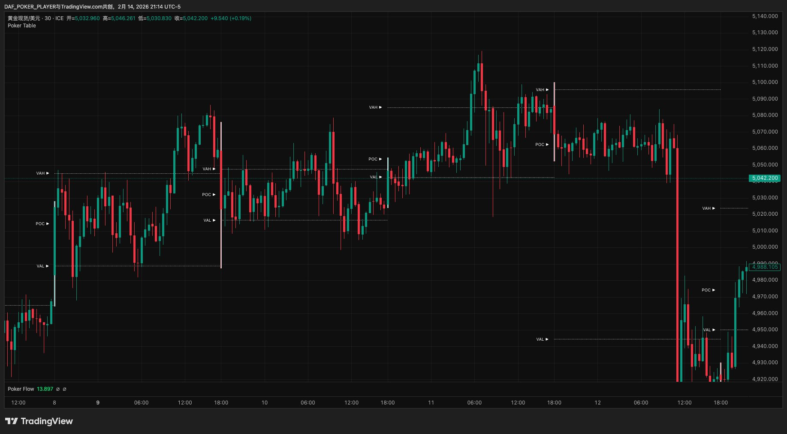
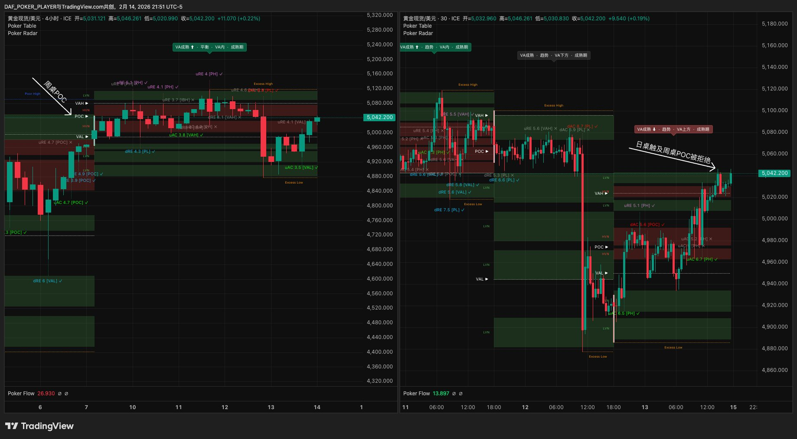
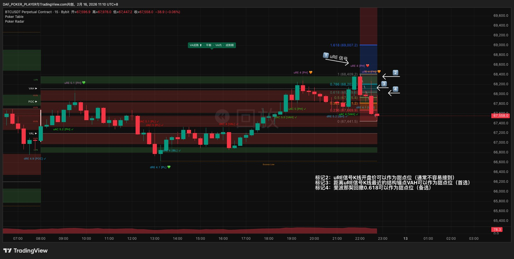
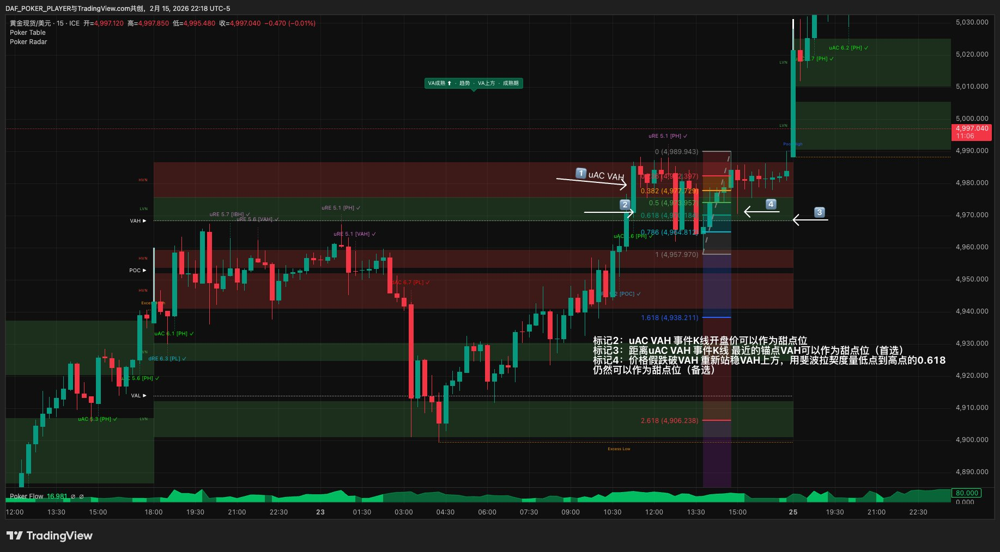
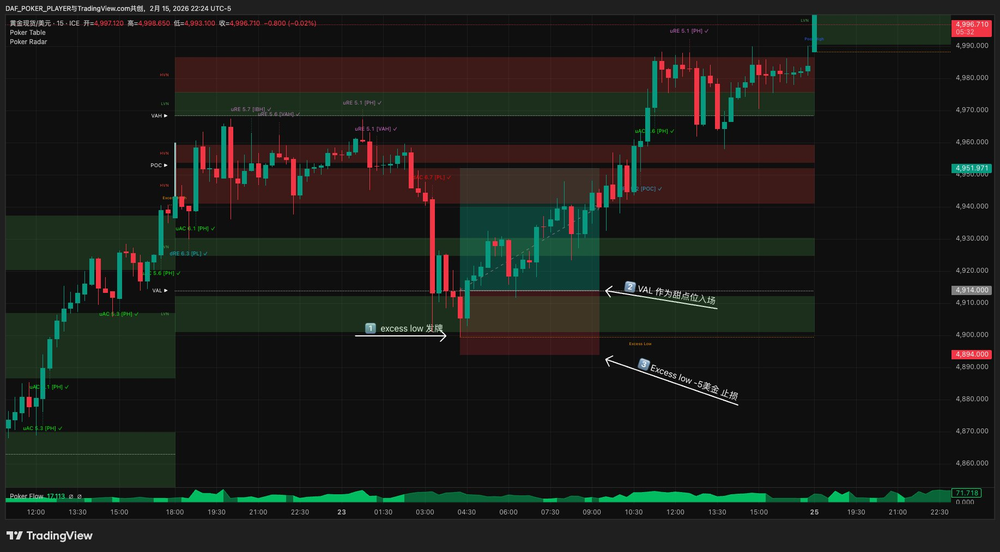
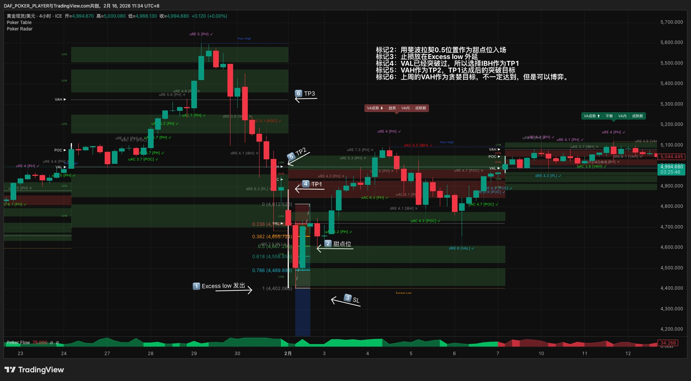

# Poker Trading

> ***Trade like a poker player - Poker Trading***
>
> **用拍卖理论读懂市场，用扑克规则把交易变成概率游戏，像牌手一样交易。**

---

## 前言

做交易这件事，走到最后你会发现，难的从来不是"看对方向"。

大部分在市场里待过几年的人，看图表的能力都不差。趋势和震荡分得清，支撑和阻力找得到，甚至复盘的时候回头看，很多机会自己当时都看到了。但结果呢？要么看到了没敢做，要么做了但仓位不对，要么进去了但拿不住，要么拿住了但不知道什么时候该走。

问题出在分析之后的所有环节。

什么时候出手？下多大仓位？止损放哪里？到了第一个目标该全走还是留一部分？信号出来了但环境不对怎么办？错过了最佳入场点还追不追？这些问题没有一个是靠"多看几根K线"能解决的。它们需要的不是更多的分析能力，而是一套足够清晰的规则——在盘中的压力下，帮你快速做出决定，而且事后复盘时能说清楚每一步的依据。

Poker Trading 就是为了解决这个问题而创建的交易策略。

大多数策略教你看懂市场，但没人教你怎么下注、怎么管、什么时候走。Poker Trading用拍卖理论读结构，用扑克规则管执行——像职业牌手一样，不预测，只打好手里的牌。

想象一下，未来一年你继续用现在的方式交易——每次凭感觉入场、止损靠"差不多"、仓位看心情——12个月后你的账户会在哪里？大部分人不需要想象，因为过去一年就是这么过来的。Poker Trading不保证你赚钱，但它保证你做的每一笔交易都有清晰的理由，每一次止损都在计划之内。

它重新定义了交易者和市场之间的关系，给每一步决策都配上了明确的规则和对应的工具。从你打开图表的那一刻到最终下桌，每一个环节该看什么、该怎么判断、该怎么行动，都有章可循。

如果你已经准备好了，翻到第一章，我们从头开始。

---

## 目录

**第一章 · 新世界**
*市场 · 拍卖 · 牌桌*

**第二章 · 工具箱**
*Poker Table · Flow · Radar*

**第三章 · 坐哪桌**
*选桌 · 看桌风 · 顺风优先 · 建立偏见*

**第四章 · 等发牌**
*边界出事 · 验牌*

**第五章 · 牌好吗**
*牌型 · 牌力 · 纹理*

**第六章 · 算笔账**
*甜点位 · 止损 · 盈亏比*

**第七章 · 怎么打**
*仓位 · 下注 · 四街*

**第八章 · 活下来**
*风控 · 纪律 · 长期主义*

**第九章 · 你的第一手牌**
*一个完整案例，从打开图表到平仓下桌*

---

## 全书路线图

```
Ch1 新世界 ──→ Ch2 工具箱 ──→ Ch3 坐哪桌
  理解市场        认识工具         选桌+看方向
  │                               │
  │  ┌─────────────────────────────┘
  │  │
  │  ↓
  │  Ch4 等发牌 ──→ Ch5 牌好吗 ──→ Ch6 算笔账
  │    等信号+验真      评估牌力       算盈亏比
  │                                  │
  │  ┌───────────────────────────────┘
  │  │
  │  ↓
  │  Ch7 怎么打 ──→ Ch8 活下来 ──→ Ch9 第一手牌
  │    入场+管理       风控+纪律       完整实战
  │
  └──→ 每一步的输出是下一步的输入
       看不懂后面的？回到前面对应的章节
```

> 你在任何时候迷路了，回来看这张图——它告诉你每一章在整条决策链里的位置。

---

> 已验证品种：黄金 / 白银 / BTC / ETH（Volume Profile数据充足的品种均可适用，以上为已验证并持续实盘使用的品种）
>
> 核心工具：Poker Table · Poker Flow · Poker Radar
>
> 本策略约七成规则可量化执行（评分、R:R、仓位、熔断），三成依赖经验判断（验牌节奏、纹理评估）。所有判断类规则均附参考阈值。
-e 


# 第一章 · 新世界

> *"大部分人输钱不是因为看错了方向，而是因为从来没搞懂自己坐在一张什么样的牌桌上。"*

这一章是整个体系的地基——从市场本质讲起，建立Poker Trading的世界观。

---

## 1.1 忘掉庄家

以前你可能听过这样的故事——

市场里有一个庄家。他控制着一切：拉升是他在吸筹，暴跌是他在洗盘，你的止损被扫了是他在"猎杀"。你唯一能做的就是猜他下一步要干什么，然后跟上。

忘掉这个故事。

不是因为它完全错误，而是因为它**让你把自己放在了一个永远被动的位置**——你在猜，在跟，在害怕。而一个职业牌手，从来不猜对手手里是什么牌。他只看桌面上已经翻开的信息，然后做出最优决策。

市场不是一个人在操控的赌局，而是一场**所有人同时参与的双向拍卖**。

---

## 1.2 市场是一场拍卖

想象一个最简单的拍卖场景：

一件商品挂出来，起拍价100。有人喊101，有人喊102，价格一路往上走。喊到120的时候，没人再加价了——因为大部分人觉得120以上不值。价格开始回落，115有人接手，110又有人买。最后成交最密集的区域停在了108-115之间。

这就是市场每时每刻在做的事情。

**价格是广告牌**——它只是在喊："这个价格，有没有人愿意交易？"

**成交量才是真正的投票**——它告诉你："有多少人觉得这个价格合理。"

就像淘宝上一个商品标价￥100——这是广告。但有5000人真的掏钱买了——这才是投票。你应该关注的是有多少人愿意在这个价格交易，而不是价格本身。

当很多人在某个价格附近投票，那里就形成了一个共识区——我们叫它**价值区**。价格偏离价值区太远，就像商品定价太离谱——要么被疯抢，要么无人问津，最终回归合理。

这就是市场唯一不变的规律：

> **偏离 → 回归 → 再偏离 → 再回归。**
>
> ⚠️ 但"偏离"不等于"一定回来"。有时偏离就是新价值区的开始——市场接受了新价格，旧的价值区被抛弃。后面章节会教你区分"该回归的偏离"和"已被接受的偏离"。

你不需要预测"下一步往哪走"。你只需要读懂当前的结构——价值在哪里，价格偏离了多远，市场正在接受还是拒绝。

好消息是，成交量分布把这些信息全都摆在你面前了。坏消息是，光"看懂"还不够——你还需要一套规则框架来帮你决定：什么时候出手，下多大注，什么时候收手。

这套框架，我们从德州扑克里借来。

---

## 1.3 从拍卖到牌局

交易和德州扑克本质上是同一类游戏——都是在信息不完全的环境下做概率决策。

你永远不知道所有人的底牌，但桌面上翻开的公共牌给了你足够的线索。市场也一样——你看不到所有人的持仓，但成交量分布告诉你大多数人在哪里达成了共识。

职业牌手不需要每手都赢。100手牌里赢40手，但每手赢的是输的3倍，他就是赢家。业余玩家怕错过、每手都想参与。职业牌手大部分时间在弃牌——80%的利润来自20%的好牌。

扑克给了你一套可执行的思维框架——

- "我该不该做这笔交易？" → "这手牌值不值得入池？"
- "该做多还是做空？" → "桌风偏哪边？"
- "该下多大仓位？" → "这手牌够不够强？"
- "什么时候止损？" → "局势变差了，该弃牌。"
- "什么时候止盈？" → "目标到了，收手。"

拍卖市场理论告诉你市场是怎么运作的，成交量分布让你能读懂市场结构，而德州扑克给了你一套把"读懂"转化为"做到"的规则系统——从环境判定、信号识别、牌力评估，到入场执行、仓位管理、下桌管理，每一步都有对应的扑克概念。

把拍卖市场的结构分析能力，装进德州扑克的执行框架里——这套系统，我们叫它 **Poker Trading**。

---

## 1.4 职业牌手的四条铁律

在进入具体的工具和策略之前，先记住职业牌手都知道的四件事。它们贯穿 Poker Trading 的每一章，是所有策略的底色。

**第一，大部分手牌不值得打。**

你有没有过这种经历——信号出来了就忍不住做，做完才发现是一手烂牌？职业牌手恰恰相反——他的默认状态是**不做**，只有当条件足够好的时候才出手。弃牌的成本是零，而追一手烂牌的代价可能是一周的利润。

**第二，位置比牌大。**

同样一手中等牌，在有利位置（顺着环境、踩在关键位上）可以大胆打，在不利位置（逆着环境、找不到好的入场位）就应该弃掉。同样的信号，在不同的结构位置，价值完全不同。忽视位置的交易者，赢一次输三次——因为好信号出现在坏位置上的概率远高于你的想象。

**第三，下注是为了赢筹码，不是为了证明自己对。**

盈亏比不够就放弃。止盈目标太近、止损太远——哪怕你99%确定方向是对的，这笔交易也不值得做。长期来看，盈亏比决定了你能不能活下来。每一笔"我就试一下"的交易，都是在拿本金为好奇心买单。

**第四，情绪是最大的对手。**

被连续止损后报复性交易，赢了一笔大的后飘了加大仓位——这些情绪驱动的行为，比任何"看错方向"都更致命。你见过这样的人：周一到周四赚了$800，周五被连扫两次止损后失控，连续追了三笔、把仓位加到平时的三倍——两小时亏掉$1,200。一周白干。你真正的对手不在市场里，在你自己脑子里。

---

## 1.5 你的牌桌地图：成交量分布

如果市场是一场拍卖，那**成交量分布（Volume Profile）就是这场拍卖的投票记录**。它不告诉你价格会往哪走，但它告诉你在过去一段时间里，市场参与者在哪些价格上达成了最多共识。

把一段时间内的所有成交量按价格分布画出来，你会得到一张横向的柱状图——柱子越长，说明那个价格上发生的交易越多。这张图就是你的牌桌地图。

地图上有几组关键标记。下面会一组一组地介绍——**不用急着背，它们会在后面的章节里反复出现，现在只需要知道每个标记代表什么意思就够了。**

### 第一组：价值区三件套（VA + POC）

这是最核心的三个概念。打个比方：如果成交量分布是一栋楼，价值区就是楼里住人最多的那几层。

**价值区（VA）**——包含70%成交量的价格区间，也就是大多数人觉得合理的价格范围。价值区有一个天花板和一个地板：

- **价值区上界（VAH）** = 天花板，价格到了这里容易受阻
- **价值区下界（VAL）** = 地板，价格到了这里容易获得支撑

价格在VA内 = 市场觉得"价格合理"，倾向于横盘。价格在VA外 = 市场觉得"价格偏离了"，可能回归，也可能扩展到新的价值区。

**控制点（POC）**——成交量最大的那个价格，也就是价值区的"重心"。POC对价格有磁吸效应——价格偏离后容易被吸回来。当POC开始向一个方向移动，说明市场的共识重心正在迁移，这是方向确认的重要信号。

举个例子：黄金日VP显示VA在2640-2680之间，POC在2660。这意味着今天大部分人认为2640-2680是合理价格区间，而2660是成交最密集的"重心"。如果价格跌到2640（VAL）被弹回来，说明市场在地板上拒绝了更低的价格。



> ✅ **检查点：** 如果你理解了"VA=大多数人觉得合理的价格区间"和"POC=成交最密集的那个价格"，就可以继续了。不确定的话回到上面再看一遍。

### 第二组：拍卖边界（PH/PL + VAH/VAL + IB）——Radar捕信号时标记

**周期最高价与最低价（PH / PL，Period High / Period Low）**——当前计算周期内价格触及的天花板和地板。注意PH/PL是Period High/Period Low，不是Poor High/Poor Low——Poor是另一个概念（见下方第三组）。它们是拍卖的极端边界——价格到了这里，要么被拒绝弹回，要么突破进入新领地。PH/PL不是Table画出的固定标线，而是Poker Radar在K线级别检测到AC/RE事件时才标记出来——没有事件就没有标记。

**初始平衡区（IB）**——开盘后初始阶段形成的价格范围，代表了市场的"开局博弈区"。具体的计算窗口因品种和周期而异，第二章会详细说明。IB的上界叫**初始平衡区上界（IBH）**，下界叫**初始平衡区下界（IBL）**，同样由Radar在检测到事件时标记，无事件不显示。

**价值区边界（VAH / VAL）**——上面已经介绍过，由Table画出，始终可见。Radar在这里捕捉接受和拒绝两种事件。

以上6个位置分两种显示方式：**VAH/VAL由Poker Table画出**（始终可见），**PH/PL/IBH/IBL由Poker Radar在检测到AC/RE事件时标记**（无事件不显示）。Table负责画结构（VA区域、POC、IB范围），Radar负责在边界上捕信号并标记事件位——两层分工。

![第二组：黄金现货30分钟图，Poker Radar在一级边界上实时捕捉AC/RE信号，标签显示信号类型+评分+触发位（如uRE 4 [PH]、dRE 5.6 [VAL]、dAC 4.1 [POC]），顶部状态栏显示VA成熟度/市场类型/VA位置/阶段](images/ch1-group2-radar.png)

> ✅ **检查点：** PH/PL=拍卖极端边界，VAH/VAL=价值区边界，IBH/IBL=开局博弈区边界。其中VAH/VAL由Table画出（始终可见），PH/PL/IBH/IBL由Radar在事件触发时标记。

### 第三组：拍卖边界——Table识别（Excess High / Excess Low）

**极值完成（Excess）**——当拍卖到达极端价格时，如果那个区域的成交量极低，说明价格刚到那里就被快速拒绝了——拍卖干脆利落地结束了。VP的尾部呈现尖锐形态，这叫极值完成。Excess是最强烈的拒绝信号，意味着那个边界非常牢固。上方的Excess叫**Excess High**（看空信号），下方的叫**Excess Low**（看多信号）。在实际操作中，Poker Table会自动识别和标记Excess——你不需要自己测量尾部形态。

Excess和PH/PL都出现在周期的高低点区域，但检测方式完全不同——PH/PL由Radar在K线级别检测到事件时标记（无事件不显示），Excess由Poker Table在VP级别直接识别成交量分布结构（始终可见）。PH是一条精确的价格线（周期最高价），Excess是一段尖锐的尾部区域（VP长出来的结构）。**两者可以单独出现，也可以共同存在，都是一级边界。**

**极值未完成（Poor）**——如果极端价格区域的成交量反而很高，说明那里发生了大量交易，拍卖并没有干脆地结束。这叫极值未完成，意味着那个边界不牢固，价格可能会回来重新测试。**Poor不是发牌来源**——它告诉你这里的门没关上，不是可靠的边界。

直觉理解：**Excess像一扇砰地关上的门**——价格碰了一下就弹走了，没人愿意在那个价格交易，边界非常牢固。**Poor像一扇虚掩的门**——很多人在门口挤来挤去，说明大家对"要不要进去"还有分歧，边界不牢固，价格可能回来再推一次。

![第三组：黄金现货30分钟图，Poker Table + Poker Radar同时开启。Table标记Excess High（顶部VP尾部尖锐）、Excess Low（底部VP尾部尖锐）、Poor High（左侧第一天肥厚尾部）。Radar信号标签同时可见（如dRE 7.5 [PL]✓、uRE 5.5 [VAH]✓），展示Table画线+识别Excess、Radar在线上捕信号的两层分工](images/ch1-group3-excess.png)

> ✅ **检查点：** Excess High/Low由Table在VP级别识别（始终可见），PH/PL由Radar在事件触发时标记（无事件不显示）——不同机制观察同一片战场。Excess=门关了（一级边界，发牌），Poor=门没关（不发牌）。

### 第四组：路况标记（HVN/LVN）

**高成交量节点（HVN）与低成交量节点（LVN）**——HVN是成交量特别密集的价格区域，像路上的减速带——价格容易在这里停留和纠缠。LVN是成交量特别稀少的区域，像一条高速公路——价格一碰就快速穿越。

HVN和LVN不是边界，不产生发牌。它们是路况参考——告诉你价格经过某个区域时会快还是慢，影响你的纹理判断和甜点位选择（第五章和第六章会用到）。


> ✅ **检查点：** HVN=减速带（成交密集，价格容易粘住），LVN=高速公路（成交稀少，价格快速通过）。四组都理解了，你已经能读懂VP地图了。

---

## 1.6 市场只会说两种话

有了牌桌地图之后，你需要学会听懂市场的语言。好在这门语言极其简洁——当价格触及任何一个关键位时，市场只有两种回答：

### 接受（Accept）

价格穿越了关键位，收盘在另一侧。K线实体饱满，穿透明确。

市场在说：**"这个价格，我接受了。旧的边界已经失效，新的价值区正在形成。"**

在信号雷达（Poker Radar）上，接受信号分为两个方向：
- **uAC** = 向上接受（Up Accept）——价格往上突破关键位，收盘站在上方。白话：**"冲上去了，站住了"**
- **dAC** = 向下接受（Down Accept）——价格往下跌破关键位，收盘留在下方。白话：**"跌下去了，没回来"**

### 拒绝（Reject）

价格触及了关键位，但被弹了回来。留下影线，收盘回归原侧。

市场在说：**"这个价格，我不接受。这里就是边界，价格该回去了。"**

在信号雷达上，拒绝信号分为两个方向：
- **uRE** = 向上拒绝（Up Reject）——价格往上冲到关键位，被打回来了，留上影线。白话：**"冲上去了，又被打回来"**
- **dRE** = 向下拒绝（Down Reject）——价格往下探到关键位，被弹回来了，留下影线。白话：**"砸下去了，又被弹回来"**

> **命名规律（记住，后面全靠它）：** 字母u/d代表价格的运动方向（上/下），AC/RE代表结果（接受/拒绝）。"向上拒绝"不是说"拒绝向上"，而是"价格向上运动之后被拒绝了"。

举个例子：黄金价格涨到$2,680（VAH），然后被打回到$2,665——这就是uRE，市场说"$2,680以上太贵了"。如果黄金从$2,640（VAL）跌到$2,630，但收盘站稳在$2,628——这就是dAC，市场说"$2,640以下我也接受了"。

有一个关键的不对称需要记住：拒绝通常是瞬间事件，一根K线就能确认，接受是一个过程，需要后续K线持续在外侧收盘才能确认。这个不对称深刻地影响着后面的策略设计——你会发现逆风牌和顺风牌的节奏差异，根源就在这里。

信号雷达还有评分系统、确认机制、成熟度判断等更多功能，这些会在第二章详细介绍。

![Poker Radar信号示例：黄金现货30分钟图，Radar在K线上标记uAC/dAC/uRE/dRE信号标签（如dAC 8.7 [PL]✓、uRE 5.1 [PH]✓、dAC 5.6 [POC]✓），顶部状态栏显示VA成熟度·市场类型·VA位置·阶段，底部Poker Flow数值](images/ch1-radar-signals.png)

---

## 1.7 一级边界与POC

不是所有关键位都一样重要。Poker Trading在**8个一级边界**上发牌，按识别工具分两组：

**Radar捕捉信号（6个）——K线级别实时事件：**

| 层级 | 关键位 | 信心度 | 含义 |
|------|--------|--------|------|
| 第一层 | PH / PL | ⭐⭐⭐ | 拍卖的极端边界，信号最强 |
| 第二层 | VAH / VAL | ⭐⭐ | 价值区的边界，核心交易位 |
| 第三层 | IBH / IBL | ⭐ | 开局博弈区边界，日内参考 |

**Table识别（2个）——VP级别结构演化：**

| 关键位 | 信心度 | 含义 |
|--------|--------|------|
| Excess High | ⭐⭐⭐ | 上方VP尾部放量拒绝（看空） |
| Excess Low | ⭐⭐⭐ | 下方VP尾部放量拒绝（看多） |

```
        ┌─────────┐
        │ PH / PL │  ← Radar标记：事件触发时显示（无事件不显示）
        │ Excess  │  ← Table识别：VP结构极端边界（始终可见）
        ├─────────┤
      ┌─┤ VAH/VAL ├─┐  ← Table画出：价值区边界（始终可见，Radar捕AC/RE）
      │ ├─────────┤ │
    ┌─┤ │ IBH/IBL │ ├─┐  ← Radar标记：事件触发时显示（无事件不显示）
    │ │ └─────────┘ │ │
    └─┘             └─┘
```

这8个位置构成VP的**一级边界**。Poker Trading只在一级边界上发牌——边界上的事件或结构演化代表拍卖机制的真正判决，VA内部的信号只是已知价值区内的正常波动，不产生方向性信息，一律当噪音忽略。

PH/PL和Excess都出现在周期高低点区域，但来自不同指标、不同机制。它们可以单独出现、也可以共同存在——共同存在时以Excess为准（VP结构证据优先于K线事件）。

层级越高的关键位，发出的信号越可信。而当多个关键位在同一个价格附近重叠时（比如PH恰好在VAH附近，或者Excess和偏见桌关键位重合），信号强度会叠加——这是你能拿到的最好的牌。

**POC的角色：参考位，不是发牌位。**

POC和一级边界性质不同。PH/PL、VAH/VAL、IBH/IBL、Excess High/Low都是"边界"——价格在这里会被接受或拒绝，或者VP在这里演化出结构判决。而POC是"磁铁"——价格偏离后容易被它吸回来，经过它时容易被减速和纠缠。

POC不是入场触发位——你不会因为"价格到了POC"而开仓。但POC在四个场景下有参考和辅助价值：

（1）**验牌能量**——边界信号出现后，POC处的同向AC可以作为验牌③能量的证据。

（2）**共振加分**——执行桌边界与偏见桌/背景桌关键位（含POC）重合时，信号获得额外的结构支撑。

（3）**方向参考**——POC持续迁移可以辅助判断方向。

（4）**翻转入场锚点**——边界事件发生后，如果价格穿越POC（AC确认），POC角色翻转（原来的支撑变阻力，反之亦然），可作为回踩/回抽入场的甜点位。翻转入场的前提是先有边界事件，POC本身不产生发牌。POC翻转在同一VP周期内有效——VP更新后旧的翻转角色失效。



---

## 1.8 每一张VP就是一张牌桌

成交量分布的计算方式永远相同，区别只在于时间窗口的大小。一个小时的成交量分布和一个月的成交量分布，算法完全一样——你看的是多大范围内的拍卖记录，就决定了你坐在哪张牌桌上。

在 Poker Trading 里，我们把每一张VP直接看作一张牌桌。打开一张日VP，你就坐到了日内桌上。打开一张周VP，你就换到了短线桌上。每张牌桌都有自己的VA、POC、PH/PL、关键位——就像每张扑克桌都有自己的底池、庄位和盲注一样。

```
┌─────────────────────────────────────┐
│  波段桌（月VP · 日线）               │
│  ┌─────────────────────────────┐    │
│  │  短线桌（周VP · 4H）          │    │
│  │  ┌─────────────────────┐    │    │
│  │  │  日内桌（日VP · 30m）  │    │    │
│  │  │  ┌─────────────┐    │    │    │
│  │  │  │ 分时段桌(5m) │    │    │    │
│  │  │  └─────────────┘    │    │    │
│  │  └─────────────────────┘    │    │
│  └─────────────────────────────┘    │
└─────────────────────────────────────┘
    小桌嵌在大桌里，规则相同，范围不同
```

| 牌桌 | VP计算范围 | 配合K线 | 典型持仓时间 |
|------|---------|--------|------------|
| 分时段桌 | 1个时段（按时区配置，见下方） | 5分钟 | 数小时 |
| 日内桌 | 1天 | 15/30分钟 | 24小时内 |
| 短线桌 | 1周 | 4小时 | 数天到两周 |
| 波段桌 | 1月 | 日线 | 数周到数月 |

**时段配置（默认HKT/UTC+8）：**
| 时段 | 名称 | 时间范围 |
|------|------|---------|
| Session 1 | 东京 | 08:00 — 16:00 |
| Session 2 | 伦敦 | 16:00 — 22:30 |
| Session 3 | 纽约 | 22:30 — 05:00 |

> 05:00-08:00为亚洲早盘静默期，成交量极低，不单独生成时段VP，其数据归入日VP。不建议在此时段入场。

你的持仓周期决定你坐哪张桌。做日内就坐日内桌，做短线就坐短线桌，做波段就坐波段桌。一次只坐一张桌——这个纪律后面会反复提到。

但你坐在一张桌上打牌时，并不是完全不看别的桌。Poker Trading 用多屏布局来组织信息：

- **背景桌（高周期）** = 比执行桌高一级的牌桌，提供共振参考
- **执行桌（当前周期）** = 你正在打牌的这张桌，所有入场和下桌决策都在这里做
- **偏见桌（更高周期，进阶）** = 更大格局的参考，提供偏见方向

初学阶段用**双屏布局**：背景桌（左）+ 执行桌（右），偏见直接等于执行桌桌风方向。进阶后加偏见桌升级为**三屏布局**：偏见桌（左）+ 背景桌（中）+ 执行桌（右）。

不管哪种布局，你只在执行桌上下注，参考桌只是"侧头看一眼"了解大环境。

布局关系随你坐的执行桌变化。如果你坐在日内桌上，本周的周VP就是你的背景桌。如果你坐在短线桌上，本月的月VP是你的背景桌。完整配置见game-setup，布局用法在第三章展开。


---

## 1.9 完整映射一览

到这里，牌桌上的基本工具已经全部到齐。德州扑克和 Poker Trading 的完整概念映射表见**附录A · 模型总览**，可以随时翻阅。现在不用背——后面每一章都会用到这些概念，用着用着就记住了。

---

> **本章要点速记**
>
> 市场 = 双向拍卖 · 价格 = 广告 · 成交量 = 投票
>
> 价值区（VA）= 70%共识区间 · POC = 价格磁铁
>
> 接受（Accept）= 穿越关键位 · 拒绝（Reject）= 在关键位弹回
>
> 信号标记：uAC / dAC（接受）· uRE / dRE（拒绝）
>
> 极值完成 = 最强拒绝 · 极值未完成 = 边界不牢
>
> 一级边界（发牌位）：Table画出 VAH/VAL（始终可见）+ Table识别 Excess High/Low（始终可见）+ Radar标记 PH/PL/IBH/IBL（事件触发时显示）· POC = 参考位（不发牌）
>
> 布局：双屏（新手·背景桌+执行桌）或三屏（进阶·加偏见桌）。背景桌=共振优先

> 🏁 **你现在能做什么：** 你理解了市场是拍卖，知道VP上的关键标记代表什么——VA是共识区、边界是发牌位、信号只有接受和拒绝两种。下一章，我们去认识帮你读这些信息的三个工具。
-e 


# 第二章 · 工具箱

> *"概念再清楚，看不到就等于没有。工具的意义就是让你用眼睛看到拍卖理论描述的那些东西。"*

上一章建立了世界观，这一章把它变成你能看到、能操作的三个工具。

---

## 2.1 三个工具总览

先用一张表建立全局印象：

| 工具 | 类比 | 负责什么 | 核心输出 |
|------|------|---------|---------|
| Poker Table | 牌桌地图 | 画出每个周期的成交量分布结构 | VA、POC、VAH/VAL、IB、HVN/LVN、**Excess/Poor** |
| Poker Flow | 桌风罗盘 | 判断VA迁移的方向和节奏 | 多头趋势 / 空头趋势 / 多头回调 / 空头回调 / 平衡 |
| Poker Radar | 信号雷达 | 在关键位自动识别接受/拒绝信号并评分 | uAC / dAC / uRE / dRE + 评分 + VA迁移方向 |

三个工具之间有明确的分工边界。Poker Table画出VP结构（VA/POC/VAH/VAL/IB/HVN/LVN）并识别Excess边界和Poor标记，始终可见。Poker Flow判断方向，不捕捉信号。Poker Radar在边界上捕捉AC/RE事件并评分——6个一级边界（PH/PL/VAH/VAL/IBH/IBL）加POC都会捕信号，区别在于VAH/VAL由Table画好线，Radar在线上等事件，而PH/PL/IBH/IBL没有预画的线，只有Radar检测到事件时才标记出来。决策权留给你——后面的章节会教你怎么用这些信息做判断。

---

## 2.2 Poker Table：你的牌桌地图

Poker Table 是你打开图表后第一个要看的东西。它把一段时间内的所有成交量按价格分布画出来，形成第一章讲过的那张牌桌地图——VA在哪里、POC在哪里、边界在哪里、哪里密集哪里稀疏，全都一目了然。

Table最重要的独特输出是**Excess High和Excess Low**——8个一级边界中的2个由Table在VP级别识别。当VP在PH/PL区域长出尖锐的放量拒绝尾部，Table将其标记为Excess。Excess是独立于Radar的一级边界（详见第四章）。Table同时标记极值未完成（Poor）——尾部肥厚，说明拍卖不充分，边界不牢固。


### 看盘布局

Poker Trading 的看盘方式有两种：

**双屏布局（新手路线）：** 左图=背景桌（高周期VP+K线，提供共振参考），右图=执行桌（当前周期VP+K线，实际打牌）。偏见直接等于执行桌桌风方向，不需要额外判断。

**三屏布局（进阶）：** 左图=偏见桌（更高周期VP+K线，看大方向），中图=背景桌，右图=执行桌。偏见桌提供偏见方向，需要在更高周期VP上识别AC/RE事件（详见§3.4）。

| 偏见桌（三屏左图） | 背景桌（双屏左图/三屏中图） | 执行桌（右图） |
|------------------|------------------------|--------------|
| 周桌（1周VP/4H） | 日桌（1日VP/30m） | 分时段桌（1时段VP/5m） |
| 月桌（1月VP/日线） | 周桌（1周VP/4H） | 日内桌（1日VP/30m） |
| 季度桌（季VP） | 月桌（1月VP/日线） | 短线桌（1周VP/4H） |
| 年桌（年VP） | 季度桌（季VP） | 波段桌（1月VP/日线） |

做决策永远看执行桌。背景桌主要提供共振参考。初学阶段用双屏就够了——等对AC/RE有了实盘直觉后再加偏见桌升级为三屏。完整配置见game-setup，布局用法在第三章展开。


### 时段VP

除了日、周、月这些标准周期，Poker Table还支持按交易时段划分——比如东京时段、伦敦时段、纽约时段，每个时段各生成一张独立的VP。时段VP在日内交易中特别有用，本质上就是把一天切成几张小桌，每张桌有自己的VA和关键位。读法和标准VP完全一样，只是时间窗口更短。

### 数据成熟度

有一个容易被忽视的问题：VP的数据不是一开始就可靠的。

一张新的VP刚开始形成时，成交量很少，VA和POC都在剧烈变化——就像一个新开的餐厅，第一天只有3个人给了评分，这时候4.8分毫无意义。等100个人都打完分之后，评分才可靠。VP也一样——只有当足够多的交易发生之后，VP的结构才会稳定下来，这时候的VA、POC、关键位才值得信赖。

Poker Radar会通过状态标签告诉你当前数据的成熟度（2.4节会详细讲）。作为经验参考，不同牌桌大致的成熟时间是：

- **日内桌**：开盘后大约8小时，VA基本稳定
- **短线桌**：大约到周三，结构开始清晰
- **波段桌**：大约到第10天，VA和POC趋于稳定

> 加密品种（BTC/ETH）7×24无收盘——"开盘"=VP重置时间（UTC 0:00），以此为基准计算成熟度。

在VP尚未成熟之前，你可以临时用上一桌的VP作为参考——上一桌的数据是完整的，关键位仍然有效。等当前VP成熟后再切回来。这个切换规则在第三章会进一步展开。

### IB的计算窗口

第一章提到过初始平衡区（IB）是"开盘后初始阶段形成的价格范围"。在Poker Table里，IB的计算窗口因牌桌而异：

| 牌桌 | IB计算窗口 |
|------|-----------|
| 分时段桌 | 时段开始后前15-20分钟 |
| 日内桌 | 开盘后第1小时 |
| 短线桌 | 周一全天 |
| 波段桌 | 月初前3天 |

IB代表的是市场在开局阶段的第一轮博弈结果。具体的时间长度可以在参数中微调，但核心逻辑不变。

---

## 2.3 Poker Flow：你的桌风罗盘

Poker Table画出了每一张牌桌的静态结构，但它不告诉你方向。一张VP上VA在中间，价格在VAH附近——然后呢？该看多还是看空？

这个问题由Poker Flow来回答。

Poker Flow做的事情很简单：它回溯过去几个周期的VA位置，看VA是在往上走、往下走、还是原地不动，然后给你一个桌风判定。你可以把它理解成一个罗盘——你坐到牌桌上，先看一眼罗盘，知道风往哪边吹，再决定优先往哪个方向找机会。


### 五种桌风状态

Poker Flow会输出五种状态中的一种：

| 桌风 | 含义 | 你的默认姿态 |
|------|------|------------|
| 多头趋势 | VA持续上移，方向明确 | 优先找做多机会 |
| 空头趋势 | VA持续下移，方向明确 | 优先找做空机会 |
| 多头回调 | 大方向偏多，但短期在回调 | 仍然优先做多，耐心等回调结束 |
| 空头回调 | 大方向偏空，但短期在反弹 | 仍然优先做空，耐心等反弹结束 |
| 平衡 | VA没有明显方向 | 两边都可以看，但入池门槛更高 |

### 回溯参数

Poker Flow需要知道"回溯多远"来判断方向。不同牌桌的推荐参数不同：

- **日内桌**：回溯5天（看最近一周的VA迁移）
- **短线桌**：回溯4周（看最近一个月的VA迁移）
- **波段桌**：回溯3个月（看最近一个季度的VA迁移）

### 桌风的核心作用

这一点非常重要，需要记住：

桌风**只是一个前置过滤器**。它告诉你优先盯哪些边界、等什么事件——多头桌风优先盯下方边界买便宜和上方边界追突破，空头桌风反过来。逆风方向不是不能做，但门槛更高。其中"顺风优先"是核心——第三章会围绕这个原则展开。除此之外，桌风不替代任何具体的交易决策——不替你定起点、不替你评牌力、不替你决定下多大注。

换句话说，桌风告诉你"风往南吹"，但你不会因为风往南吹就闭着眼睛往南走。你还需要看地图（Poker Table）确认路况，等雷达（Poker Radar）告诉你"前方有一个明确的边界事件"，然后才决定要不要迈步。桌风怎么具体影响你的策略选择，是第三章的内容。

---

## 2.4 Poker Radar：你的信号雷达

Poker Table给你画了地图，Poker Flow给你指了方向，但你还缺一样东西——**谁来告诉你"现在有动静了"？**

这就是Poker Radar的工作。它实时监控所有关键位，当价格触及某个关键位并形成接受或拒绝时，Radar会自动捕捉这个信号，给它评分，然后推送给你。你不需要盯着每一根K线去判断"这算不算一个信号"——Radar替你做了这件事。8个一级边界中，Radar在PH/PL/VAH/VAL/IBH/IBL共6个边界上捕捉K线级AC/RE事件（其中PH/PL/IBH/IBL只在事件触发时才标记，无事件不显示），另外2个（Excess High/Low）由Table在VP级别直接识别结构演化。

![Poker Radar界面：黄金现货30分钟图，Radar在K线上标记信号标签（dAC 8.7 [PL]✓，uRE 5.1 [PH]✓，dAC 5.6 [POC]✓），顶部状态栏显示VA成熟度/市场类型/VA位置/阶段](images/ch1-radar-signals.png)

### 四种信号

Radar识别的信号和第一章讲的市场语言完全对应：

| 信号 | 颜色 | 含义 |
|------|------|------|
| **uAC** | 🟢 绿色 | 向上接受——价格突破了上方关键位，收盘站在上方 |
| **dAC** | 🔴 红色 | 向下接受——价格跌破了下方关键位，收盘站在下方 |
| **uRE** | 🟣 紫色 | 向上拒绝——价格冲高触及上方关键位，被打回来了 |
| **dRE** | 🔵 蓝色 | 向下拒绝——价格下探触及下方关键位，被弹回来了 |

每个信号标签都会附带它触发的关键位信息，比如"uAC 7.5 [VAH]"意味着"在VAH这个关键位上发生了一个向上接受信号，评分7.5"。

### 评分系统

并不是所有信号都值得认真对待。Radar会给每个信号打一个1-10分的评分，分数越高说明信号越清晰、越可靠：

| 分数 | 含义 | 你的态度 |
|------|------|---------|
| ≥7.0（7+）🚨 | 优质信号 | 认真对待，进入后续评估流程 |
| 4.0–6.9 📢 | 普通信号 | 需要结合其他条件确认 |
| <4.0 | 噪音 | 忽略 |

评分的具体算法你不需要了解——它综合考虑了K线形态、穿透力度、成交量配合等多个因素。你只需要记住这个三档分类就够了。

### 状态标签

除了信号和评分，Radar还会在图表上持续显示四段状态信息，帮你快速了解当前市场的整体状况：

**第一段：数据成熟度** — "IB形成中"、"VA形成中"、"VA成熟"。这就是上一节提到的VP数据成熟度判断。当标签显示"IB形成中"时，VP的结构还在剧烈变化，这个阶段的信号可靠性较低。

**第二段：市场类型** — "趋势"、"扩张"、"平衡"、"震荡"、"中性"。它告诉你当前VP的形态特征。

> ⚠️ **市场类型 ≠ 桌风。** 这是两套独立的分类系统。市场类型（Radar）= 当前VP的形态快照（VP长什么样）。桌风（Flow）= 跨周期VA迁移方向（VA在往哪移）。两者各自独立，不存在映射关系。市场类型是"趋势"时桌风可能是平衡（因为VA没有移动），桌风是多头时市场类型可能是"平衡"（因为VP形态对称）。不要试图让它们"对得上"——它们本来就在说不同的事。

**第三段：VA位置** — "VA上方"、"VA内"、"VA下方"。价格相对于价值区的位置。

**第四段：阶段** — "开盘期"、"发展期"、"成熟期"。当前周期进行到了哪个阶段。

这四段信息组合起来，给你一个快速的"环境快照"。盘中最常看的是**第一段（数据成熟度）和第三段（VA位置）**——前者决定当前VP是否可信赖，后者告诉你价格在结构中的位置。其余两段是辅助参考，用到时自然会看。比如看到"VA成熟 · 趋势 · VA上方 · 成熟期"——这意味着当前VP数据可靠、市场有方向、价格在价值区上方运行、周期已经进入后半段。至于这些信息怎么影响你的具体策略，后面章节会展开。


### VA迁移识别

Radar自动对比当前和前一周期的VA位置，识别VA迁移方向。这和Poker Flow互补——Flow回溯多个周期给宏观桌风，Radar的VA迁移聚焦"这一局和上一局之间VA往哪走了"。比如Flow显示"多头趋势"但Radar发现本周VA下移了——提示大方向不变但短期有回调迹象。

### 推荐设置

Radar必须和Poker Table对齐——你用哪张牌桌，Radar就跟着看哪个周期的信号：

| 牌桌 | Poker Table VP | Radar配合K线 |
|------|------------|-------------|
| 分时段桌 | 1时段VP | 5分钟 |
| 日内桌 | 1日VP | 15/30分钟 |
| 短线桌 | 1周VP | 4小时 |
| 波段桌 | 1月VP | 日线 |

设置好之后，Radar就会按照你所在牌桌的周期来监控信号。你不需要在盘中手动切换——选定牌桌，设好参数，然后让Radar替你盯着。

---

## 2.5 三个工具怎么配合

工作流有自然的先后顺序：

```
┌────────────┐     ┌────────────┐     ┌────────────┐
│ Poker Table │ ──→ │ Poker Flow │ ──→ │Poker Radar │
│  画地图     │     │  读方向     │     │  捕信号     │
│ VA在哪?     │     │ VA往哪走?   │     │ 哪里出事了? │
│ 关键位在哪?  │     │ 风往哪吹?   │     │ 评分多少?   │
└────────────┘     └────────────┘     └────────────┘
   空间感              方向感              时机感
```

**30秒速读示例：** 你坐到短线桌。第一眼看Poker Table——VA在$2,640-$2,680，POC@$2,660，PH@$2,695。第二眼看Poker Flow——绿色，多头趋势。第三眼看Poker Radar——暂无信号。结论：风往多头方向吹，下方边界（VAL $2,640）是"买便宜"的位置，上方边界（PH $2,695）是"追突破"的位置。现在没信号，等。

地图给你空间感，桌风给你方向感，雷达给你时机感。三层信息叠在一起，你对当前牌桌的理解就到位了。拿到这三层信息之后怎么做判断，是第三章开始的内容。

**三个工具之间不会"打架"。** Flow说多头但Radar给了一个dAC——这不是矛盾。Flow在说"过去几周VA在上移"，Radar在说"刚才价格向下突破了一个关键位"。一个是宏观方向，一个是微观事件。它们是信息输入，不是交易指令——不要试图让所有工具"说同一句话"才敢出手。Radar推送的信号支持alert功能，可以设置推送通知，避免持续盯盘。

**工具不适用的场景：** 极端行情（单日暴涨暴跌10%+）、流动性极低（凌晨/节假日）、数据延迟——遇到这些，不坐下，等市场恢复正常再说。详细的极端情况处理见第八章。

---

> **本章要点速记**
>
> Poker Table = 牌桌地图 · Poker Flow = 桌风罗盘 · Poker Radar = 信号雷达
>
> 看盘布局：双屏（新手·背景桌+执行桌）或三屏（进阶·加偏见桌）
>
> 桌风五态：多头趋势 / 空头趋势 / 多头回调 / 空头回调 / 平衡
>
> 桌风回溯：日/5 · 周/4 · 月/3
>
> Radar四信号：uAC / dAC（接受）· uRE / dRE（拒绝）
>
> Radar评分：7+优质 · 4-6普通 · 4以下忽略
>
> VA迁移：Radar对比当前vs前周期VA位置 · 工作流：Table画地图 → Flow读方向 → Radar捕信号

> 🏁 **到目前为止你学了什么：** 第一章你理解了市场是拍卖，第二章你认识了读拍卖的三个工具——Table画结构、Flow看方向、Radar捕信号。下一章开始，你会学到怎么用这些信息做决策：坐哪张桌、往哪个方向看。
-e 


# 第三章 · 坐哪桌

> *"好牌手不是坐下就打，而是先把桌上的情况看清楚。"*

工具摆好了，但不能直接找信号。先解决几个前置问题：坐哪张桌、什么时候该换、风往哪边吹、优先往哪个方向找机会。

---

## 3.1 选桌：你要坐哪张桌

选桌的逻辑很简单——你打算持仓多久，就坐哪张桌。

| 你的持仓周期 | 对应牌桌 | VP计算范围 |
|------------|---------|----------|
| 数小时 | 分时段桌 | 1个时段（按时区配置） |
| 24小时内 | 日内桌 | 1天 |
| 数天到两周 | 短线桌 | 1周 |
| 数周到数月 | 波段桌 | 1月 |

做日内的人坐日内桌，做波段的人坐波段桌。听起来像废话，但在实际交易中，很多人会不自觉地混桌——坐在日内桌上却拿着波段桌的止损，或者坐在短线桌上被一根5分钟K线吓得提前下桌。这种混桌是大部分交易失控的根源。

Poker Trading有一个硬规矩：**一次只坐一张桌。** 你选定了短线桌，那你的VP是周VP，你的K线是4小时，你的止损和止盈都按短线桌的级别来。不在盘中因为恐惧切到更小的K线上"看清楚"，也不因为贪心切到更大的周期去"看看还能不能拿"。一张桌坐到底，除非有明确的理由换桌。

**看盘频率参考：** 你不需要全天盯盘——看盘频率由你的K线级别决定。

| 牌桌 | K线 | 建议看盘频率 | 说明 |
|------|-----|------------|------|
| 分时段桌 | 5m | 盘中实时 | 需要盯盘 |
| 日内桌 | 30m | 每30-60分钟 | 可以设Radar推送，有信号再看 |
| 短线桌 | 4H | 每4小时或一天2-3次 | 早中晚各看一次足够 |
| 波段桌 | 日线 | 每天收盘后1次 | 日线走完后统一处理 |

---

## 3.2 牌桌切换：什么时候该换VP

选好了桌，还有一个实际问题——每个新周期刚开始的时候，VP的数据还不够。

第二章提到过数据成熟度：一张新的VP刚开始形成时，VA和POC还在剧烈变化，这时候的结构不可靠。那怎么办？

答案是临时用上一桌的VP。

### 通用原则

新周期VP未成熟时，以上一周期的VP作为主桌参考。一旦当前VP的结构稳定下来——POC位置不再大幅跳动，VAH和VAL基本锁定——就切回当前VP。判断的依据可以看Poker Radar的状态标签：当第一段从"IB形成中"或"VA形成中"变成"VA成熟"时，就是切换的时机。


任何时候只有一张主桌。不会出现"两张VP都看着，哪个顺眼用哪个"的情况。

### 各牌桌的切换节奏

**波段桌（月VP）：** 月初第1-5天，上个月的VP仍然是你的主桌。第6-8天开始留意本月VP是否成熟，成熟了就切过来。最迟到第10天，不管结构清不清晰，一律用本月VP。

**短线桌（周VP）：** 周一用上周VP。周二开始看本周VP的成熟度。最迟周三收盘后，一律切到本周VP。切过来后如果VP结构仍不清晰（关键位太近、VA太窄）→按§3.5"不坐"处理。

**日内桌（日VP）：** 开盘后前4小时用昨日VP。4-8小时观察当日VP是否成熟。最迟第8小时，切到当日VP。

**分时段桌（时段VP）：** 每个新时段开始时，先参考上一时段VP。当前时段VP形成足够交易量后切回。由于时段VP的时间窗口短，通常成熟得也快。

> **加密货币时区说明：** BTC/ETH等7×24交易品种的VP周期以UTC时间为界。UTC周一0:00=新周开始，每月1日0:00=新月开始（7×24连续交易，不受周末影响）。game-setup中的默认时区（如HKT）仅影响K线显示，不影响VP周期边界。

这些时间节点不需要死记——它们的逻辑是一致的：**新周期前半段用上一桌，后半段必须用当前桌。** 具体什么时候切，看Radar状态标签就好。

### 两个场景帮你建立直觉

**场景一：周一——VP未成熟，用上周的。** 打开短线桌，本周VP极窄，POC还在跳，关键位没参考价值。上周VP结构完整、关键位清晰→主桌=上周VP，等本周成熟了再切。


**场景二：周三——VP成熟了，切回来。** 两天多交易后，VA展开、POC稳定、Radar显示"VA成熟"→切到本周VP，用本周自己的关键位做后续判断。


### 洗牌期

偶尔会遇到一种情况：当前VP乱得没法看，上一桌的VP也接不上——结构混乱，方向不清。这种状态在Poker Trading里叫"洗牌期"。

洗牌期的处理只有一个字：**等。** 不坐下，不入池，不猜方向。记录下当前价格位置和VP的大致结构，等市场结构重新变得清晰、Radar给出明确信号再说。宁可错过一整个周期的机会，也不在一张看不清的桌子上赌。

---

## 3.3 读桌风：顺风优先

桌选好了，VP也确认了。打开Poker Flow看桌风。第二章介绍了五种状态，这里讲拿到桌风后怎么用。

### 核心原则：顺风优先

桌风的核心价值只有一句话：**多头桌风优先做多，空头桌风优先做空。**

这不是绝对——逆风方向不是完全不能做——但顺风方向的胜率显著更高。在实盘中，大部分盈利来自顺风方向的交易。把精力集中在顺风方向，少碰逆风，长期下来胜率和盈亏比都会好得多。

| 桌风状态 | 优先方向 | 逆风方向 |
|---------|---------|---------|
| 多头趋势 / 多头回调 | 做多 | 做空可以但门槛更高 |
| 空头趋势 / 空头回调 | 做空 | 做多可以但门槛更高 |
| 平衡 | 两边都可以 | 无逆风概念，但标准更严 |

```
             做多信号 ←  边界事件  → 做空信号
                │                    │
多头桌风     ⭐⭐⭐ 顺风           ⭐ 逆风（高门槛）
                │                    │
空头桌风     ⭐ 逆风（高门槛）     ⭐⭐⭐ 顺风
                │                    │
平衡桌风     ⭐⭐ 可做（标准更严）  ⭐⭐ 可做（标准更严）
```

> **回调vs平衡怎么区分？** 回溯窗口内≥60%周期VA同向移动=回调，<60%=平衡。例：4周中3周上移=75%=多头回调。

### 顺风优先怎么落地

顺风优先不是一个抽象口号——它具体到你**盯哪些边界、等什么事件**。

**多头桌风下，你优先盯三类机会：**

- **下方边界（VAL/IBL/PL/Excess Low）买便宜** — 价格回落到支撑位被拒绝弹回（RE或Excess），或者VAL/IBL假跌破后反弹。这是多头桌风下最标准的机会。
- **上方边界（VAH/IBH/PH）追真突破** — 价格突破阻力位并站稳，新价值区被发现，等回踩入场做多。
- **上方边界的拒绝和假突破是逆风** — 做空方向和桌风相反，门槛更高。普通信号可以直接跳过，只有特别强烈的才值得考虑。

**空头桌风下反过来：**

- **上方边界（VAH/IBH/PH/Excess High）卖贵** — 价格反弹到阻力位被打回（RE或Excess），或者VAH/IBH假突破后回落。
- **下方边界（VAL/IBL/PL）追真跌破** — 价格跌破支撑位并站稳，等反弹入场做空。
- **下方边界的拒绝和假跌破是逆风** — 做多方向和桌风相反，门槛更高。

**平衡桌风下：** 两边都可以盯，但因为没有桌风加持，入池标准要更严格——信号更强、共振更明确才值得做。

一句话：**桌风告诉你优先盯哪些边界，边界上发生什么事件告诉你做什么。** 两者配合就是整个交易判断的起点。

### 三个场景看顺风优先怎么用

**场景三：买便宜——多头趋势下价格回到VAL附近。**

波段桌，Poker Flow多头趋势，价格从VA上方回落接近VAL。这正是你优先盯的下方边界——如果Radar在VAL上捕到拒绝（dRE）或者dAC失败后价格反弹回VAL上方，就是顺风做多机会。在支撑位买便宜做多，这是多头桌风下优先级最高的入场逻辑。具体怎么评估，下一章展开。


**场景四：逆风——多头趋势下VAH上方出现拒绝。**

同桌多头趋势，价格冲到VAH上方被打回（uRE）。上方边界拒绝=做空方向，和桌风相反，属于逆风。逆风信号不直接忽略，但门槛更高——需要看拒绝是否特别强烈。普通拒绝在多头桌风下可以跳过。


**场景五：VA迁移分歧——大方向多头，但短期下移。**

短线桌，Flow显示多头趋势（过去4周VA持续上移），但Radar的VA迁移显示本周VA相对上周下移。不意味着反转，但提示大趋势中正在经历短期回调——找做多机会要更耐心，等价格回调到更深的支撑位（PL而不只是VAL）。Flow给宏观方向，Radar VA迁移给最近一步变化，两者配合着看。

### 一句话定局

到这里，桌风的角色可以用一句话概括：**顺风优先，桌风定方向，边界定起点。**

桌风给了你一个方向。如果你升级到三屏布局加入偏见桌（最左图），还可以拿到更精确的方向——这就是下一节的偏见。

---

## 3.4 建立偏见

> ⛔ **新手路线：跳过本节。** 初学阶段，偏见=执行桌桌风方向，不看偏见桌——只用执行桌+背景桌的双屏布局。背景桌继续提供共振参考（判断牌力需要它），但不从背景桌读偏见。
>
> **为什么跳过？** 偏见系统需要在更高周期VP上识别和判断AC/RE事件——这套能力要先在执行桌上练熟。过早使用偏见系统是新手最常见的错误之一——它不会让你更准，只会制造方向冲突和决策噪音，让你犹豫。等你在执行桌上做了几十手顺风牌、对信号的长相和力度有了本能反应后，再回来学这一节。

偏见决定你优先往哪个方向找机会。偏见来源分两层：

| 层级 | 偏见来源 | 操作 |
|------|---------|------|
| 基础 | 执行桌桌风（Poker Flow颜色） | 看桌风 → 偏见=桌风方向 |
| 进阶 | 偏见桌未完成的牌 | 扫一眼最左图 → 有未完成的牌 → 偏见=那手牌方向（覆盖桌风） |

**偏见来源决策树：**

```
偏见桌有未被否定的牌？
  ├─ Yes → 偏见 = 那手牌方向
  │         （覆盖桌风，即使方向相反）
  └─ No  → 背景桌有未被否定的牌？
              ├─ Yes → 偏见 = 那手牌方向
              └─ No  → 偏见 = 桌风方向
                        （回到§3.3基础版）
```

### 3.4.1 三屏布局

进阶布局是三屏：偏见桌（最左）+ 背景桌（中间）+ 执行桌（最右）。

| | 偏见来源 | 共振参考 |
|---|---------|---------|
| 偏见桌（最左，更高周期） | 首选 | ✅（更高级别共振） |
| 背景桌（中间，高周期） | 偏见桌没牌时接替 | ✅（标准共振） |

三屏配置表见§2.2。

> 注：年VP在BTC上历史数据有限，参考价值可能不足。如果年VP结构不清晰，波段桌的偏见可以退化为季度VP或桌风方向。

偏见桌主要提供偏见方向，背景桌主要提供共振参考，两者可互补。

偏见桌没有未完成的牌 → 偏见=桌风方向，和顺风优先一致。

### 3.4.2 偏见桌上的"一手牌"

偏见桌**一级边界或POC**上的AC或RE事件，以及Table识别的Excess。AC、RE和Excess都能开牌：

| 空头牌开始 | 多头牌开始 |
|-----------|-----------|
| uRE（上方拒绝打回） | dRE（下方拒绝弹回） |
| dAC（向下接受突破） | uAC（向上接受突破） |
| Excess High（上方VP结构拒绝） | Excess Low（下方VP结构拒绝） |

多个事件先后出现时，看最近一个未被否定的。后发事件自然覆盖前面的。

**信号有效性：** 偏见桌K线已走完，统一看Radar标记——✓或无标记=事件成立，✗=没成立（当它没发生）。

**否定规则：** 只有反方向的AC能否定一手牌，RE不能。AC是进攻（价值区扩张），RE是防守。只有进攻能推翻方向。否定信号同样看Radar✓/✗。强烈的反向RE（7+）不否定偏见，但提示偏见方向可能承压，交易时留意。

三屏布局时偏见来自偏见桌（最左图）。偏见桌没牌时看背景桌（中间图）。都没有→偏见=桌风方向。共振两张桌都算，可叠加。

偏见桌和背景桌读两件事：（1）有没有未被否定的AC/RE事件或Excess→偏见方向，（2）关键位有没有和执行桌重合→共振。不读桌风，不判断牌型，不评估牌力，不看Radar评分高低。

> **怎么在图上看？** 偏见桌挂Poker Radar（和执行桌相同配置方法），Radar会在偏见桌K线上标记AC/RE事件和✓/✗状态。Poker Table在偏见桌同样识别Excess High/Low（一级边界）和Poor——Excess用于偏见建立和否定锚点（见下节）。

### 3.4.3 否定锚点

每个偏见有一个否定锚点——偏见反方向的极值区域，是偏见的"生死线"。

**空头偏见** → 偏见来源桌VP上方最高的Excess High。没有Excess → 用PH。
**多头偏见** → 偏见来源桌VP下方最低的Excess Low。没有Excess → 用PL。

偏见来源桌=提供当前偏见的那张桌（偏见桌优先，偏见桌没牌时为背景桌）。

锚点距离自动反映偏见稳固程度：远=稳固，近=脆弱。

### 3.4.4 偏见失效

两个条件**并行，任一满足即失效**：

| 否定方式 | 触发条件 | 含义 |
|---------|---------|------|
| 反向AC | 偏见来源桌一级边界/POC出现反向AC（✓或无标记） | 对手牌出现，这手牌结束 |
| 锚点穿越 | 执行桌K线收盘在否定锚点外侧（收盘穿过才算，影线碰到不算） | 价格推翻偏见前提 |

插针到锚点但收盘未穿过=未穿越=偏见不受影响。"穿越"的定义和AC一致——看收盘价，不看影线极值。失效后重新评估：有新的未完成的牌→新偏见，没有→偏见退化为桌风方向。

### 3.4.5 偏见与桌风

**一致时：** 偏见方向的信号=顺风牌，高置信度，标准门槛。最优先的交易机会。

**冲突时（偏见逆桌风）：** 偏见定注意力，桌风定牌型。两者各管各的维度，不互相否决。

| 你在做什么 | 用偏见 | 用桌风 |
|-----------|--------|--------|
| 决定盯哪些边界 | 偏见方向的边界优先盯 | 不管 |
| 信号出来后判牌型 | 不管 | 交易方向vs桌风→顺风/逆风 |
| 决定打不打 | 不管 | 牌型+牌力→决策总表 |

偏见方向的信号你主动盯——牌型按执行桌桌风判定，逆桌风就是逆风牌（AA-only + KK执行）。逆偏见方向的信号不排斥——牌型仍按"交易方向 vs 桌风"判定，走完整决策链。

### 3.4.6 偏见更新

| 触发 | 动作 |
|------|------|
| 偏见来源桌反向AC出现（✓或无标记） | 当前牌结束 → 重新评估 |
| 价格穿越否定锚点 | 偏见失效 → 重新评估 |
| 偏见来源桌VP更新（新的一天/一周） | 重新评估偏见和否定锚点 |
| 偏见方向连续无信号 | **不更新。** 偏见只被结构变化否定，不被时间和情绪否定 |

VP更新（新的一天/一周/一月开始）是偏见的自然重新评估时机——偏见不会真的无限持续。每次VP更新时重新检查：偏见来源桌上有没有仍未完成的牌？否定锚点还在原位吗？

偏见确定后，你知道了优先盯哪些边界。接下来就是等那个边界上出现事件——怎么验证、怎么判断质量，是第四章的内容。

---

## 3.5 不坐的时候

不是每个时刻都适合坐下。

有三种情况应该选择等待而不是入池：

**VP未成熟且上一桌也不可用。** 这就是前面说的洗牌期。两张VP都看不清结构，没有可靠的关键位可以参考，那就没有打牌的基础。

**桌风状态不清晰。** Poker Flow有时会输出一个很模糊的状态——VA来回震荡，既不算趋势也不算典型的平衡。遇到这种情况，与其硬猜方向，不如承认"现在风向不明"，等它清晰了再说。

**刚切换VP但新结构还没形成有效的关键位。** 你按时间节点切到了当前VP，但这张新VP的VAH/VAL/PH/PL位置还很局促，距离太近，信号出来了也没有足够的空间去操作。这种时候也不急——等结构展开一些再动手。

### 场景六：洗牌期 vs 正常环境

**洗牌期：** 短线桌VP范围极窄，连续几个周期VA来回跳，Flow在平衡和回调之间反复切换，关键位互相矛盾。没有可靠的方向和关键位——不坐。

**正常环境：** 同桌VP结构清晰，VA充分展开，POC稳定，Flow显示明确多头趋势，关键位之间有足够空间。这才是值得坐下的桌子。


三种"不坐"的共同点：**你看不清楚。** 看不清就不打。

---

> **本章要点速记**
>
> 选桌：持仓周期=牌桌级别 · 一次只坐一张 · 不混桌
>
> 切换：前半段用上一桌VP → Radar显示"VA成熟"就切 → 最迟：波段D10/短线周三/日内8H
>
> 顺风优先：多头→盯下方买便宜+上方追突破 · 空头→盯上方卖贵+下方追跌破 · 平衡→两边都盯但标准更严
>
> 偏见来源（进阶·新手直接用桌风+背景桌共振）：偏见桌有牌→偏见=牌方向 → 没牌看背景桌 → 都没有=桌风方向。否定=反向AC或锚点穿越
>
> 偏见vs桌风冲突：偏见定注意力（盯哪些边界），桌风定牌型（顺风/逆风），各管各的
>
> 洗牌期/看不清：不坐 · 等结构清晰再说

> 🏁 **你现在能做什么：** 你能选桌、读桌风、知道优先往哪个方向找机会。下一章，你会学到边界上出现事件后，怎么判断它是不是一个真信号。
-e 


# 第四章 · 等发牌

> *"牌桌上最重要的纪律，是大部分时间不出手。"*

桌选好了、桌风读过了，接下来你盯着8个一级边界等一件事：**哪个边界出事了。** 边界上发生了事件或结构演化就是发牌，但拿到牌不代表可以动手——只有验牌通过的信号才进入后续评估。

---

## 4.1 什么算一手牌

你的牌桌上有8个一级边界，按识别工具分两组：

**Radar捕捉信号（6个）——K线级别实时事件：** 价格触及PH、PL、VAH、VAL、IBH、IBL时，Radar自动捕捉接受（AC）或拒绝（RE），标记为uAC、dAC、uRE、dRE中的一种。其中PH/PL/IBH/IBL只在Radar检测到事件时才标记出来——没有事件，图上不显示这些位置。边界上出事了，你就拿到了一手牌。6个边界均发AC和RE两种牌。

**Table识别（2个）——VP级别结构演化：** Poker Table在VP的高低点区域识别Excess High和Excess Low。Excess不是某一刻"发生"的，是VP在一段时间内累积成交量逐渐"长出来"的尖锐尾部。Excess成型=拍卖在那个方向的探索已被结构性拒绝=发牌。

Radar边界和Table边界各自独立。PH/PL和Excess都出现在周期高低点区域，但来自不同指标、不同机制——可以单独出现，也可以共同存在。共同存在时以Excess为准（VP结构证据优先于K线事件）。

VA内部的信号——包括POC附近、HVN内部、以及任何非边界位置上的Radar响应——一律当噪音忽略，不算发牌。原因很简单：边界是多空双方的决战线，边界上的事件或结构演化代表拍卖机制的方向性判决。VA内部的价格运动只是已知价值区内的正常轮换，不产生新的方向性信息。

POC不是发牌位，但有四种辅助角色（验牌能量/共振/方向/翻转锚点，详见§1.7）。核心原则不变：**只因边界事件开仓——发牌必须来自8个一级边界，入场价位在甜点位上。**

拿到牌之后，你要做的第一件事不是分析它、不是判断方向——而是**验证它是不是真的**。

---

## 4.2 验牌：确认这手牌是真的

信号出现了，但你还不能直接入场。

> **⚠️ 核心原则：没有通过验牌的信号都是预测，而Poker Trading永远不做预测。**

信号出现的那一刻只是可能性，只有后续市场行为确认了方向，它才从"预测"变成"确认"。

### 什么是验牌

**验牌是对任何市场事件判断"它是不是真的"的标准流程。** 入场、加注、判断假突破——都走同一条验牌链路。一次定义，处处适用。

**人话版本：** 信号出来了→(1)价格有没有往正确方向动？没动=扔掉 (2)动了，待在新方向3根K线以上不回来？没有=扔掉 (3)还出了同方向的新推进且不被Radar否定？有=直接挂甜点位。没有=等价格回来测试不破再挂。

### 验牌链路

```
                        事件出现（RE / AC / Excess）
                                  │
                        ┌─────────┴─────────┐
                        │ ① 方向（必须通过） │
                        │ 价格往正确方向动了？│
                        └────┬──────────┬────┘
                          没有          有
                           ↓            ↓
                        ❌弃牌  ┌───────┴────────┐
                               │ ② 时间（必须）  │
                               │ ≥3根K线不回去   │
                               └───┬────────┬───┘
                                回来了    没回来
                                  ↓         ↓
                               ❌弃牌 ┌─────┴──────┐
                                      │ ③ 能量     │
                                      │ 同向新推进？│
                                      └──┬─────┬──┘
                                       没有    有
                                        ↓      ↓
                                     后手入场   先手入场
                                  等回踩不破  直接挂
                                  再挂甜点位  甜点位
```

**快速通道：** 有时市场不给你慢慢数3根K线的机会——去程中直接出现同向AC且不被Radar否定（如dRE[PL]后立刻uAC[IBL]）。这个AC同时完成了三件事：AC本身=方向确认，AC=能量的定义，而Radar的确认机制（2-3根K线内价格没有反向突破信号K线极值）已经帮你做了时间检验。三关同时过=验牌完成→先手入场，直接找甜点位挂单。

**去程与回程：** 信号出现后价格远离信号位的过程叫**去程**——验牌三步都在去程中判断。价格回向信号位的过程叫**回程**——§4.3会详细讲。

### ① 方向（必须通过）

信号出现后，价格有没有往正确方向动？

**RE类事件（拒绝）：** 价格有没有往反方向反弹？dRE出现后价格涨了吗？uRE出现后价格跌了吗？有 → 继续。没有 → 验牌失败。

**AC类事件（突破）：** 价格有没有继续往突破方向走？uAC出现后价格继续涨了吗？dAC出现后价格继续跌了吗？有 → 继续。没有（价格回到突破位内侧）→ 验牌失败（可能是假突破→诈唬牌机会，见§4.4）。

**Excess事件：** 价格有没有远离Excess区域？Excess High成型后价格跌了吗？Excess Low成型后价格涨了吗？有 → 继续。没有 → 验牌失败。

三种信号问的都是同一个问题：**价格动了没有？** 方向是二元判断——动了就继续，没动就扔掉。Radar评分不影响方向判断，但影响验牌优先级（见§4.4）。

### ② 时间（必须通过）

方向对了，但价格可能只是一根K线的脉冲——闪一下就回来。时间过滤掉这种噪音。

**判断标准：≥3根执行桌K线持续停留在新方向，不回到信号位。** 短线桌看4H K线，日内桌看15/30m K线，分时段桌看5m K线。3根是最低门槛，5根以上确认度更高。

持续停留不回去 → ✅ 继续看③能量。又滑回信号位 → ❌ 验牌失败。

①通过但②未明确 → **验牌进行中**：继续观察，不入场，不预判结果。

**例外：去程中出现同向AC且不被Radar否定 → 不用另外数3根K线。** Radar的否定机制本身就是时间检验——信号发生后2-3根K线内价格没有反向突破，就是不被否定，就是时间过了。直接跳到"验牌完成，先手入场"（见上方快速通道）。

### ③ 能量（先手 or 后手）

方向+时间都过了，信号大概率为真。方向+时间证明信号位有力量在防守——价格被挡住了，而且挡了一段时间。现在看有没有后续推进——能量证明这股力量还在进攻，不仅挡住了，还往前推了。**有没有能量，决定你怎么入场。**

**RE后的能量 = 同向AC。** 如dRE[VAL]后出现uAC[POC]——POC的同向AC可以作为验牌能量。

**AC后的能量 = 连续AC推进。** 如uAC[IBH]后出现uAC[VAH]。

**Excess后的能量 = 同向AC。** 如Excess High成型后出现dAC，方向一致即算能量确认。

能量信号有效期=当前VP周期内。VP更新后重新评估。

**RE和Excess后的能量不能被Radar否定。** 如果能量信号后来被Radar标记为无效，这个能量就作废——继续等新的能量或弃牌。

**⚠️ 能量只在去程中计算。** 价格远离信号位的过程中出的同向AC才是能量。价格回向信号位的过程中出的信号不是能量，而是回踩确认（见§4.3）。

**能量分流规则：**

| ③ 能量 | 入场方式 | 含义 |
|--------|---------|------|
| ✅ 有 | **先手入场 · 直接挂甜点位** | 方向+时间+能量三层确认，防守和进攻都验证了，可以博弈回踩不破 |
| ❌ 没有 | **后手入场 · 等回踩不破** | 方向+时间确认了防守，但没有进攻验证——等回踩确认后再挂甜点位 |

**默认规则：能量有就先手，没有就后手。** 如果你是保守型牌手，可以每次都选择后手入场——牺牲一点入场价，换更高的确认度。

---

## 4.3 回踩确认：防守还在不在

验牌确认了"信号位有真实力量在防守"。但防守会不会持续？价格回来第二次测试的时候，防守还在不在？这就是回踩确认要回答的问题。

> **回踩确认的前提是验牌通过（至少①方向+②时间）。** 信号出来后价格在信号位附近反复晃动、方向和时间都没过——这不叫回踩，这叫拍卖还没结束。只有去程走完了（价格离开信号位、在新位置停住了），之后价格回来才叫回踩。

### 关键锚点

回踩不破，"不破"的是**关键锚点**——一个具体的价位：

| 信号类型 | 关键锚点 | 为什么 |
|---------|---------|--------|
| RE | RE信号K线的极值点（dRE=低点，uRE=高点）| 价格被弹回来的最低/最高价 |
| AC | AC K线回踩侧的极值点（uAC=低点，dAC=高点）| 突破后没跌/涨回去的最低/最高价 |
| Excess | Excess尾部的极值点 | Excess成型的边界价 |

**判断方式：二元，用收盘价定义。** K线收盘在关键锚点的正确一侧=不破。K线收盘在锚点错误一侧=击穿，不做。影线刺穿锚点但收盘拉回正确一侧=不破。只看一个数字，破了没有，不需要判断"确认够不够强"。

### 后手入场流程

后手入场（③能量没出）的完整入场流程：

1. ①方向+②时间通过 → 验牌部分通过，不挂单，观察
2. 价格开始回向信号位（回程开始）
3. 价格到达信号位附近 → 观察关键锚点
4. 锚点没被击穿 → 回踩不破确认 → 找甜点位挂限价单（甜点位方法见Ch6，和先手入场完全一样）
5. 锚点被击穿 → 不做
6. 价格不回踩直接走 → 错过，等下一手

### 先手入场 vs 后手入场

| | 先手入场 · 直接挂 | 后手入场 · 回踩后挂 |
|--|---------------|-----------------|
| 前提 | ①方向 + ②时间 + ③能量 | ①方向 + ②时间（能量没出）|
| 入场时机 | 验牌通过后立刻找甜点位挂单 | 回踩不破确认后找甜点位挂单 |
| 优势 | 入场价好（信号位附近）| 方向有双重确认（验牌+回踩）|
| 代价 | 可能被回踩击穿止损 | 入场价较差，可能接不到 |
| 甜点位方法 | Ch6三层优先级 | Ch6三层优先级（完全一样）|

**硬规则：同一个信号只承担一次入场风险。** 先手入场成交了（无论盈亏）→ 这手牌结束，不再做后手。先手挂单中未成交 → 等结果，不同时做后手。没挂先手（保守型牌手直接选后手）→ 可以直接走后手。

---

## 4.4 验牌速查

### RE / AC / Excess 验牌对照

```
RE信号（拒绝/防守）    AC信号（突破/进攻）    Excess（结构演化）
     │                      │                      │
① 方向？              ① 方向？              ① 方向？
往反方向反弹了？       继续突破方向走了？      远离Excess区域了？
有↓  没有→❌          有↓  没有→❌          有↓  没有→❌
② 时间？              ② 时间？              ② 时间？
≥3根K线不回去          ≥3根K线不回去          ≥3根K线不回去
是↓  否→❌            是↓  否→❌            是↓  否→❌
③ 能量？              ③ 能量？              ③ 能量？
同向AC出现？           连续AC推进？           同向AC出现？
有→先手入场  没有→后手入场  有→先手入场  没有→后手入场  有→先手入场  没有→后手入场
```

| | RE信号 | AC信号 | Excess信号 |
|--|--------|--------|-----------| 
| **信号本质** | 防守（拒绝） | 进攻（突破） | 结构演化（VP尾部） |
| **① 方向** | 价格往反方向反弹了？ | 价格继续往突破方向走了？ | 价格远离Excess区域了？ |
| **② 时间** | ≥3根K线不回到信号位 | ≥3根K线不回到突破位 | ≥3根K线不回到Excess区域 |
| **③ 能量** | 同向AC出现（不被否定）| 连续AC推进 | 同向AC出现（不被否定）|
| **有能量** | 先手入场：直接挂甜点位 | 先手入场：直接挂甜点位 | 先手入场：直接挂甜点位 |
| **没能量** | 后手入场：等回踩不破再挂 | 后手入场：等回踩不破再挂 | 后手入场：等回踩不破再挂 |
| **失败标志** | 没反弹 / 回到信号位 | 回到突破位内侧 | 价格回到Excess区域内 |

### 假突破的验牌

AC突破后站不住、价格回到关键位内侧 = 假突破。突破失败意味着反方向力量更强，利用假突破反做的机会叫"诈唬牌"（Ch5）。

假突破验牌分两段：先确认突破失败（2-3根K线站不住+Radar捕到反向信号），再按反方向RE逻辑走验牌链路。


### 最重要的"不做"信号

**RE出现后价格根本不走 = 弃牌。** 验牌链路第一步就失败——方向都没有，后面不用看。

**AC出现后价格回到内侧 = 弃牌。** 突破失败了。但别忘记，这可能是一个假突破的机会——AC失败本身就是反方向的信息。

你在这个时刻会感到一种错过的焦虑——"如果它后来又走了呢？"这很正常。但记住两件事：你没亏一分钱，而且一个连方向都没有的信号，后来真走出大行情的概率很低。弃掉不心疼的牌是职业牌手的日常。

### 验牌优先级

**🟢 A档：立刻验牌。** Radar 7+。双Excess也按A档。

**🟡 B档：耐心观察。** Radar 4-6。单Excess（无Radar评分）默认B档。

**🔴 C档：暂时跳过。** Radar 4以下。

**Excess发牌：** 没有Radar评分，单Excess默认按🟡B档处理（耐心观察①方向和②时间），双Excess按🟢A档。

> 验牌在你所在牌桌的K线上进行。短线桌看4H K线，日内桌看15/30m K线，分时段桌看5m K线。不切到更小K线上"验得更快"。
>
> 验牌没有时间限制——唯一的过期条件是VP更新后边界位移。如果VP没更新、边界没动，即使信号过了6小时你才打开图表，仍然可以回溯后续K线表现来补验。过期≠失败（不影响未来判断，可能开延续牌新局）。

### 场景

**RE · 后手入场（方向+时间过了，没能量）：** BTC 15min，多头桌风，dRE 5.3出现在PL附近。①方向：价格反弹了。②时间：4根K线待在PL上方不回去。③能量：没有同向uAC出现。→后手入场，等价格回踩PL附近、关键锚点不被击穿后再挂甜点位。


**RE · 能量出现→先手入场：** BTC 15min，空头桌风，dRE 5.6出现。①方向：价格反弹了。②时间：3根K线不回去。③能量：同向uAC 5.6出现。✅ 三步全过→先手入场。


**RE · 先手入场（高评分+能量）：** BTC 15min，多头桌风，uRE 8.3出现在PH（逆风牌——逆着桌风做空）。①方向：价格向下反弹，有方向。②时间：3根K线持续在PH下方不回去。③能量：同向dAC 6.2出现。✅ 三步全过→先手入场，直接挂甜点位。


**AC · 先手入场（方向+时间+能量全过）：** BTC 15min，多头桌风，uAC 6.8突破VAH。①方向：价格继续往上走。②时间：4根K线站稳在VAH上方不回去。③能量：继续uAC突破IBH。✅ 三步全过→先手入场，直接在VAH附近挂甜点位等回踩。


**AC · 后手入场（方向+时间过了，没能量）：** 黄金5min，多头桌风，uAC 5.3[PH]突破VAH。①方向：价格继续往上走。②时间：方向+时间都通过了。③能量：没有新的能量通过。→后手入场，价格跌回VAH附近又快速收回，回踩不破，后手入场挂甜点位。

![AC验牌——后手入场：黄金5min图，①多头桌风，②uAC 5.3[PH]突破VAH，③方向+时间都通过了但没有新的能量通过，④价格跌回VAH又快速收回，回踩不破→后手入场](images/ch4-ac-patience.png)

**Excess · 后手入场：** BTC 15min，多头桌风，没有uRE信号但Excess High成型=边界发牌。①方向：价格远离Excess区域向下走。②时间：3根K线持续远离。③能量：没有同向dAC出现。→后手入场，等回踩Excess区域不破后再挂甜点位。


---

> **本章要点速记**
>
> 发牌 = 8个一级边界：Radar捕捉 PH/PL/VAH/VAL/IBH/IBL 的AC和RE（其中PH/PL/IBH/IBL事件触发才显示）+ Table识别 Excess High/Low（VP结构演化，始终可见）· VA内=噪音 · POC=辅助
>
> Radar和Excess共同存在以Excess为准
>
> 验牌三步（统一链路）：①方向（必须）→ ②时间≥3根K线不回去（必须）→ ③能量=去程中同向AC
>
> ③有能量 → 先手入场：直接挂甜点位 · ③没能量 → 后手入场：等回踩不破再挂
>
> 回踩确认：验牌通过后，价格回到信号位附近，关键锚点没被击穿=回踩不破 · 用收盘价定义（影线刺穿但收盘拉回=不破）· RE锚点=信号K线极值点 · AC锚点=AC K线回踩侧极值点
>
> 去程中出的后续信号=验牌能量 · 回程中出的后续信号=回踩确认 · 不要混淆
>
> 验牌优先级：🟢A(7+)立刻验 · 🟡B(4-6)观察 · 🔴C(<4)跳过 · 在当前桌K线验 · 不限时间
>
> 没有通过验牌的信号都是预测，Poker Trading永远不做预测

> 🏁 **你现在能做什么：** 你能识别一个边界信号并判断它是不是真的——通过验牌三步检查，并知道该直接挂甜点位（先手入场）还是等回踩确认（后手入场）。下一章，你会学到验牌通过后，怎么判断这手牌值不值得打。
>
> ⏸️ **中场休息：** 如果你到这里感觉信息量很大，是正常的。Ch1-Ch4引入了大量新概念。回去翻一遍Ch3和Ch4的速记，确认你理解了"桌风→偏见→等边界出事→验牌→先手/后手入场"这条线，再往下走。
-e 


# 第五章 · 牌好吗

> *"好牌不代表好局。牌好、环境好、两者同时满足才出手。"*

验牌通过的信号不等于好牌。这一章做全面体检——牌型、牌力、纹理，输出最终牌力。

---

## 5.1 四种牌型：这是哪种机会

牌型的判断从**边界**出发，不是从信号类型出发。实战中你不是坐在那里等"一个uAC"——你是盯着一个具体的边界（比如VAL 2650），看价格到了之后发生什么。边界上只会出两种事：**突破成功**（AC验牌通过，价格站到另一侧）和**突破失败**（RE拒绝弹回，或AC失败价格回到原侧）。你做什么，取决于哪个边界出了什么事。

### 三种入场逻辑

**买便宜 / 卖贵。** 价格到了边界被拒绝弹回（RE）。做多就在下方边界（VAL/IBL/PL）买便宜的，做空就在上方边界（VAH/IBH/PH）卖贵的。这是最经典的边界交易。

**追真突破 / 追真跌破。** 边界被真正突破（AC验牌通过），新的价值区被发现。做多就追上方边界（VAH/IBH/PH）的真突破，等回踩突破位入场，做空就追下方边界（VAL/IBL/PL）的真跌破，等反弹至跌破位入场。原来的阻力变成支撑，原来的支撑变成阻力。AC[PH/PL]是区间扩展信号——但和所有AC一样，必须通过验牌（站稳/延续）才算真突破。站不住收回来=假突破→诈唬牌机会（见下一条）。

**假突破反做。** 边界看似被突破但站不住，价格回到原侧——突破失败本身就是反方向的强证据。VAH/IBH/PH假突破→做空，VAL/IBL/PL假跌破→做多。这就是诈唬牌。

### 四种牌型

牌型由**交易方向 vs 桌风方向**决定。两者一致=顺风，两者相反=逆风。桌风与VA迁移分歧时牌型不变但牌力降级（见§5.5）。

**顺风牌（主食）。** 交易方向和桌风+VA迁移一致。多头桌风下的做多、空头桌风下的做空，不管来自哪种入场逻辑（买便宜、追突破、假跌破反做多），都是顺风牌。新手应该集中精力打这个牌型。

**逆风牌。** 交易方向和桌风+VA迁移相反。天然需要更高门槛——更强信号、更谨慎仓位。

**诈唬牌。** 假突破后反做。按反做后的交易方向归入对应类别——顺风方向的假突破反做是**顺风诈唬牌**（桌风+假突破双重确认，门槛同顺风牌），逆风方向的假突破反做是**逆风诈唬牌**（按逆风牌门槛处理）。判断方法：先看假突破反做后你的交易方向，再和桌风比——同向=顺风诈唬，反向=逆风诈唬。

**延续牌。** 错过原始入场后的补救。不是独立方向判断，而是入场时机的处理方式。入场逻辑：价格远离原始甜点位后，在途中形成新小平衡区，在新平衡区边缘找甜点位入场。

小平衡区三个条件：3-5根K线横向震荡（非单边推进），幅度不超甜点位到TP1距离的30%，K线实体逐渐缩短、影线互相覆盖。

硬性前提：桌风没有反向 + 有清晰的新小平衡 + 小平衡内出现过一次顺风方向的Radar信号。三缺一就放弃。延续牌天然用更轻仓位。甜点位和TP定位见Ch6（算笔账）。

### 边界×结果→牌型映射

下面两张表是实战中最核心的对照——**你盯着哪些边界、等什么结果、做什么动作。**

**怎么用这张表（四步）：**
1. **看桌风**→确定用哪张表（多头用第一张，空头用第二张）
2. **找你盯的边界**→在表的第一列找到对应行（比如你在盯VAL）
3. **等结果**→价格到了边界之后，看它是被拒绝弹回（RE）、真突破站稳（AC成功）、还是假突破回来（AC失败）
4. **查表**→对应行告诉你该做什么、这是什么牌型、优先级多高

**顺风优先原则：** 每张表的前三行是顺风方向（⭐⭐⭐和⭐⭐），后三行是逆风（⭐）。新手集中精力盯前三行就够了。

**多头桌风 + VA上移（一致）：**

| 边界 | 结果 | 你做什么 | 牌型 | 顺风优先级 |
|------|------|---------|------|-----------|
| VAL / IBL / PL / Excess Low | 拒绝弹回（RE / Excess） | 在支撑位买便宜做多 | 顺风牌 | ⭐⭐⭐ 最高 |
| VAL / IBL / PL | 假跌破（AC失败→反弹） | 在支撑位做多 | 顺风诈唬牌 | ⭐⭐⭐ |
| VAH / IBH / PH | 真突破（AC成功+验牌） | 回踩突破位做多 | 顺风牌 | ⭐⭐ |
| VAH / IBH / PH / Excess High | 拒绝打回（RE / Excess） | 在阻力位卖贵做空 | 逆风牌 | ⭐ 逆风 |
| VAH / IBH / PH | 假突破（AC失败→回落） | 在阻力位做空 | 逆风诈唬牌 | ⭐ 逆风 |
| VAL / IBL / PL | 真跌破（AC成功+验牌） | 反弹至跌破位做空 | 逆风牌 | ⭐ 逆风 |

多头桌风下你优先盯前三行：下方边界买便宜 + 下方边界假跌破反做多 + 上方边界追真突破。后三行是逆风，门槛更高。

**空头桌风 + VA下移（一致）：**

| 边界 | 结果 | 你做什么 | 牌型 | 顺风优先级 |
|------|------|---------|------|-----------|
| VAH / IBH / PH / Excess High | 拒绝打回（RE / Excess） | 在阻力位卖贵做空 | 顺风牌 | ⭐⭐⭐ 最高 |
| VAH / IBH / PH | 假突破（AC失败→回落） | 在阻力位做空 | 顺风诈唬牌 | ⭐⭐⭐ |
| VAL / IBL / PL | 真跌破（AC成功+验牌） | 反弹至跌破位做空 | 顺风牌 | ⭐⭐ |
| VAL / IBL / PL / Excess Low | 拒绝弹回（RE / Excess） | 在支撑位买便宜做多 | 逆风牌 | ⭐ 逆风 |
| VAL / IBL / PL | 假跌破（AC失败→反弹） | 在支撑位做多 | 逆风诈唬牌 | ⭐ 逆风 |
| VAH / IBH / PH | 真突破（AC成功+验牌） | 回踩突破位做多 | 逆风牌 | ⭐ 逆风 |

空头桌风下你优先盯前三行：上方边界卖贵 + 上方边界假突破反做空 + 下方边界追真跌破。

### 六种入场场景（以多头桌风为例）

**① 顺风牌——拒绝弹回（RE / Excess）：** 多头桌风，价格回落到下方边界附近被拒绝弹回。上图黄金30min：Excess Low成型后价格迅速离开低点区域，视为顺风牌。下图黄金4H：dRE在VAL弹回，在支撑位买便宜做多。这是顺风最高优先级——顺着桌风方向、在边界被拒绝后入场，确定性最高。


**② 顺风诈唬牌——假跌破（AC失败→反弹）：** 多头桌风，价格跌破VAL触及Excess Low区域，但第二根K线快速收回VA内部=假跌破。对手试图打破支撑但失败了，反方向力量更强。你在支撑位做多，和①同优先级。


**③ 顺风牌——真突破（AC成功+验牌）：** 多头桌风，价格uAC突破昨日VAH，验牌通过后站稳=真突破。你等回踩突破位不破后入场追多，不追高。顺风方向的真突破=价值区正在扩张。


**④ 逆风牌——拒绝打回（RE / Excess）：** 多头桌风，价格冲到PH上方，uRE 8.5被打回=上方边界拒绝上涨。你在阻力位卖贵做空。这是逆风操作——逆着桌风方向，门槛更高，需要更强的信号和更严格的验牌。


**⑤ 逆风诈唬牌——假突破（AC失败→回落）：** 多头桌风，价格突破VAH又快速收回=假突破。多头试图突破但失败了，你在阻力位做空，回踩不破入场。逆风诈唬牌，门槛和④一样高。


**⑥ 逆风牌——真跌破（AC成功+验牌）：** 多头桌风，价格dAC跌破VAL，验牌通过后站稳在下方=真跌破。你等反弹至跌破位不破后入场做空。逆风方向的真突破=可能是桌风转向的信号，但在确认之前仍按逆风对待。


以上6种入场场景全部以多头桌风为例。空头桌风下完全对称：上方边界RE打回做空=顺风牌，下方边界RE弹回做多=逆风牌，以此类推。判断方法永远一样——先看你的交易方向，再和桌风比，同向=顺风，反向=逆风。

**桌风与VA迁移分歧时（§3.3场景五提到过这种情况）：** 桌风说多头但Radar的VA迁移显示本周期VA下移（或反过来）。牌型仍按桌风方向归类，但**牌力自动降一级**。AA按KK打，KK按AK打，AK按AQ打，AQ直接弃牌。

桌风分歧是独立降级来源——与纹理降级同时存在时，牌力降一级（取最严），仓位额外减半（见§7.2仓位与下注）。分歧提示大方向没变但短期有回调，找顺风机会要更耐心，等价格回调到更深的边界。

---

## 5.2 四种牌力：这手牌有多好

牌力由两个独立维度决定：**共振**和**信号强度。**

### 共振

**执行桌的关键位和偏见桌或背景桌的关键位在同一个价位附近重合。** 量化标准：两个关键位的价差≤执行桌VA宽度的10%即视为共振（VA宽度以信号出现时的最新VP数据为准）。比如短线桌VA宽度40美元，两个关键位差4美元以内=共振成立。偏见桌共振=更高级别（跨周期距离大，信息含量高），背景桌共振=标准级别。两张桌都重合=双重共振。有就是有，没有就是没有。

### 信号强度（Radar发牌）

- **Radar评分**：7+ = 强，4-6 = 一般，4以下通常忽略

### Radar发牌牌力：2×2矩阵

| | 信号强 | 信号不强 |
|--|--------|---------|
| **有共振** | **AA** — 最强 | **KK** — 强 |
| **无共振** | **AK** — 中等 | **AQ** — 最低门槛 |

Radar 4以下 = 直接弃牌，不进牌力评估。

**不确定时永远往下降一级。** 觉得可能AA也可能KK？按KK打。

### Excess发牌牌力

Excess High和Excess Low是8个一级边界中由Table识别的2个（第一章§1.7）。Excess没有Radar评分，牌力由结构强度（单/双Excess）× 共振决定。

**单Excess：**

| | 有共振 | 无共振 |
|--|--------|---------|
| **顺风/平衡** | **KK** | **AK** |
| **逆风** | **AK** | **AQ** |

**双Excess：**

| | 有共振 | 无共振 |
|--|--------|---------|
| **顺风/平衡** | **AA** | **KK** |
| **逆风** | **KK** | **AK** |

**双Excess定义：** 同一价格区域出现两次Excess，且**第二次比第一次"弱"**——双Excess High要求第二个高点低于第一个（"冲不动了"），双Excess Low要求第二个低点高于第一个（"砸不动了"）。第二次更极端 = 趋势加速，不是双Excess。两次之间通常有一段回归VA的过程。有效范围：同一VP内或相邻VP之间（如本周+上周）。跨两个以上VP的双Excess参考价值很低。

**双Excess逆风特权：** 双Excess逆风牌免掉Radar 7+条件直接入池（双Excess本身就是方向穷尽的结构证据）。纹理和R:R照常走。

### 场景对比

**Radar发牌四种牌力：**

2×2矩阵给出基础牌力，然后看牌型（顺风/逆风）决定怎么打：顺风=按基础牌力执行，逆风=每级降一档（AA→KK、KK→AK需三条件、AK→AQ、AQ弃牌）。

**AA（有共振+信号强+顺风）：** 执行桌边界和更高周期关键位重合，Radar评分7+，交易方向顺桌风。三个维度全到位=最强牌力，标准仓位12手入场。逆风时AA降级按KK（9手）执行。

![AA牌力：BTC双屏（4H背景桌+15min执行桌），①执行桌空头桌风，②执行桌发出dAC 7[PL]信号强(7+)，③背景桌跌破上周VAL=共振确认。顺风+评分7++背景桌共振→最终牌力AA](images/ch5-strength-aa.png)

**KK（有共振+信号不强+顺风）：** 执行桌边界和更高周期关键位重合，但Radar评分4-6，交易方向顺桌风。共振给了方向信心，信号力度一般，9手入场。逆风时KK需满足三条件（7+ + 纹理不湿润 + R:R≥1.5:1）才入池。

![KK牌力：BTC双屏（4H背景桌+15min执行桌），①执行桌空头桌风，②执行桌发出uRE 5.1[PH]信号不强(5.1)，③背景桌在接近Excess High被拒绝跌回VAH内=共振确认。顺风+信号不强+共振→最终牌力KK](images/ch5-strength-kk.png)

**AK（无共振+信号强+顺风）：** 执行桌边界没有更高周期关键位配合，但Radar评分7+，交易方向顺桌风。信号力度够，缺少跨周期确认，6手轻仓。逆风时AK降级按AQ（3手）执行。

![AK牌力：BTC双屏（4H背景桌+15min执行桌），①执行桌空头桌风，②执行桌发出uRE 8.3[PH]信号强(8.3)，③背景桌没有在关键位置共振。顺风+信号强+无共振→最终牌力AK](images/ch5-strength-ak.png)

**AQ（无共振+信号不强+顺风）：** 执行桌边界没有共振，Radar评分4-6，交易方向顺桌风。两个维度都不突出=最低门槛，3手最轻仓。逆风时AQ直接弃牌。

![AQ牌力：BTC双屏（4H背景桌+15min执行桌），①执行桌空头桌风，②执行桌发出uRE 4[PH]信号不强(4.0)，③背景桌没有关键位置共振。顺风+信号不强+无共振→最终牌力AQ](images/ch5-strength-aq.png)

**Excess发牌两种牌力：**

**单Excess：** Excess没有Radar评分，牌力起点由结构强度决定。单Excess = 顺风有共振KK / 顺风无共振AK / 逆风降一级。


**双Excess：** 同一区域两次Excess且第二次更弱=方向穷尽的结构证据。双Excess = 顺风有共振AA / 顺风无共振KK / 逆风降一级。

![双Excess牌力：黄金双屏（4H背景桌+15min执行桌），①执行桌多头桌风，②执行桌发出双Excess Low，③背景桌在VAL dRE 4.3[PL]=共振确认。双Excess+顺风+背景桌共振→牌力最终判定AA](images/ch5-strength-excess-double.png)

以上6个场景展示的是顺风+有/无共振的典型组合。实战中牌型（顺风/逆风/中性）× 共振（有/无）× 信号强度（强/不强）× Excess结构（单/双）的全部组合远不止这些——按§5.2的矩阵和降级规则查表即可，不需要死记每种排列。

---

## 5.3 牌型 × 牌力：决策总表

**热力图速读：** 绿色=放心入池，黄色=轻仓或条件入池，红色=弃牌。越绿越大胆，越红越保守。

| 牌型 \ 牌力 | AA | KK | AK | AQ |
|------------|----|----|----|----|
| **顺风牌** | 🟢 标准入池 · 12手 | 🟢 标准入池 · 9手 | 🟡 轻仓入池 · 6手 | 🟡 最轻仓 · 3手 |
| **顺风诈唬牌** | 🟢 标准入池 · 12手 | 🟢 标准入池 · 9手 | 🟡 轻仓入池 · 6手 | 🟡 最轻仓 · 3手 |
| **逆风牌** | 🟡 降级入池 · 9手 | 🟡 条件入池 · 6手 | 🟡 降级入池 · 3手 | 🔴 弃牌 |
| **逆风诈唬牌** | 🟡 降级入池 · 9手 | 🟡 条件入池 · 6手 | 🟡 降级入池 · 3手 | 🔴 弃牌 |
| **平衡桌风** | 🟢 标准入池 · 12手 | 🟡 轻仓入池 · 6手 | 🔴 多数弃牌（仅7+时轻仓） | 🔴 弃牌 |
| **顺风延续牌** | 🟡 降级入池 · 9手 | 🟡 降级入池 · 6手 | 🟡 降级入池 · 3手 | 🔴 弃牌 |
| **逆风延续牌** | 🟡 降级入池 · 6手 | 🟡 降级入池 · 3手 | 🔴 弃牌 | 🔴 弃牌 |

> **📎 速查卡建议：** 把这张表和§5.1的映射表打印出来贴在屏幕旁边。实战中你最常查的就是这两张表。

要点：

- 顺风牌门槛最低（桌风在帮你），顺风诈唬同门槛
- 逆风牌每级降一档执行（AA→9手，KK→6手需三条件，AK→3手，AQ弃牌）
- 逆风KK三条件：7+ + 纹理不湿润 + R:R≥1.5:1，缺一弃牌
- 平衡桌风介于两者之间，R:R≥1.2:1
- 延续牌天然轻仓
- 矛盾信号（同时出现反向信号）→ 都不打，等一方胜出

> **平衡桌风判定：** 回溯窗口内VA移动方向无主导（同向移动<60%周期）=平衡。对比：有≥60%周期同向移动=回调（方向已确立，近期暂停）。

**新手路线：只打顺风牌（含顺风诈唬）的AA和KK。** 偏见=执行桌桌风方向，双屏布局（执行桌+背景桌），不看偏见桌。

### 查表练习

试着用决策表回答以下问题（答案在下方）：

**练习1：** 多头桌风，dRE@VAL，Radar 7.5，执行桌VAL和背景桌月VP下界差$2（VA宽度$50）。你该怎么做？

**练习2：** 空头桌风，uRE@VAH，Radar 5.8，无共振。纹理中性。你该怎么做？

**练习3：** 多头桌风，uRE@PH，Radar 8.0，有共振。这是什么牌型？查表结果？

> 答案：
> (1) 顺风牌 · 共振✅（差$2，VA宽$50，4%<10%）· 7.5=信号强 → AA · 12手
> (2) 顺风牌 · 无共振 · 5.8=信号不强 → AQ · 3手
> (3) 做空+多头桌风=逆风牌 · AA · 降级按KK执行 · 9手

### 选择你的主打牌型

学完所有牌型是为了理解全局，**实战中只打自己高胜率的那一两种。** 反复练习、记录结果，找到胜率最高、执行最舒服的牌型，然后只打那些。专注一两种牌型打到炉火纯青，比掌握十种但每种半生不熟强得多。

---

## 5.4 牌面纹理：环境好不好

牌型和牌力确定后，还需要看**从入场位置到目标之间的路况。**

### 地形：红色块和绿色块

Poker Table在K线图上覆盖两种色块：**红色块（HVN）** = 高成交量节点，大量持仓堆积，价格经过时容易被"粘住"或弹回，是路上的关卡。**绿色块（LVN）** = 低成交量节点，成交稀少，价格快速通过，是路上的高速公路。

纹理判断：**从信号位置往交易方向看，关卡多还是高速公路多？** POC/VAH/VAL等虚线是结构定位用的，纹理判断只看红绿色块。

### 三档纹理

**干燥：** LVN占主导，HVN少且分散。前方通畅，最理想的环境。


**中性：** 红绿交替，间距适中。有路可走但不算通畅，留意TP可能遇阻。


**湿润：** HVN密集堆叠，LVN几乎消失。价格每走一小段就撞关卡，市场在这段价格区间没有方向共识。


**直觉测试：** 从甜点位到TP1画一条线，这条线穿过的红色区域（HVN）总厚度不到路程四分之一=干燥，超过一半=湿润，中间=中性。

一眼判断法：**一片绿**→干燥→放心。**红绿交替**→中性→留意。**一堆红**→湿润→警惕。纹理是**入场那一刻的快照**，入场后变化属于持仓管理问题。

### 纹理对牌力的影响

**干燥牌面：** 牌力不变，按5.3的决策表正常处理。

**中性牌面：** 牌力不变，但做好颠簸准备。新手可以主动选择轻仓一些。

**湿润牌面：** **牌力降一级处理。** 本来是AA的按KK打，本来是KK的按AK打，本来是AK的按AQ打，本来是AQ的——弃牌。

**极端湿润：** 从信号位置往交易方向看几乎全是红色块、绿色块完全消失——**不管牌力多高，直接弃牌。**

---

## 5.5 降级总规则与最终牌力

**降级来源汇总：**
- 桌风与VA迁移分歧 → 降一级
- 判断不确定 → 降一级
- 纹理湿润 → 降一级
- 纹理极端湿润 → 直接弃牌

多个降级来源同时存在时，**牌力不叠加，取最严格的那个结果。** 但多个降级来源同时存在时，仓位额外减半——牌力决定"打不打"，仓位反映"多重不利因素叠加的风险"。降级后得到**最终牌力**，带入下一章。

---

## 5.6 弃牌不可惜

从选桌到验牌通过，你投入了大量等待。被告知"条件不够，弃牌"心理上很难接受。但你等了这么久，不是为了打这一手牌，而是为了打**值得打的**牌。

**弃牌为什么是赚钱的？** 假设你一个月有20次信号。如果20次全做，历史数据显示你的胜率大约45%、平均盈亏比1.3:1——结果是微利或持平。但如果你只打其中最好的8次（AA和KK级），胜率提高到60%、盈亏比提升到1.8:1——因为你过滤掉了所有"勉强入池"的AQ和逆风牌。12次弃牌亏了多少？零。8次精选入池多赚了多少？远超那12次"可能"的利润。**少打=多赚，这是概率游戏的核心悖论。**

**条件不齐就不动手——等好牌+好环境同时满足才出手。**

---

> **本章要点速记**
>
> 牌型从边界出发：盯着8个一级边界，看突破成功还是失败
>
> 三种入场逻辑：买便宜/卖贵（边界RE）· 追真突破/跌破（边界AC成功）· 假突破反做（边界AC失败）
>
> 牌型四种：顺风牌（顺桌风）· 逆风牌（逆桌风）· 诈唬牌（假突破反做，可顺可逆）· 延续牌（错过后补救）
>
> 牌力：Radar信号→AA/KK/AK/AQ（共振×信号强度）· Excess结构→单KK/双AA起步（×共振，逆风降级，双Excess逆风免7+）
>
> 共振 = 执行桌和偏见桌/背景桌关键位重合（≤VA宽度10%）
>
> 纹理三档：干燥=标准 · 中性=留意 · 湿润=降级 · 极端湿润=弃牌
>
> 降级取最严+仓位减半 · 新手只打顺风AA/KK

> 🏁 **你现在能做什么：** 你能判断一手牌值不值得打——牌型、牌力、纹理三重评估输出最终牌力。下一章，你会学到这笔交易划不划算：在哪入场、止损放哪、盈亏比够不够。
-e 


# 第六章 · 算笔账

> *"好牌不等于好局。甜点位对不对、止损放哪里、赚多少才够——算不过来就不出手。"*

上一章输出了最终牌力。这一章做数学检验——甜点位、止损、目标位、盈亏比，四样全部算清楚。算不过来=弃牌。

> **两道门：** 上一章的牌力检查是第一道门（这手牌值不值得评估），本章的数学检查是第二道门（这个入场位置划不划算）。两道门都过才Go——好牌+烂位置=弃牌，烂牌+好位置=也弃牌。

---

## 6.1 甜点位：在哪个价位入场

验牌通过不意味着立刻入场——你需要一个精确的入场价位。

**核心原则：** RE=等弹回来再进，AC=等回踩突破位再进。永远不市价入场，只用限价挂单。

甜点位的选择取决于信号类型：

### RE信号的甜点位（三层优先级）

价格到了边界被拒绝弹回——你要在弹回的起点附近等回踩入场。

🥇 **结构锚点。** IBH/IBL、VAH/VAL、POC——这些是VP画出来的精确价位。价格在边界弹回后往往会回踩到最近的结构锚点。这是最精确的甜点位。

🥈 **信号K线开盘价。** RE那根K线的开盘价=拒绝动作的起点。如果没有结构锚点恰好在附近，用这根K线的开盘价作为甜点位。

🥉 **斐波那契回撤。** 价格弹得太快、太远，验牌已经通过——回踩时既没有合适的结构锚点，信号K线开盘价也离得太远。这时候用斐波那契回撤作为参考：从信号起点到弹回最远点画一段距离，取61.8%或78.6%的回撤位。

> 斐波那契不需要深入理解原理——把它当成一种度量工具：信号运动了一段距离，价格回撤到这段距离的六成到八成位置时，往往是不错的入场点。



### AC信号的甜点位（三层优先级）

价格突破了边界并站稳——你要等价格回踩突破位入场（原阻力变支撑，原支撑变阻力）。

🥇 **突破位本身。** AC突破了VAH，价格站到VAH上方。等价格回踩到VAH附近入场——这就是"原来的天花板变成了地板"。最精确。

🥈 **POC翻转位。** 边界事件发生后，如果价格还穿越了POC（AC确认），POC角色翻转。回踩到这个翻转后的POC也是好的入场位。

🥉 **斐波那契回撤。** 突破后价格强势推进、不回踩到突破位。用从突破点到推进最远点的斐波那契0.618/0.786作为备用甜点位。



### "够不到"规则

甜点位和当前价格之间有一个合理距离。如果价格已经走太远，甜点位变得遥不可及——等回来的概率太低。

**量化标准：** 甜点位与当前价格的距离 ≥ 信号K线振幅 × 1.5 = 够不到。当前价格=你做Go/No-go检查那一刻的最新K线收盘价。

三层甜点位全部够不到 → 放弃这手牌。宁可错过也不追价——错过一手好牌不亏钱，追价入场可能亏很多。

### 甜点位的K线框架

甜点位在你所在牌桌的K线上定义。短线桌看4H K线的开盘价，日内桌看15/30m K线的开盘价，分时段桌看5m K线的开盘价。不要切到更小K线上去"找更精确的甜点位"——和验牌一样，在你的牌桌上操作。先手入场和后手入场用同一套甜点位方法，区别只是入场时机不同（Ch4 §4.3）。

### 挂单与过期

甜点位确定后挂限价单等成交。挂单有效期=当前VP周期内。VP更新后关键位可能位移，甜点位可能失效→取消未成交挂单，重新评估。

---

## 6.2 止损：亏多少认赔

止损是"如果我错了，最多亏多少"的答案。每笔交易必须在入场前定好SL，不例外。

### 结构SL（首选）

从甜点位出发，往交易反方向找最近的结构位，SL画在那个结构位的外侧。

**SL可用的结构位：**
- 一级边界：PH / PL / VAH / VAL / IBH / IBL
- HVN边缘（高成交量节点的外侧——大量持仓堆积的地方，价格不容易穿过）
- POC（最大成交量价格，有磁吸和支撑/阻力效果）

**不包括LVN。** LVN是通道不是阻挡——价格在LVN区域快速通过，放SL在那里没有结构保护。

结构SL的逻辑：如果价格穿过了那个结构位，说明我的入场理由大概率是错的，认赔出场。结构位越清晰，SL越可靠。



### 最小SL下限

SL不能太小——太小会被正常波动扫掉。不同品种、不同牌桌有最小SL要求：

| 品种 | 分时段桌 | 日内桌 | 短线桌 | 波段桌 |
|------|---------|--------|--------|--------|
| 黄金 | ≥$3 | ≥$5 | ≥$10 | ≥$15 |
| BTC | ≥$100 | ≥$200 | ≥$500 | ≥$1,000 |
| ETH | ≥$8 | ≥$15 | ≥$40 | ≥$80 |
| 白银 | ≥$0.05 | ≥$0.10 | ≥$0.25 | ≥$0.50 |

结构SL距离低于下限 → 放弃本局。关键位间距太近说明操作空间不足，不适合这个牌桌级别。表外品种暂无标准——建议参考波动率相近的品种作为起点，实盘中根据经验微调。

### 数学SL（降级方案）

有时候结构SL太远，导致盈亏比算不过来。数学SL是一种妥协——用你需要的盈亏比反推SL应该放在哪里。

**数学SL不是标准方案，是降级妥协。** SL放在没有结构保护的位置=更容易被扫，仓位还得降一级=赚得更少。首选永远是结构SL达标→入场。结构SL不达标→首选弃牌→数学SL仅为最后手段。

**使用限制：**
- 仅限AA或KK牌力，且Radar 7+
- AK和AQ不允许使用数学SL——牌力不够强，不值得冒无结构保护的风险
- Excess发牌没有Radar评分，不适用数学SL——Excess发牌必须有结构SL才能入场
- 仓位降一个牌力等级（AA用KK的手数，KK用AK的手数）
- R:R硬要求提高0.5（顺风牌≥1.7:1，平衡桌风≥1.7:1，逆风牌≥2.0:1）

### SL画好后不能移远

入场后禁止往不利方向移动SL。SL只能在TP达成后按规则往有利方向移（见Ch7 SL管理）。"浮亏了把SL往后移一点——再给它一次机会"=情绪交易。如果你的SL被打了，说明市场告诉你：你错了。接受这个答案。

---

## 6.3 目标位：赚多少下桌

TP（Take Profit）是"如果我对了，在哪里收钱"的答案。TP定位只看结构——路上有什么阻挡就在那里设TP，不猜"能涨多少"。

### TP1：第一个结构阻挡

从甜点位出发，往交易方向看，第一个会挡住价格的结构位就是TP1。结构阻挡包括：HVN边缘（大量持仓堆积，价格到了会被"粘住"或弹回）、下一个一级边界（做多时的VAH、做空时的VAL）、对面VA边界。

TP1是最重要的目标——它决定了你这笔交易的最低收益，也是计算盈亏比的基础。

### TP2：第二个结构阻挡

TP1之后，继续往交易方向看，第二个结构阻挡就是TP2。TP2可以是执行桌上更远的一级边界，也可以是偏见桌或背景桌的关键位。

### TP3：极端目标

偏见方向的极端目标——偏见桌的PH（做多时）或PL（做空时）。如果你做的是大级别的顺风牌，TP3可以很远。另一种TP3的定义是"跟着走到结构反转信号出现"——价格一直推进，直到你看到反向的验牌通过信号。

TP1必须有，TP2和TP3有更好、没有也行。如果路上只有一个结构阻挡就到了执行桌的边界——那TP1就是唯一的目标。



---

## 6.4 盈亏比：这笔账划算吗

盈亏比（R:R）= 甜点位到TP1的距离 ÷ 甜点位到SL的距离。

一个数字告诉你这笔交易值不值得做：赚的空间够不够大，相对于你可能亏的空间。

### R:R门槛

| 牌型 | 最低R:R |
|------|---------|
| 顺风牌（含顺风诈唬） | ≥ 1.2:1 |
| 平衡桌风 | ≥ 1.2:1 |
| 逆风牌（含逆风诈唬） | ≥ 1.5:1 |
| 使用数学SL时 | 在对应牌型基础上 +0.5 |

逆风牌要求更高是因为逆风方向胜率更低——需要更大的盈利空间来弥补。平衡桌风介于两者之间。

### 为什么用TP1算

R:R只用TP1计算，不用TP2/TP3。这是保守设计——即使价格只到TP1你就平仓，这笔交易也是正的。TP2和TP3到了是额外收益（bonus），不是你入场的前提。

这种设计牺牲了精度换取了鲁棒性。进阶用户可以自行计算加权期望值：EV = 各TP触达概率 × 各TP收益 - 止损概率 × SL亏损。但加权期望值不替代TP1 R:R检查——即使EV为正，TP1 R:R不达标仍然弃牌。

### R:R不达标 → 弃牌

好牌+好环境，但R:R不够——弃牌。AA+干燥纹理+共振，R:R只有1.3:1——弃牌。不要因为信号好就降低数学门槛。信号好说明方向可能对，R:R不够说明这个入场位置不划算。等下一个机会。

---

## 6.5 Go/No-go：最终检查

四样都算完了，走一遍最终检查。

**可勾选清单（盘中使用）：**

```
☐ 甜点位够得到（距离 ≤ 振幅×1.5）
     甜点位 = _________ · 当前价 = _________ · 差 = _________
     不够 → 弃牌

☐ SL有结构支撑
     结构位 = _________ · SL = _________ · 距离 = _________
     无结构 → 数学SL可用？（需AA/KK + 7+）
                不可用 → 弃牌
                可用 → 仓位降级 + R:R门槛+0.5

☐ R:R ≥ 门槛（顺风1.2 / 平衡1.2 / 逆风1.5 / 数学SL+0.5）
     TP1 = _________ · R:R = _________
     不达标 → 弃牌

→ 三个都 ☑ = Go · 进入Ch7
```

通过这个检查=你有一个精确的甜点位、一个有结构保护的SL、至少一个明确的TP、一个达标的盈亏比。四样齐了，你才有资格在这手牌上花钱。

弃牌的原因可能很多种：甜点位够不到、SL太远、TP太近、R:R差一点点。每一种都是正常的。弃牌不是失败——它保护了你的账户。好的交易者弃牌的次数远多于入场的次数。

---

## 6.6 场景演示

### 场景一：标准结构SL

短线桌做多黄金，dRE@VAL，Radar 7.5。甜点位=VAL $2,648（结构锚点🥇）。SL方向往下看：PL在$2,638。SL画在PL外侧=$2,636。SL距离=$12。TP1=路上第一个HVN边缘$2,657。R:R=($2,657-$2,648)÷($2,648-$2,636)=9÷12=0.75:1。顺风牌R:R门槛1.2:1——不达标。**弃牌。**

好信号，好位置，但数学不够。等下一手。

### 场景二：甜点位够不到

同一手牌，但你看到信号时价格已经弹到$2,660。甜点位$2,648和当前价差=$12。信号K线振幅=$7。$12 > $7×1.5=$10.5——够不到。三层甜点位都在$2,648以下。**弃牌。**

### 场景三：数学SL

日内桌做空黄金，uAC[VAH]验牌力度大，AA牌力，Radar 8.2。甜点位=VAH $2,670（回踩突破位🥇）。结构SL方向往上看：PH在$2,695。结构SL=$2,697。SL距离=$27。TP1=$2,650（HVN边缘）。R:R=20÷27=0.74:1。结构SL不达标。

数学SL可用（AA+Radar 8.2即7+）：反推SL=20÷2.5=8→SL=$2,678。仓位从AA(12手)降到KK(9手)。但$2,678没有结构保护——清醒地知道这是妥协方案。

---

> **本章要点速记**
>
> 甜点位 = RE三层（结构锚点>K线开盘价>Fib） · AC三层（突破位回踩>POC翻转>Fib） · 够不到（距离>振幅×1.5）→弃牌 · 挂限价单 · 有效期=VP周期
>
> SL = 甜点位→反方向最近结构位外侧（一级边界+HVN+POC，不含LVN）· 最小SL下限见表 · 低于下限=放弃 · SL画好后不能移远
>
> 数学SL = 降级妥协：仅AA/KK+7+ · 仓位降级 · R:R+0.5 · AK/AQ禁用
>
> TP = TP1（第一个结构阻挡，必须有）· TP2/TP3（bonus）· R:R用TP1算
>
> R:R门槛：顺风≥1.2 · 平衡≥1.2 · 逆风≥1.5 · 数学SL再+0.5 · 不达标→弃牌
>
> Go/No-go：甜点位够得到 + SL有结构 + R:R达标 → 三样齐了才花钱

> 🏁 **你现在能做什么：** 你能算清楚一笔交易划不划算——甜点位在哪、止损放哪、盈亏比够不够。Go/No-go三样全过才花钱。下一章，花多少钱、怎么入场、入场后每一步怎么做。
-e 


# 第七章 · 怎么打

> *"入场前是科学，入场后是纪律。计划好了就执行，执行了就不后悔。"*

上一章算清了账——甜点位、SL、TP、R:R全部达标，Go。这一章决定花多少钱、怎么花、入场后每一步怎么走。

---

## 7.1 三层资金结构

Poker Trading的资金管理和职业牌手管钱一模一样——三层结构：**牌本、子弹、手数。**

**牌本（Bankroll）——你全部用来交易的本钱。** 一条硬规则：**牌本全亏不影响你的生活。** 这笔钱是你能承受100%损失的金额。牌本不全放在交易账户里——它是你的总预算，分成若干颗子弹。

**子弹（Buy-in）——每次划入交易账户的金额。** 你从牌本中取出一颗子弹放进交易账户，用这颗子弹去打牌。亏完了=这颗子弹没了，从牌本再取一颗——这叫补弹（Re-buy）。赚到收割线=提走利润，留一颗子弹继续打。子弹大小由你自己根据牌本和心理承受力决定。

**手数（Hands）——每笔交易的风险单位。** 1手=你自定义的固定风险金额。牌力决定每笔交易用几手：AA=12手，KK=9手，AK=6手，AQ=3手。手数×每手风险=这笔交易的总风险金额。

```
牌本 → 分成N颗子弹 → 每颗子弹能打M手
```

**子弹的最低要求：** 一颗子弹至少要能承受连续10笔AQ止损（30手）不清零，所以子弹≥33手的金额（留缓冲）。

举个例子：牌本$10,000，每颗子弹$2,000，每手风险$50。牌本里有5颗子弹。每颗子弹=40手。连续10笔AQ止损（30手=$1,500）后还剩$500，不会清零。

> 牌本多大、子弹多大、每手多少钱——全部由你自己定义。上面的数字只是一个例子。唯一的硬约束是牌本全亏不影响生活。

### 换算

牌力决定手数，手数×每手风险=总风险金额。剩下的就是在你的交易平台上开对应的仓位。

**1手等于多少合约（lot）、多少仓位——这是你根据自己的经济情况和风险承受能力提前规划好的事。** 比如你规定每手=$50风险，你在黄金上已经知道0.05手≈$50，那AA=12手=0.6手黄金，直接下单。不同品种、不同平台、不同杠杆，对应关系不一样——但这些都是你在上桌之前就搞清楚的，不是每次入场临时算的。

---

## 7.2 仓位与下注

一局只用一种下注模式。入场前定好，不中途切换。

入场后仓位分三组管理：**安全组**（TP1到了就走）、**价值组**（跟到TP2）、**贪婪组**（博TP3+大行情）。三组的详细使命和SL规则见§7.4。

### 前置下注

计划手数一次全部入场，三组同时建仓。后面只管止盈和SL调整。简单、干脆、不需要盯盘。新手默认用前置。

| 牌力 | 手数 | 安全组 | 价值组 | 贪婪组 |
|------|------|--------|--------|--------|
| AA | 12 | 4 | 4 | 4 |
| KK | 9 | 3 | 3 | 3 |
| AK | 6 | 2 | 2 | 2 |
| AQ | 3 | 1 | 1 | 1 |

### 分街下注

初始轻仓入场，后面等结构事件出现后加注。先用小仓位试水，市场证明你对了再加码。

| 牌力 | 手数 | 初始入场 | 加注① | 加注② |
|------|------|---------|-------|-------|
| AA | 12 | 5 | 4 | 3 |
| KK | 9 | 4 | 3 | 2 |
| AK | 6 | 3 | 2 | 1 |
| AQ | 3 | 1 | 1 | 1 |

最多加注两次。**每次加注当新牌处理**——走一遍Ch4验牌链路。加注信号没有因为你已经有仓位而变得更好或更差。标准不变。全部到位后按前置表的三组比例（均分）管理止盈和SL。

### 怎么选

| 条件 | 建议 |
|------|------|
| 逆风牌 | 只用前置（逆风不加注） |
| 延续牌 | 只用前置（补救不加码） |
| 平衡桌风 | 只用前置（方向不确定不加注） |
| 新手 | 默认前置 |
| AA/KK + 顺风 + 干燥 | 分街 |
| 不确定 | 前置 |

### 仓位微调

**多重降级：** Ch5提到降级不叠加、取最严格的那个。但如果你有多个降级来源同时存在（比如桌风分歧+纹理湿润），虽然牌力只降一级，仓位要额外减半。牌力决定"打不打"，仓位反映"多重不利因素叠加的风险"。例：原始牌力AA，桌风分歧降到KK，同时纹理湿润——牌力按KK打，手数=9×50%=4.5→取整4手。

**信号评分：** 同一牌力档位内，评分更高的信号可以接近满仓，评分只是勉强过线的可以偏轻。AA级中Radar 9.8用12手，Radar 7.1用9手。这是进阶调整，新手按牌力直接对应手数就行。

**同桌多信号：** 偶尔会出现同一时间段内同桌出了两个信号——比如VAL的dRE和IBL的dRE同时存在。规则：只做牌力最高的一个。牌力相同→做共振更强的。仍然相同→做甜点位更优的。不同时做两笔同方向的同桌交易。

---

## 7.3 入场时机：先手与后手

Ch4验牌通过后，能量决定你什么时候挂单。这不是主观选择——Radar告诉你答案。

**先手入场：** 验牌三步全过（方向+时间+能量）。直接找甜点位挂限价单，博弈回踩不破。入场价好，但可能被回踩击穿止损。

**后手入场：** 方向+时间过了，能量没出。等价格回踩信号位附近、关键锚点收盘价不破后，再找甜点位挂限价单。方向有双重确认，但入场价较差，可能接不到。

**保守型牌手可以每次都选后手入场**——牺牲一点入场价，换更高的确认度。

先手和后手用同一套甜点位方法（Ch6），同一套仓位表（§7.2），同一套下注模式。区别只在入场时机。

**硬规则：同一信号只承担一次入场风险。** 先手成交了→不再做后手。先手挂单中→等结果。没挂先手→直接走后手。

---

## 7.4 安全组 · 价值组 · 贪婪组

§7.2的表格定了每组几手，这里说每组的使命。

| 组别 | 使命 | 平仓触发 |
|------|------|---------|
| **安全组** | TP1到了就走——锁定R:R计算基础，保证这手牌不白打 | TP1达成 |
| **价值组** | 吃行情主体——跟到TP2区域，收割主要利润 | TP2达成 |
| **贪婪组** | 博大行情——不急着走，等TP3、结构反转信号或对侧Excess成型 | TP3/结构反转/对侧Excess |

贪婪组的设计逻辑：TP1后SL不动，TP2后SL才移到TP1——这时候最差也赚TP1的钱，它是一张**免费彩票**。价格在TP1-TP2区间震荡时不会被误伤，让利润真正跑起来。对侧Excess成型=拍卖在新方向被结构性拒绝=行情大概率结束，是最有说服力的下桌信号。

**比例微调：** 默认三组均分（每组=总手数÷3）。可根据纹理微调：
- 纹理湿润（路上阻碍多）→ 安全组多分、贪婪组少分（多锁少博）
- 纹理干燥+AA（路上通畅）→ 贪婪组多分（多博少锁）
- 原则是贪婪组≤安全组

---

## 7.5 四街打法

四条街是Poker Trading的持仓管理框架。每条街有明确的任务——入场、止盈、推进、下桌。

### 前置下注的四街

| 街 | 动作 |
|----|------|
| **翻牌前** | 计划手数全部入场 · SL和TP全部挂好 |
| **翻牌** | TP1达成 → 安全组平仓 · 价值组SL移到入场价（保本）· 贪婪组SL不动（给空间） |
| **转牌** | TP2达成 → 价值组平仓 · 贪婪组SL移到TP1 |
| **河牌** | TP3达成 / 结构反转信号 / 对侧Excess成型 → 贪婪组下桌 |

### 分街下注的四街

| 街 | 动作 |
|----|------|
| **翻牌前** | 初始轻仓入场 · SL和TP挂好 |
| **翻牌** | 路上出现新结构确认 → 第一次加注 · 加注走验牌链路 |
| **转牌** | 第一个主要结构位出现回踩 → 第二次加注 · 加注走验牌链路 |
| **河牌** | 止盈阶段 · 安全组TP1 / 价值组TP2 / 贪婪组TP3+ · SL管理同前置 |

### SL管理三条规则

1. **TP达成前不碰SL。** 初始SL画好就不动。不管价格怎么波动，SL在那里是你的保险——动了就没保险了。

2. **TP1后：安全组平仓 + 价值组SL移入场价 + 贪婪组SL不动。** 安全组已经赚了钱出来了。价值组SL移到入场价=最差也不亏。贪婪组保持原始SL不动——它只有1/3仓位，需要更多空间扛住TP1附近的正常波动，才能活到TP2甚至TP3。

3. **TP2后：价值组平仓 + 贪婪组SL移TP1。** 到这一步你已经赚了两次了，贪婪组的SL锁定在TP1=最差也赚TP1的钱——这时候贪婪组才真正变成**免费彩票**。继续持有，等TP3、结构反转信号或对侧Excess成型再下桌。

四街不是严格的时间分界线。价格不会按照翻牌→转牌→河牌的顺序整齐推进。价格可能在TP1附近反复震荡——这不需要特殊处理，你在翻牌阶段等TP1，等到了就执行翻牌的规则。

**四街时间轴（前置下注）：**

```
翻牌前          翻牌           转牌           河牌
 │               │              │              │
 全仓入场        TP1到          TP2到          TP3/反转/Excess
 SL/TP挂好      安全组平仓      价值组平仓      贪婪组下桌
                价值组SL→入场价  贪婪组SL→TP1
                贪婪组SL不动
                  ↑              ↑              ↑
              SL阶梯：      逐步推进：      最终锁定：
              保护本金       锁定利润       最差也赚TP1
              (贪婪组留空间)  (贪婪组变免费彩票)
```

**迷你四街走势：** 你做多黄金，前置12手入场@$2,648，SL@$2,636，TP1@$2,665。价格涨到$2,665——TP1到了，安全组（4手）平仓赚$68，价值组SL移到$2,648（入场价），贪婪组SL不动仍在$2,636。继续持有。价格推到$2,680（TP2），价值组（4手）平仓赚$128。贪婪组（4手）SL移到$2,665（TP1）——此时贪婪组变成免费彩票。价格到$2,695附近出现对侧Excess成型信号，贪婪组4手全平，赚$188。总盈利$68+$128+$188=$384。全程SL只往有利方向移动，从不后退，越远的组收得越慢。

---

## 7.6 买定离手

"买定"：入场前做完所有功课——Ch3到Ch6的每一步都走完了，甜点位、SL、TP、R:R、仓位全部写在纸上（或者在脑子里），不轻易入场。

"离手"：入场后按计划执行——不让情绪改变计划。SL在哪里就在哪里，TP在哪里就在哪里。

### 合规平仓：四种，且仅四种

**① 触SL。** 自动执行。SL挂好了交给系统，不需要你做任何决策。

**② 到TP。** 按计划减仓或平仓。TP1减安全组，TP2减价值组，TP3/结构反转/对侧Excess→贪婪组下桌。

**③ 结构自证错误。** 入场理由被市场推翻了，SL还没到但你已经知道方向错了——主动平仓。比如：你做多基于dRE[VAL]弹回，入场后价格收盘在VAL下方=dAC确认=你的RE已经被否定了。虽然SL在更远的PL外侧还没到，但你入场的理由已经不存在了。这时主动出来比等SL更明智。

**④ 周期结束平仓。** 当前VP周期即将结束，你不打算持仓跨周期。这不是强制的——如果你愿意持仓到下个周期，按新VP重新评估就行。

| 牌桌 | 周期结束平仓窗口 |
|------|----------------|
| 分时段桌 | 时段结束前15分钟 |
| 日内桌 | 收盘前1小时 |
| 短线桌 | 周五收盘前 |
| 波段桌 | 月末最后一天 |

> 加密品种无收盘——"收盘"=VP重置时间（UTC 0:00）。日内桌"收盘前1小时"=UTC 23:00。短线桌"周五收盘前"=UTC周一00:00前（周VP在周一UTC 0:00重置）。

### 禁止情绪驱动

想提前平仓？问自己四个问题：

1. SL到了吗？
2. TP到了吗？
3. 入场理由被推翻了吗？
4. 周期要结束了吗？

四个都是No → 你是在情绪交易。放下手机，走开。去散步、做一组俯卧撑、打开交易日志写下此刻的情绪——给自己一个"替代盯盘"的动作。价格在TP1之前的任何波动都是"翻牌前的噪音"——你入场前已经考虑过了，现在不需要重新考虑。

**入场后的内心剧场（提前经历一遍）：** 入场后价格先回调了$3——你开始想"是不是做错了"。然后回到入场价——你松了口气，开始想"要不要先跑"。然后价格往TP1方向走了一半——你想"现在走保住利润"。然后又回调了一半——"完了又要回来了"。最后价格到了TP1。整个过程你的情绪坐了四次过山车，但计划没变过一步。**这就是正常的持仓体验。** 提前知道它会发生，发生时就不会被劫持。

禁止情绪驱动的改变，允许规则驱动的调整。SL管理三条规则都是规则驱动——它们在你入场前就定好了，执行时不需要判断。

---

## 7.7 入场后纹理变化

纹理是入场那一刻的快照。入场后VP可能更新、新的HVN出现、路上的结构发生变化——**这不触发平仓。**

但你可以做一个微调：如果入场后纹理明显变湿润（路上出现了新的大HVN），安全组多分几手、贪婪组少分。提前锁定更多利润，减少贪婪组暴露。

不因纹理变化改变SL、改变TP、改变方向判断。纹理变化只影响TP1的减仓比例。

---

> **本章要点速记**
>
> 三层资金：牌本→子弹→手数 · 牌本全亏不影响生活 · 子弹≥33手 · 1手=提前规划好的固定风险金额
>
> 仓位与下注：前置=一次入场（AA 4/4/4 · KK 3/3/3 · AK 2/2/2 · AQ 1/1/1）· 分街=轻仓+两次加注（AA 5/4/3 · KK 4/3/2）· 逆风/延续/平衡/新手→前置 · AA/KK顺风干燥→分街
>
> 入场时机：能量有→先手（直接挂甜点位） · 能量没有→后手（回踩不破再挂） · 同一信号只承担一次入场风险
>
> 三组管理：安全组(TP1平仓)+价值组(TP2平仓)+贪婪组(TP3/反转/Excess下桌) · SL管理：TP前不碰→TP1后价值组移入场价、贪婪组不动→TP2后贪婪组移TP1（变免费彩票）
>
> 合规平仓仅四种：触SL · 到TP · 结构自证错误 · 周期结束 · 四个都No=情绪交易→放下手机走开
>
> 买定离手：入场前做完功课，入场后按计划执行

> 🏁 **你现在能做什么：** 你知道花多少钱（仓位）、什么时候入场（先手/后手）、怎么入场（前置/分街）、入场后每一步怎么做（四街SL管理+合规平仓）。下一章，保护自己——风控、熔断、纪律。
-e 


# 第八章 · 活下来

> *"策略再好，活不下来都是零。不是赚最多的人赢——是最后还在牌桌上的人赢。"*

前面七章教你怎么找牌、怎么评估、怎么入场、怎么管理。这一章保证你能一直做下去。风控、纪律、情绪管理——不是附加条件，是生存前提。

---

## 8.1 单笔风险上限

**每笔交易最大风险 = AA的12手。** 这是天然上限——牌力最高的AA也只下12手，没有任何牌力能超过这个数字。

12手意味着什么？假设每手$50，AA止损一次=$600。如果你的子弹是$2,000，两笔AA止损后只剩$800——子弹余量跌到40%，子弹余量阶梯（§8.5）自动把你的牌力上限降一级。这就是为什么系统不需要你"自觉停手"，结构替你刹车。

小牌天然轻仓：AQ=3手=$150风险，做错了代价很低。这就是为什么新手前100笔只用AQ。

---

## 8.2 总持仓上限

单笔12手不够——如果你同时开了两笔AA，总手数就是24手。

**所有在场仓位的总手数 ≤ 24手。**

| 同时持仓 | 约束 |
|---------|------|
| 1笔 | 无额外约束 |
| 2笔 | 总手数≤24手 |
| 3笔 | 需已有仓位中至少一笔已移保本SL |

> 24手=两笔AA的上限。实际上大多数时候你持仓的是KK或更低级别的牌，总手数远低于24手。

不同牌桌的持仓互不影响牌型判断——短线桌的做多和日内桌的做空可以同时存在——但它们共享同一颗子弹。

---

## 8.3 杠杆

杠杆不是魔法加速器——它是实现仓位的工具。

不限制具体杠杆倍数。限制最终风险金额：**你的仓位大小由手数决定，不由杠杆决定。** 杠杆只是执行仓位的工具。

如果你的平台需要超过允许的杠杆才能开出目标仓位——说明SL太小或子弹太小。解决方案：放弃本局、换更大级别的牌桌（SL更宽）、或者接受更少的手数。绝不是"开更高杠杆"。

---

## 8.4 强制停止：笔数熔断

交易做错不可怕——连续做错不停下来才可怕。熔断用**止损笔数**触发，不用金额——连续错误比亏多少钱更能说明"你的状态或市场环境出了问题"。

| 级别 | 触发条件 | 动作 | 恢复 |
|------|---------|------|------|
| **日熔断** | 当日止损 ≥ 2笔 | 当日停止交易 | 次日自动恢复 |
| **周熔断** | 本周止损 ≥ 4笔 | 本周停止 + 复盘当周所有交易 | 复盘完成后下周恢复 |

> 为什么用笔数不用金额？一笔AA止损可能亏$600，一笔AQ止损只亏$150——金额差4倍，但"连续做错"的信号价值是一样的。亏$600可能只是一笔AA正常止损（不代表任何问题），但一天内连续做错2笔不管金额大小都说明你在和市场对着干。

熔断不是惩罚。触发熔断说明两件事之一：市场环境不适合你当前的牌桌（洗牌期、极端行情），或者你的执行出了问题（情绪交易、降低标准入池）。无论哪种，停下来想清楚都比继续做好。

---

## 8.5 子弹余量阶梯

笔数熔断管"连续做错"，子弹余量管"子弹还剩多少"。两套并行，哪个先触发就先执行。

| 子弹余量 | 动作 |
|---------|------|
| ≥60% | 正常打，所有牌力照常 |
| 40-60% | 牌力上限降一级（AA按KK的9手打，KK按AK的6手打，AK按AQ的3手打，AQ弃牌）|
| 20-40% | 只打AA（按降一级的9手执行）|
| <20% | 停止当颗子弹，复盘后决定是否补弹 |

子弹余量恢复：盈利使余量回升到上一级时，逐步恢复对应手数。不要一次恢复满手数——从40%回到65%时先按"≥60%正常打"恢复，观察几笔再确认状态。

---

## 8.6 补弹与收割

**补弹（Re-buy）：** 子弹打完了，从牌本取一颗新子弹划入交易账户。

| 情况 | 规则 |
|------|------|
| 第一颗子弹打完 | 从牌本补弹，继续 |
| 连续2颗子弹打完 | 强制休息一周 + 复盘这两颗子弹的全部交易 |
| 牌本中所有子弹打完 | 停止交易 + 全面复盘策略是否适合自己 |

> "连续打完"指连续亏光——第一颗子弹亏完→补弹→第二颗也亏完。如果第一颗亏完、补弹后第二颗盈利到收割线再补第三颗，这不算连续。

**收割：** 子弹赚到你预设的收割线时，提走利润，留一颗子弹继续打。收割线由你自己定——翻倍、+50%、赚够一颗子弹的金额，都行。关键是**提前定好、到了就提**，不因为"手感好"而取消收割。

**为什么要收割：** 锁定利润是纪律的一部分。你赚到的钱回到牌本里，增加了牌本厚度（更多颗子弹）。交易账户里只留一颗子弹=风险暴露始终受控。

---

## 8.7 交易日志

没有记录就没有改进。每笔交易记录以下信息：

> **新手简化版（前100笔先用这个）：** 日期 · 信号（什么边界什么事件） · 方向 · 结果（+/-多少） · 一句话复盘。五个字段，做完100笔后再升级到完整版。

**完整版：**

| 字段 | 内容 |
|------|------|
| 日期/时间 | 入场和出场 |
| 品种/牌桌 | 黄金/短线桌 |
| 桌风/偏见 | 多头趋势 / 偏见桌dRE |
| 信号 | dRE@VAL $2,648，Radar 7.8 |
| 牌型/牌力/纹理 | 顺风/AA/干燥 |
| 最终牌力 | AA |
| 甜点位/SL/TP1 | $2,648 / $2,636 / $2,665 |
| R:R | 1.7:1 |
| 手数/模式 | 12手/前置 |
| 安全/价值/贪婪 | 4/4/2 |
| 结果 | TP1达成 +$170 |
| 复盘笔记 | 规则执行✅，甜点位精确 |

### 周复盘

每周回顾所有交易：本周胜率、平均R:R、有没有规则外的操作、情绪记录（哪几笔纠结了、有没有提前跑或者扛单）。

### 月复盘

统计月胜率、月R:R、最大单笔亏损、最大回撤、规则遵守率。看看有没有需要微调的参数——验牌阈值感觉太松还是太紧？品种SL下限合不合适？月复盘是策略进化的唯一合法途径。

---

## 8.8 连续止损

连续止损的处理已经内置在笔数熔断（§8.4）和子弹余量阶梯（§8.5）里——日止损2笔自动停，子弹缩水自动降级。你不需要额外记"连续亏了几次"，系统帮你刹车。

连续止损不代表策略有问题——它可能只是说明你在一个不适合的市场环境中。洗牌期、极端低波动、非农/FOMC前夕——这些时候信号质量天然下降。停下来等环境变化，比硬做要好。

**熔断日记：** 周二下午连续止损2笔，日熔断触发。关闭交易软件，去跑了5公里。回来后复盘这两笔——发现都是合规入场，但当天市场进入洗牌期，信号K线质量普遍下降。结论：不是你做错了，是市场暂时不适合做。周三早上带着清醒的头脑重新评估，发现桌风重新清晰，下午捕到一笔AA级顺风牌——$180。熔断不是惩罚，是保护。

---

## 8.9 情绪管理

纯靠"自律"管理情绪不现实。好的策略应该通过结构设计减少情绪干预的机会。

**限价挂单。** 不盯盘做决策，提前挂好单让市场来找你。甜点位确定了就挂单走人——价格到了自动成交，到不了就不做。

**SL自动执行。** 不靠自律止损。SL挂好了交给系统。你唯一需要做的是入场前定好SL的位置——执行交给机器。

**验牌缓冲。** 信号出来不是立刻决策。验牌链路有一个自然的缓冲期——你需要看后续K线的表现才能判断验牌是否通过。这个等待过程让你冷静下来。

**买定离手。** 入场前做完所有功课，入场后不再决策。在场的你只有一件事——等SL或TP或结构自证错误或周期结束。其他时间，不需要看盘。

**熔断机制。** 当你状态不好时强制停止。不给情绪交易的机会。

**情绪日志（可选但推荐）。** 在交易日志旁边加三个字段：入场时情绪（1-5分，1=冷静，5=冲动）、持仓中情绪、出场时情绪。一个月后你会发现：情绪分数高的交易，盈利率显著低于情绪分数低的。数据会告诉你，冷静不是美德——是收益。

---

## 8.10 赢钱后的纪律

赢了大的之后最危险。**你最危险的时刻不是连亏的时候，而是刚赢了一笔大的之后。** 赢的时候大脑释放多巴胺，这种快感会让你错误地认为自己"掌握了市场"——于是降低标准、加大仓位。三种常见错误：

**加大仓位。** "手气好，下一手多押一点。"——仓位只由牌力决定，和上一手赚了多少没关系。

**降低标准。** "状态这么好，随便做做也能赚。"——入池门槛不因盈亏历史变化。AQ就是AQ的标准，不会因为你上一手赚了AA的钱就降低。

**过度交易。** "趁热打铁多做几手。"——一天能出几个合格信号就做几个。没有信号的时候不做——不管你刚赚了多少。

---

## 8.11 工具失效场景

| 场景 | 特征 | 处理 |
|------|------|------|
| 极端行情 | 单日暴涨暴跌10%+ | 不坐下，等波动恢复正常 |
| 低流动性 | 凌晨/节假日交易稀疏 | VP数据不足，信号不可靠 |
| 数据延迟 | 交易所异常、API中断 | 暂停一切操作 |
| 黑天鹅事件 | 战争/政策突变 | 已有仓位按SL处理，不开新仓 |

这些场景下VP和Radar的信号质量会大幅下降。不是策略失效了——是市场暂时不适合用这套方法。等它恢复正常。

---

## 8.12 品种参数

### 黄金（XAUUSD）

主战场。所有牌桌类型均适用（分时段/日内/短线/波段），决策链与其他品种一致——无特殊规则。SL下限和最小SL见§6.2。东京/伦敦/纽约时段切换时VP结构可能快速变化，注意§3.2 VP成熟度切换规则。

### BTC/ETH

VP周期边界以UTC时间为界（UTC周一0:00=新周，每月1日0:00=新月）。7×24交易无"收盘"概念，日内桌以UTC 0:00为日界。波动率更大，验牌阈值和SL下限参考§6.2。周末流动性可能下降——周六日信号质量要额外留意。

### 白银（XAGUSD）

波动率介于黄金和BTC之间。SL下限和验牌逻辑按黄金的框架比例调整。

---

## 8.13 长期主义

"多长算长期？" 最低200笔合规交易——大约3-6个月。前100笔用最轻仓位（AQ级=3手），重点放在规则执行率而不是盈亏结果。这100笔是你的训练赛——输了不心疼（AQ级每笔风险只有3手），但每一笔都完整记录和复盘。

100笔后统计胜率和平均R:R。如果胜率×平均盈利 > (1-胜率)×平均亏损——策略对你有正期望值。逐步提高仓位。如果数字不好看——先检查执行：是不是有很多规则外的操作？规则遵守率低的话问题不在策略，在执行。

策略的价值不是在一周内翻倍——是在一年后你还活着，而且知道自己为什么活着。

---

## 8.14 不做什么

追新闻、猜方向、凭感觉、频繁交易、跟大V、扛亏损、上头加仓——如果你做过交易，这些你大概率全干过。不丢人，谁都是这么过来的。但它们不是几个独立的坏习惯——戒掉一个另一个会冒出来，因为根子是一样的：拿情绪做决策。

Poker Trading的每一步都在替换这套东西：用结构替换叙事，用规则替换直觉，用概率替换预测。同时接入其他指标或策略也不建议——不是它们不好，是信号源多了会打架，打架你就会犹豫，犹豫就会凭感觉选一个。一条决策链，从头走到尾，中间不掺别的。

链条只在每一步都按规则执行时才有效。混进去任何一个"我觉得"，整条链就废了。

做到了，概率站你这边。做不到，Poker Trading帮不了你。

---

> **本章要点速记**
>
> 风控：单笔≤12手（AA上限）· 总仓≤24手 · 杠杆不限倍数限风险金额
>
> 笔数熔断：日止损2笔停 · 周止损4笔停+复盘
>
> 子弹余量阶梯：≥60%正常 · 40-60%降一级 · 20-40%只打AA · <20%停止当颗
>
> 补弹：打完一颗补弹继续 · 连续2颗打完→休息一周+复盘 · 牌本全部打完→停止
>
> 收割：到收割线提走利润留一颗子弹 · 收割线牌手自定义 · 到了就提不拖
>
> 连续止损处理已内置：日2笔停+子弹阶梯自动降级 · 赢钱后不加仓不降标准
>
> 极端行情/低流动性/黑天鹅 → 不坐下 · 前100笔AQ训练 · 200笔后才有统计意义
>
> 一条链从头走到尾 · 不掺别的 · 混进"我觉得"整条链就废

> 🏁 **你现在能做什么：** 你有了保护自己的完整规则——手数上限、总仓控制、笔数熔断、子弹余量阶梯、补弹收割、情绪防线。下一章，看完整的决策链在实盘中长什么样。
-e 


# 第九章 · 你的第一手牌

> *"看了八章规则，现在走一遍完整的牌局。从打开图表到平仓下桌，每一步都有数字。"*

这一章用真实案例把Ch3到Ch8串起来。不是教新概念——是让你看到完整的决策链在实盘中长什么样。

> **五个案例：** ①顺风AA赚钱下桌 · ②信号强但R:R不够弃牌 · ③止损+结构自证错误 · ④双Excess逆风KK（分时段桌三屏）· ⑤假突破反做（诈唬牌）

---

## 案例一：短线桌顺风牌AA · 赚钱下桌

品种：黄金（XAUUSD）。牌桌：短线桌（周VP / 4H K线）。每手$10/点。

### 第一步到第六步：评估（Ch3-Ch6）

| 步骤 | 内容 | 结果 |
|------|------|------|
| Ch3选桌 | 短线桌周VP，VP成熟 | ✅ |
| Ch3桌风 | 执行桌多头桌风（VA上移趋势，成熟期） | 多头趋势 |
| Ch4信号 | 执行桌发出dRE 7.1 [PL] @$4,274 → A档（7+） | 立刻验牌 |
| Ch4验牌 | ①方向✅ ②时间✅ ③能量✅ → 先手入场 | ✅通过 |
| Ch3共振 | 背景桌关键位@$4,265，与执行桌PL@$4,274仅差$9（VA宽度$89，10%≈$9）| 共振成立 |
| Ch5牌型 | 下方边界买便宜+多头桌风 | 顺风牌 |
| Ch5牌力 | 共振✅+信号强✅（7.1） | AA |
| Ch5纹理 | 上方有2个HVN，跨过后是高速LVN | 中性（不降级） |
| Ch6甜点 | 执行桌VAL @$4,301（距dRE信号最近的结构锚点🥇） | $4,301 |
| Ch6 SL | dRE所在PL @$4,273外侧-$20=$4,253，距离$48 | 结构SL $4,253 |
| Ch6 TP | TP1=POC $4,360 · TP2=VAH $4,390 · TP3=上周低点Excess Low $4,430 | 三级目标 |
| Ch6 R:R | ($4,360-$4,301)÷($4,301-$4,253)=$59÷$48=1.23:1≥1.2✅ | Go |

![案例一入场设置：黄金4H双屏，左侧背景桌关键位@$4,265与执行桌PL共振确认→AA牌力（图片标注$4,625为标记误差，实际共振位$4,265）。右侧执行桌①多头桌风，②dRE 7.1[PL]@$4,274信号强，④VAL@$4,301甜点位，⑤SL@$4,253，⑦TP1=POC@$4,360，⑧TP2=VAH@$4,390，⑨TP3=上周Excess Low@$4,430。纹理中性（上方2个HVN跨过后高速）](images/ch9-case1-setup.png)

### 第七步：仓位 + 入场（Ch7）

AA=12手。前置下注。黄金每手$10/点。

安全组4手 / 价值组4手 / 贪婪组4手。

在$4,301挂限价多单12手，SL挂$4,253，TP1挂$4,360（安全组4手）。等成交。

### 第八步：四街管理（Ch7）

**翻牌前：** 限价单成交于$4,301。12手全部入场。

**翻牌（TP1）：** 价格推到$4,360，安全组4手平仓。盈利=($4,360-$4,301)×4×$10=$2,360。价值组SL从$4,253移到入场价$4,301（保本），贪婪组SL不动仍在$4,253（给空间）。

**转牌（TP2）：** 价格继续推到$4,390，价值组4手平仓。盈利=($4,390-$4,301)×4×$10=$3,560。贪婪组4手SL移到TP1=$4,360。

**河牌（TP3）：** 价格推到$4,430（上周低点Excess Low），贪婪组4手全部平仓。盈利=($4,430-$4,301)×4×$10=$5,160。如果没有设TP3，可以继续持有贪婪组博更大行情。

**总盈利：$2,360+$3,560+$5,160=$11,080。** 风险$5,760（12手×$48 SL×$10），收益$11,080。实际R:R=1.9:1。


**📋 案例一总结卡**

```
顺风牌 AA · dRE 7.1[PL] @$4,274 · 背景桌@$4,265共振（差$9≤VA10%）
甜点位 $4,301(VAL) · SL $4,253(PL外侧-$20) · TP1 $4,360(POC) · R:R 1.23:1
仓位 12手前置 · 安全4手/价值4手/贪婪4手
结果 TP3全部下桌 · +$11,080 · 实际R:R 1.9:1
```

---

## 案例二：弃牌 · 信号好但R:R不够

品种：BTC（BTCUSDT）。牌桌：日内桌（日VP / 15min K线）。

**信号：** dRE 7.9 [PL] @$75,690。桌风空头，信号方向做多=**逆风牌。** 验牌通过。

**牌力：** 信号强（7.9即7+）。逆风牌→降级执行。

**甜点位：** VAL @$77,060（距信号K线最近的结构锚点🥇）。

**SL：** PL @$75,690外侧-$500=$75,190。SL距离=$77,060-$75,190=$1,870。

**TP1：** 第二个HVN上沿 @$78,960。TP距离=$78,960-$77,060=$1,900。

**R:R：** $1,900÷$1,870=**1.02:1。** 逆风牌R:R门槛1.5:1——**不达标。弃牌。**

7.9分的信号，非常强。但R:R不够就是不够。信号再强也不能弥补盈亏比的不足——赚的钱覆盖不了风险，长期做下去一定亏。**R:R是硬门槛，没有例外。**

![案例二弃牌：BTC 15min，①空头桌风，②dRE 7.9[PL]@$75,690信号非常强，③VAL@$77,060甜点位，④第二个HVN上沿@$78,960作为TP1，⑤SL=PL@$75,690-$500=$75,190，⑥R:R=1.02:1<逆风门槛1.5:1，信号再强也弃牌不打](images/ch9-case2-fold.png)

**📋 案例二总结卡**

```
逆风牌 · dRE 7.9[PL] @$75,690 · 信号非常强
甜点位 $77,060(VAL) · SL $75,190 · TP1 $78,960
R:R 1.02:1 < 逆风门槛1.5:1 → 弃牌
教训：R:R是硬门槛，信号再强也不能弥补盈亏比不足
```

---

## 案例三：止损 · 做错了怎么出来

品种：BTC（BTCUSDT）。牌桌：日内桌（日VP / 15min K线）。

**信号：** uRE 4.4 [PH] @$69,450。桌风空头，信号方向做空=**顺风牌。** 验牌通过。

**牌力：** 无共振 + 信号不强（4.4）= **AQ。** 纹理中性。最终牌力=AQ。

**甜点位：** VAH @$69,230（距信号K线最近的结构锚点🥇）。

**SL：** PH @$69,450外侧+$500=$69,950。SL距离=$720。

**TP1：** 因为顺风，把LVN下沿 @$68,000作为TP1。TP距离=$1,230。

**R:R：** $1,230÷$720=**1.7:1。** 顺风牌门槛1.2:1——达标。Go。前置，AQ=3手。


**入场后：** 价格从$69,230开始往下推，出现浮赢。但价格一直在HVN区域拉扯，没有按预期持续下走。TP前不碰SL——继续持有，但需要警惕风险。


**结构自证错误：** 新的牌局开启，价格uAC了前一周的POC——原来支撑做空的结构被突破了。这时候有两个选择：

1. **果断离场。** 入场理由不再成立，主动平仓。
2. **SL移到成本价继续博弈。** 至少不会亏损，给剩余仓位一次机会。


**止损不是失败。** 大多数人把止损等同于"做错了"。但在Poker Trading里，止损等同于"规则执行正确"。你的工作不是永远不止损——你的工作是在该止损的时候止损。结构自证错误让你在SL触发前就识别出问题，提前保护资金。记录、复盘、继续。

**📋 案例三总结卡**

```
顺风牌 AQ · uRE 4.4[PH] @$69,450 · 空头桌风做空
甜点位 $69,230(VAH) · SL $69,950 · TP1 $68,000(LVN下沿) · R:R 1.7:1
仓位 3手前置
结果 结构自证错误（uAC前周POC）→ 离场或移SL成本价
教训：入场理由消失=最强的离场信号
```

> **如果这是当天第二次止损？** Ch8规则：日止损2笔→日熔断触发，当日停止交易。不是惩罚，是让你在情绪升温前离场。同时检查子弹余量阶梯——子弹缩水了多少决定下次牌力上限。

---

## 案例四：逆风KK · 双Excess Low + 分街下注

品种：黄金（XAUUSD）。执行桌：分时段桌（时段VP / 5min K线）。三屏布局：偏见桌（月VP / 日线）+ 背景桌（周VP / 4H）+ 执行桌（时段VP / 5min）。

**偏见和桌风都看空，但执行桌出了双Excess Low——逆着大方向做多。整笔交易从三屏读图到止盈下桌，用四张截图完整还原。**

### 第一步到第六步：三屏读图 + 评估（Ch3-Ch6）

**Ch3三屏读图：**

先看偏见桌（最左，月VP / 日线）——VA成熟，震荡期。没有uAC信号，也就是没有空头牌被否定。偏见桌没有明确的未完成多头牌可以覆盖桌风。

再看背景桌（中间，周VP / 4H）——VA成熟，平衡。关键信息：dAC 6.8出现，**没有反向uAC否定**。空头牌还没结束。偏见保持看空。

最后看执行桌（最右，时段VP / 5min）——东京时段刚开始。桌风：**空头**（VA下移趋势，成熟期）。

三屏结论：偏见看空 + 执行桌空头桌风。方向上全部指向空。

**但是——执行桌底部出了双Excess Low（标记④）。**


**Ch4发牌：** Poker Table在执行桌时段VP底部识别出双Excess Low——同一区域两次放量拒绝，第二次更弱。这是方向穷尽的结构证据。做多信号。

**Ch4验牌（Excess链路）：** ①方向✅ 价格远离Excess区域向上走 → ②时间✅ K线持续远离不回去 → ③能量待观察 → 验牌通过。

**Ch5牌型：** 做多 vs 空头桌风 = **逆风牌。**

**Ch5牌力——查Excess专用表：** 偏见桌（月VP）VAL在相近价位，价格正接近月VP的VAL区域 → 共振成立。

| | 单Excess | 双Excess |
|--|---------|---------|
| 有共振·逆风 | AK | **→ KK** |

双Excess + 共振 + 逆风 = **KK。** 双Excess逆风牌免7+条件直入池。

**Ch5纹理：** 从甜点位往上看，上方大段LVN通道（标记⑥），路上畅通。干燥。不降级。最终牌力 = **KK。**

**Ch6数学检验：**

| 项目 | 数值 | 说明 |
|------|------|------|
| 甜点位 | $4,930 | 东京时段IBH（结构锚点🥇）。价格已uAC突破东京桌IB |
| SL | $4,870 | 双Excess Low下方外侧。距离=$60。≥分时段下限$3 ✅ |
| TP1 | $5,040 | 上方LVN上沿（第一个结构阻挡） |
| R:R | $110÷$60=**1.83:1** | ≥逆风KK门槛1.5:1 ✅ |

Go/No-go：甜点位够得到 ✅ + SL达标 ✅ + R:R达标 ✅ = **Go。**

### 第七步：入场（Ch7）

逆风KK = 6手。

> **规则vs实战：** Ch7标准是"逆风牌只用前置"——6手一次入场。这笔交易选了分街下注（2+2+2），是作者为了验证分街在逆风场景下的表现而做的测试局。结论写在后面的盈亏计算里：分街抬高均价、稀释R:R，逆风前置确实更优。
>
> 另外要注意牌桌节奏。分时段桌5min K线跑得极快，一个时段里可能已经走完好几手牌了——回头看这个案例的四张截图，从双Excess到止盈，中间已经有多手牌局完成。**没有足够打牌经验的读者不要在分时段桌尝试分街下注**，你很难把握加注时机。这个案例展示的决策逻辑（三屏读图→双Excess发牌→逆风降级→分街管理）套在短线桌或波段桌上会更从容：K线周期更长，每一步都有时间想清楚再动手。

实际操作：先打入2手@$4,930（IBH），SL@$4,870。

### 第八步：四街管理（Ch7）

**翻牌前：** 2手入场@$4,930。SL挂$4,870。

**翻牌（第一次加注）：** 价格快速上涨，东京时段VA上移（标记②）。VA从空头切换到扩张。东京桌VAL上移到$4,948附近，价格回踩VAL = 买便宜的机会。走验牌链路：新的dRE@VAL弹回确认。加注2手@$4,948。


**转牌（第二次加注）：** 进入伦敦时段。价格出现回调（标记①），但没有跌回东京桌IB内侧——结构没失效，买定离手继续持有。随后价格创新高，Radar捕到uAC 7.6 [PH]（标记②）——这是强烈的突破信号，评分7.6。在伦敦桌IBL@$4,971挂限价单加注最后2手。


**河牌（止盈）：** 6手全部到位（2+2+2）。规划河牌目标在这轮下跌LVN的上沿@$5,040（标记②）——价格从底部双Excess Low弹起，经过整段LVN通道，到达第一个结构阻挡位。价格推到目标区域，6手全仓止盈离场（标记③）。


**盈亏计算：**

| 批次 | 入场价 | 手数 | 盈利（到$5,040） |
|------|--------|------|-----------------|
| 初始@$4,930 | $4,930 | 2手 | $110 × 2 = $220/点 |
| 加注①@$4,948 | $4,948 | 2手 | $92 × 2 = $184/点 |
| 加注②@$4,971 | $4,971 | 2手 | $69 × 2 = $138/点 |
| **合计** | | **6手** | **$542/点** |

风险：最大风险（全部被SL@$4,870扫掉）= (2×$60 + 2×$78 + 2×$101) = $478风险。

实际R:R = $542 ÷ $478 = **1.13:1。** 注意：分街下注的后两批入场拉高了均价、扩大了SL距离，稀释了整体R:R。前置下注6手@$4,930的R:R = ($110×6) ÷ ($60×6) = 1.83:1，更优。这就是逆风牌规定前置的原因之一——加注抬高了平均成本。

**📋 案例四总结卡**

```
逆风牌 KK · 双Excess Low · 执行桌空头桌风+偏见看空
三屏：偏见桌+背景桌空头未否定 → 执行桌双Excess做多 = 逆风
牌力 双Excess+共振（偏见桌月VP VAL）+逆风=KK · 免7+条件
甜点位 $4,930(IBH) · SL $4,870(Excess Low下方) · TP $5,040(LVN上沿)
R:R 1.83:1(前置标准) ≥ 逆风KK门槛1.5:1
仓位 6手分街2/2/2（作者验证测试） · 标准应前置
结果 全仓止盈@$5,040 · +$542/点
教训：双Excess逆风可以做，严格降级+R:R达标是底线
牌桌：同样逻辑放短线桌/波段桌更从容，时段桌分街不适合新手
```

---

## 案例五：顺风诈唬牌 · 假突破反做

品种：BTC（BTCUSDT永续合约）。执行桌：日内桌（日VP / 15min K线）。双屏布局：背景桌（周VP / 4H）+ 执行桌。

**价格冲破VAH，没站住，快速跌回来——假突破。这就是诈唬机会。两段验牌通过，R:R刚好达标，入场做空，三个TP全部到位。**

### 第一步到第四步：识别诈唬机会（Ch3-Ch4）

**Ch3桌风：** 执行桌空头桌风（标记①，VA下移趋势，成熟期）。偏见=桌风方向=做空。盯上方边界的做空机会。

**Ch3共振检查：** 背景桌（标记②）价格没有落在关键结构位附近。非共振。

**Ch4发牌——先来假动作：** 价格突破执行桌VAH@$68,100（标记③）。但随后快速跌回VAH内侧。Radar捕到uRE [PH]，评分4分。假突破最高价到$68,400。

**突破死了。** uAC@VAH没站住=假突破。价格回到VAH内侧=反方向力量更强。这就是诈唬机会——假突破后反做空。

**Ch4两段验牌：**

| 段 | 检查 | 本案例 |
|---|------|--------|
| **第一段：确认突破失败** | K线站不住 + Radar捕到反向信号 | 价格快速回落VAH内 ✅ + uRE [PH] ✅ |
| **第二段：按RE逻辑验牌** | ①方向→②时间→③能量 | ①方向✅ ②时间✅ → 验牌通过 |

**关键区别：** 普通RE只有一段验牌。诈唬牌多了第一段——必须先确认"突破真的死了"，然后才按RE逻辑评估反方向信号。

### 第五步：牌型 + 牌力（Ch5）

**牌型：** 假突破后做空 + 空头桌风 = **顺风诈唬牌**（桌风+假突破双重确认，门槛同顺风牌）。

**牌力：** uRE只有4分（不强）+ 背景桌非共振 → **AQ。**

**纹理：** 从VAH往下看，路上有HVN，中性。不降级。最终牌力 = **AQ。**

### 第六步：数学检验（Ch6）

| 项目 | 数值 | 说明 |
|------|------|------|
| 甜点位 | $67,950 | VAH下浮$150（防踏空挂单） |
| SL | $68,600 | 假突破最高价$68,400外侧+$200。距离=$650 |
| TP1 | $67,150 | 本桌VAL（标记④，第一个结构阻挡） |
| TP2 | $66,600 | 本桌Excess Low（标记⑤） |
| TP3 | $66,200 | 上一桌VAL（标记⑥） |
| **R:R** | $800÷$650=**1.23:1** | ≥1.2:1 ✅ 刚好达标 |

> **诈唬牌的SL：** 不放在最近结构位外侧，而放在假突破高点/低点外侧——如果价格再次冲破$68,400，说明突破是真的，你的诈唬判断错了。

Go/No-go：甜点位够得到 ✅ + SL达标 ✅ + R:R达标 ✅ = **Go。**


### 第七步：仓位 + 入场（Ch7）

AQ=3手。前置下注。安全组1手 / 价值组1手 / 贪婪组1手。

在$67,950挂限价空单3手，SL挂$68,600，TP1挂$67,150（安全组1手）。

### 第八步：四街管理（Ch7）

**翻牌前：** 价格反弹到甜点位$67,950附近，限价单成交。3手全部入场。

**翻牌（TP1）：** 价格快速下跌，推到$67,150。安全组1手平仓。盈利=($67,950-$67,150)×1=$800/点。价值组SL移到入场价$67,950（保本），贪婪组SL不动（给空间）。

**转牌（TP2）：** 价格继续下跌到Excess Low@$66,600。价值组1手平仓。盈利=($67,950-$66,600)×1=$1,350/点。贪婪组1手SL移到TP1=$67,150。

**河牌（TP3）：** 价格推到上一桌VAL@$66,200。贪婪组1手平仓。盈利=($67,950-$66,200)×1=$1,750/点。全仓止盈下桌。


**盈亏计算：**

| 批次 | 平仓位 | 手数 | 盈利 |
|------|--------|------|------|
| 安全组@TP1 $67,150 | $67,150 | 1手 | $800 × 1 = $800/点 |
| 价值组@TP2 $66,600 | $66,600 | 1手 | $1,350 × 1 = $1,350/点 |
| 贪婪组@TP3 $66,200 | $66,200 | 1手 | $1,750 × 1 = $1,750/点 |
| **合计** | | **3手** | **$3,900/点** |

风险=$1,950/点（3手×$650）。实际R:R=$3,900÷$1,950=**2.0:1。**

**📋 案例五总结卡**

```
顺风诈唬 AQ · 假突破@VAH $68,100 · uRE [PH] 4分
两段验牌：①突破失败（快速回落VAH内+uRE）→ ②RE链路验牌通过（①方向+②时间）
牌力 无共振+信号不强=AQ · 纹理中性不降级
甜点位 $67,950(VAH-$150) · SL $68,600（假突破高点外侧）
TP1 本桌VAL $67,150 · R:R 1.23:1 ≥ 顺风门槛1.2:1
仓位 3手前置 · 安全1/价值1/贪婪1
结果 3个TP全达成 · +$3,900/点 · 实际R:R 2.0:1
```

> **本案例的三个教学要点：**
> 1. **两段验牌：** 先确认"突破死了"（K线站不住+Radar反向信号），再按RE逻辑验牌反方向信号。普通RE只有一段。
> 2. **牌型归类看反做方向：** 假突破后做空，和桌风比——同向=顺风诈唬。桌风+假突破=双重确认，门槛同顺风牌。
> 3. **SL放假突破极值外侧：** 不是放在最近结构位外侧，而是放在假突破冲出去的最高点外侧。价格再破这个点=突破是真的，你错了。

---

## 决策复盘表模板

每手牌下桌后填一张：

```
┌──────────────────────────────────────────┐
│ 交易编号: #___     日期: ____-__-__       │
│ 品种: _______  牌桌: ______（__VP/__K线） │
├──────────────────────────────────────────┤
│ Ch3 桌风: ____（Flow颜色____）           │
│ Ch3 偏见: ____（来源：偏见桌____ / 桌风） │
│ Ch3 桌风分歧: □无 □有（____vs____）      │
│ Ch4 信号: ____@____（$____）Radar ____    │
│ Ch4 验牌: ____（①方向/②时间/③能量）     │
│ Ch5 牌型: ____                            │
│ Ch5 牌力: ____（共振____+信号____）       │
│ Ch5 纹理: ____                            │
│ Ch5 最终牌力: ____                        │
│ Ch6 甜点位: $____ （____层）              │
│ Ch6 SL: $____（结构/数学）                │
│ Ch6 TP1/TP2/TP3: $____ / $____ / $____   │
│ Ch6 R:R: ____:1                           │
│ Ch7 仓位: ____手  模式: 前置/分街         │
│ Ch7 安全/价值/贪婪组: ____/____/____ 手     │
├──────────────────────────────────────────┤
│ 结果: TP__达成 / SL触发 / 自证错误        │
│ 盈亏: $____                               │
├──────────────────────────────────────────┤
│ 规则执行: ✅/❌（哪一步偏离了？）         │
│ 本手违规项: □无 □追价 □移远SL □情绪平仓  │
│   □仓位过大 □跳过验牌 □逆风未升级门槛    │
│ 如果重来: ________________________________ │
│ 复盘笔记: _____________________________   │
│ 情绪评分: 入场__/持仓__/出场__(1冷静-5冲动)│
└──────────────────────────────────────────┘
```

每次下桌花3分钟填这张表。一个月后你会有20-50张表——这就是你的成长记录。周复盘时把这些表摊开看，比任何教程都有价值。

---

## 回测参考数据

以下数据来自作者实盘/模拟盘记录，仅供参考，不代表未来表现：

| 指标 | 参考范围 |
|------|---------|
| 综合胜率 | 45-55% |
| 顺风牌胜率 | 50-60% |
| 逆风牌胜率 | 35-45% |
| 平均R:R（TP1到达后） | 1.8-2.5:1 |
| 每月交易次数（短线桌） | 8-15笔 |
| 每月交易次数（日内桌） | 15-30笔 |
| 最大回撤（含训练期） | 12-18% |
| 最长连续亏损 | 6笔 |

> 这些数字的前提是：严格按规则执行。规则遵守率低于80%时所有统计数据都没有意义——你测的不是策略，是你的情绪。

---

> **本章要点速记**
>
> 完整决策链：Ch3选桌+桌风+偏见 → Ch4等发牌+验牌 → Ch5牌型+牌力+纹理 → Ch6甜点位+SL+TP+R:R → Ch7仓位+入场+四街管理
>
> 弃牌是正常结果 · 止损是系统的一部分
>
> 每手牌下桌后填复盘表 · 3分钟投资 · 一个月后回报巨大
>
> 前100笔AQ级仓位训练 · 重点看规则遵守率不看盈亏
>
> 策略能不能赚钱看数字 · 你能不能执行看复盘表
>
> Trade like a poker player.

> 🏁 **你走完了全部九章。** 你看到了完整的决策链在实盘中长什么样——从打开图表到平仓下桌，每一步都有规则、每一步都有依据。现在该做的：回到Ch8§8.13，用AQ级仓位开始你的前100笔训练。
-e 


# 进阶 · 极简牌谱

> *"规则越少，执行越果断。"*

Ch1-Ch9是完整教材。**这份进阶的前提是你已经精读并学会了整套策略。** 没有的话，请先回去认真学习——否则你既看不懂这份进阶为什么这么简化，实盘执行时也容易出偏差。

完整版考虑了所有情况——纹理三档、偏见方向覆盖、四种降级来源、逆风梯度门槛。越严谨，胜率越高，但规则越多，冲突和噪音也越多，实盘中犹豫一秒就是滑点和错过。大道至简——极简牌谱主动砍掉这些复杂度，只留逆风统一降一级，其余条件不好直接弃牌。**用一点胜率，换执行的确定性。每个决策点都是"做"或"不做"，没有中间态。**

---

## A.1 三步决策

从信号到挂单，三步走完。

```
① 打不打？→ 环境不清楚 / 评分太低 / 逆风AK以下 = 弃牌
         ↓ 值得看
② 真不真？→ 验牌没过 = 弃牌
         ↓ 过了 → 有能量直接挂 / 没能量等回踩再挂
③ 亏不亏？→ 没结构SL / R:R不够 = 弃牌
         ↓ 过了
      → 买定离手
```

三步走完不超过30秒。走不完说明条件不清晰——条件不清晰本身就是弃牌的理由。下面逐步展开。

### 第一步：打不打？

这一步解决"这手牌值不值得花时间"——四件事过一遍，任何一件不过就走。

**桌风。** Poker Flow颜色一眼看到——多头、空头、还是平衡？**平衡桌风不做。** 等桌风明确再打。平衡市里信号多但假突破也多，来回打脸亏的钱比趋势里赚的还多。

**边界。** 8个一级边界分得清吗？如果边界密集到分不清哪个是哪个、方向杂乱——**不做。** 分得清就继续。

**评分。** 边界出事了，Radar报了信号。看评分分档——A档（7+）立刻验牌，B档（4-6）耐心观察，C档（4以下）直接弃牌。Excess无评分：单Excess按B档，双Excess按A档。

**方向。** 你的交易方向和桌风一致（顺风）还是相反（逆风）？逆风降一级，AK以下弃牌。桌风和边界过了之后，看评分和方向：

| 评分 | 顺风 | 逆风 |
|------|------|------|
| A档（7+）| 查牌力表，值得看 | 降一级，AK以下弃牌 |
| B档（4-6）| 查牌力表，值得看 | 有共振才看，无共振弃牌 |

> 第一步只问一个问题：**这手牌值得我花时间验牌吗？** 值得→下一步。不值得→弃牌。

### 第二步：真不真？

信号值得看了，但信号是不是真的？**所有信号都走验牌。**

**方向：价格动了吗？** RE——价格往反方向反弹了吗？AC——价格继续往突破方向走了吗？Excess——价格远离Excess区域了吗？没动→弃牌。

**时间：持续了吗？** ≥3根K线持续停留在新方向，不回到信号位。没持续→弃牌。

方向+时间通过=验牌通过。接下来看能量决定什么时候挂单：

**能量：有后续推动吗？** 去程中出现同向AC=有能量。

有能量 → 直接找甜点位挂单（先手入场）。没能量 → 等回踩关键锚点收盘价不破后再挂（后手入场）。

> 第二步只问一个问题：**价格真的动了、而且持续了吗？** 是→挂单（先手或后手）。不是→弃牌。

### 第三步：亏不亏？

验牌过了，现在算账。三件事必须同时满足：

**结构SL。** 甜点位附近有没有明确的结构支撑/阻力可以放SL？**没有结构就弃牌。** 极简版不用数学SL——没有结构说明入场位置不够好，别勉强。

**R:R。** 顺风≥1.2:1，逆风≥1.5:1。不达标弃牌。

**甜点位够得到。** 现价离甜点位太远就放弃。够不到好价位=入场成本太高。实际上甜点位够不到通常意味着R:R也不达标——这一步会自动过滤。

> 第三步只问一个问题：**这笔交易的数学合理吗？** 合理→买定离手。不合理→弃牌。

---

## A.2 三条规则

极简版和完整版的区别，就这三条。

### 规则一：偏见只做共振，方向只看桌风

完整版里，偏见桌可以覆盖桌风方向——偏见桌有未完成的牌时，偏见方向可能和桌风不同，制造方向冲突。

极简版砍掉方向覆盖。**偏见桌只有一个用途：共振加分。** 执行桌边界和更高周期关键位重合=有共振。牌力速查：

| | 信号强（7+） | 信号不强（4-6） |
|--|-------------|----------------|
| **有共振** | AA | KK |
| **无共振** | AK | AQ |

除此之外偏见桌不影响任何决策。

**方向只看执行桌桌风。** 一层，不纠结。

### 规则二：逆风降一级，AK以下弃牌

完整版里，逆风牌有四档梯度降级加三条件门槛，判断复杂。

极简版只有一条规则——**逆风牌力降一级：**

| 原始牌力 | 逆风降级后 | 动作 |
|---------|-----------|------|
| AA | 按KK打 | 做，9手 |
| KK | 按AK打 | 做，6手 |
| AK | 弃牌 | — |
| AQ | 弃牌 | — |

不纠结"逆风AK要不要3手试试"——不试。逆风方向本来就逆着桌风，AK以下信号不够强就别赌。

### 规则三：延续牌可追，仓位降一级

你错过了一手顺风牌，价格已经走了一段。如果价格明显不再创新高/新低，在一个区域里来回晃，这时候区域内又出了一个顺风方向的信号——可以上车。

**仓位降一级：** AA→9手，KK→6手，AK→3手，AQ→弃牌。你是在追不是在等，二等机会用二等仓位。

**甜点位够不到就放弃。** 价格已经跑远了，入场成本太高，R:R算不过来就别追。错过就错过，下一手牌永远会来。

**延续牌只追顺风方向。** 逆风延续弃牌——逆风本身就是二等机会，再追就是三等，不值得。

---

## A.3 场景图谱

不用推理，看图对号入座。**看到就做，看不到就等。**

### 做：六种场景

**① 顺风RE / Excess（支撑位买便宜）⭐⭐⭐**

多头桌风，价格回落到下方边界（VAL/IBL/PL），Radar报dRE弹回，或者Table识别出Excess Low。验牌通过后找甜点位挂单。顺风最高优先级——顺着桌风方向，在边界被拒绝后入场。

> 一句话：**桌风帮你，价格到了支撑位被弹回来，验牌过了做多。**

**② 顺风AC（突破站稳）⭐⭐**

多头桌风，价格uAC突破上方边界（VAH/IBH/PH），验牌通过站稳。有能量直接挂甜点位，没能量等回踩突破位不破后再挂。不追高，等好价位接你。

> 一句话：**桌风帮你，价格突破了还站得住，找好价位做多。**

**③ 顺风诈唬（假跌破/假突破反做）⭐⭐⭐**

多头桌风，价格跌破下方边界（VAL/IBL/PL）又快速收回——假跌破。对手试图打破支撑但失败了。你在支撑位做多。桌风+假突破双重确认。

> 一句话：**对手试了没成功，你顺着桌风方向反做。**

**④ 逆风RE / Excess（阻力位卖贵，仅AA/KK）⭐**

多头桌风，价格冲到上方边界（VAH/IBH/PH），Radar报uRE 7+被强力打回，或者Table识别出Excess High。验牌通过后在阻力位做空。逆风操作，降一级处理。

> 一句话：**信号够强的拒绝，验牌过了逆着桌风降一级打。**

**⑤ 逆风AC（跌破站稳，仅AA/KK）⭐**

多头桌风，价格dAC跌破下方边界（VAL/IBL/PL），验牌通过站稳=真跌破。有能量直接挂甜点位，没能量等回踩跌破位不破后再挂。逆风操作，降一级处理。

> 一句话：**逆风方向的真突破站稳了，验牌过了降一级打。**

**⑥ 逆风诈唬（假突破反做，仅AA/KK）⭐**

多头桌风，价格突破上方边界（VAH/IBH/PH）又快速收回——假突破。你在阻力位做空。逆风诈唬，同样降一级处理。

> 一句话：**价格冲出去又被打回来，信号够强就反做。**

> **空头桌风：上下镜像翻转。** ①②③变成阻力位卖贵、真跌破站稳、假突破做空——顺风⭐⭐⭐/⭐⭐。④⑤⑥变成支撑位买便宜、真突破站稳、假跌破做多——逆风⭐。

### 不做：四种陷阱

**❌ 平衡桌风出的信号。** 桌风不明确，信号再好也容易被反复打脸。等方向出来再打。

**❌ VA内部的信号。** 边界是决战线，VA内部是正常轮换。VA内部的Radar信号是噪音，不是发牌。

**❌ 被Radar否定的能量。** RE或Excess后的同向AC被Radar标记为无效=能量作废。被否定了就不能用，等新的能量或弃牌。

**❌ 没有结构SL的位置。** 甜点位附近找不到明确的结构放SL = 入场位置不够好。别勉强。

---

## A.4 执行和风控

三步决策走完、挂单入场之后，执行层面不需要简化——规则本身已经很清晰：

- **仓位：** 按牌力查表（速查卡2）
- **四街SL管理：** 翻牌TP1→安全组平仓+价值组SL移入场价+贪婪组不动。转牌TP2→价值组平仓+贪婪组SL移TP1。河牌→贪婪组TP3或反转信号下桌
- **风控熔断：** 日止损2笔停、周止损4笔停+复盘、子弹余量<20%停止当颗（速查卡6）

执行和风控的详细规则见Ch7（怎么打）和Ch8（活下来），速查数字见速查卡包。

---

> **进阶要点速记**
>
> 极简牌谱的核心：用一点胜率换执行的确定性，做或不做，没有中间态
>
> 三步决策：①打不打（环境+牌力）→ ②真不真（验牌+入场时机）→ ③亏不亏（风控）
>
> 验牌：所有信号都验 · 方向+时间=验牌通过 · 有能量→先手挂单 · 没能量→后手等回踩
>
> 三条规则：①偏见只做共振 ②逆风降一级，AK以下弃牌 ③延续牌可追降一级
>
> 场景图谱：6种做 + 4种不做，看图对号入座
>
> 30秒走不完三步 = 条件不清晰 = 弃牌
>
> Trade like a poker player. 🃏

> 🏁 **极简牌谱不替代Ch1-Ch9。** 完整版更严谨、胜率更高——想要精细化回去用完整版。极简版牺牲一部分边际胜率，换来30秒内果断出手的执行力。先学完整版理解逻辑，再用极简版提高执行速度。当你觉得30秒太慢了，说明你已经把规则内化了——那时候连这份进阶也不用翻。
-e 


-e 
---

# 附录

# Poker Trading 术语对照表

## 扑克语言 ↔ 交易语言

| 扑克术语 | 交易含义 | 说明 |
|---------|---------|------|
| 牌桌 (Table) | VP周期 | 月VP/周VP/日VP/时段VP = 四张桌 |
| 桌风 (Table Flow) | 趋势方向 | 多头/空头/平衡，核心原则：顺风优先 |
| 偏见 (Bias) | 注意力方向 | 基础=桌风方向，进阶=偏见桌未完成的牌方向。决定优先盯哪些边界 |
| 市场 | 双向拍卖 | 价格=广告，成交量=投票，不预测只识别 |
| 发牌 (Dealing) | 边界上发生事件或结构演化 | 8个一级边界上出事了就是发牌 |
| 验牌 (Check Hand) | 信号/事件验证 | 三步链路：①方向→②时间（≥3根K线）→③能量（同向AC）。入场和加注通用 |
| 先手入场 | 能量确认后直接挂单 | 三步全过（①②③）→直接找甜点位挂限价单。入场价好，可能被击穿 |
| 后手入场 | 回踩确认后再挂单 | ①②过了③没出→等价格回踩关键锚点、收盘价不破后再挂单。双重确认，入场价较差 |
| 去程 | 价格远离信号位的过程 | 验牌三步都在去程中判断。去程中的同向AC=验牌能量 |
| 回程 | 价格回向信号位的过程 | 回程中的信号=回踩确认，不是验牌能量 |
| 关键锚点 | 回踩不破的判定价位 | RE=信号K线极值点，AC=AC K线回踩侧极值点，Excess=Excess区域边缘。用收盘价定义 |
| 牌型 (Hand Type) | 交易类型 | 顺风牌/逆风牌/诈唬牌/延续牌 |
| 牌力 (Hand Strength) | 共振+信号强度综合分级 | AA/KK/AK/AQ四级 |
| 入池 (Enter Pot) | 开仓 | 验牌通过+数学检验达标后入场 |
| 翻牌 (Flop) | TP1区域 | 第一止盈目标 |
| 转牌 (Turn) | TP2区域 | 第二止盈目标 |
| 河牌 (River) | TP3区域 | 第三止盈目标 |
| 四街 (Four Streets) | 四阶段持仓管理 | Pre-flop/Flop/Turn/River |
| 下注 (Bet) | 仓位分配 | 分街下注/前置下注 |
| 牌本 (Bankroll) | 总交易资金池 | 全部用来交易的本钱，全亏不影响生活。分成N颗子弹 |
| 子弹 (Buy-in / Re-buy) | 单次交易账户资金 | 从牌本取出一颗子弹划入交易账户。亏完=补弹（Re-buy）。≥33手 |
| 手数 (Hands) | 仓位单位 | 1手=牌手根据自身经济情况和风险承受能力提前规划好的固定风险金额 |
| 弃牌 (Fold) | 不开仓/认赔 | 不满足条件时 |
| 下桌 (Leave Table) | 平仓 | 到TP或触SL |
| 买定离手 | 不改SL/TP | 开局定好不动 |
| 牌面纹理 (Board Texture) | 市场结构特征 | 甜点位到TP1路上的红绿色块分布（干燥/中性/湿润） |
| 筹码计划 | 仓位管理计划 | 入场量/加仓/减仓规划 |
| 最终牌力 (Final Hand Strength) | 降级后的实际牌力 | 原始牌力 - 降级（桌风分歧/纹理/不确定）= 实际执行等级 |
| 数学SL (Math Stop Loss) | 盈亏比反推的止损 | 无结构保护，纯数学位置。仅限AA/KK+Radar 7+，仓位降一级，R:R+0.5。AK/AQ不允许 |
| 降级 (Downgrade) | 牌力下调 | 来源：桌风分歧/不确定/湿润纹理→各降一级，极端湿润→弃牌。不叠加取最严，多来源→仓位减半 |
| 边缘交易 (Edge Trading) | 只在一级边界发牌 | VA内部信号=噪音，8个一级边界：Table画出VAH/VAL+识别Excess(始终可见)，Radar标记PH/PL/IBH/IBL(事件触发) |
| 一级边界 (Primary Edge) | VP结构的发牌位（共8个） | Table画出+始终可见：VAH/VAL、Excess High/Low（4个）· Radar标记+事件触发：PH/PL/IBH/IBL（4个）|
| 甜点位 (Sweet Spot) | 最佳入场价位 | RE=①结构锚点>②信号K线开盘价>③斐波那契。AC=①突破位回踩>②POC翻转位>③斐波那契。三层都够不到=不入场 |
| 安全组 (Safety Group) | TP1减仓部分 | 默认1/3仓位。TP1达成→平仓锁利 |
| 价值组 (Value Group) | 行情主体部分 | 默认1/3仓位。TP1后SL移入场价，TP2达成→平仓 |
| 贪婪组 (Greed Group) | 博大行情部分 | 默认1/3仓位。TP2后SL移TP1，等TP3/结构反转/对侧Excess下桌 |
| 结构自证错误 | 入场理由被推翻 | AC/RE事件被反向事件否定，SL尚未触发但方向已错→主动平仓 |
| 周期结束平仓 | VP周期即将结束时平仓 | 第四种合规平仓。日内桌=收盘前1h，短线桌=周五收盘前。非强制 |
| 平衡桌风 | 桌风状态（非独立牌型） | 回溯窗口内VA同向移动<60%。AA标准入池，KK轻仓，AK多数弃牌，AQ弃牌。R:R≥1.2:1 |
| 共振 (Confluence) | 跨周期关键位重合 | 执行桌和偏见桌/背景桌关键位价差≤VA宽度10%。偏见桌共振>背景桌共振 |
| 熔断 (Circuit Breaker) | 强制停止交易 | 笔数熔断：日止损≥2笔停/周止损≥4笔停+复盘。子弹余量<20%→停止当颗 |

## VP结构术语

| 术语 | 全称 | 含义 |
|------|------|------|
| VP | Volume Profile | 成交量分布图 |
| POC | Point of Control | 最大成交量价格（磁铁）。不是发牌位。四种辅助角色：验牌能量/共振加分/方向参考/翻转入场锚点（边界事件后被AC穿越→角色翻转→可作甜点位） |
| VA | Value Area | 价值区（70%成交量） |
| VAH | Value Area High | 价值区上边界 |
| VAL | Value Area Low | 价值区下边界 |
| HVN | High Volume Node | 高成交量节点（密集区） |
| LVN | Low Volume Node | 低成交量节点（通道） |
| IB | Initial Balance | 初始平衡区 |
| IBH | IB High | IB上边界 |
| IBL | IB Low | IB下边界 |
| Excess | 极值 | VP尾部放量拒绝。8个一级边界之一（Table识别，始终可见），与Radar标记的PH/PL并列 |
| Excess High | 上方极值 | 顶部放量拒绝（看空信号） |
| Excess Low | 下方极值 | 底部放量拒绝（看多信号） |
| 双Excess | 方向穷尽 | 同一区域两次Excess且第二次更弱。牌力AA起步（顺风有共振） |
| Poor High | 上方弱极值 | 顶部拍卖不充分。⚠️ 缩写不是PH（PH=Period High） |
| Poor Low | 下方弱极值 | 底部拍卖不充分。⚠️ 缩写不是PL（PL=Period Low） |
| PH (Period High) | 周期最高价 | 拍卖极端边界，Radar事件触发时标记。不是Poor High |
| PL (Period Low) | 周期最低价 | 拍卖极端边界，Radar事件触发时标记。不是Poor Low |
| 背景桌 | 中间图VP（高周期） | 标准共振参考 + 偏见桌没牌时接替偏见来源 |
| 偏见桌 | 最左图VP（更高周期） | 首选偏见来源 + 更高级别共振参考。不读桌风不判牌型 |
| 否定锚点 | 偏见的"生死线" | 空头偏见=偏见来源桌VP最高Excess High（没有用PH），多头反之 |
| 偏见来源桌 | 提供当前偏见的那张桌 | 偏见桌优先，偏见桌没牌时为背景桌 |

## Radar 信号术语

| 信号 | 方向 | 类型 | 含义 |
|------|------|------|------|
| uAC | 向上 | 接受(Accept) | 多头突破并站稳 |
| dAC | 向下 | 接受(Accept) | 空头突破并站稳 |
| uRE | 向上 | 拒绝(Reject) | 多头冲高被打回 |
| dRE | 向下 | 拒绝(Reject) | 空头下探被弹回 |

## 桌风状态术语

| 状态 | 含义 | 操作 |
|------|------|------|
| 多头趋势 | VA持续上移 | 优先做多 |
| 空头趋势 | VA持续下移 | 优先做空 |
| 多头回调 | 趋势偏多但短期回调 | 仍优先做多 |
| 空头回调 | 趋势偏空但短期反弹 | 仍优先做空 |
| 平衡 | VA无明显方向 | 两边都可，门槛高 |

> 回调vs平衡判定：回溯窗口内≥60%周期VA同向移动=回调，<60%同向=平衡。

## 牌力→仓位映射（标准）

| 牌型 | 最大手数 | 典型下注模式 |
|------|---------|------------|
| AA | 12手 | 4/4/4 分街或前置 |
| KK | 9手 | 3/3/3 分街或前置 |
| AK | 6手 | 2/2/2 偏保守 |
| AQ | 3手 | 1/1/1 最轻仓 |


-e 


# 专家组配置

/discuss 命令触发时，以下专家以各自身份参与讨论。

| 代号 | 身份 | 领域 | 职责 |
|------|------|------|------|
| 🔵 Steidlmayer | J. Peter Steidlmayer | Market Profile发明人 | 拍卖市场理论权威，确保AMT概念准确 |
| 🟣 Dalton | Jim Dalton | Market Profile实战与教育 | VP结构、市场类型、边界判断 |
| 🟡 Coulling | Anna Coulling | Volume Price Analysis | 量价分析，验证K线与成交量逻辑 |
| 🟢 PT | 主持人 | 逻辑整理 | 理清逻辑、对齐决策、推进讨论 |
| 🟤 Risk | 风控 | 唱反调 | 安全阀，找漏洞，极端场景风险 |
| 🔴 Devil | 压力测试 | 逻辑审计 | 矛盾检测、边界条件、反例攻击 |
| 🟠 Architect | 文档架构 | 写法落地 | 怎么写、写哪里、格式一致性 |
-e 


